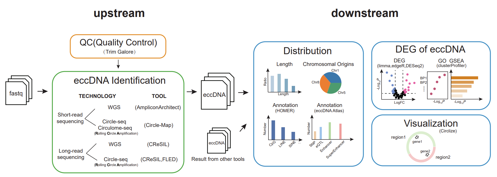

[](https://zenodo.org/doi/10.5281/zenodo.10205619)
# eccDNA-pipe: An integrated pipeline for identification, analysis, and visualization of extrachromosomal circular DNA from high-throughput sequencing data  

An integrated pipeline for identification, analysis, and visualization of extrachromosomal circular DNA(eccDNA) from high-throughput sequencing data in Circle-Map, AmpliconArchitect, CReSIL, FLED

## Getting started
* [Installation](#Installation)
* [Resource download&reset](#Resource)
* Tutorials
    * [Upstream Tutorial: Shell Code for 01.QC, 02.Detect](example/01.upstream/script/)
    * [Downstream Tutorial: Shell Code for 03.Analysis](example/02.downstream/script/)
    * [Downstream Tutorial: Python Code for Distribution in single sample](example/s001_downstream_Distribution.ipynb)
    * [Downstream Tutorial: Python Code for Distribution in multi sample](example/multi_example/Multi_sample_analysis.ipynb)
    * [Downstream Tutorial: Python Code for DEG](example/s002_downstream_DEG.ipynb)
    * [Downstream Tutorial: Python Code for Visualize](example/s003_downstream_Visualize.ipynb)
    * [Cross-Species user add](example/cross-species/cross-species.md)
    * [Example Data](example/)
    * [Example Config](config/)
* Paper Code
    * [Fig2/sFig2](example/paper/Fig2/Fig2_sFig2.ipynb)
    * Fig3/sFig3 [CReSIL](example/paper/Fig3/CReSIL/cresil_analysis.ipynb) [Circle-Map](example/paper/Fig3/) [AA](example/paper/Fig3/AA/AA_analysis.ipynb)
    * [Fig4](example/paper/Fig4/MB_data/Fig4_MB_analysis.ipynb)

## Latest updates
### Version 1.1 2023-12
#### Add functions
- Add limma, edgeR, GSEA analysis in DEG
- Add FLED in upstream [02.Detect]
- Add Tutorials in Python Code for Downstream analysis
- Add Cross-Species Genome API[user_ref] for CReSIL, Circle-Map, Fled

### Version 1.0 2023-07
- Downstream (03.Analysis [Distribution, DEG, Visualize])

### Version 0.9 2022-12
- Upstream (01.QC & 02.Detect)

## Installation
### Install Conda environment
```
cd ecc_pipe
conda env create -f ./install/env.yml
```
## Resource
Please install resource.zip and unzip in the ./ecc_pipe before setting environment
```
## download from rec in ustc
resource: https://rec.ustc.edu.cn/share/a9c71b20-8b2b-11ee-90a7-cbb8e7db2a0d
passwd: ustc

## download from Google Drive
## please unzip resource_1.zip and resource_2.zip, merge it to ./ecc_pipe/resource  
resource_1: https://drive.google.com/drive/folders/1rsdEjmgW-5leS1vTiQhtGSy_vtBRQErF
resource_2: https://drive.google.com/drive/folders/1pIH12HKpzkb7O_G_8-t3l2zBC_1SXGqx
```

### Activate environment and set environment for AA
```
conda activate ecc_pipe
## Set environment for AA
master=$PWD
#### data_repo
cd ./resource/AA/AmpliconArchitect/data_repo/
echo export AA_DATA_REPO=$PWD/ >> ~/.bashrc
touch coverage.stats && chmod a+rw coverage.stats
cd $master
#### AC
echo export AC_SRC=$PWD/resource/AA/AmpliconClassifier >> ~/.bashrc
#### AA
echo export AA_SRC=$PWD/resource/AA/AmpliconArchitect/src >> ~/.bashrc
#### mosek
cd ./resource/AA/AmpliconArchitect/
echo export MOSEKPLATFORM=linux64x86 >> ~/.bashrc
export MOSEKPLATFORM=linux64x86
echo export PATH=PATH:PATH:PWD/mosek/8/tools/platform/$MOSEKPLATFORM/bin >> ~/.bashrc
echo export LD_LIBRARY_PATH=LDLIBRARYPATH:LD_LIBRARY_PATH:PWD/mosek/8/tools/platform/$MOSEKPLATFORM/bin >> ~/.bashrc
echo export MOSEKLM_LICENSE_FILE=$PWD/mosek/8/licenses >> ~/.bashrc
cd $PWD/mosek/8/tools/platform/linux64x86/python/3/
python3 setup.py install
```
### Install CReSIL, FLED and install reference for homer
```
cd $master
cd ./resource/cresil-master
pip install .

cd ./resource/FLED
python ./setup.py install

## Install homer reference
#### $conda_path = ~/miniconda3/envs/ecc_pipe
cd $conda_path/share/homer
perl configureHomer.pl -install mm10
perl configureHomer.pl -install hg38
```

## 01.QC
First set all params in ***QC_config.yaml*** and run python in shell for QC by fastqc and trim_galore
```
python3 ecc_pipe_master.py --QC -n 4 --config configfile_path
## --QC: set the function; no input
## -n: set max threads for **all data** [if you use for n sample, please set n*threads_set_in_yaml]
## --config: set QC_config.yaml file path 
```
all params in the ***QC_config.yaml*** file show:
-   **ecc_master_path** - The full path for ecc_pipe; eg: /home/user/project/ecc_pipe
-   **output_path** - output path, eg: ./example/01.upstream/result/01.QC
-   **input_file** - fastq file path, eg: file_name: ['r1.fq.gz', 'r2.fq.gz']
-   **threads** - set max threads for **one data**, eg:1
-   **paired** - single or paired sequence; eg: True or False

## 02.Detect
First set all params in ***circlemap_config.yaml, AA_config.yaml, cresil_config.yaml***
```
python3 ecc_pipe_master.py --Detect --tool circlemap -n 24 --config configfile_path
python3 ecc_pipe_master.py --Detect --tool AA -n 24 --config configfile_path
python3 ecc_pipe_master.py --Detect --tool cresil -n 24 --config configfile_path
python3 ecc_pipe_master.py --Detect --tool fled -n 24 --config configfile_path
## --Detect: set the function; no input
## --tool: set detect tools for NGS/TGS
## -n: set max threads for **all data** [if you use for n sample, please set n*threads_set_in_yaml]
## --config: set tool_config.yaml file path [must full path]
```
all params in the ***circlemap_config.yaml*** file show:
-   **ecc_master_path** - The full path for ecc_pipe; eg: /home/user/project/ecc_pipe
-   **output_path** - output path, eg: ./example/01.upstream/result/02.circlemap
-   **input_file** - fastq file path, eg: file_name: ['r1.fq.gz', 'r2.fq.gz']
-   **threads** - set max threads for **one data**, eg:12
-   **reference** - hg38 or mm10
-   **user_ref** - default: None, if user_add new genome, set str, eg: 'TAIR10.1_genomic'

all params in the ***AA_config.yaml*** file show:
-   **ecc_master_path** - The full path for ecc_pipe; eg: /home/user/project/ecc_pipe
-   **output_path** - output path, eg: ./example/01.upstream/result/02.AA
-   **input_file** - fastq file path, eg: file_name: ['r1.fq.gz', 'r2.fq.gz']
-   **threads** - set max threads for **one data**, eg:12
-   **reference** - hg38 or mm10
-   **cnvkit_dir** - the path for cnvkit eg: $conda_path/bin/cnvkit.py
-   **rscript** - Rscript path eg: $conda_path/bin/Rscript
-   **python_path** - Python path eg: $conda_path/bin/python
-   **cngain** - Set a custom threshold for the CN gain considered by AA, default:4
-   **cnsize** - Set a custom threshold for CN interval size considered by AA, default:10000
-   **user_ref** - default: None, if user_add new genome, set str, eg: 'TAIR10.1_genomic'

all params in the ***cresil_config.yaml*** file show:
-   **ecc_master_path** - The full path for ecc_pipe; eg: /home/user/project/ecc_pipe
-   **output_path** - output path, eg: ./example/01.upstream/result/02.cresil
-   **input_file** - fastq file path, eg: file_name: ['r1.fq.gz', 'r2.fq.gz']
-   **threads** - set max threads for **one data**, eg:12
-   **reference** - hg38 or mm10
-   **wgs** - if use WGS mode set 1 else 0, default: 0
-   **user_ref** - default: None, if user_add new genome, set str, eg: 'TAIR10.1_genomic'

all params in the ***fled_config.yaml*** file show:
-   **ecc_master_path** - The full path for ecc_pipe; eg: /home/user/project/ecc_pipe
-   **output_path** - output path, eg: ./example/01.upstream/result/02.fled
-   **input_file** - fastq file path, eg: file_name: ['r1.fastq', 'r2.fastq']
-   **threads** - set max threads for **one data**, eg:12
-   **reference** - hg38 or mm10
-   **user_ref** - default: None, if user_add new genome, set str, eg: 'TAIR10.1_genomic'

Detect tools raw website:
- [circlemap](https://github.com/iprada/Circle-Map)
- [AA](https://github.com/jluebeck/AmpliconSuite-pipeline)
- [cresil](https://github.com/visanuwan/cresil)
- [FLED](https://github.com/FuyuLi/FLED)

## 03.Analysis
we apply three mode to analysis the eccDNA result file by python: Distribution, DEG, Visualize
### Distribution
This mode calculates the length and chromatin distribution and 
        performs annotation of RepeatMasker with Homer, 
        as well as enhancers, super-enhancers, SNPs, and eQTLs with [eccAtlas](http://lcbb.swjtu.edu.cn/eccDNAatlas/)  
```
python3 ecc_pipe_master.py --Analysis --mode Distribution --tool circlemap \
            --file_path example/02.downstream/circlemap/DNARCAT1.circle.bed \
            --geno hg38 --ratio 0.5 --circlemap_qc 0
```
-   **Analysis** - set the function; no input
-   **mode** - set the mode, eg: Distribution
-   **tool** - str in ['circlemap', 'AA', 'cresil', 'other']
-   **file_path** - eccDNA result file from 02.Detect; if set tool=='other',please set the file_path contain 6 columns:['Chr', 'Start', 'End', 'Count', 'eccID', 'Length']; eg: ./example/02.downstream/other/result_ecc.txt
-   **peak_path** - default: no input; if tool=='other', please set the peak bed file contain 5 columns: ['chr', 'start', 'end', 'count', 'id'] eg: ./example/02.downstream/other/result_peak.bed
-   **geno** - hg38 or mm10
-   **ratio** - overlap ratio for annotate enhancer/super_enhancer/snp/eQTL ; float in [0,1]; eg:0.5
-   **circlemap_qc** - if set tool == 'circlemap', on/off qc the eccDNA[note: if tool != circlemap not need this params] result eg:0
    
### DEG
Prior to running this mode, the Distribution mode must be executed first. 
        Afterwards, this mode calculates the gene matrix by intersecting the eccDNA matrix, 
        and performs differential expression analysis (DEG) and Gene Ontology (GO) annotation using limma/edgeR/Deseq2/clusterprofile.
```
python3 ecc_pipe_master.py --Analysis --mode DEG \
        --path_share example/02.downstream/deg_test/ \
        --group_file example/02.downstream/deg_test/group.txt \
        --count_type gene --geno hg38 --ratio 0.5 --deg_mode limma \
        --log2fc 0.5 --pvalue 0.05 
```
-   **Analysis** - set the function; no input
-   **mode** - set the mode, eg: DEG
-   **path_share** - path contain all sample data, eg: example/02.downstream/deg_test/
-   **group_file** - txt file contain group info, eg: example/02.downstream/deg_test/group.txt
-   **count_type** - gene or region, gene: compute all gene in ecc region; region: compute ecc region in gene
-   **ratio** - overlap ratio for compute gene matrix ; float in [0,1]; eg: 1
-   **deg_mode** - DEG software select ; str in ['limma', 'edger', 'deseq2']; eg: 'limma'   
-   **log2fc** - log2foldchange by deseq2 result; eg: 0.5
-   **pvalue** - pvalue cut by deseq2 result; eg: 0.05 
        
### Visualize
this mode Visualize the eccDNA by Circlize
```
python3 ecc_pipe_master.py --Analysis --mode Visualize \
        --bed_file example/02.downstream/cresil/ecc_pipe_result/cresil_result.analysis.bed \
        --geno hg38 --ecc_id 1 --count_type region --ratio 0.5
```
-   **Analysis** - set the function; no input
-   **mode** - set the mode, eg: Visualize
-   **bed_file** - peak_list bed file;
-   **geno** - hg38 or mm10
-   **ecc_id** - ecc id in the peak_list
-   **count_type** - gene or region, gene: compute all gene in ecc region; region: compute ecc region in gene
-   **ratio** - overlap ratio for compute gene matrix ; float in [0,1]; eg: 0.5


## NOTE
-   **1** - The YAML file delimiter should not be a tab; it should consist of four spaces.
-   **2** - The reference supports "hg38" and "mm10".
-   **3** - The input file for CReSIL is fq but not fq.gz.
-   **4** - config params in Detect mode must be full path.
-   **5** - If the TGS data undergoes trimming and adapter removal during the basecalling step, or if users employ other cutadapt tools beforehand, 01. quality control (QC) step may not be necessary.

## Software Version
-   trim-galore 0.6.7  fastqc 0.12.1  Circle-Map 1.1.4  PrepareAA 0.1344.1  CReSIL 1.0.0  FLED 1.5.0
-   homer 4.11  limma 3.54.0  edgeR 3.40.0  DESeq2 1.38.0  clusterProfiler 4.6.0  circlize 0.4.15

## Citation
Please cite the following article if you use eccDNA-pipe in your research
> xxxx

Please also cite the related raw software paper if you use the related params of eccDNA-pipe
```
QC: trim-galore fastqc
Detect: Circle-Map, AA, CReSIL, Fled
Analysis-distribution: HOMER, eccDNA Atlas
Analysis-DEG: limma, edgeR, DESeq2, clusterprofiler
Analysis-Visualization: Circlize
```

Please use your own license in mosek if you use eccDNA-pipe in your publish paper.
## License and Copyright
eccDNA_pipe is distributed under the terms of the USTC
