```python
import numpy as np
import pandas as pd
import seaborn as sns
import matplotlib as mpl
import matplotlib.pyplot as plt
import warnings
import os
mpl.rcParams['pdf.fonttype'] = 42
mpl.rcParams["font.sans-serif"] = "Arial"

plt.rcParams['font.size'] = 42
warnings.filterwarnings('ignore')
%config InlineBackend.figure_format = 'retina'
%matplotlib inline
```


```python
import sys
sys.path.append('./ecc_pipe/analysis_code')
from Distribution import *
from DEG import *
from Circlize import *
```

## CircleMap_42_data


```python
## raw data from 2018 NC
## https://doi.org/10.1038/s41467-018-03369-8
```


```python
## shell code Distribution example:
#####
## source /home/qukun/minghaofang/miniconda3/etc/profile.d/conda.sh
## conda activate ecc_pipe
## cd /home/qukun/minghaofang/workspace/project/ecc/pipe/ecc_pipe 
## for i in {393..434}
## do
##  python3 ecc_pipe_master.py --Analysis --mode Distribution --tool circlemap \
##                --file_path $path/circle-Map_real_data/SRR6315$i/SRR6315${i}_circlemap_result.bed \
##                --geno hg38 --ratio 0.5
## done
```


```python
## Here is Python code for the same function (Distribution/DEG)
```


```python
_list = []
for i in range(393,435):
    _sample_name = 'SRR6315'+str(i)
    _list.append(_sample_name)
```


```python
## Distribution
path_share = './data/nebula/circle-Map_real_data/'
_type = 'circlemap'
geno = 'hg38'
ecc_pipe_path = './ecc_pipe' ## please set download resource file first
for name in os.listdir(path_share):
    if name in _list:
        print(name)
        file_path = path_share+name+'/'+name+'_circlemap_result.bed'
        eccDNA = distribution(file_path, _type, geno, _qc=1)
        eccDNA.run_fast(ecc_pipe_path=ecc_pipe_path, ratio=1)
```

    SRR6315394
    Run fast Start!
    	Make chr bed & QC start!
    	Make chr bed & QC over!
    	Plot Chr distribution Start!
    	Plot Chr distribution over!
    	Plot Length distribution Start!
    	Plot Length distribution over!
    	Plot homer anno distribution Start!


    
    	Peak file = ./data/nebula/circle-Map_real_data/SRR6315394/ecc_pipe_result/circlemap_result.analysis.bed
    	Genome = hg38
    	Organism = human
    	Peak/BED file conversion summary:
    		BED/Header formatted lines: 102
    		peakfile formatted lines: 0
    		Duplicated Peak IDs: 23
    
    	Peak File Statistics:
    		Total Peaks: 102
    		Redundant Peak IDs: 0
    		Peaks lacking information: 0 (need at least 5 columns per peak)
    		Peaks with misformatted coordinates: 0 (should be integer)
    		Peaks with misformatted strand: 0 (should be either +/- or 0/1)
    
    	Peak file looks good!
    
    	Reading Positions...
    	-----------------------
    	Finding Closest TSS...
    	Annotating:.......................
    		Annotation	Number of peaks	Total size (bp)	Log2 Ratio (obs/exp)	LogP enrichment (+values depleted)
    		3UTR	1.0	26786192	0.149	-0.518
    		miRNA	0.0	97618	-0.005	0.003
    		ncRNA	0.0	6998912	-0.306	0.236
    		TTS	0.0	32227484	-1.068	1.091
    		pseudo	0.0	2085537	-0.098	0.070
    		Exon	1.0	37015031	-0.318	0.438
    		Intron	41.0	1253662019	-0.042	0.809
    		Intergenic	54.0	1631972721	-0.025	0.769
    		Promoter	3.0	35774823	1.316	-2.116
    		5UTR	2.0	2592085	4.518	-5.637
    		snoRNA	0.0	357	-0.000	0.000
    		scRNA	0.0	97	-0.000	0.000
    		rRNA	0.0	25562	-0.001	0.001
    	NOTE: If this part takes more than 2 minutes, there is a good chance
    		your machine ran out of memory: consider hitting ctrl+C and rerunning
    		the command with "-noann"
    	To capture annotation stats in a file, use "-annStats <filename>" next time
    	Annotating:.......................
    		Annotation	Number of peaks	Total size (bp)	Log2 Ratio (obs/exp)	LogP enrichment (+values depleted)
    		3UTR	1.0	26786192	0.150	-0.518
    		Retroposon	1.0	4044155	2.877	-2.061
    		RC?	0.0	59509	-0.003	0.002
    		RNA	0.0	107756	-0.005	0.004
    		miRNA	0.0	97618	-0.005	0.003
    		ncRNA	0.0	6998912	-0.306	0.236
    		TTS	0.0	32227484	-1.068	1.090
    		LINE	7.0	626703751	-1.591	9.092
    		srpRNA	0.0	261424	-0.013	0.009
    		SINE	39.0	377075025	1.620	-24.063
    		RC	0.0	359494	-0.017	0.012
    		tRNA	0.0	91111	-0.004	0.003
    		DNA?	0.0	422285	-0.020	0.014
    		pseudo	0.0	2085537	-0.098	0.070
    		DNA	1.0	98947449	-1.736	1.894
    		Exon	1.0	37015031	-0.317	0.438
    		Intron	13.0	654126650	-0.760	4.129
    		Intergenic	20.0	742668051	-0.322	1.897
    		Promoter	3.0	35774823	1.317	-2.117
    		5UTR	2.0	2592085	4.519	-5.638
    		snoRNA	0.0	357	-0.000	0.000
    		LTR?	0.0	1137225	-0.054	0.038
    		scRNA	0.0	121379	-0.006	0.004
    		CpG-Island	0.0	8917387	-0.380	0.301
    		Low_complexity	0.0	5394919	-0.241	0.182
    		LTR	6.0	257625099	-0.531	1.485
    		Simple_repeat	2.0	33811580	0.814	-1.155
    		snRNA	0.0	311793	-0.015	0.010
    		Unknown	0.0	713433	-0.034	0.024
    		SINE?	0.0	2674	-0.000	0.000
    		Satellite	6.0	74135823	1.266	-3.228
    		rRNA	0.0	199378	-0.010	0.007
    	Counting Tags in Peaks from each directory...
    	Organism: human
    	Loading Gene Informaiton...
    	Outputing Annotation File...
    	Done annotating peaks file
    


    
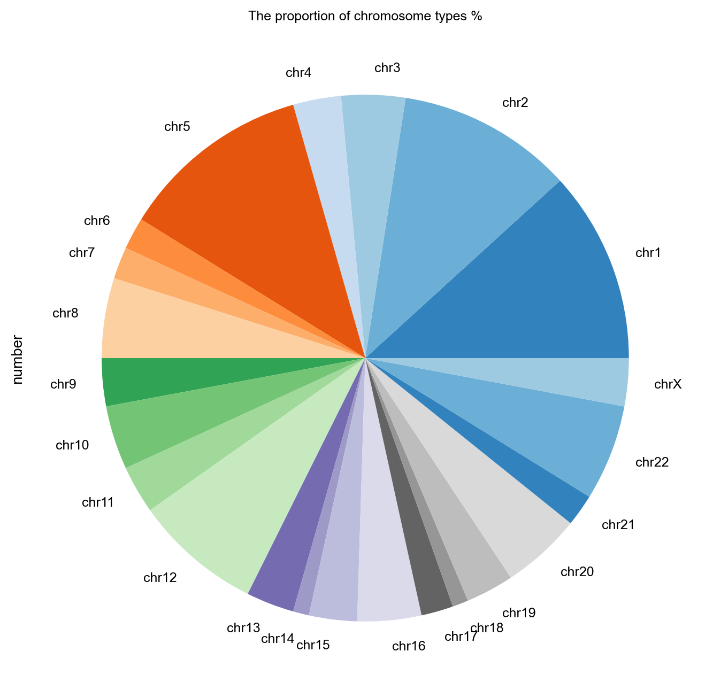
    


    
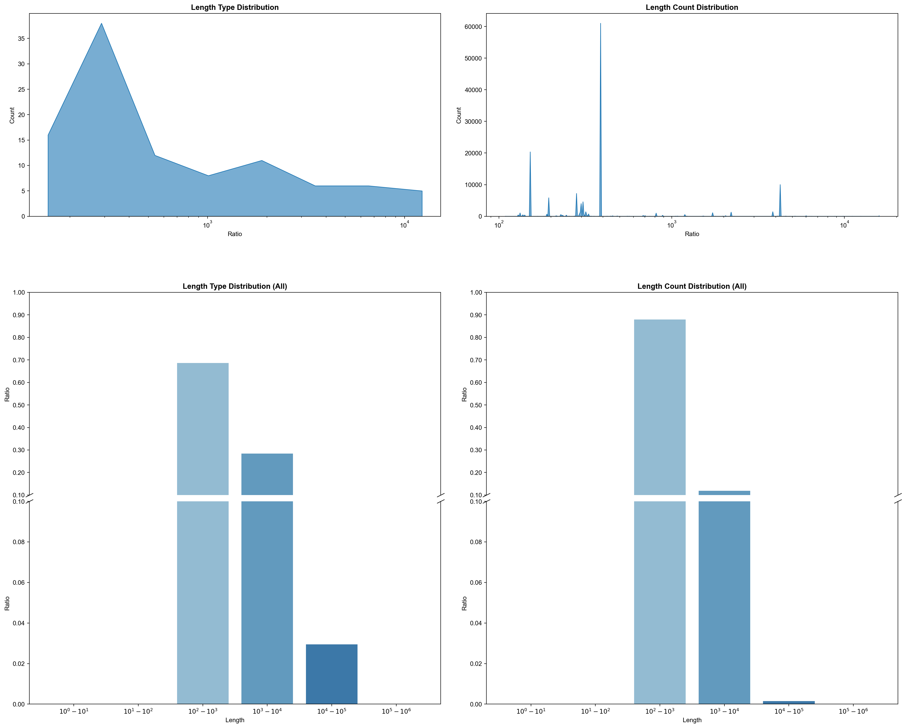
    


    
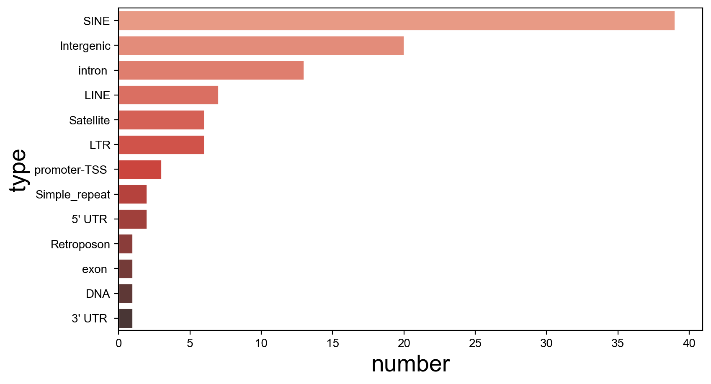
    


    	Plot homer anno distribution over!
    	Anno snp,se,e,eQTL Start!


    
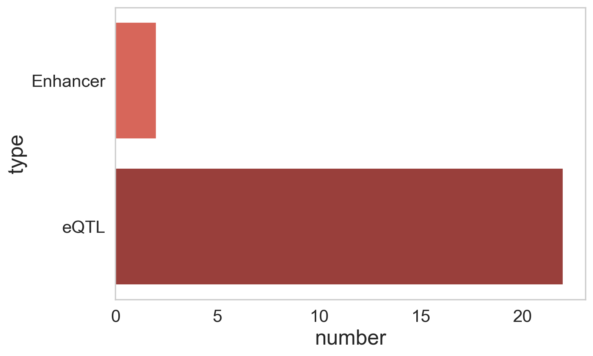
    


    	Anno snp,SuperEnhancer,Enhancer,eQTL End!
    	jinja2 report Start!
    	jinja2 report End!
    Run fast End!
    SRR6315395
    Run fast Start!
    	Make chr bed & QC start!
    	Make chr bed & QC over!
    	Plot Chr distribution Start!
    	Plot Chr distribution over!
    	Plot Length distribution Start!
    	Plot Length distribution over!
    	Plot homer anno distribution Start!


    
    	Peak file = ./data/nebula/circle-Map_real_data/SRR6315395/ecc_pipe_result/circlemap_result.analysis.bed
    	Genome = hg38
    	Organism = human
    	Peak/BED file conversion summary:
    		BED/Header formatted lines: 154
    		peakfile formatted lines: 0
    		Duplicated Peak IDs: 38
    
    	Peak File Statistics:
    		Total Peaks: 154
    		Redundant Peak IDs: 0
    		Peaks lacking information: 0 (need at least 5 columns per peak)
    		Peaks with misformatted coordinates: 0 (should be integer)
    		Peaks with misformatted strand: 0 (should be either +/- or 0/1)
    
    	Peak file looks good!
    
    	Reading Positions...
    	-----------------------
    	Finding Closest TSS...
    	Annotating:.......................
    		Annotation	Number of peaks	Total size (bp)	Log2 Ratio (obs/exp)	LogP enrichment (+values depleted)
    		3UTR	1.0	26786192	-0.445	0.503
    		miRNA	0.0	97618	-0.007	0.005
    		ncRNA	1.0	6998912	1.491	-1.205
    		TTS	3.0	32227484	0.873	-1.487
    		pseudo	1.0	2085537	3.238	-2.296
    		Exon	3.0	37015031	0.673	-1.234
    		Intron	63.0	1253662019	-0.017	0.720
    		Intergenic	75.0	1631972721	-0.146	2.173
    		Promoter	7.0	35774823	1.944	-5.983
    		5UTR	0.0	2592085	-0.179	0.132
    		snoRNA	0.0	357	-0.000	0.000
    		scRNA	0.0	97	-0.000	0.000
    		rRNA	0.0	25562	-0.002	0.001
    	NOTE: If this part takes more than 2 minutes, there is a good chance
    		your machine ran out of memory: consider hitting ctrl+C and rerunning
    		the command with "-noann"
    	To capture annotation stats in a file, use "-annStats <filename>" next time
    	Annotating:.......................
    		Annotation	Number of peaks	Total size (bp)	Log2 Ratio (obs/exp)	LogP enrichment (+values depleted)
    		3UTR	1.0	26786192	-0.445	0.503
    		Retroposon	2.0	4044155	3.283	-3.999
    		RC?	0.0	59509	-0.004	0.003
    		RNA	0.0	107756	-0.008	0.005
    		miRNA	0.0	97618	-0.007	0.005
    		ncRNA	1.0	6998912	1.492	-1.205
    		TTS	3.0	32227484	0.873	-1.488
    		LINE	18.0	626703751	-0.823	5.988
    		srpRNA	0.0	261424	-0.019	0.013
    		SINE	47.0	377075025	1.295	-19.719
    		RC	0.0	359494	-0.026	0.018
    		tRNA	0.0	91111	-0.007	0.005
    		DNA?	0.0	422285	-0.031	0.021
    		pseudo	1.0	2085537	3.238	-2.297
    		DNA	5.0	98947449	-0.008	0.493
    		Exon	3.0	37015031	0.674	-1.235
    		Intron	23.0	654126650	-0.531	3.702
    		Intergenic	23.0	742668051	-0.714	5.939
    		Promoter	7.0	35774823	1.945	-5.986
    		5UTR	0.0	2592085	-0.179	0.132
    		snoRNA	0.0	357	-0.000	0.000
    		LTR?	0.0	1137225	-0.081	0.058
    		scRNA	0.0	121379	-0.009	0.006
    		CpG-Island	1.0	8917387	1.142	-1.008
    		Low_complexity	0.0	5394919	-0.350	0.274
    		LTR	15.0	257625099	0.196	-1.109
    		Simple_repeat	2.0	33811580	0.219	-0.666
    		snRNA	0.0	311793	-0.023	0.016
    		Unknown	0.0	713433	-0.051	0.036
    		SINE?	0.0	2674	-0.000	0.000
    		Satellite	2.0	74135823	-0.913	1.307
    		rRNA	0.0	199378	-0.015	0.010
    	Counting Tags in Peaks from each directory...
    	Organism: human
    	Loading Gene Informaiton...
    	Outputing Annotation File...
    	Done annotating peaks file
    


    
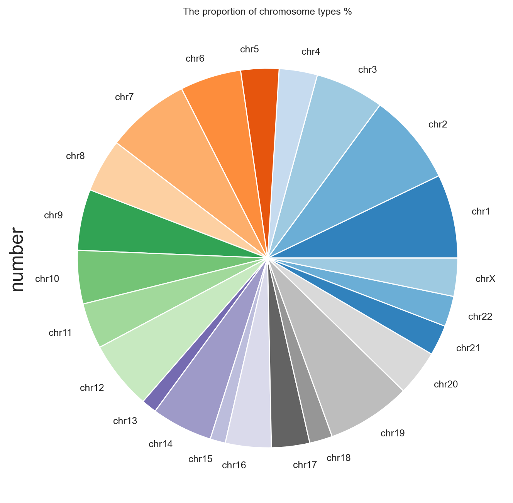
    


    
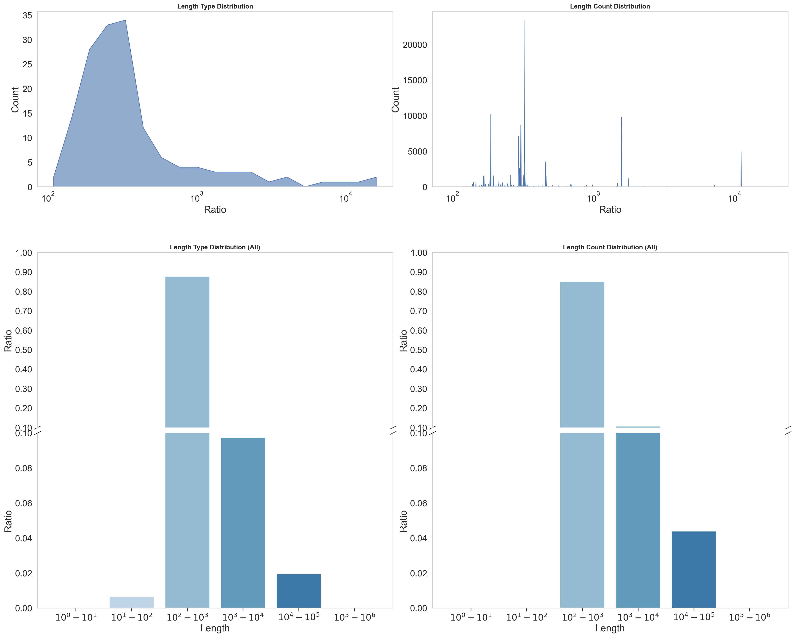
    


    
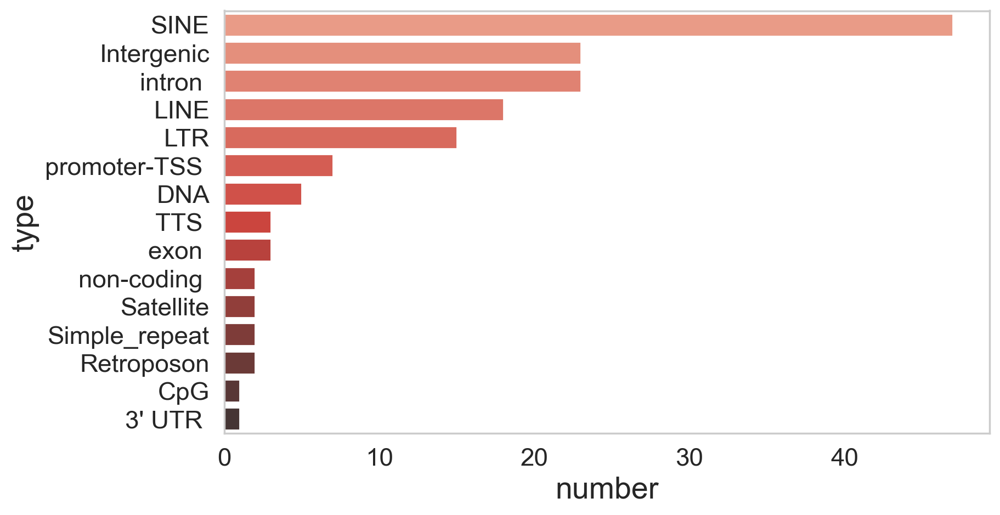
    


    	Plot homer anno distribution over!
    	Anno snp,se,e,eQTL Start!


    

    


    	Anno snp,SuperEnhancer,Enhancer,eQTL End!
    	jinja2 report Start!
    	jinja2 report End!
    Run fast End!
    SRR6315396
    Run fast Start!
    	Make chr bed & QC start!
    	Make chr bed & QC over!
    	Plot Chr distribution Start!
    	Plot Chr distribution over!
    	Plot Length distribution Start!
    	Plot Length distribution over!
    	Plot homer anno distribution Start!


    
    	Peak file = ./data/nebula/circle-Map_real_data/SRR6315396/ecc_pipe_result/circlemap_result.analysis.bed
    	Genome = hg38
    	Organism = human
    	Peak/BED file conversion summary:
    		BED/Header formatted lines: 246
    		peakfile formatted lines: 0
    		Duplicated Peak IDs: 83
    
    	Peak File Statistics:
    		Total Peaks: 246
    		Redundant Peak IDs: 0
    		Peaks lacking information: 0 (need at least 5 columns per peak)
    		Peaks with misformatted coordinates: 0 (should be integer)
    		Peaks with misformatted strand: 0 (should be either +/- or 0/1)
    
    	Peak file looks good!
    
    	Reading Positions...
    	-----------------------
    	Finding Closest TSS...
    	Annotating:........................
    		Annotation	Number of peaks	Total size (bp)	Log2 Ratio (obs/exp)	LogP enrichment (+values depleted)
    		3UTR	2.0	26833139	-0.097	0.448
    		miRNA	0.0	97618	-0.011	0.008
    		ncRNA	0.0	7044070	-0.644	0.562
    		TTS	5.0	32404629	0.953	-2.128
    		pseudo	1.0	2111155	2.571	-1.865
    		Exon	2.0	37120946	-0.565	0.841
    		Intron	111.0	1257910936	0.147	-2.382
    		Intergenic	117.0	1684358172	-0.198	4.125
    		Promoter	8.0	35946139	1.481	-4.732
    		5UTR	0.0	2601483	-0.272	0.207
    		snoRNA	0.0	357	-0.000	0.000
    		scRNA	0.0	97	-0.000	0.000
    		rRNA	0.0	25562	-0.003	0.002
    	NOTE: If this part takes more than 2 minutes, there is a good chance
    		your machine ran out of memory: consider hitting ctrl+C and rerunning
    		the command with "-noann"
    	To capture annotation stats in a file, use "-annStats <filename>" next time
    	Annotating:........................
    		Annotation	Number of peaks	Total size (bp)	Log2 Ratio (obs/exp)	LogP enrichment (+values depleted)
    		3UTR	2.0	26833139	-0.096	0.447
    		Retroposon	1.0	4062585	1.628	-1.285
    		RC?	0.0	59773	-0.007	0.005
    		RNA	0.0	108000	-0.012	0.009
    		miRNA	0.0	97618	-0.011	0.008
    		ncRNA	0.0	7044070	-0.644	0.562
    		TTS	5.0	32404629	0.954	-2.129
    		LINE	25.0	633178497	-1.013	11.408
    		srpRNA	0.0	262214	-0.030	0.021
    		SINE	60.0	379673449	0.988	-15.779
    		RC	0.0	362795	-0.041	0.029
    		tRNA	0.0	91738	-0.011	0.007
    		DNA?	0.0	423197	-0.048	0.034
    		pseudo	1.0	2111155	2.572	-1.865
    		DNA	4.0	99395597	-0.985	2.296
    		Exon	2.0	37120946	-0.564	0.840
    		Intron	53.0	656103354	0.020	-0.735
    		Intergenic	47.0	780868131	-0.404	4.296
    		Promoter	8.0	35946139	1.482	-4.734
    		5UTR	0.0	2601483	-0.272	0.207
    		snoRNA	0.0	357	-0.000	0.000
    		LTR?	1.0	1140409	3.460	-2.443
    		scRNA	0.0	121638	-0.014	0.010
    		CpG-Island	2.0	9000269	1.480	-1.823
    		Low_complexity	0.0	5480212	-0.523	0.437
    		LTR	27.0	262167686	0.371	-2.278
    		Simple_repeat	5.0	34754537	0.853	-1.921
    		snRNA	0.0	314325	-0.036	0.025
    		Unknown	0.0	714206	-0.080	0.057
    		SINE?	0.0	2674	-0.000	0.000
    		Satellite	3.0	75387841	-1.001	1.914
    		rRNA	0.0	202619	-0.023	0.016
    	Counting Tags in Peaks from each directory...
    	Organism: human
    	Loading Gene Informaiton...
    	Outputing Annotation File...
    	Done annotating peaks file
    


    
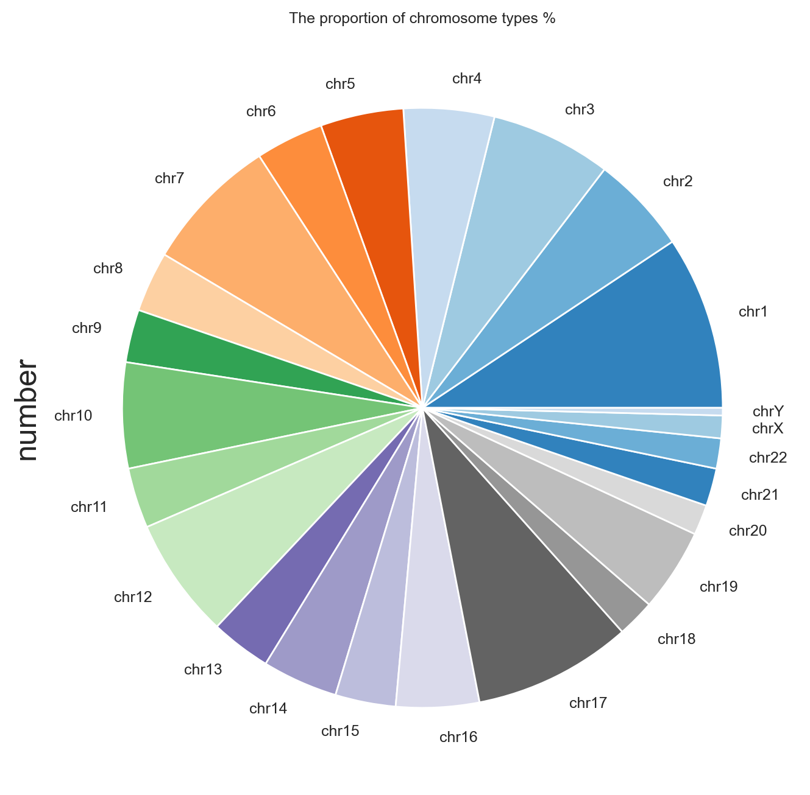
    


    
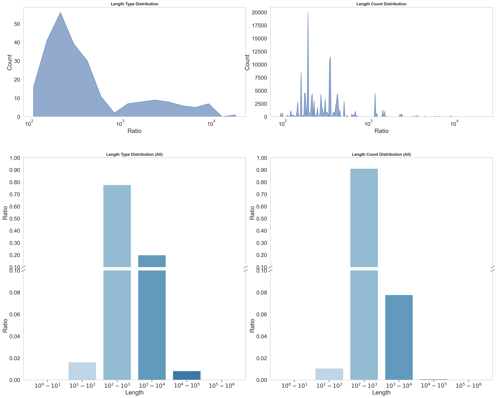
    


    
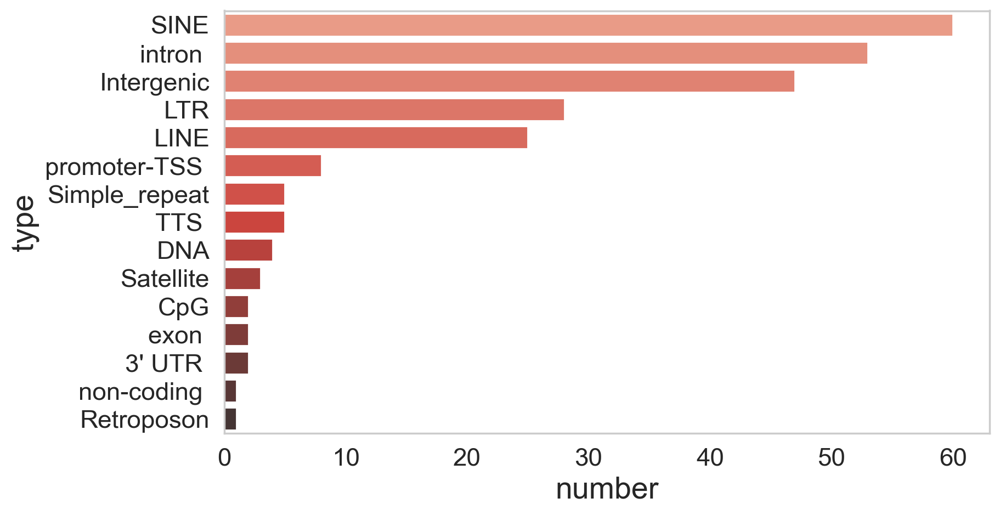
    


    	Plot homer anno distribution over!
    	Anno snp,se,e,eQTL Start!


    
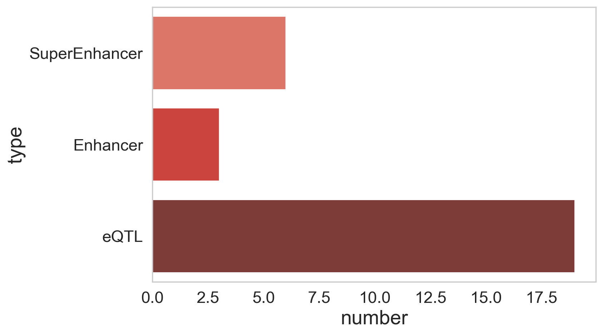
    


    	Anno snp,SuperEnhancer,Enhancer,eQTL End!
    	jinja2 report Start!
    	jinja2 report End!
    Run fast End!
    SRR6315397
    Run fast Start!
    	Make chr bed & QC start!
    	Make chr bed & QC over!
    	Plot Chr distribution Start!
    	Plot Chr distribution over!
    	Plot Length distribution Start!
    	Plot Length distribution over!
    	Plot homer anno distribution Start!


    
    	Peak file = ./data/nebula/circle-Map_real_data/SRR6315397/ecc_pipe_result/circlemap_result.analysis.bed
    	Genome = hg38
    	Organism = human
    	Peak/BED file conversion summary:
    		BED/Header formatted lines: 85
    		peakfile formatted lines: 0
    		Duplicated Peak IDs: 12
    
    	Peak File Statistics:
    		Total Peaks: 85
    		Redundant Peak IDs: 0
    		Peaks lacking information: 0 (need at least 5 columns per peak)
    		Peaks with misformatted coordinates: 0 (should be integer)
    		Peaks with misformatted strand: 0 (should be either +/- or 0/1)
    
    	Peak file looks good!
    
    	Reading Positions...
    	-----------------------
    	Finding Closest TSS...
    	Annotating:.....................
    		Annotation	Number of peaks	Total size (bp)	Log2 Ratio (obs/exp)	LogP enrichment (+values depleted)
    		3UTR	0.0	24712970	-0.828	0.772
    		miRNA	0.0	87134	-0.004	0.003
    		ncRNA	0.0	6522663	-0.267	0.203
    		TTS	1.0	29689214	0.116	-0.503
    		pseudo	0.0	1894851	-0.083	0.059
    		Exon	3.0	34084775	1.502	-2.404
    		Intron	28.0	1154303230	-0.358	2.969
    		Intergenic	51.0	1448325075	0.180	-2.152
    		Promoter	1.0	32885650	-0.031	0.318
    		5UTR	1.0	2382671	3.755	-2.639
    		snoRNA	0.0	344	-0.000	0.000
    		scRNA	0.0	97	-0.000	0.000
    		rRNA	0.0	25562	-0.001	0.001
    	NOTE: If this part takes more than 2 minutes, there is a good chance
    		your machine ran out of memory: consider hitting ctrl+C and rerunning
    		the command with "-noann"
    	To capture annotation stats in a file, use "-annStats <filename>" next time
    	Annotating:.....................
    		Annotation	Number of peaks	Total size (bp)	Log2 Ratio (obs/exp)	LogP enrichment (+values depleted)
    		3UTR	0.0	24712970	-0.828	0.771
    		Retroposon	0.0	3658343	-0.155	0.114
    		RC?	0.0	53119	-0.002	0.002
    		RNA	0.0	98356	-0.004	0.003
    		miRNA	0.0	87134	-0.004	0.003
    		ncRNA	0.0	6522663	-0.267	0.203
    		TTS	1.0	29689214	0.117	-0.504
    		LINE	7.0	549684505	-1.286	6.008
    		srpRNA	0.0	240537	-0.011	0.007
    		SINE	30.0	345051452	1.485	-16.463
    		RC	0.0	326125	-0.015	0.010
    		tRNA	0.0	84903	-0.004	0.003
    		DNA?	0.0	379120	-0.017	0.012
    		pseudo	0.0	1894851	-0.083	0.059
    		DNA	3.0	90090247	0.100	-0.629
    		Exon	3.0	34084775	1.503	-2.405
    		Intron	11.0	604289291	-0.771	3.742
    		Intergenic	16.0	666833127	-0.373	1.947
    		Promoter	1.0	32885650	-0.031	0.318
    		5UTR	1.0	2382671	3.756	-2.640
    		snoRNA	0.0	344	-0.000	0.000
    		LTR?	0.0	1034860	-0.046	0.032
    		scRNA	0.0	110900	-0.005	0.003
    		CpG-Island	2.0	8137391	2.984	-3.619
    		Low_complexity	0.0	4915538	-0.205	0.153
    		LTR	7.0	230779226	-0.034	0.558
    		Simple_repeat	3.0	30608658	1.658	-2.653
    		snRNA	0.0	284494	-0.013	0.009
    		Unknown	0.0	656732	-0.029	0.020
    		SINE?	0.0	2493	-0.000	0.000
    		Satellite	0.0	66623036	-1.642	2.095
    		rRNA	0.0	186477	-0.008	0.006
    	Counting Tags in Peaks from each directory...
    	Organism: human
    	Loading Gene Informaiton...
    	Outputing Annotation File...
    	Done annotating peaks file
    


    
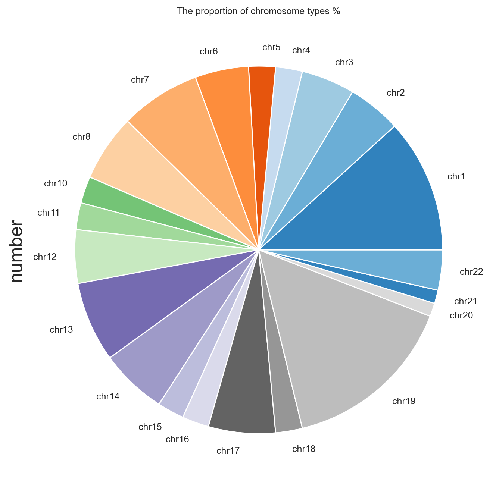
    


    
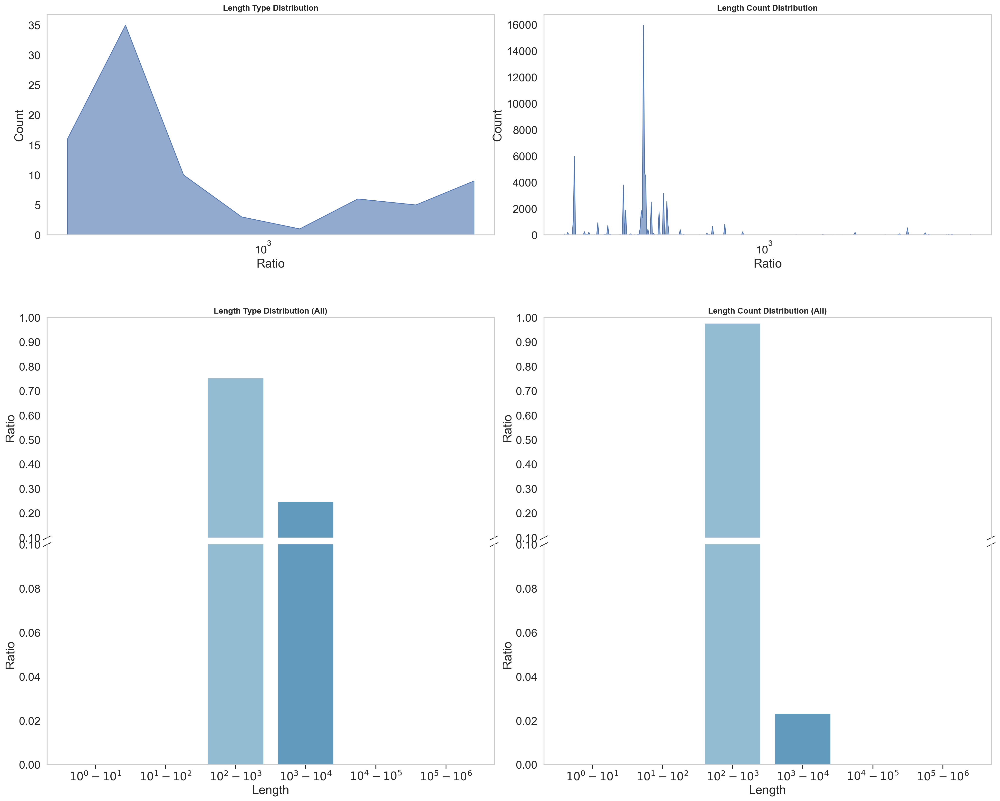
    


    
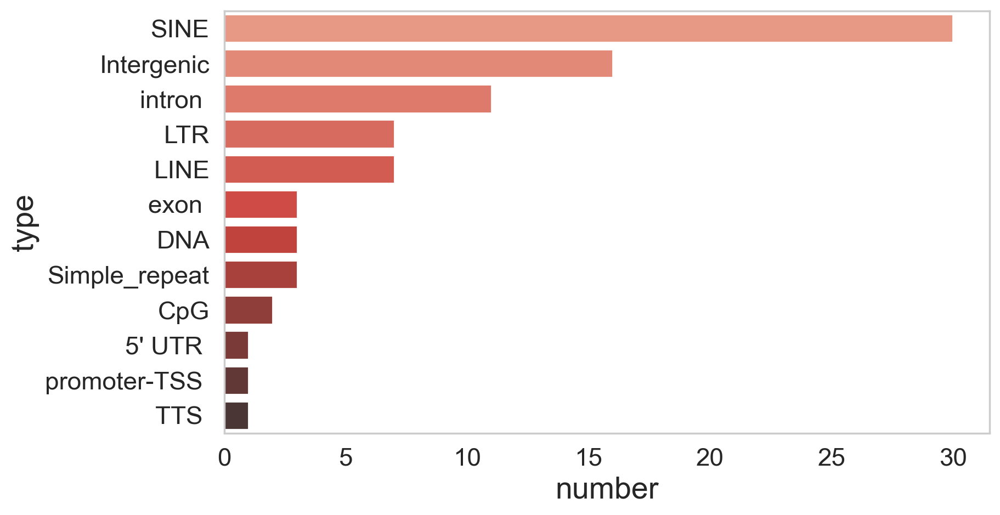
    


    	Plot homer anno distribution over!
    	Anno snp,se,e,eQTL Start!


    

    


    	Anno snp,SuperEnhancer,Enhancer,eQTL End!
    	jinja2 report Start!
    	jinja2 report End!
    Run fast End!
    SRR6315398
    Run fast Start!
    	Make chr bed & QC start!
    	Make chr bed & QC over!
    	Plot Chr distribution Start!
    	Plot Chr distribution over!
    	Plot Length distribution Start!
    	Plot Length distribution over!
    	Plot homer anno distribution Start!


    
    	Peak file = ./data/nebula/circle-Map_real_data/SRR6315398/ecc_pipe_result/circlemap_result.analysis.bed
    	Genome = hg38
    	Organism = human
    	Peak/BED file conversion summary:
    		BED/Header formatted lines: 172
    		peakfile formatted lines: 0
    		Duplicated Peak IDs: 36
    
    	Peak File Statistics:
    		Total Peaks: 172
    		Redundant Peak IDs: 0
    		Peaks lacking information: 0 (need at least 5 columns per peak)
    		Peaks with misformatted coordinates: 0 (should be integer)
    		Peaks with misformatted strand: 0 (should be either +/- or 0/1)
    
    	Peak file looks good!
    
    	Reading Positions...
    	-----------------------
    	Finding Closest TSS...
    	Annotating:........................
    		Annotation	Number of peaks	Total size (bp)	Log2 Ratio (obs/exp)	LogP enrichment (+values depleted)
    		3UTR	2.0	26833139	0.420	-0.818
    		miRNA	0.0	97618	-0.008	0.005
    		ncRNA	0.0	7044070	-0.479	0.393
    		TTS	4.0	32404629	1.147	-2.220
    		pseudo	0.0	2111155	-0.161	0.118
    		Exon	7.0	37120946	1.759	-5.279
    		Intron	72.0	1257910936	0.039	-0.886
    		Intergenic	82.0	1684358172	-0.195	3.190
    		Promoter	5.0	35946139	1.320	-2.959
    		5UTR	0.0	2601483	-0.195	0.145
    		snoRNA	0.0	357	-0.000	0.000
    		scRNA	0.0	97	-0.000	0.000
    		rRNA	0.0	25562	-0.002	0.001
    	NOTE: If this part takes more than 2 minutes, there is a good chance
    		your machine ran out of memory: consider hitting ctrl+C and rerunning
    		the command with "-noann"
    	To capture annotation stats in a file, use "-annStats <filename>" next time
    	Annotating:........................
    		Annotation	Number of peaks	Total size (bp)	Log2 Ratio (obs/exp)	LogP enrichment (+values depleted)
    		3UTR	2.0	26833139	0.420	-0.819
    		Retroposon	1.0	4062585	2.144	-1.596
    		RC?	0.0	59773	-0.005	0.003
    		RNA	0.0	108000	-0.009	0.006
    		miRNA	0.0	97618	-0.008	0.005
    		ncRNA	0.0	7044070	-0.478	0.393
    		TTS	4.0	32404629	1.148	-2.221
    		LINE	18.0	633178497	-0.970	7.958
    		srpRNA	0.0	262214	-0.021	0.015
    		SINE	35.0	379673449	0.727	-6.298
    		RC	0.0	362795	-0.029	0.020
    		tRNA	0.0	91738	-0.007	0.005
    		DNA?	0.0	423197	-0.034	0.024
    		pseudo	0.0	2111155	-0.160	0.118
    		DNA	4.0	99395597	-0.469	1.055
    		Exon	7.0	37120946	1.759	-5.282
    		Intron	35.0	656103354	-0.062	0.845
    		Intergenic	38.0	780868131	-0.195	1.653
    		Promoter	5.0	35946139	1.320	-2.961
    		5UTR	0.0	2601483	-0.195	0.145
    		snoRNA	0.0	357	-0.000	0.000
    		LTR?	0.0	1140409	-0.089	0.064
    		scRNA	0.0	121638	-0.010	0.007
    		CpG-Island	3.0	9000269	2.581	-4.246
    		Low_complexity	0.0	5480212	-0.385	0.306
    		LTR	14.0	262167686	-0.061	0.685
    		Simple_repeat	1.0	34754537	-0.953	0.862
    		snRNA	0.0	314325	-0.025	0.018
    		Unknown	0.0	714206	-0.056	0.040
    		SINE?	0.0	2674	-0.000	0.000
    		Satellite	4.0	75387841	-0.070	0.528
    		rRNA	1.0	202619	6.469	-4.490
    	Counting Tags in Peaks from each directory...
    	Organism: human
    	Loading Gene Informaiton...
    	Outputing Annotation File...
    	Done annotating peaks file
    


    
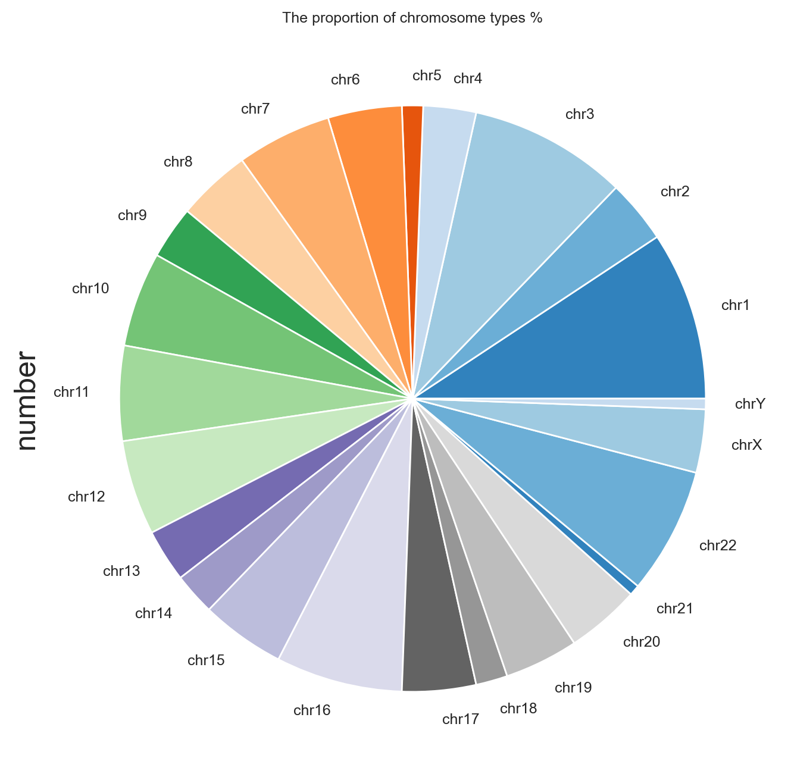
    


    
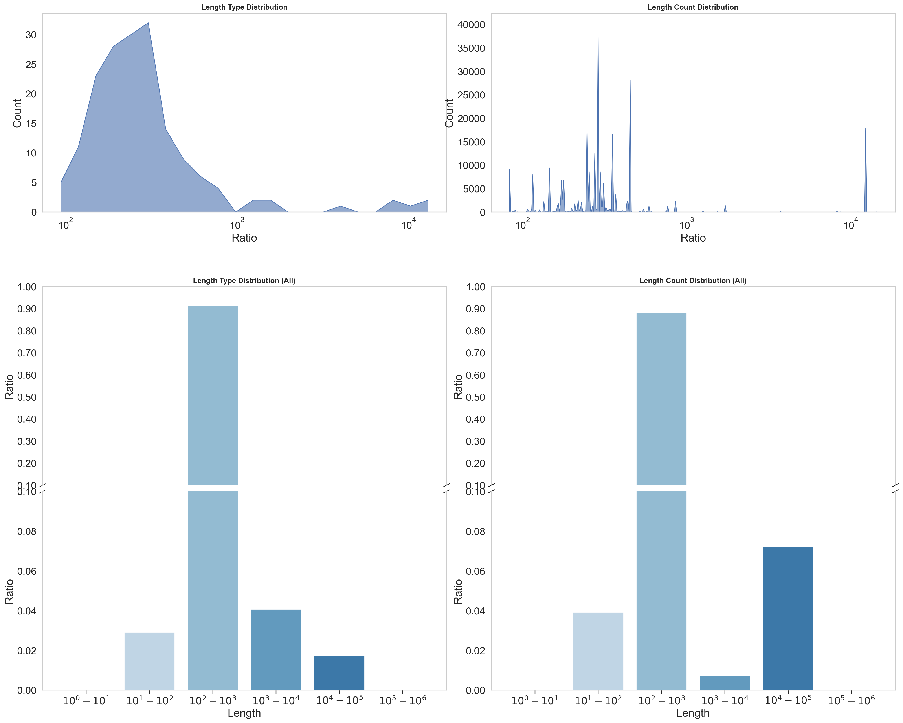
    


    
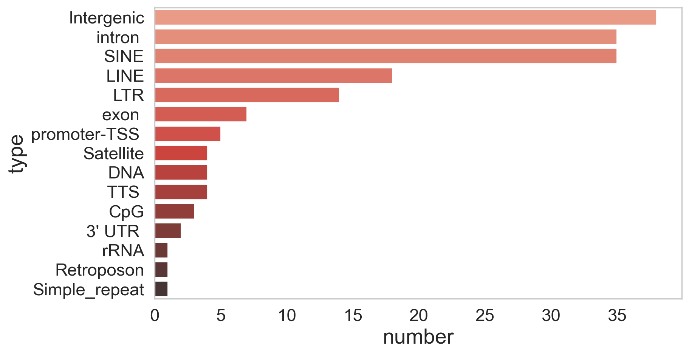
    


    	Plot homer anno distribution over!
    	Anno snp,se,e,eQTL Start!


    
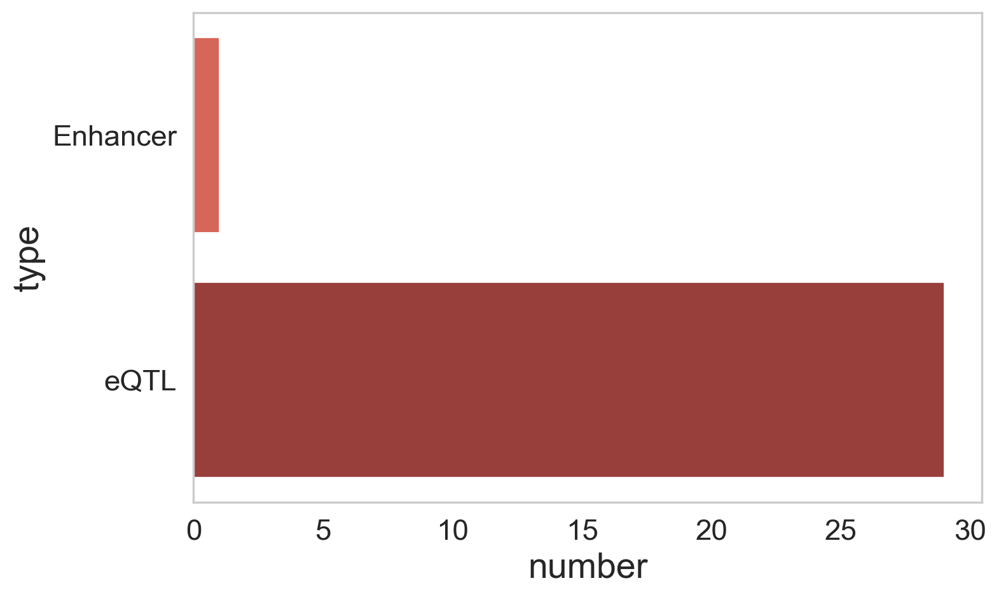
    


    	Anno snp,SuperEnhancer,Enhancer,eQTL End!
    	jinja2 report Start!
    	jinja2 report End!
    Run fast End!
    SRR6315399
    Run fast Start!
    	Make chr bed & QC start!
    	Make chr bed & QC over!
    	Plot Chr distribution Start!
    	Plot Chr distribution over!
    	Plot Length distribution Start!
    	Plot Length distribution over!
    	Plot homer anno distribution Start!


    
    	Peak file = ./data/nebula/circle-Map_real_data/SRR6315399/ecc_pipe_result/circlemap_result.analysis.bed
    	Genome = hg38
    	Organism = human
    	Peak/BED file conversion summary:
    		BED/Header formatted lines: 405
    		peakfile formatted lines: 1
    		Duplicated Peak IDs: 162
    
    	Peak File Statistics:
    		Total Peaks: 406
    		Redundant Peak IDs: 0
    		Peaks lacking information: 0 (need at least 5 columns per peak)
    		Peaks with misformatted coordinates: 0 (should be integer)
    		Peaks with misformatted strand: 0 (should be either +/- or 0/1)
    
    	Peak file looks good!
    
    	Reading Positions...
    	-----------------------
    	Finding Closest TSS...
    	Annotating:........................
    		Annotation	Number of peaks	Total size (bp)	Log2 Ratio (obs/exp)	LogP enrichment (+values depleted)
    		3UTR	4.0	26833139	0.191	-0.767
    		miRNA	0.0	97618	-0.018	0.013
    		ncRNA	2.0	7044070	1.121	-1.449
    		TTS	10.0	32404629	1.241	-4.490
    		pseudo	0.0	2111155	-0.351	0.276
    		Exon	9.0	37120946	0.893	-2.857
    		Intron	185.0	1257910936	0.172	-3.890
    		Intergenic	181.0	1684358172	-0.281	9.674
    		Promoter	11.0	35946139	1.229	-4.764
    		5UTR	1.0	2601483	1.558	-1.244
    		snoRNA	0.0	357	-0.000	0.000
    		scRNA	0.0	97	-0.000	0.000
    		rRNA	0.0	25562	-0.005	0.003
    	NOTE: If this part takes more than 2 minutes, there is a good chance
    		your machine ran out of memory: consider hitting ctrl+C and rerunning
    		the command with "-noann"
    	To capture annotation stats in a file, use "-annStats <filename>" next time
    	Annotating:........................
    		Annotation	Number of peaks	Total size (bp)	Log2 Ratio (obs/exp)	LogP enrichment (+values depleted)
    		3UTR	4.0	26833139	0.192	-0.767
    		Retroposon	1.0	4062585	0.915	-0.887
    		RC?	0.0	59773	-0.011	0.008
    		RNA	0.0	108000	-0.020	0.014
    		miRNA	0.0	97618	-0.018	0.013
    		ncRNA	2.0	7044070	1.121	-1.450
    		TTS	10.0	32404629	1.242	-4.493
    		LINE	27.0	633178497	-1.614	32.219
    		srpRNA	0.0	262214	-0.049	0.034
    		SINE	118.0	379673449	1.252	-43.769
    		RC	0.0	362795	-0.067	0.047
    		tRNA	0.0	91738	-0.017	0.012
    		DNA?	0.0	423197	-0.078	0.055
    		pseudo	0.0	2111155	-0.351	0.276
    		DNA	8.0	99395597	-0.697	2.330
    		Exon	9.0	37120946	0.894	-2.860
    		Intron	89.0	656103354	0.056	-1.024
    		Intergenic	70.0	780868131	-0.542	9.274
    		Promoter	11.0	35946139	1.230	-4.767
    		5UTR	1.0	2601483	1.559	-1.245
    		snoRNA	0.0	357	-0.000	0.000
    		LTR?	1.0	1140409	2.748	-1.978
    		scRNA	0.0	121638	-0.023	0.016
    		CpG-Island	4.0	9000269	1.768	-3.461
    		Low_complexity	0.0	5480212	-0.779	0.716
    		LTR	42.0	262167686	0.296	-2.313
    		Simple_repeat	3.0	34754537	-0.596	1.094
    		snRNA	0.0	314325	-0.058	0.041
    		Unknown	0.0	714206	-0.129	0.093
    		SINE?	0.0	2674	-0.001	0.000
    		Satellite	3.0	75387841	-1.713	4.516
    		rRNA	0.0	202619	-0.038	0.026
    	Counting Tags in Peaks from each directory...
    	Organism: human
    	Loading Gene Informaiton...
    	Outputing Annotation File...
    	Done annotating peaks file
    


    
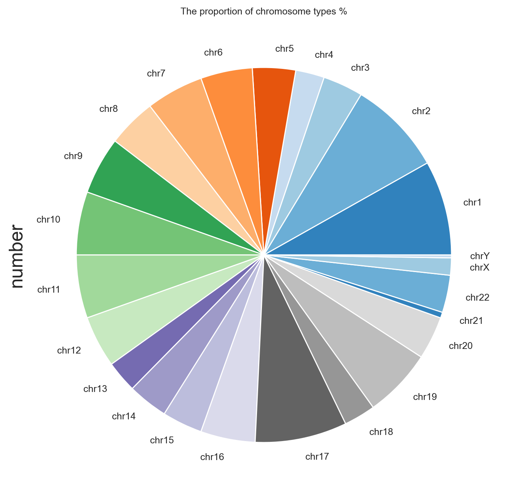
    


    
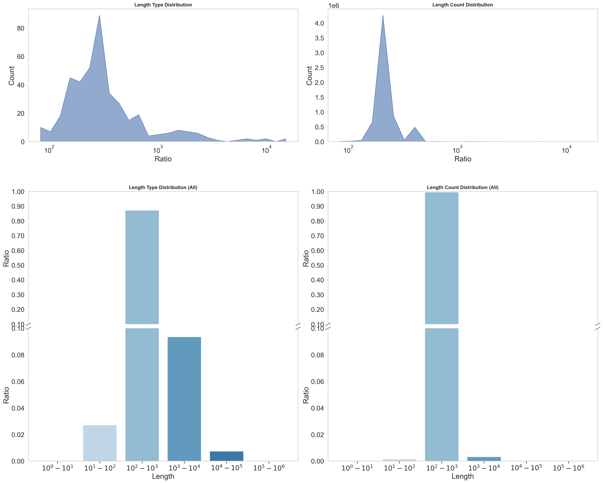
    


    
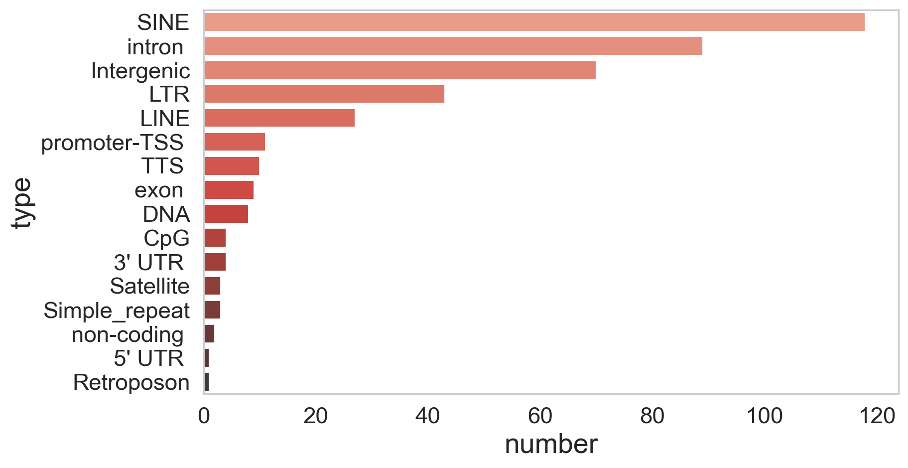
    


    	Plot homer anno distribution over!
    	Anno snp,se,e,eQTL Start!


    ***** WARNING: File ./data/nebula/circle-Map_real_data/SRR6315399/ecc_pipe_result/circlemap_result.analysis.bed has inconsistent naming convention for record:
    	755	1665	18	1791
    
    ***** WARNING: File ./data/nebula/circle-Map_real_data/SRR6315399/ecc_pipe_result/circlemap_result.analysis.bed has inconsistent naming convention for record:
    	755	1665	18	1791
    
    ***** WARNING: File ./data/nebula/circle-Map_real_data/SRR6315399/ecc_pipe_result/circlemap_result.analysis.bed has inconsistent naming convention for record:
    	755	1665	18	1791
    
    ***** WARNING: File ./data/nebula/circle-Map_real_data/SRR6315399/ecc_pipe_result/circlemap_result.analysis.bed has inconsistent naming convention for record:
    	755	1665	18	1791
    
    ***** WARNING: File ./data/nebula/circle-Map_real_data/SRR6315399/ecc_pipe_result/circlemap_result.analysis.bed has inconsistent naming convention for record:
    	755	1665	18	1791
    
    ***** WARNING: File ./data/nebula/circle-Map_real_data/SRR6315399/ecc_pipe_result/circlemap_result.analysis.bed has inconsistent naming convention for record:
    	755	1665	18	1791
    
    ***** WARNING: File ./data/nebula/circle-Map_real_data/SRR6315399/ecc_pipe_result/circlemap_result.analysis.bed has inconsistent naming convention for record:
    	755	1665	18	1791
    
    ***** WARNING: File ./data/nebula/circle-Map_real_data/SRR6315399/ecc_pipe_result/circlemap_result.analysis.bed has inconsistent naming convention for record:
    	755	1665	18	1791
    


    
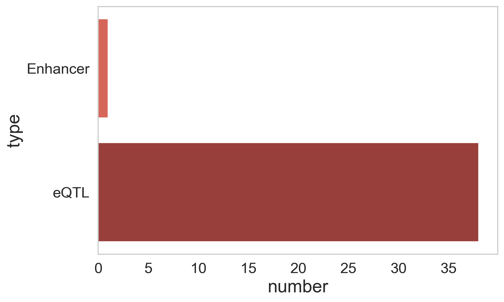
    


    	Anno snp,SuperEnhancer,Enhancer,eQTL End!
    	jinja2 report Start!
    	jinja2 report End!
    Run fast End!
    SRR6315400
    Run fast Start!
    	Make chr bed & QC start!
    	Make chr bed & QC over!
    	Plot Chr distribution Start!
    	Plot Chr distribution over!
    	Plot Length distribution Start!
    	Plot Length distribution over!
    	Plot homer anno distribution Start!


    
    	Peak file = ./data/nebula/circle-Map_real_data/SRR6315400/ecc_pipe_result/circlemap_result.analysis.bed
    	Genome = hg38
    	Organism = human
    	Peak/BED file conversion summary:
    		BED/Header formatted lines: 1223
    		peakfile formatted lines: 1
    		Duplicated Peak IDs: 707
    
    	Peak File Statistics:
    		Total Peaks: 1224
    		Redundant Peak IDs: 0
    		Peaks lacking information: 0 (need at least 5 columns per peak)
    		Peaks with misformatted coordinates: 0 (should be integer)
    		Peaks with misformatted strand: 0 (should be either +/- or 0/1)
    
    	Peak file looks good!
    
    	Reading Positions...
    	-----------------------
    	Finding Closest TSS...
    	Annotating:........................
    		Annotation	Number of peaks	Total size (bp)	Log2 Ratio (obs/exp)	LogP enrichment (+values depleted)
    		3UTR	14.0	26833139	0.397	-1.687
    		miRNA	0.0	97618	-0.055	0.039
    		ncRNA	8.0	7044070	1.519	-4.839
    		TTS	20.0	32404629	0.639	-3.279
    		pseudo	2.0	2111155	1.257	-1.588
    		Exon	27.0	37120946	0.876	-6.030
    		Intron	543.0	1257910936	0.124	-5.238
    		Intergenic	575.0	1684358172	-0.215	16.475
    		Promoter	32.0	35946139	1.168	-10.379
    		5UTR	2.0	2601483	0.956	-1.289
    		snoRNA	0.0	357	-0.000	0.000
    		scRNA	0.0	97	-0.000	0.000
    		rRNA	0.0	25562	-0.015	0.010
    	NOTE: If this part takes more than 2 minutes, there is a good chance
    		your machine ran out of memory: consider hitting ctrl+C and rerunning
    		the command with "-noann"
    	To capture annotation stats in a file, use "-annStats <filename>" next time
    	Annotating:........................
    		Annotation	Number of peaks	Total size (bp)	Log2 Ratio (obs/exp)	LogP enrichment (+values depleted)
    		3UTR	14.0	26833139	0.398	-1.690
    		Retroposon	1.0	4062585	-0.686	0.650
    		RC?	0.0	59773	-0.034	0.024
    		RNA	0.0	108000	-0.060	0.043
    		miRNA	0.0	97618	-0.055	0.039
    		ncRNA	8.0	7044070	1.520	-4.842
    		TTS	20.0	32404629	0.640	-3.283
    		LINE	138.0	633178497	-0.862	39.296
    		srpRNA	0.0	262214	-0.143	0.104
    		SINE	268.0	379673449	0.834	-46.853
    		RC	1.0	362795	2.799	-2.011
    		tRNA	0.0	91738	-0.051	0.036
    		DNA?	0.0	423197	-0.224	0.168
    		pseudo	2.0	2111155	1.258	-1.589
    		DNA	38.0	99395597	-0.051	0.789
    		Exon	27.0	37120946	0.877	-6.037
    		Intron	282.0	656103354	0.118	-2.717
    		Intergenic	248.0	780868131	-0.318	10.736
    		Promoter	32.0	35946139	1.168	-10.388
    		5UTR	2.0	2601483	0.957	-1.290
    		snoRNA	0.0	357	-0.000	0.000
    		LTR?	0.0	1140409	-0.538	0.452
    		scRNA	0.0	121638	-0.068	0.048
    		CpG-Island	8.0	9000269	1.166	-3.537
    		Low_complexity	0.0	5480212	-1.666	2.172
    		LTR	117.0	262167686	0.172	-2.319
    		Simple_repeat	11.0	34754537	-0.323	1.276
    		snRNA	0.0	314325	-0.169	0.124
    		Unknown	0.0	714206	-0.359	0.283
    		SINE?	0.0	2674	-0.002	0.001
    		Satellite	6.0	75387841	-2.315	16.082
    		rRNA	0.0	202619	-0.111	0.080
    	Counting Tags in Peaks from each directory...
    	Organism: human
    	Loading Gene Informaiton...
    	Outputing Annotation File...
    	Done annotating peaks file
    


    

    


    
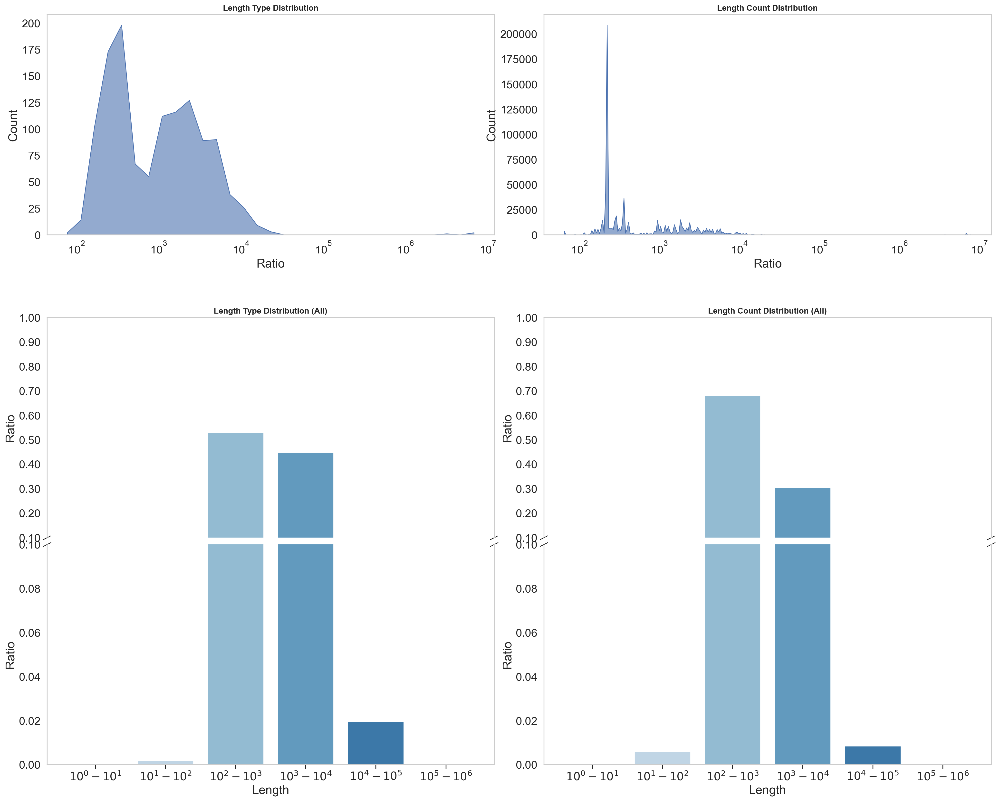
    


    
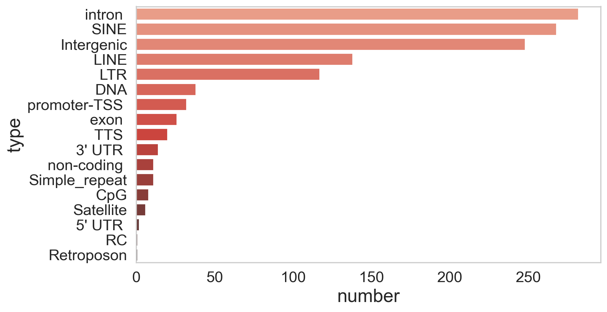
    


    	Plot homer anno distribution over!
    	Anno snp,se,e,eQTL Start!


    
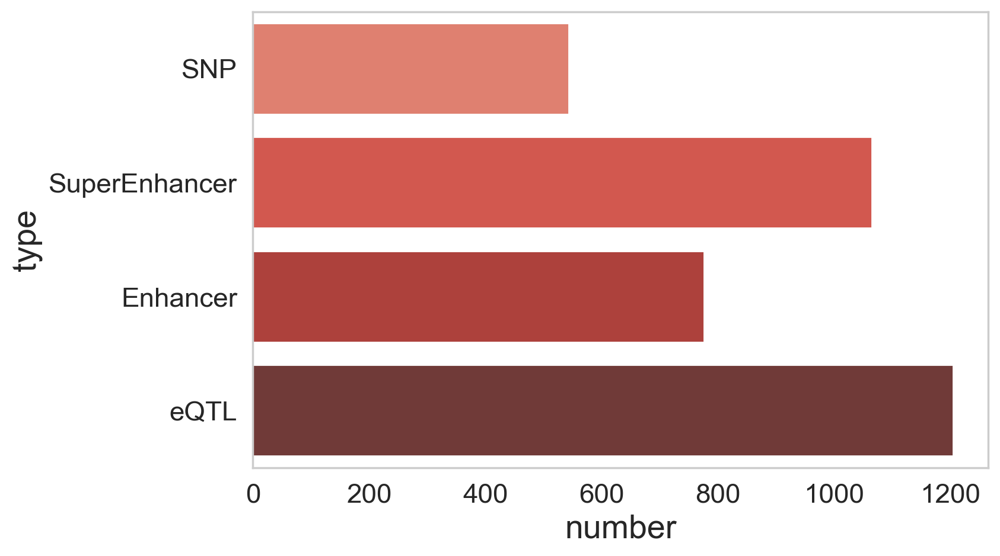
    


    	Anno snp,SuperEnhancer,Enhancer,eQTL End!
    	jinja2 report Start!
    	jinja2 report End!
    Run fast End!
    SRR6315401
    Run fast Start!
    	Make chr bed & QC start!
    	Make chr bed & QC over!
    	Plot Chr distribution Start!
    	Plot Chr distribution over!
    	Plot Length distribution Start!
    	Plot Length distribution over!
    	Plot homer anno distribution Start!


    
    	Peak file = ./data/nebula/circle-Map_real_data/SRR6315401/ecc_pipe_result/circlemap_result.analysis.bed
    	Genome = hg38
    	Organism = human
    	Peak/BED file conversion summary:
    		BED/Header formatted lines: 259
    		peakfile formatted lines: 0
    		Duplicated Peak IDs: 69
    
    	Peak File Statistics:
    		Total Peaks: 259
    		Redundant Peak IDs: 0
    		Peaks lacking information: 0 (need at least 5 columns per peak)
    		Peaks with misformatted coordinates: 0 (should be integer)
    		Peaks with misformatted strand: 0 (should be either +/- or 0/1)
    
    	Peak file looks good!
    
    	Reading Positions...
    	-----------------------
    	Finding Closest TSS...
    	Annotating:.......................
    		Annotation	Number of peaks	Total size (bp)	Log2 Ratio (obs/exp)	LogP enrichment (+values depleted)
    		3UTR	3.0	26786192	0.389	-0.912
    		miRNA	0.0	97618	-0.012	0.008
    		ncRNA	0.0	6998912	-0.678	0.599
    		TTS	5.0	32227484	0.860	-1.935
    		pseudo	0.0	2085537	-0.237	0.178
    		Exon	6.0	37015031	0.923	-2.301
    		Intron	114.0	1253662019	0.089	-1.549
    		Intergenic	124.0	1631972721	-0.170	3.485
    		Promoter	7.0	35774823	1.194	-3.335
    		5UTR	0.0	2592085	-0.289	0.222
    		snoRNA	0.0	357	-0.000	0.000
    		scRNA	0.0	97	-0.000	0.000
    		rRNA	0.0	25562	-0.003	0.002
    	NOTE: If this part takes more than 2 minutes, there is a good chance
    		your machine ran out of memory: consider hitting ctrl+C and rerunning
    		the command with "-noann"
    	To capture annotation stats in a file, use "-annStats <filename>" next time
    	Annotating:.......................
    		Annotation	Number of peaks	Total size (bp)	Log2 Ratio (obs/exp)	LogP enrichment (+values depleted)
    		3UTR	3.0	26786192	0.390	-0.913
    		Retroposon	0.0	4044155	-0.429	0.346
    		RC?	0.0	59509	-0.007	0.005
    		RNA	0.0	107756	-0.013	0.009
    		miRNA	0.0	97618	-0.012	0.008
    		ncRNA	0.0	6998912	-0.678	0.599
    		TTS	5.0	32227484	0.860	-1.936
    		LINE	21.0	626703751	-1.351	17.352
    		srpRNA	0.0	261424	-0.032	0.022
    		SINE	71.0	377075025	1.140	-23.269
    		RC	0.0	359494	-0.044	0.031
    		tRNA	0.0	91111	-0.011	0.008
    		DNA?	0.0	422285	-0.051	0.036
    		pseudo	0.0	2085537	-0.237	0.178
    		DNA	5.0	98947449	-0.758	1.907
    		Exon	6.0	37015031	0.924	-2.303
    		Intron	51.0	654126650	-0.132	1.363
    		Intergenic	52.0	742668051	-0.287	2.914
    		Promoter	7.0	35774823	1.195	-3.337
    		5UTR	0.0	2592085	-0.289	0.222
    		snoRNA	0.0	357	-0.000	0.000
    		LTR?	0.0	1137225	-0.134	0.097
    		scRNA	0.0	121379	-0.015	0.010
    		CpG-Island	2.0	8917387	1.392	-1.729
    		Low_complexity	0.0	5394919	-0.548	0.461
    		LTR	27.0	257625099	0.294	-1.842
    		Simple_repeat	7.0	33811580	1.277	-3.595
    		snRNA	0.0	311793	-0.038	0.027
    		Unknown	0.0	713433	-0.085	0.061
    		SINE?	0.0	2674	-0.000	0.000
    		Satellite	2.0	74135823	-1.663	3.064
    		rRNA	0.0	199378	-0.024	0.017
    	Counting Tags in Peaks from each directory...
    	Organism: human
    	Loading Gene Informaiton...
    	Outputing Annotation File...
    	Done annotating peaks file
    


    
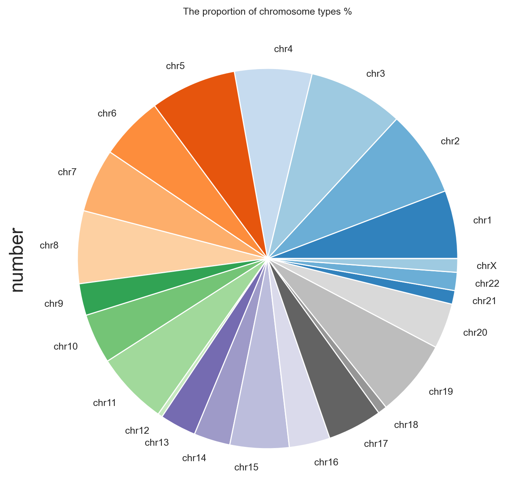
    


    
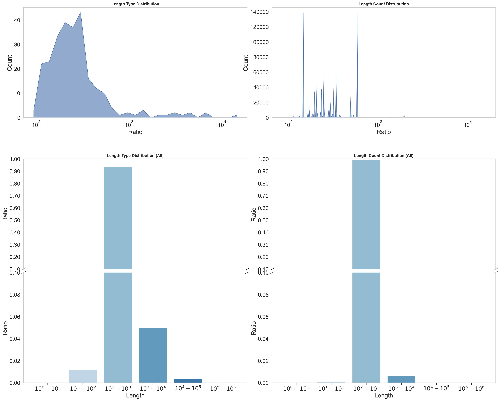
    


    
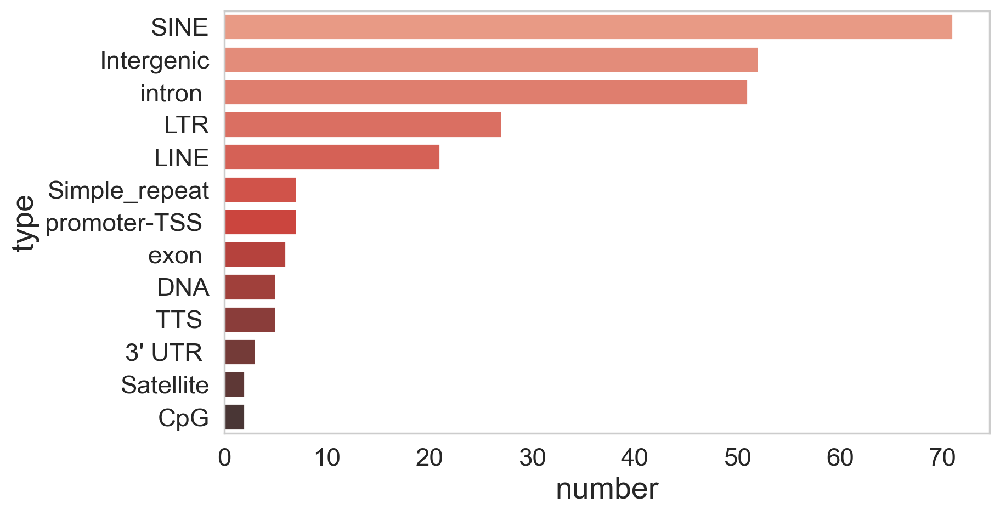
    


    	Plot homer anno distribution over!
    	Anno snp,se,e,eQTL Start!


    
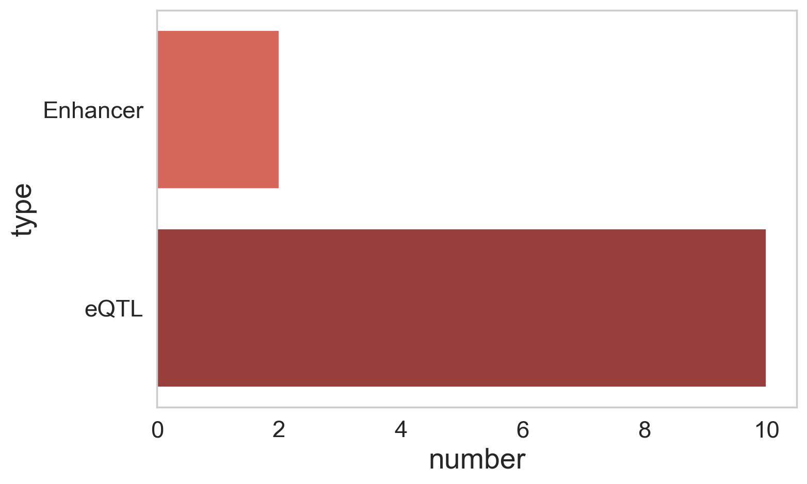
    


    	Anno snp,SuperEnhancer,Enhancer,eQTL End!
    	jinja2 report Start!
    	jinja2 report End!
    Run fast End!
    SRR6315402
    Run fast Start!
    	Make chr bed & QC start!
    	Make chr bed & QC over!
    	Plot Chr distribution Start!
    	Plot Chr distribution over!
    	Plot Length distribution Start!
    	Plot Length distribution over!
    	Plot homer anno distribution Start!


    
    	Peak file = ./data/nebula/circle-Map_real_data/SRR6315402/ecc_pipe_result/circlemap_result.analysis.bed
    	Genome = hg38
    	Organism = human
    	Peak/BED file conversion summary:
    		BED/Header formatted lines: 305
    		peakfile formatted lines: 1
    		Duplicated Peak IDs: 91
    
    	Peak File Statistics:
    		Total Peaks: 306
    		Redundant Peak IDs: 0
    		Peaks lacking information: 0 (need at least 5 columns per peak)
    		Peaks with misformatted coordinates: 0 (should be integer)
    		Peaks with misformatted strand: 0 (should be either +/- or 0/1)
    
    	Peak file looks good!
    
    	Reading Positions...
    	-----------------------
    	Finding Closest TSS...
    	Annotating:........................
    		Annotation	Number of peaks	Total size (bp)	Log2 Ratio (obs/exp)	LogP enrichment (+values depleted)
    		3UTR	4.0	26833139	0.593	-1.291
    		miRNA	0.0	97618	-0.014	0.010
    		ncRNA	1.0	7044070	0.523	-0.689
    		TTS	11.0	32404629	1.780	-7.693
    		pseudo	0.0	2111155	-0.274	0.209
    		Exon	10.0	37120946	1.447	-5.448
    		Intron	143.0	1257910936	0.202	-4.049
    		Intergenic	128.0	1684358172	-0.379	11.915
    		Promoter	8.0	35946139	1.171	-3.576
    		5UTR	0.0	2601483	-0.330	0.257
    		snoRNA	0.0	357	-0.000	0.000
    		scRNA	0.0	97	-0.000	0.000
    		rRNA	0.0	25562	-0.004	0.003
    	NOTE: If this part takes more than 2 minutes, there is a good chance
    		your machine ran out of memory: consider hitting ctrl+C and rerunning
    		the command with "-noann"
    	To capture annotation stats in a file, use "-annStats <filename>" next time
    	Annotating:........................
    		Annotation	Number of peaks	Total size (bp)	Log2 Ratio (obs/exp)	LogP enrichment (+values depleted)
    		3UTR	4.0	26833139	0.594	-1.292
    		Retroposon	1.0	4062585	1.317	-1.107
    		RC?	0.0	59773	-0.008	0.006
    		RNA	0.0	108000	-0.015	0.011
    		miRNA	0.0	97618	-0.014	0.010
    		ncRNA	1.0	7044070	0.523	-0.690
    		TTS	11.0	32404629	1.781	-7.698
    		LINE	34.0	633178497	-0.879	11.424
    		srpRNA	0.0	262214	-0.037	0.026
    		SINE	68.0	379673449	0.859	-14.042
    		RC	0.0	362795	-0.051	0.036
    		tRNA	0.0	91738	-0.013	0.009
    		DNA?	0.0	423197	-0.059	0.042
    		pseudo	0.0	2111155	-0.273	0.209
    		DNA	10.0	99395597	0.027	-0.653
    		Exon	10.0	37120946	1.448	-5.451
    		Intron	62.0	656103354	-0.064	0.972
    		Intergenic	43.0	780868131	-0.843	13.527
    		Promoter	8.0	35946139	1.172	-3.579
    		5UTR	0.0	2601483	-0.330	0.257
    		snoRNA	0.0	357	-0.000	0.000
    		LTR?	0.0	1140409	-0.154	0.113
    		scRNA	0.0	121638	-0.017	0.012
    		CpG-Island	1.0	9000269	0.170	-0.529
    		Low_complexity	0.0	5480212	-0.625	0.542
    		LTR	34.0	262167686	0.393	-2.760
    		Simple_repeat	12.0	34754537	1.806	-8.434
    		snRNA	0.0	314325	-0.044	0.031
    		Unknown	0.0	714206	-0.098	0.071
    		SINE?	0.0	2674	-0.000	0.000
    		Satellite	6.0	75387841	-0.311	0.959
    		rRNA	0.0	202619	-0.029	0.020
    	Counting Tags in Peaks from each directory...
    	Organism: human
    	Loading Gene Informaiton...
    	Outputing Annotation File...
    	Done annotating peaks file
    


    
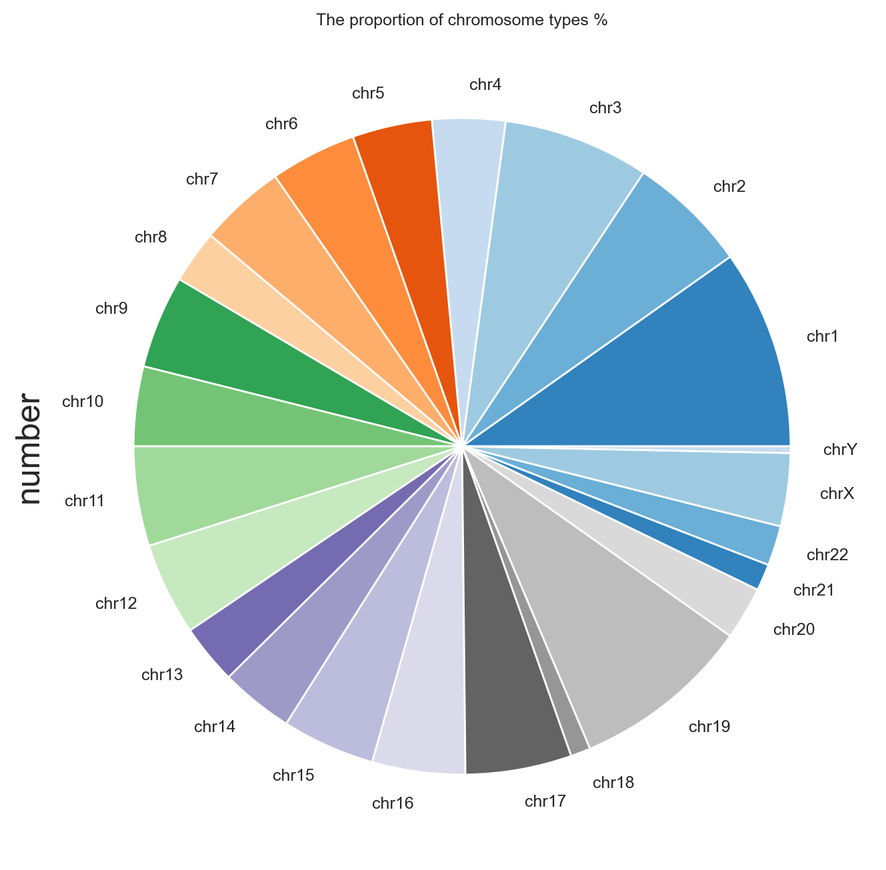
    


    
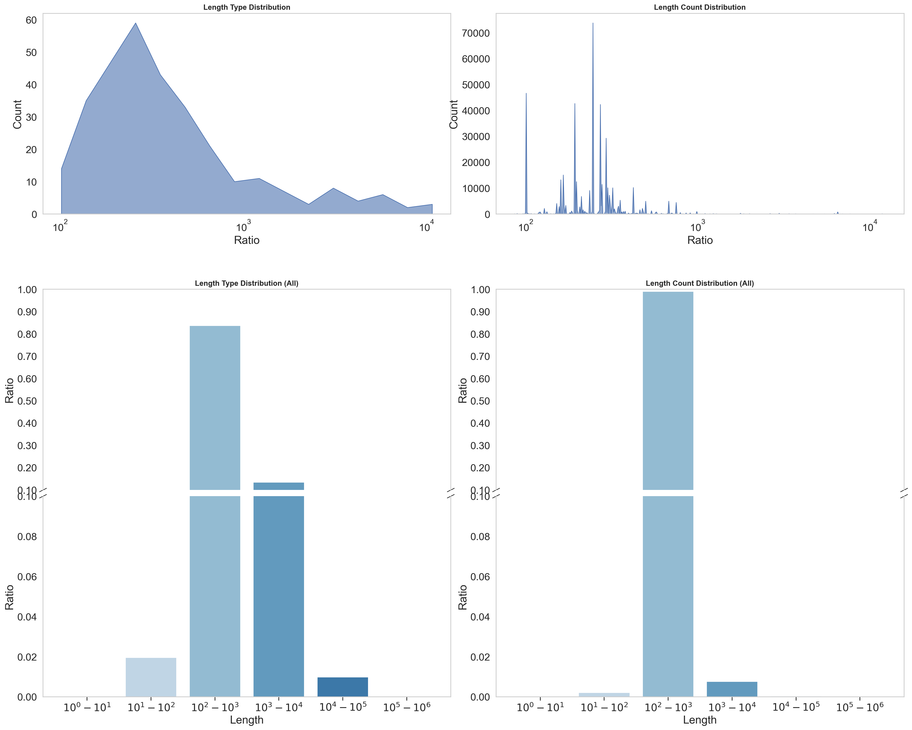
    


    
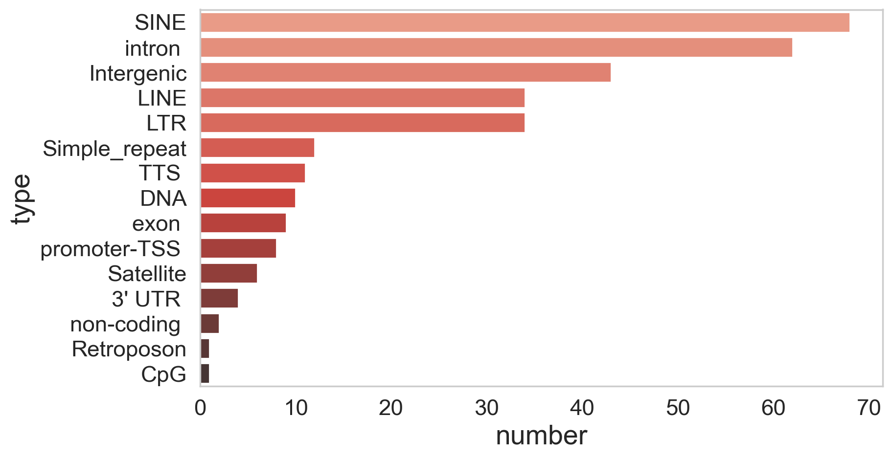
    


    	Plot homer anno distribution over!
    	Anno snp,se,e,eQTL Start!


    
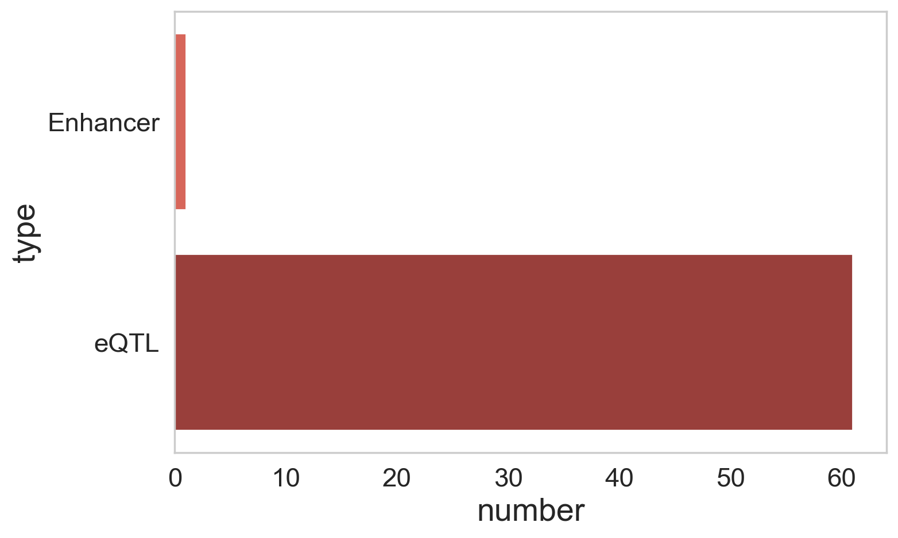
    


    	Anno snp,SuperEnhancer,Enhancer,eQTL End!
    	jinja2 report Start!
    	jinja2 report End!
    Run fast End!
    SRR6315403
    Run fast Start!
    	Make chr bed & QC start!
    	Make chr bed & QC over!
    	Plot Chr distribution Start!
    	Plot Chr distribution over!
    	Plot Length distribution Start!
    	Plot Length distribution over!
    	Plot homer anno distribution Start!


    
    	Peak file = ./data/nebula/circle-Map_real_data/SRR6315403/ecc_pipe_result/circlemap_result.analysis.bed
    	Genome = hg38
    	Organism = human
    	Peak/BED file conversion summary:
    		BED/Header formatted lines: 1254
    		peakfile formatted lines: 1
    		Duplicated Peak IDs: 666
    
    	Peak File Statistics:
    		Total Peaks: 1255
    		Redundant Peak IDs: 0
    		Peaks lacking information: 0 (need at least 5 columns per peak)
    		Peaks with misformatted coordinates: 0 (should be integer)
    		Peaks with misformatted strand: 0 (should be either +/- or 0/1)
    
    	Peak file looks good!
    
    	Reading Positions...
    	-----------------------
    	Finding Closest TSS...
    	Annotating:.......................
    		Annotation	Number of peaks	Total size (bp)	Log2 Ratio (obs/exp)	LogP enrichment (+values depleted)
    		3UTR	15.0	26786192	0.436	-1.887
    		miRNA	0.0	97618	-0.057	0.040
    		ncRNA	6.0	6998912	1.050	-2.608
    		TTS	29.0	32227484	1.120	-8.991
    		pseudo	2.0	2085537	1.212	-1.541
    		Exon	22.0	37015031	0.522	-2.777
    		Intron	566.0	1253662019	0.125	-5.541
    		Intergenic	592.0	1631972721	-0.191	13.541
    		Promoter	20.0	35774823	0.433	-2.179
    		5UTR	2.0	2592085	0.898	-1.234
    		snoRNA	0.0	357	-0.000	0.000
    		scRNA	0.0	97	-0.000	0.000
    		rRNA	0.0	25562	-0.015	0.011
    	NOTE: If this part takes more than 2 minutes, there is a good chance
    		your machine ran out of memory: consider hitting ctrl+C and rerunning
    		the command with "-noann"
    	To capture annotation stats in a file, use "-annStats <filename>" next time
    	Annotating:.......................
    		Annotation	Number of peaks	Total size (bp)	Log2 Ratio (obs/exp)	LogP enrichment (+values depleted)
    		3UTR	15.0	26786192	0.437	-1.890
    		Retroposon	2.0	4044155	0.257	-0.696
    		RC?	0.0	59509	-0.035	0.025
    		RNA	0.0	107756	-0.063	0.045
    		miRNA	0.0	97618	-0.057	0.040
    		ncRNA	6.0	6998912	1.051	-2.610
    		TTS	29.0	32227484	1.121	-8.999
    		LINE	125.0	626703751	-1.053	54.508
    		srpRNA	0.0	261424	-0.148	0.108
    		SINE	330.0	377075025	1.081	-90.971
    		RC	0.0	359494	-0.200	0.149
    		tRNA	0.0	91111	-0.053	0.038
    		DNA?	0.0	422285	-0.232	0.175
    		pseudo	2.0	2085537	1.213	-1.542
    		DNA	54.0	98947449	0.399	-3.623
    		Exon	22.0	37015031	0.523	-2.782
    		Intron	269.0	654126650	-0.009	0.752
    		Intergenic	221.0	742668051	-0.476	19.722
    		Promoter	20.0	35774823	0.434	-2.183
    		5UTR	2.0	2592085	0.899	-1.235
    		snoRNA	0.0	357	-0.000	0.000
    		LTR?	0.0	1137225	-0.557	0.471
    		scRNA	0.0	121379	-0.071	0.050
    		CpG-Island	11.0	8917387	1.576	-6.497
    		Low_complexity	0.0	5394919	-1.694	2.234
    		LTR	121.0	257625099	0.183	-2.508
    		Simple_repeat	11.0	33811580	-0.347	1.349
    		snRNA	0.0	311793	-0.175	0.129
    		Unknown	0.0	713433	-0.373	0.295
    		SINE?	0.0	2674	-0.002	0.001
    		Satellite	13.0	74135823	-1.238	8.337
    		rRNA	1.0	199378	3.600	-2.536
    	Counting Tags in Peaks from each directory...
    	Organism: human
    	Loading Gene Informaiton...
    	Outputing Annotation File...
    	Done annotating peaks file
    


    

    


    
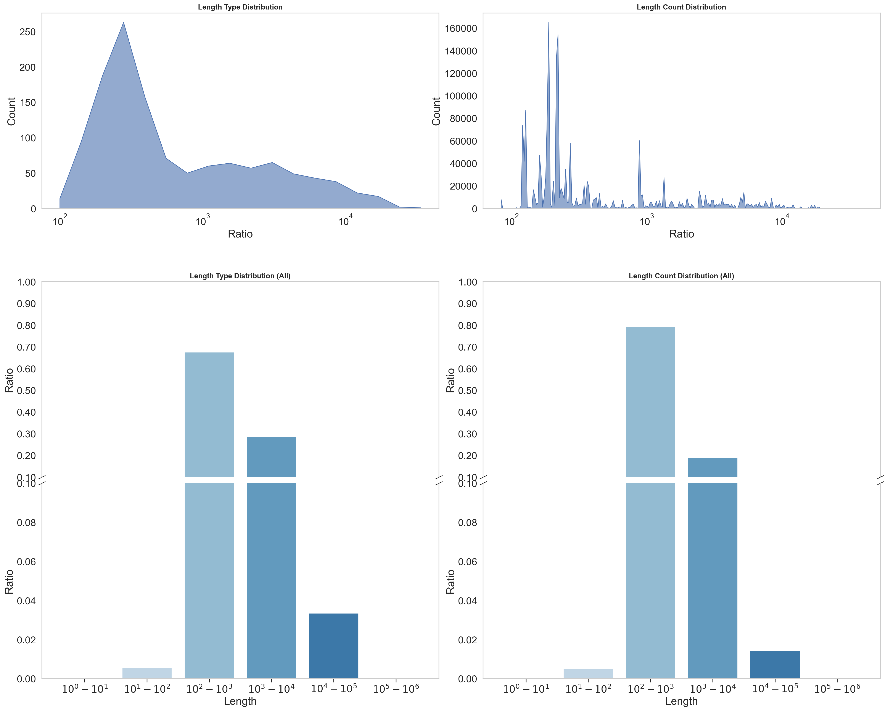
    


    
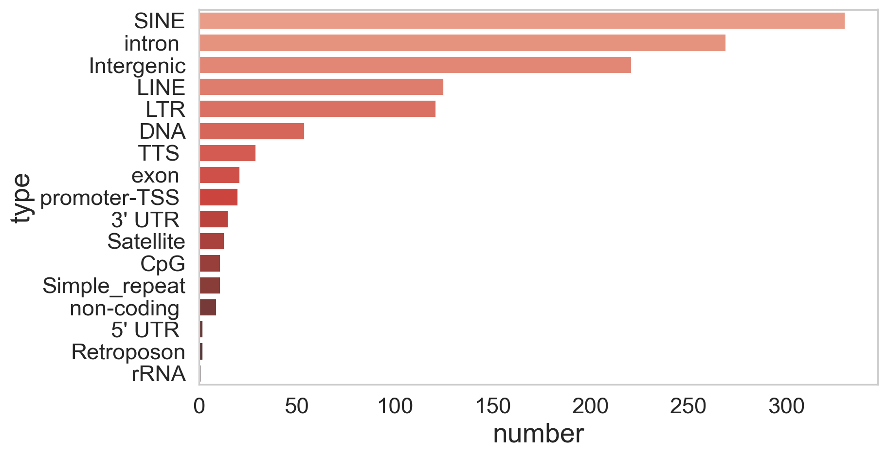
    


    	Plot homer anno distribution over!
    	Anno snp,se,e,eQTL Start!


    
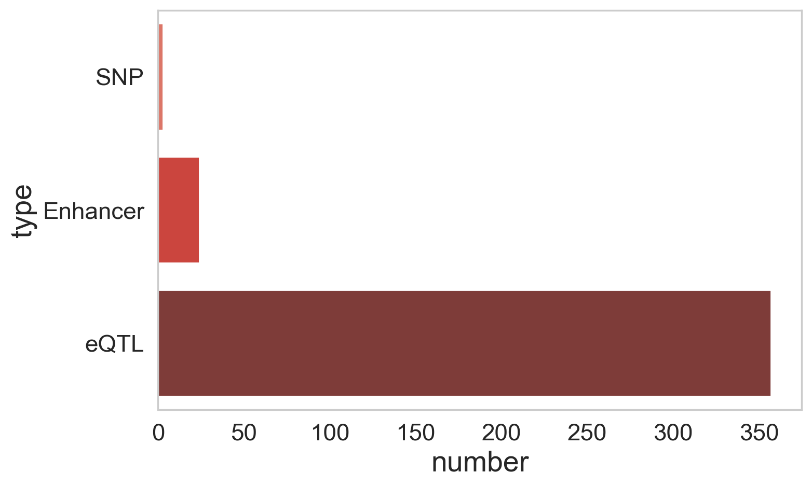
    


    	Anno snp,SuperEnhancer,Enhancer,eQTL End!
    	jinja2 report Start!
    	jinja2 report End!
    Run fast End!
    SRR6315404
    Run fast Start!
    	Make chr bed & QC start!
    	Make chr bed & QC over!
    	Plot Chr distribution Start!
    	Plot Chr distribution over!
    	Plot Length distribution Start!
    	Plot Length distribution over!
    	Plot homer anno distribution Start!


    
    	Peak file = ./data/nebula/circle-Map_real_data/SRR6315404/ecc_pipe_result/circlemap_result.analysis.bed
    	Genome = hg38
    	Organism = human
    	Peak/BED file conversion summary:
    		BED/Header formatted lines: 518
    		peakfile formatted lines: 0
    		Duplicated Peak IDs: 200
    
    	Peak File Statistics:
    		Total Peaks: 518
    		Redundant Peak IDs: 0
    		Peaks lacking information: 0 (need at least 5 columns per peak)
    		Peaks with misformatted coordinates: 0 (should be integer)
    		Peaks with misformatted strand: 0 (should be either +/- or 0/1)
    
    	Peak file looks good!
    
    	Reading Positions...
    	-----------------------
    	Finding Closest TSS...
    	Annotating:........................
    		Annotation	Number of peaks	Total size (bp)	Log2 Ratio (obs/exp)	LogP enrichment (+values depleted)
    		3UTR	7.0	26833139	0.636	-1.781
    		miRNA	1.0	97618	5.932	-4.120
    		ncRNA	2.0	7044070	0.759	-1.106
    		TTS	4.0	32404629	-0.443	1.005
    		pseudo	0.0	2111155	-0.438	0.354
    		Exon	13.0	37120946	1.061	-4.488
    		Intron	245.0	1257910936	0.215	-6.501
    		Intergenic	223.0	1684358172	-0.342	16.174
    		Promoter	22.0	35946139	1.867	-14.907
    		5UTR	1.0	2601483	1.196	-1.039
    		snoRNA	0.0	357	-0.000	0.000
    		scRNA	0.0	97	-0.000	0.000
    		rRNA	0.0	25562	-0.006	0.004
    	NOTE: If this part takes more than 2 minutes, there is a good chance
    		your machine ran out of memory: consider hitting ctrl+C and rerunning
    		the command with "-noann"
    	To capture annotation stats in a file, use "-annStats <filename>" next time
    	Annotating:........................
    		Annotation	Number of peaks	Total size (bp)	Log2 Ratio (obs/exp)	LogP enrichment (+values depleted)
    		3UTR	7.0	26833139	0.637	-1.782
    		Retroposon	2.0	4062585	1.553	-1.902
    		RC?	0.0	59773	-0.014	0.010
    		RNA	0.0	108000	-0.026	0.018
    		miRNA	1.0	97618	5.932	-4.120
    		ncRNA	2.0	7044070	0.759	-1.106
    		TTS	4.0	32404629	-0.442	1.004
    		LINE	48.0	633178497	-1.146	26.336
    		srpRNA	0.0	262214	-0.062	0.044
    		SINE	130.0	379673449	1.029	-34.219
    		RC	0.0	362795	-0.085	0.061
    		tRNA	0.0	91738	-0.022	0.015
    		DNA?	0.0	423197	-0.099	0.071
    		pseudo	0.0	2111155	-0.438	0.354
    		DNA	8.0	99395597	-1.059	4.270
    		Exon	13.0	37120946	1.062	-4.492
    		Intron	123.0	656103354	0.160	-2.387
    		Intergenic	85.0	780868131	-0.624	14.070
    		Promoter	22.0	35946139	1.867	-14.915
    		5UTR	1.0	2601483	1.196	-1.039
    		snoRNA	0.0	357	-0.000	0.000
    		LTR?	2.0	1140409	3.386	-4.129
    		scRNA	0.0	121638	-0.029	0.020
    		CpG-Island	4.0	9000269	1.406	-2.709
    		Low_complexity	0.0	5480212	-0.942	0.920
    		LTR	57.0	262167686	0.374	-3.593
    		Simple_repeat	5.0	34754537	-0.222	0.749
    		snRNA	0.0	314325	-0.074	0.053
    		Unknown	0.0	714206	-0.163	0.120
    		SINE?	0.0	2674	-0.001	0.000
    		Satellite	4.0	75387841	-1.661	5.412
    		rRNA	0.0	202619	-0.048	0.034
    	Counting Tags in Peaks from each directory...
    	Organism: human
    	Loading Gene Informaiton...
    	Outputing Annotation File...
    	Done annotating peaks file
    


    
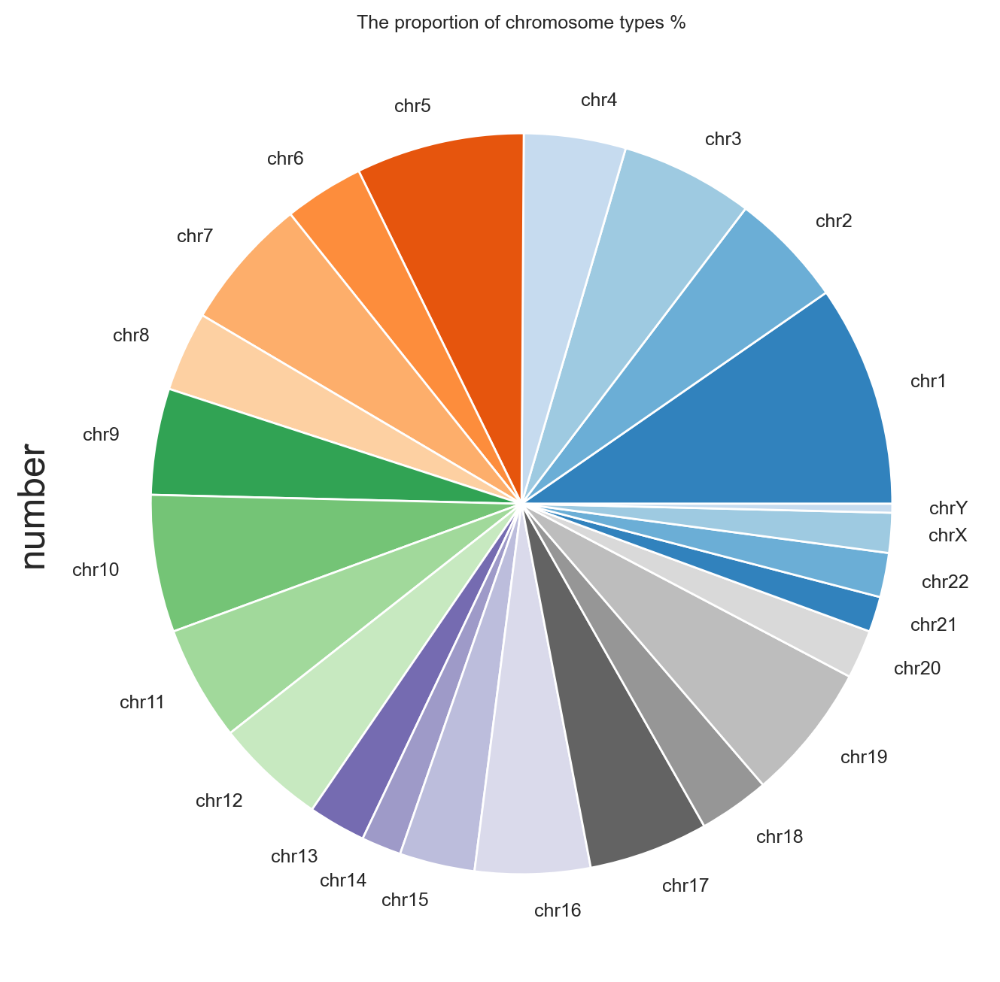
    


    
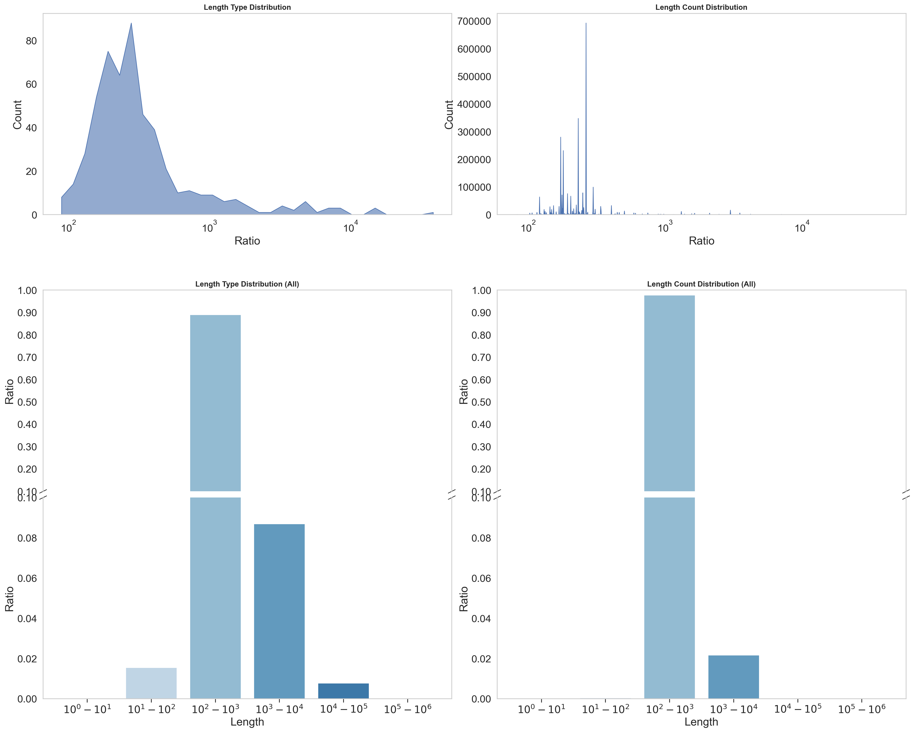
    


    
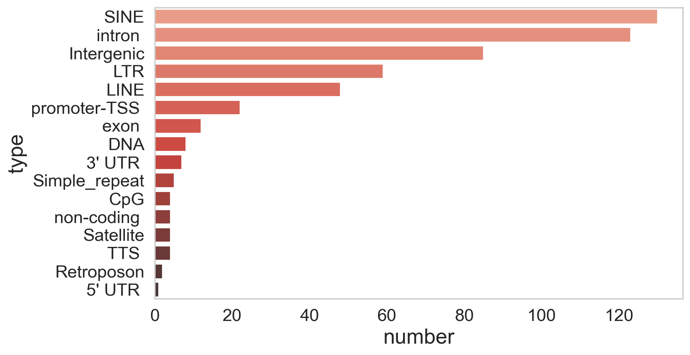
    


    	Plot homer anno distribution over!
    	Anno snp,se,e,eQTL Start!


    

    


    	Anno snp,SuperEnhancer,Enhancer,eQTL End!
    	jinja2 report Start!
    	jinja2 report End!
    Run fast End!
    SRR6315405
    Run fast Start!
    	Make chr bed & QC start!
    	Make chr bed & QC over!
    	Plot Chr distribution Start!
    	Plot Chr distribution over!
    	Plot Length distribution Start!
    	Plot Length distribution over!
    	Plot homer anno distribution Start!


    
    	Peak file = ./data/nebula/circle-Map_real_data/SRR6315405/ecc_pipe_result/circlemap_result.analysis.bed
    	Genome = hg38
    	Organism = human
    	Peak/BED file conversion summary:
    		BED/Header formatted lines: 7
    		peakfile formatted lines: 1
    		Duplicated Peak IDs: 0
    
    	Peak File Statistics:
    		Total Peaks: 8
    		Redundant Peak IDs: 0
    		Peaks lacking information: 0 (need at least 5 columns per peak)
    		Peaks with misformatted coordinates: 0 (should be integer)
    		Peaks with misformatted strand: 0 (should be either +/- or 0/1)
    
    	Peak file looks good!
    
    	Reading Positions...
    	-----------------------
    	Finding Closest TSS...
    	Annotating:.....
    		Annotation	Number of peaks	Total size (bp)	Log2 Ratio (obs/exp)	LogP enrichment (+values depleted)
    		3UTR	0.0	6659761	-0.098	0.070
    		miRNA	0.0	14292	-0.000	0.000
    		ncRNA	0.0	1602360	-0.024	0.017
    		TTS	0.0	7683628	-0.113	0.081
    		pseudo	0.0	693111	-0.010	0.007
    		Exon	0.0	8740084	-0.128	0.092
    		Intron	6.0	281649863	1.023	-3.682
    		Intergenic	1.0	351602094	-1.882	3.061
    		Promoter	0.0	8521142	-0.125	0.090
    		5UTR	0.0	601461	-0.009	0.006
    		snoRNA	0.0	74	-0.000	0.000
    		scRNA	0.0	97	-0.000	0.000
    	NOTE: If this part takes more than 2 minutes, there is a good chance
    		your machine ran out of memory: consider hitting ctrl+C and rerunning
    		the command with "-noann"
    	To capture annotation stats in a file, use "-annStats <filename>" next time
    	Annotating:.....
    		Annotation	Number of peaks	Total size (bp)	Log2 Ratio (obs/exp)	LogP enrichment (+values depleted)
    		3UTR	0.0	6659761	-0.098	0.070
    		Retroposon	0.0	932922	-0.014	0.010
    		RC?	0.0	11484	-0.000	0.000
    		RNA	0.0	22077	-0.000	0.000
    		miRNA	0.0	14292	-0.000	0.000
    		ncRNA	0.0	1602360	-0.024	0.017
    		TTS	0.0	7683628	-0.113	0.081
    		LINE	0.0	123178038	-1.369	1.426
    		srpRNA	0.0	65179	-0.001	0.001
    		SINE	2.0	86904887	1.135	-1.477
    		RC	0.0	62567	-0.001	0.001
    		tRNA	0.0	25966	-0.000	0.000
    		DNA?	0.0	95069	-0.001	0.001
    		pseudo	0.0	693111	-0.010	0.007
    		DNA	0.0	19865567	-0.280	0.211
    		Exon	0.0	8740084	-0.128	0.092
    		Intron	2.0	145717532	0.390	-0.750
    		Intergenic	1.0	181529789	-0.927	0.935
    		Promoter	0.0	8521142	-0.125	0.090
    		5UTR	0.0	601461	-0.009	0.006
    		snoRNA	0.0	74	-0.000	0.000
    		LTR?	0.0	243742	-0.004	0.003
    		scRNA	0.0	30443	-0.000	0.000
    		CpG-Island	0.0	2093674	-0.031	0.022
    		Low_complexity	0.0	1101191	-0.017	0.012
    		LTR	1.0	49120903	0.958	-0.882
    		Simple_repeat	1.0	6732844	3.825	-2.682
    		snRNA	0.0	71638	-0.001	0.001
    		Unknown	0.0	151619	-0.002	0.002
    		SINE?	0.0	444	-0.000	0.000
    		Satellite	0.0	15642055	-0.224	0.166
    		rRNA	0.0	34969	-0.001	0.000
    	Counting Tags in Peaks from each directory...
    	Organism: human
    	Loading Gene Informaiton...
    	Outputing Annotation File...
    	Done annotating peaks file
    


    
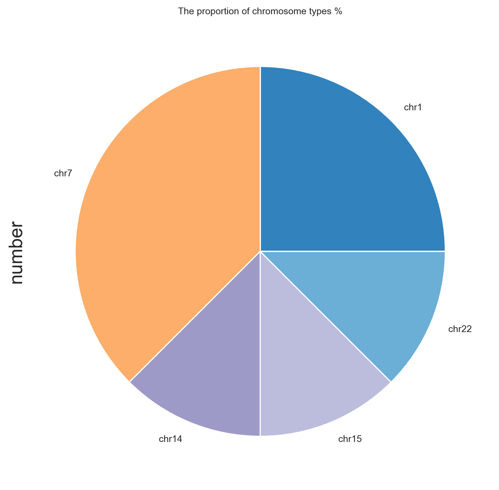
    


    
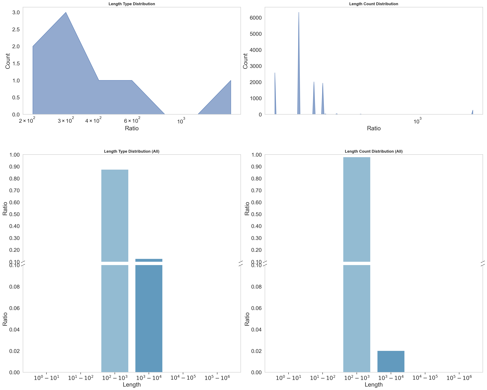
    


    
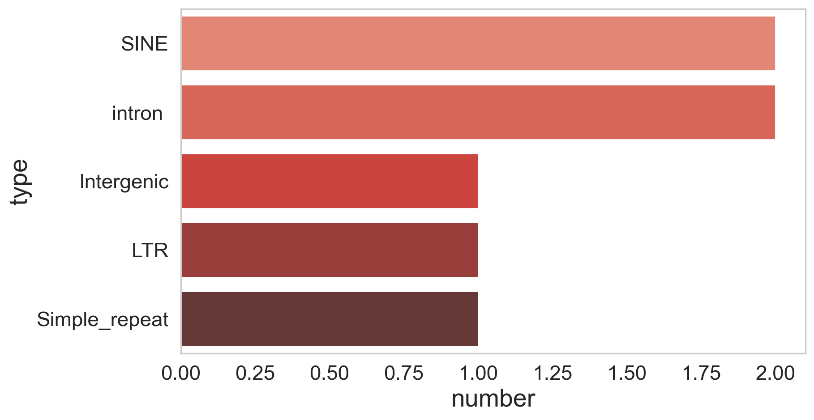
    


    	Plot homer anno distribution over!
    	Anno snp,se,e,eQTL Start!
    	Anno snp,SuperEnhancer,Enhancer,eQTL End!
    	jinja2 report Start!
    	jinja2 report End!
    Run fast End!
    SRR6315406
    Run fast Start!
    	Make chr bed & QC start!
    	Make chr bed & QC over!
    	Plot Chr distribution Start!
    	Plot Chr distribution over!
    	Plot Length distribution Start!
    	Plot Length distribution over!
    	Plot homer anno distribution Start!


    
    	Peak file = ./data/nebula/circle-Map_real_data/SRR6315406/ecc_pipe_result/circlemap_result.analysis.bed
    	Genome = hg38
    	Organism = human
    	Peak/BED file conversion summary:
    		BED/Header formatted lines: 47
    		peakfile formatted lines: 0
    		Duplicated Peak IDs: 5
    
    	Peak File Statistics:
    		Total Peaks: 47
    		Redundant Peak IDs: 0
    		Peaks lacking information: 0 (need at least 5 columns per peak)
    		Peaks with misformatted coordinates: 0 (should be integer)
    		Peaks with misformatted strand: 0 (should be either +/- or 0/1)
    
    	Peak file looks good!
    
    	Reading Positions...
    	-----------------------
    	Finding Closest TSS...
    	Annotating:.....................
    		Annotation	Number of peaks	Total size (bp)	Log2 Ratio (obs/exp)	LogP enrichment (+values depleted)
    		3UTR	0.0	24949537	-0.520	0.432
    		miRNA	0.0	90765	-0.002	0.002
    		ncRNA	0.0	6427182	-0.152	0.111
    		TTS	1.0	30175958	0.942	-0.898
    		pseudo	0.0	1991846	-0.049	0.034
    		Exon	0.0	34838663	-0.686	0.605
    		Intron	22.0	1142969322	0.158	-1.213
    		Intergenic	24.0	1447209142	-0.057	0.810
    		Promoter	0.0	33597227	-0.666	0.583
    		5UTR	0.0	2423648	-0.059	0.042
    		snoRNA	0.0	357	-0.000	0.000
    		scRNA	0.0	97	-0.000	0.000
    		rRNA	0.0	25562	-0.001	0.000
    	NOTE: If this part takes more than 2 minutes, there is a good chance
    		your machine ran out of memory: consider hitting ctrl+C and rerunning
    		the command with "-noann"
    	To capture annotation stats in a file, use "-annStats <filename>" next time
    	Annotating:.....................
    		Annotation	Number of peaks	Total size (bp)	Log2 Ratio (obs/exp)	LogP enrichment (+values depleted)
    		3UTR	0.0	24949537	-0.520	0.432
    		Retroposon	0.0	3749250	-0.090	0.065
    		RC?	0.0	53692	-0.001	0.001
    		RNA	0.0	96838	-0.002	0.002
    		miRNA	0.0	90765	-0.002	0.002
    		ncRNA	0.0	6427182	-0.152	0.111
    		TTS	1.0	30175958	0.943	-0.898
    		LINE	5.0	560433573	-0.950	2.828
    		srpRNA	0.0	238806	-0.006	0.004
    		SINE	21.0	348620339	1.805	-16.400
    		RC	0.0	327388	-0.008	0.006
    		tRNA	0.0	86722	-0.002	0.001
    		DNA?	0.0	377541	-0.009	0.007
    		pseudo	0.0	1991846	-0.049	0.034
    		DNA	0.0	88879286	-1.370	1.558
    		Exon	0.0	34838663	-0.686	0.604
    		Intron	8.0	594929765	-0.358	1.292
    		Intergenic	7.0	651204055	-0.682	2.333
    		Promoter	0.0	33597227	-0.666	0.583
    		5UTR	0.0	2423648	-0.059	0.042
    		snoRNA	0.0	357	-0.000	0.000
    		LTR?	0.0	1006808	-0.025	0.017
    		scRNA	0.0	110765	-0.003	0.002
    		CpG-Island	0.0	8325114	-0.194	0.144
    		Low_complexity	0.0	4850160	-0.116	0.084
    		LTR	2.0	227227903	-0.970	1.436
    		Simple_repeat	2.0	30389261	1.933	-2.336
    		snRNA	0.0	285224	-0.007	0.005
    		Unknown	0.0	632727	-0.016	0.011
    		SINE?	0.0	2305	-0.000	0.000
    		Satellite	1.0	69692269	-0.265	0.414
    		rRNA	0.0	188060	-0.005	0.003
    	Counting Tags in Peaks from each directory...
    	Organism: human
    	Loading Gene Informaiton...
    	Outputing Annotation File...
    	Done annotating peaks file
    


    

    


    

    


    
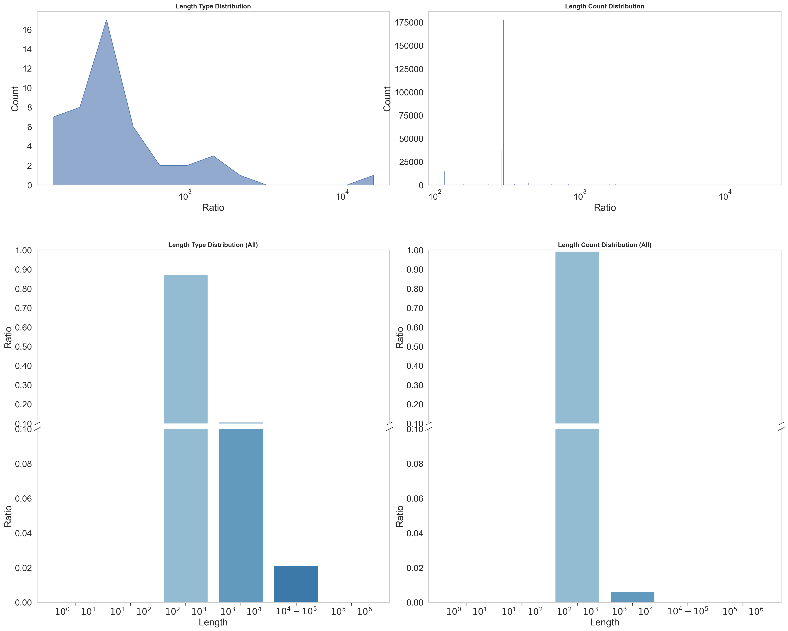
    


    
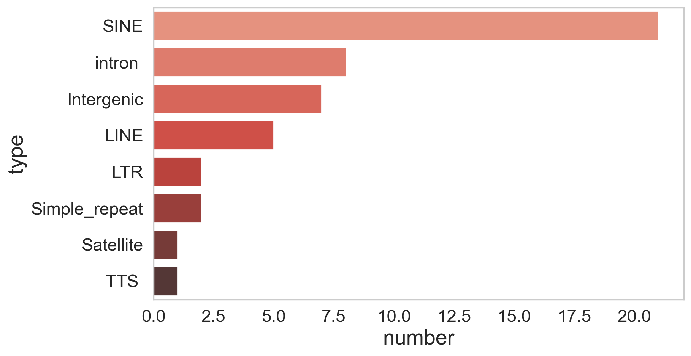
    


    	Plot homer anno distribution over!
    	Anno snp,se,e,eQTL Start!


    

    


    	Anno snp,SuperEnhancer,Enhancer,eQTL End!
    	jinja2 report Start!
    	jinja2 report End!
    Run fast End!
    SRR6315407
    Run fast Start!
    	Make chr bed & QC start!
    	Make chr bed & QC over!
    	Plot Chr distribution Start!
    	Plot Chr distribution over!
    	Plot Length distribution Start!
    	Plot Length distribution over!
    	Plot homer anno distribution Start!


    
    	Peak file = ./data/nebula/circle-Map_real_data/SRR6315407/ecc_pipe_result/circlemap_result.analysis.bed
    	Genome = hg38
    	Organism = human
    	Peak/BED file conversion summary:
    		BED/Header formatted lines: 66
    		peakfile formatted lines: 0
    		Duplicated Peak IDs: 5
    
    	Peak File Statistics:
    		Total Peaks: 66
    		Redundant Peak IDs: 0
    		Peaks lacking information: 0 (need at least 5 columns per peak)
    		Peaks with misformatted coordinates: 0 (should be integer)
    		Peaks with misformatted strand: 0 (should be either +/- or 0/1)
    
    	Peak file looks good!
    
    	Reading Positions...
    	-----------------------
    	Finding Closest TSS...
    	Annotating:......................
    		Annotation	Number of peaks	Total size (bp)	Log2 Ratio (obs/exp)	LogP enrichment (+values depleted)
    		3UTR	1.0	26474262	0.771	-0.810
    		miRNA	0.0	91109	-0.003	0.002
    		ncRNA	0.0	6820614	-0.203	0.151
    		TTS	4.0	31727170	2.510	-5.209
    		pseudo	0.0	2069923	-0.065	0.046
    		Exon	3.0	36644103	1.887	-3.038
    		Intron	33.0	1239345362	0.267	-2.273
    		Intergenic	24.0	1601607813	-0.562	5.675
    		Promoter	1.0	35228595	0.359	-0.610
    		5UTR	0.0	2560784	-0.080	0.057
    		snoRNA	0.0	357	-0.000	0.000
    		scRNA	0.0	97	-0.000	0.000
    	NOTE: If this part takes more than 2 minutes, there is a good chance
    		your machine ran out of memory: consider hitting ctrl+C and rerunning
    		the command with "-noann"
    	To capture annotation stats in a file, use "-annStats <filename>" next time
    	Annotating:......................
    		Annotation	Number of peaks	Total size (bp)	Log2 Ratio (obs/exp)	LogP enrichment (+values depleted)
    		3UTR	1.0	26474262	0.772	-0.810
    		Retroposon	0.0	4001034	-0.122	0.089
    		RC?	0.0	59236	-0.002	0.001
    		RNA	0.0	107044	-0.003	0.002
    		miRNA	0.0	91109	-0.003	0.002
    		ncRNA	0.0	6820614	-0.203	0.151
    		TTS	4.0	31727170	2.511	-5.211
    		LINE	5.0	619516085	-1.454	5.715
    		srpRNA	0.0	258827	-0.008	0.006
    		SINE	16.0	373001706	0.956	-5.052
    		RC	0.0	355982	-0.011	0.008
    		tRNA	0.0	90622	-0.003	0.002
    		DNA?	0.0	418633	-0.013	0.009
    		pseudo	0.0	2069923	-0.065	0.046
    		DNA	1.0	97786340	-1.113	1.025
    		Exon	3.0	36644103	1.888	-3.039
    		Intron	14.0	646232435	-0.030	0.624
    		Intergenic	10.0	726186117	-0.684	2.992
    		Promoter	1.0	35228595	0.360	-0.610
    		5UTR	0.0	2560784	-0.080	0.057
    		snoRNA	0.0	357	-0.000	0.000
    		LTR?	0.0	1121352	-0.035	0.025
    		scRNA	0.0	119986	-0.004	0.003
    		CpG-Island	0.0	8754249	-0.256	0.194
    		Low_complexity	0.0	5308729	-0.160	0.118
    		LTR	7.0	253332031	0.321	-1.117
    		Simple_repeat	1.0	33134854	0.448	-0.651
    		snRNA	0.0	307380	-0.010	0.007
    		Unknown	0.0	707405	-0.022	0.016
    		SINE?	0.0	2674	-0.000	0.000
    		Satellite	2.0	71513810	0.339	-0.752
    		rRNA	1.0	169039	8.063	-5.591
    	Counting Tags in Peaks from each directory...
    	Organism: human
    	Loading Gene Informaiton...
    	Outputing Annotation File...
    	Done annotating peaks file
    


    
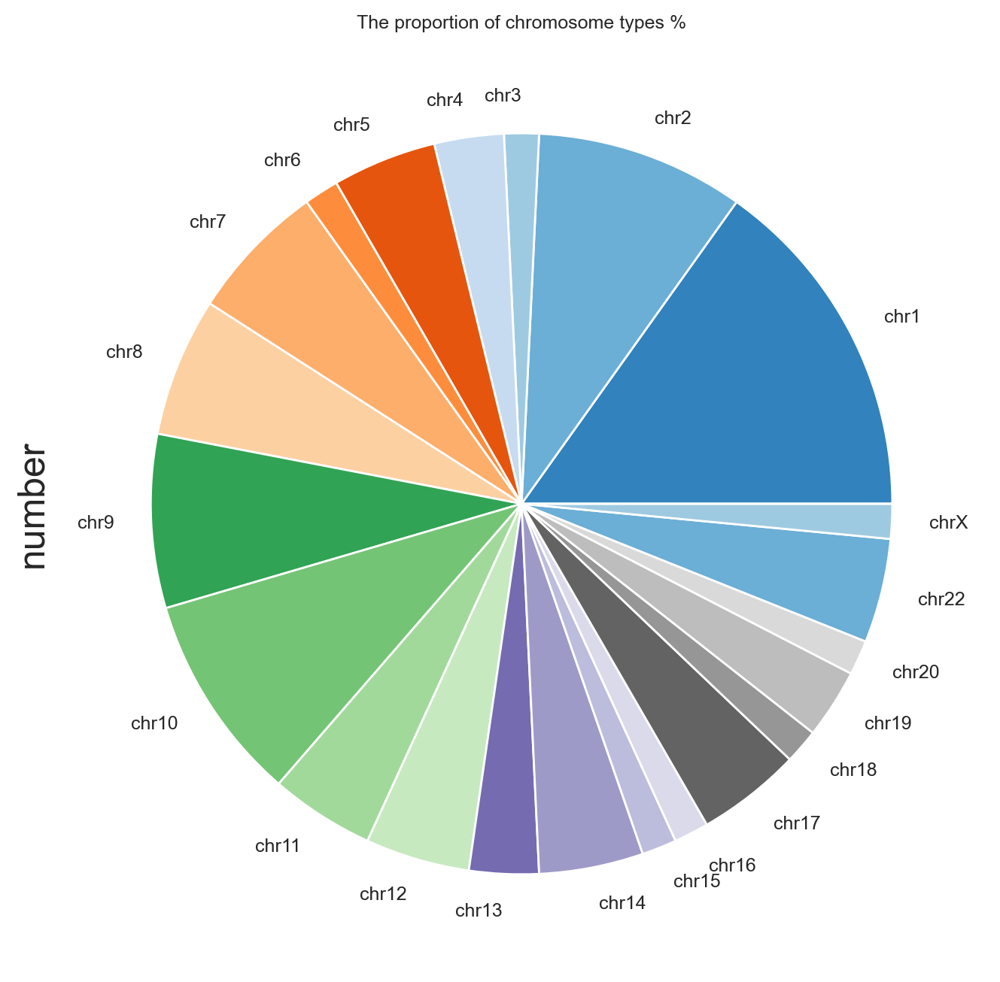
    


    
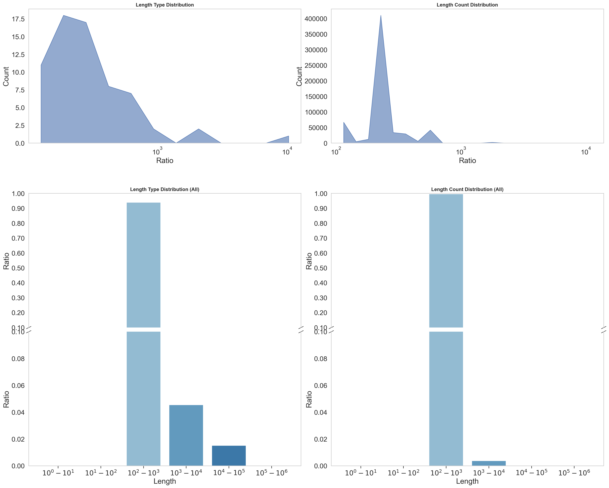
    


    
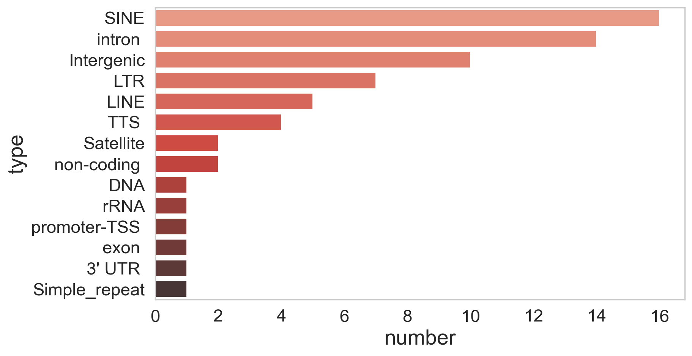
    


    	Plot homer anno distribution over!
    	Anno snp,se,e,eQTL Start!


    

    


    	Anno snp,SuperEnhancer,Enhancer,eQTL End!
    	jinja2 report Start!
    	jinja2 report End!
    Run fast End!
    SRR6315408
    Run fast Start!
    	Make chr bed & QC start!
    	Make chr bed & QC over!
    	Plot Chr distribution Start!
    	Plot Chr distribution over!
    	Plot Length distribution Start!
    	Plot Length distribution over!
    	Plot homer anno distribution Start!


    
    	Peak file = ./data/nebula/circle-Map_real_data/SRR6315408/ecc_pipe_result/circlemap_result.analysis.bed
    	Genome = hg38
    	Organism = human
    	Peak/BED file conversion summary:
    		BED/Header formatted lines: 57
    		peakfile formatted lines: 0
    		Duplicated Peak IDs: 11
    
    	Peak File Statistics:
    		Total Peaks: 57
    		Redundant Peak IDs: 0
    		Peaks lacking information: 0 (need at least 5 columns per peak)
    		Peaks with misformatted coordinates: 0 (should be integer)
    		Peaks with misformatted strand: 0 (should be either +/- or 0/1)
    
    	Peak file looks good!
    
    	Reading Positions...
    	-----------------------
    	Finding Closest TSS...
    	Annotating:.....................
    		Annotation	Number of peaks	Total size (bp)	Log2 Ratio (obs/exp)	LogP enrichment (+values depleted)
    		3UTR	0.0	25247935	-0.604	0.518
    		miRNA	0.0	87851	-0.003	0.002
    		ncRNA	0.0	6504651	-0.180	0.133
    		TTS	2.0	30420670	1.687	-2.055
    		pseudo	0.0	2029874	-0.059	0.041
    		Exon	0.0	35153835	-0.788	0.722
    		Intron	23.0	1166179279	-0.050	0.754
    		Intergenic	30.0	1490486077	-0.020	0.680
    		Promoter	2.0	33824621	1.534	-1.885
    		5UTR	0.0	2446352	-0.070	0.050
    		snoRNA	0.0	357	-0.000	0.000
    		scRNA	0.0	97	-0.000	0.000
    	NOTE: If this part takes more than 2 minutes, there is a good chance
    		your machine ran out of memory: consider hitting ctrl+C and rerunning
    		the command with "-noann"
    	To capture annotation stats in a file, use "-annStats <filename>" next time
    	Annotating:.....................
    		Annotation	Number of peaks	Total size (bp)	Log2 Ratio (obs/exp)	LogP enrichment (+values depleted)
    		3UTR	0.0	25247935	-0.604	0.517
    		Retroposon	0.0	3800196	-0.108	0.078
    		RC?	0.0	56386	-0.002	0.001
    		RNA	0.0	100134	-0.003	0.002
    		miRNA	0.0	87851	-0.003	0.002
    		ncRNA	0.0	6504651	-0.180	0.133
    		TTS	2.0	30420670	1.688	-2.055
    		LINE	7.0	574501703	-0.744	2.556
    		srpRNA	0.0	244882	-0.007	0.005
    		SINE	18.0	354065426	1.317	-8.757
    		RC	0.0	335033	-0.010	0.007
    		tRNA	0.0	87770	-0.003	0.002
    		DNA?	0.0	391315	-0.011	0.008
    		pseudo	0.0	2029874	-0.059	0.041
    		DNA	1.0	91062300	-0.894	0.817
    		Exon	0.0	35153835	-0.788	0.722
    		Intron	8.0	607757501	-0.632	2.289
    		Intergenic	9.0	677528866	-0.619	2.447
    		Promoter	2.0	33824621	1.535	-1.886
    		5UTR	0.0	2446352	-0.070	0.050
    		snoRNA	0.0	357	-0.000	0.000
    		LTR?	0.0	1029169	-0.030	0.021
    		scRNA	0.0	113105	-0.003	0.002
    		CpG-Island	0.0	8380830	-0.228	0.171
    		Low_complexity	0.0	4943356	-0.139	0.101
    		LTR	7.0	232574050	0.561	-1.641
    		Simple_repeat	0.0	30869219	-0.711	0.633
    		snRNA	0.0	288716	-0.008	0.006
    		Unknown	0.0	658167	-0.019	0.013
    		SINE?	0.0	2544	-0.000	0.000
    		Satellite	3.0	69207156	1.087	-1.786
    		rRNA	0.0	161279	-0.005	0.003
    	Counting Tags in Peaks from each directory...
    	Organism: human
    	Loading Gene Informaiton...
    	Outputing Annotation File...
    	Done annotating peaks file
    


    
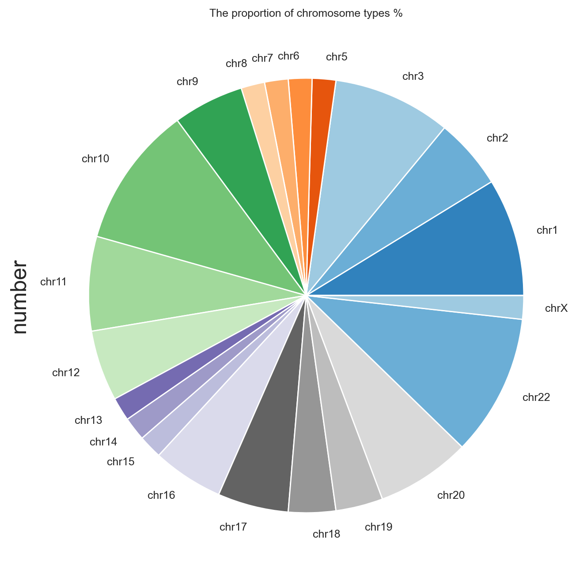
    


    
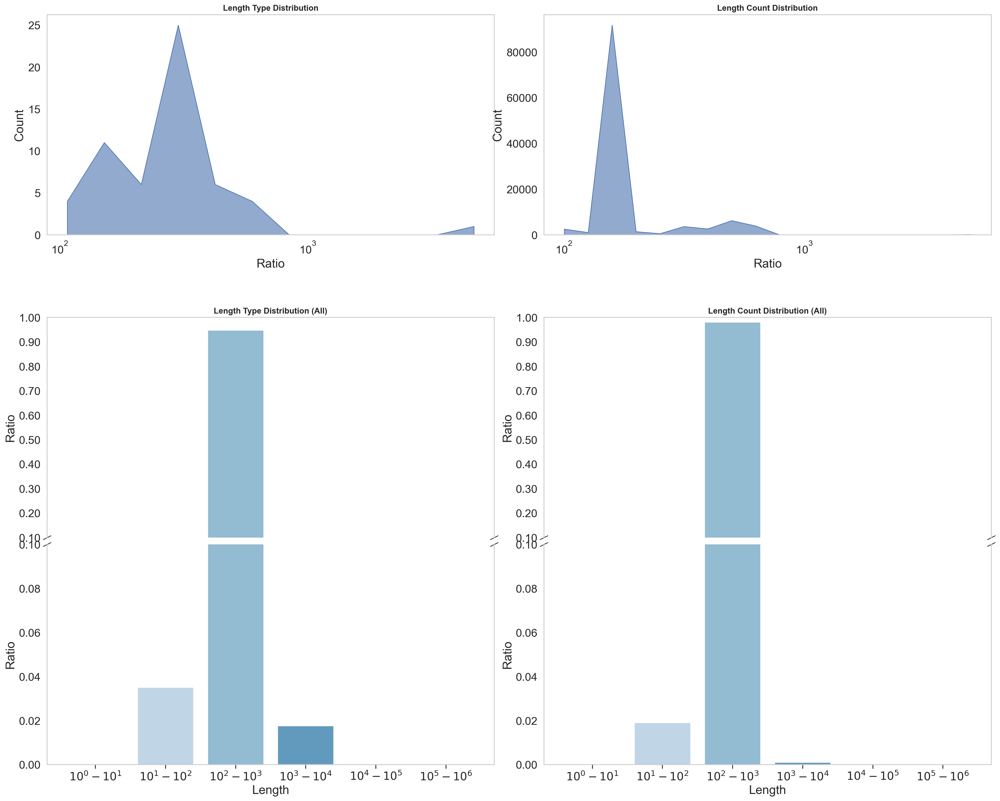
    


    
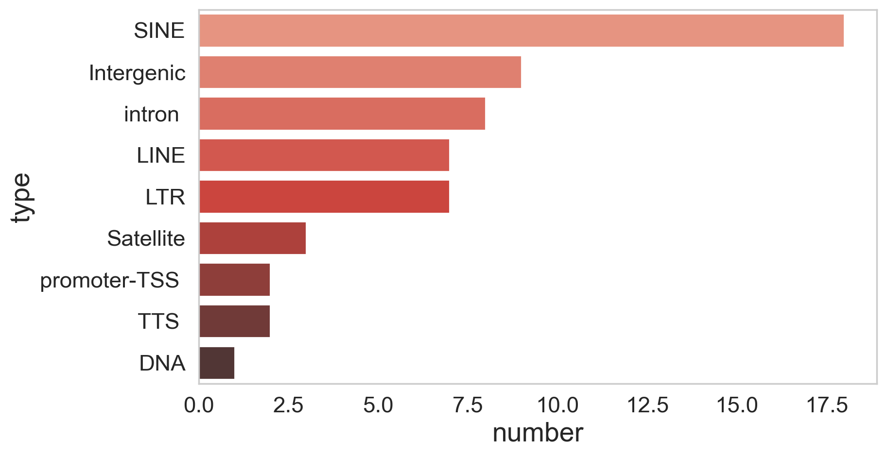
    


    	Plot homer anno distribution over!
    	Anno snp,se,e,eQTL Start!


    
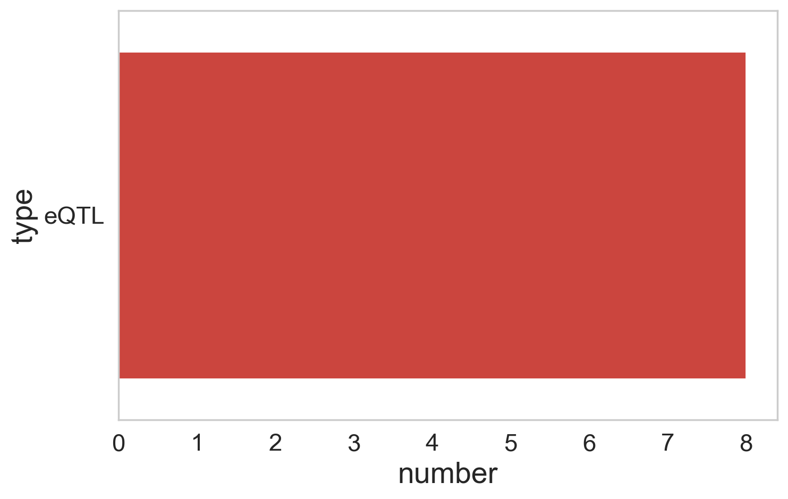
    


    	Anno snp,SuperEnhancer,Enhancer,eQTL End!
    	jinja2 report Start!
    	jinja2 report End!
    Run fast End!
    SRR6315409
    Run fast Start!
    	Make chr bed & QC start!
    	Make chr bed & QC over!
    	Plot Chr distribution Start!
    	Plot Chr distribution over!
    	Plot Length distribution Start!
    	Plot Length distribution over!
    	Plot homer anno distribution Start!


    
    	Peak file = ./data/nebula/circle-Map_real_data/SRR6315409/ecc_pipe_result/circlemap_result.analysis.bed
    	Genome = hg38
    	Organism = human
    	Peak/BED file conversion summary:
    		BED/Header formatted lines: 10
    		peakfile formatted lines: 1
    		Duplicated Peak IDs: 0
    
    	Peak File Statistics:
    		Total Peaks: 11
    		Redundant Peak IDs: 0
    		Peaks lacking information: 0 (need at least 5 columns per peak)
    		Peaks with misformatted coordinates: 0 (should be integer)
    		Peaks with misformatted strand: 0 (should be either +/- or 0/1)
    
    	Peak file looks good!
    
    	Reading Positions...
    	-----------------------
    	Finding Closest TSS...
    	Annotating:......
    		Annotation	Number of peaks	Total size (bp)	Log2 Ratio (obs/exp)	LogP enrichment (+values depleted)
    		3UTR	0.0	6871039	-0.111	0.080
    		miRNA	0.0	20528	-0.000	0.000
    		ncRNA	0.0	1922082	-0.032	0.022
    		TTS	0.0	8181967	-0.131	0.095
    		pseudo	0.0	646367	-0.011	0.007
    		Exon	0.0	9235180	-0.148	0.107
    		Intron	3.0	350435728	-0.431	0.990
    		Intergenic	7.0	479715454	0.339	-1.296
    		Promoter	0.0	8960557	-0.143	0.104
    		5UTR	0.0	658479	-0.011	0.008
    		snoRNA	0.0	77	-0.000	0.000
    	NOTE: If this part takes more than 2 minutes, there is a good chance
    		your machine ran out of memory: consider hitting ctrl+C and rerunning
    		the command with "-noann"
    	To capture annotation stats in a file, use "-annStats <filename>" next time
    	Annotating:......
    		Annotation	Number of peaks	Total size (bp)	Log2 Ratio (obs/exp)	LogP enrichment (+values depleted)
    		3UTR	0.0	6871039	-0.111	0.080
    		Retroposon	0.0	1082403	-0.018	0.012
    		RC?	0.0	16937	-0.000	0.000
    		RNA	0.0	30388	-0.001	0.000
    		miRNA	0.0	20528	-0.000	0.000
    		ncRNA	0.0	1922082	-0.032	0.022
    		TTS	0.0	8181967	-0.131	0.095
    		LINE	0.0	178976885	-1.848	2.312
    		srpRNA	0.0	72815	-0.001	0.001
    		SINE	5.0	102545822	2.080	-5.661
    		RC	0.0	101345	-0.002	0.001
    		tRNA	0.0	19378	-0.000	0.000
    		DNA?	0.0	124674	-0.002	0.001
    		pseudo	0.0	646367	-0.011	0.007
    		DNA	0.0	28374522	-0.420	0.333
    		Exon	0.0	9235180	-0.147	0.107
    		Intron	0.0	185293815	-1.894	2.404
    		Intergenic	4.0	223832398	0.632	-1.413
    		Promoter	0.0	8960557	-0.143	0.104
    		5UTR	0.0	658479	-0.011	0.008
    		snoRNA	0.0	77	-0.000	0.000
    		LTR?	0.0	342831	-0.006	0.004
    		scRNA	0.0	35521	-0.001	0.000
    		CpG-Island	1.0	2453336	5.144	-3.578
    		Low_complexity	0.0	1542850	-0.025	0.018
    		LTR	0.0	75728359	-0.969	0.914
    		Simple_repeat	0.0	9735089	-0.155	0.113
    		snRNA	0.0	83818	-0.001	0.001
    		Unknown	0.0	208263	-0.003	0.002
    		SINE?	0.0	958	-0.000	0.000
    		Satellite	0.0	20056800	-0.307	0.234
    		rRNA	0.0	37300	-0.001	0.000
    	Counting Tags in Peaks from each directory...
    	Organism: human
    	Loading Gene Informaiton...
    	Outputing Annotation File...
    	Done annotating peaks file
    


    
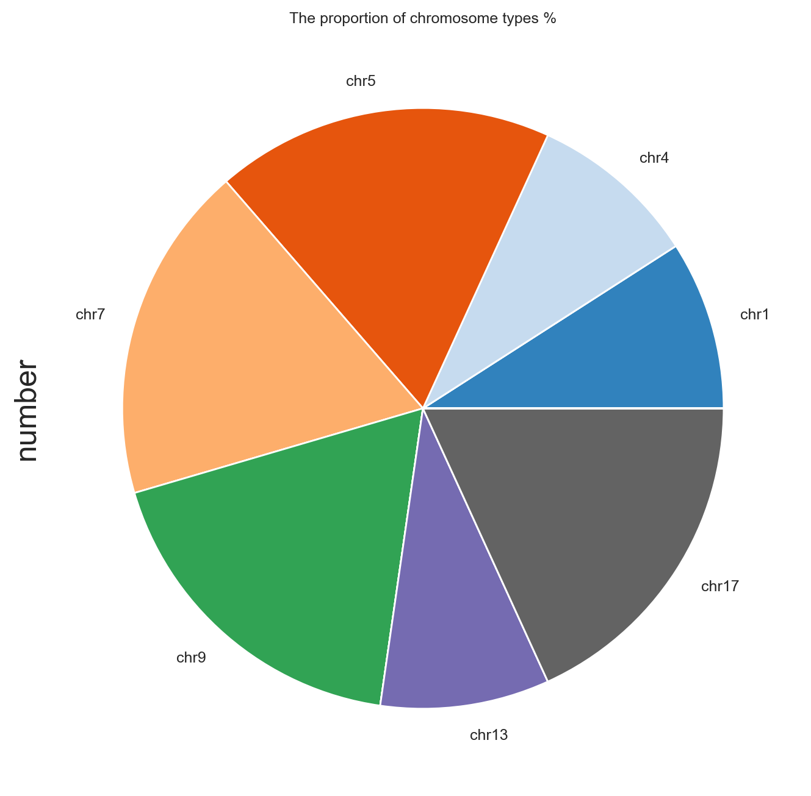
    


    

    


    
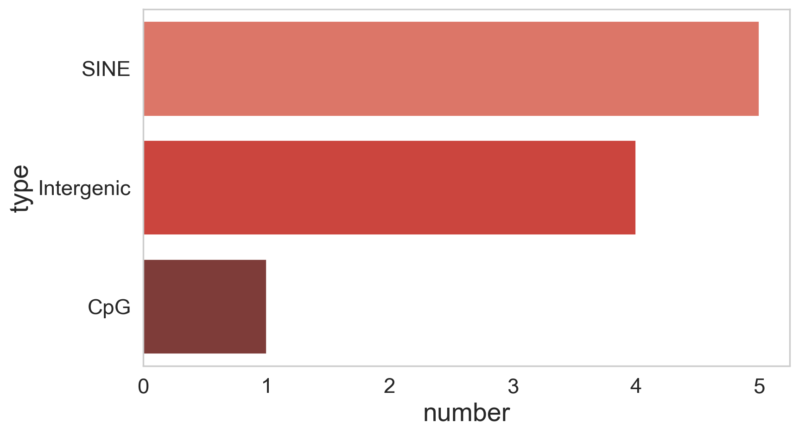
    


    	Plot homer anno distribution over!
    	Anno snp,se,e,eQTL Start!
    	Anno snp,SuperEnhancer,Enhancer,eQTL End!
    	jinja2 report Start!
    	jinja2 report End!
    Run fast End!
    SRR6315410
    Run fast Start!
    	Make chr bed & QC start!
    	Make chr bed & QC over!
    	Plot Chr distribution Start!
    	Plot Chr distribution over!
    	Plot Length distribution Start!
    	Plot Length distribution over!
    	Plot homer anno distribution Start!


    
    	Peak file = ./data/nebula/circle-Map_real_data/SRR6315410/ecc_pipe_result/circlemap_result.analysis.bed
    	Genome = hg38
    	Organism = human
    	Peak/BED file conversion summary:
    		BED/Header formatted lines: 11
    		peakfile formatted lines: 0
    		Duplicated Peak IDs: 0
    
    	Peak File Statistics:
    		Total Peaks: 11
    		Redundant Peak IDs: 0
    		Peaks lacking information: 0 (need at least 5 columns per peak)
    		Peaks with misformatted coordinates: 0 (should be integer)
    		Peaks with misformatted strand: 0 (should be either +/- or 0/1)
    
    	Peak file looks good!
    
    	Reading Positions...
    	-----------------------
    	Finding Closest TSS...
    	Annotating:.......
    		Annotation	Number of peaks	Total size (bp)	Log2 Ratio (obs/exp)	LogP enrichment (+values depleted)
    		3UTR	0.0	9930658	-0.156	0.114
    		miRNA	0.0	19128	-0.000	0.000
    		ncRNA	0.0	2278788	-0.037	0.026
    		TTS	0.0	12277623	-0.191	0.141
    		pseudo	0.0	915628	-0.015	0.010
    		Exon	0.0	14268125	-0.221	0.164
    		Intron	3.0	423539457	-0.688	1.555
    		Intergenic	8.0	486126115	0.528	-2.130
    		Promoter	0.0	13646658	-0.212	0.157
    		5UTR	0.0	994297	-0.016	0.011
    		snoRNA	0.0	133	-0.000	0.000
    	NOTE: If this part takes more than 2 minutes, there is a good chance
    		your machine ran out of memory: consider hitting ctrl+C and rerunning
    		the command with "-noann"
    	To capture annotation stats in a file, use "-annStats <filename>" next time
    	Annotating:.......
    		Annotation	Number of peaks	Total size (bp)	Log2 Ratio (obs/exp)	LogP enrichment (+values depleted)
    		3UTR	0.0	9930658	-0.156	0.114
    		Retroposon	0.0	1445149	-0.024	0.016
    		RC?	0.0	16938	-0.000	0.000
    		RNA	0.0	31985	-0.001	0.000
    		miRNA	0.0	19128	-0.000	0.000
    		ncRNA	0.0	2278788	-0.037	0.026
    		TTS	0.0	12277623	-0.191	0.141
    		LINE	0.0	184808683	-1.851	2.339
    		srpRNA	0.0	89538	-0.001	0.001
    		SINE	3.0	139287303	0.917	-1.588
    		RC	0.0	106285	-0.002	0.001
    		tRNA	0.0	33754	-0.001	0.000
    		DNA?	0.0	126284	-0.002	0.001
    		pseudo	0.0	915628	-0.015	0.010
    		DNA	2.0	30470652	2.525	-3.092
    		Exon	0.0	14268125	-0.221	0.164
    		Intron	2.0	217521640	-0.311	0.629
    		Intergenic	2.0	215959008	-0.300	0.619
    		Promoter	0.0	13646658	-0.211	0.157
    		5UTR	0.0	994297	-0.016	0.011
    		snoRNA	0.0	133	-0.000	0.000
    		LTR?	0.0	350137	-0.006	0.004
    		scRNA	0.0	43779	-0.001	0.000
    		CpG-Island	0.0	3794618	-0.061	0.043
    		Low_complexity	0.0	1841459	-0.030	0.021
    		LTR	2.0	79527775	1.141	-1.477
    		Simple_repeat	0.0	11280851	-0.177	0.129
    		snRNA	0.0	105029	-0.002	0.001
    		Unknown	0.0	213018	-0.004	0.002
    		SINE?	0.0	441	-0.000	0.000
    		Satellite	0.0	23199024	-0.346	0.268
    		rRNA	0.0	59232	-0.001	0.001
    	Counting Tags in Peaks from each directory...
    	Organism: human
    	Loading Gene Informaiton...
    	Outputing Annotation File...
    	Done annotating peaks file
    


    

    


    
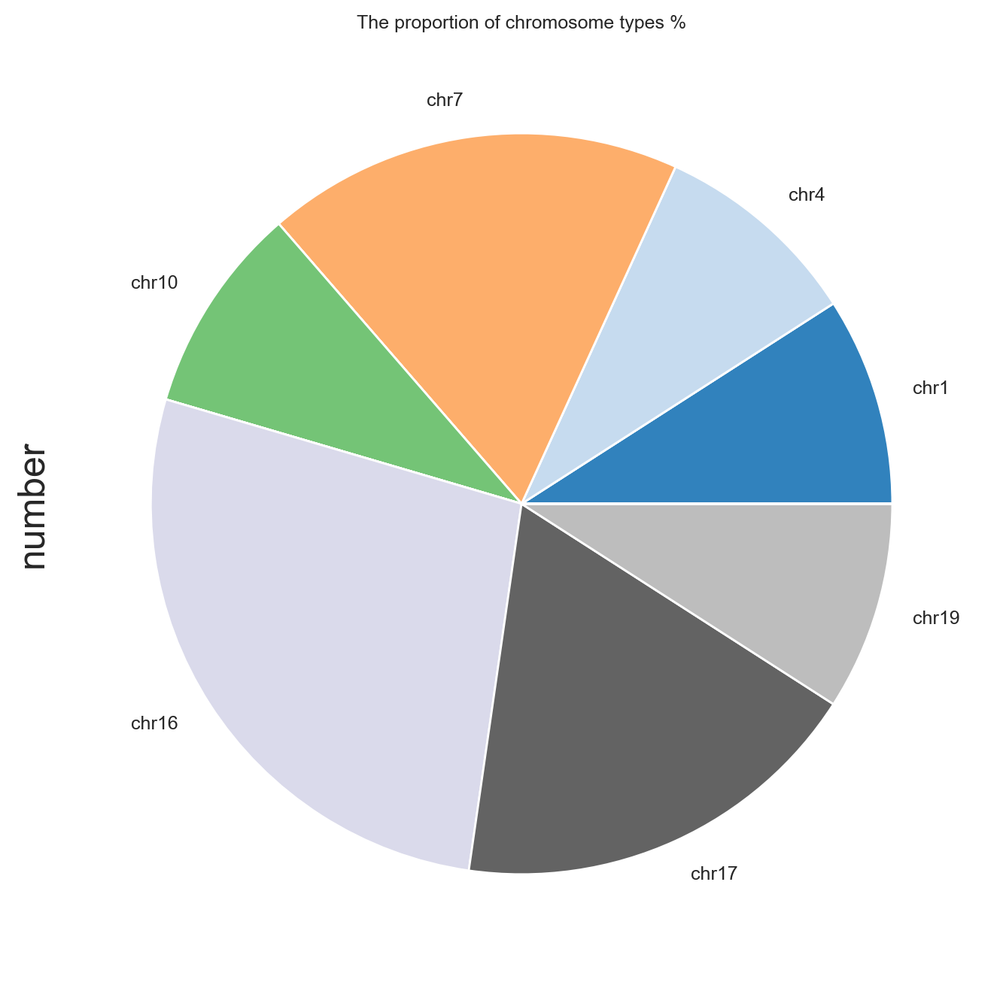
    


    
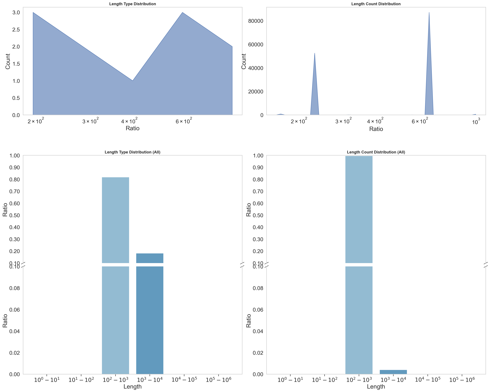
    


    
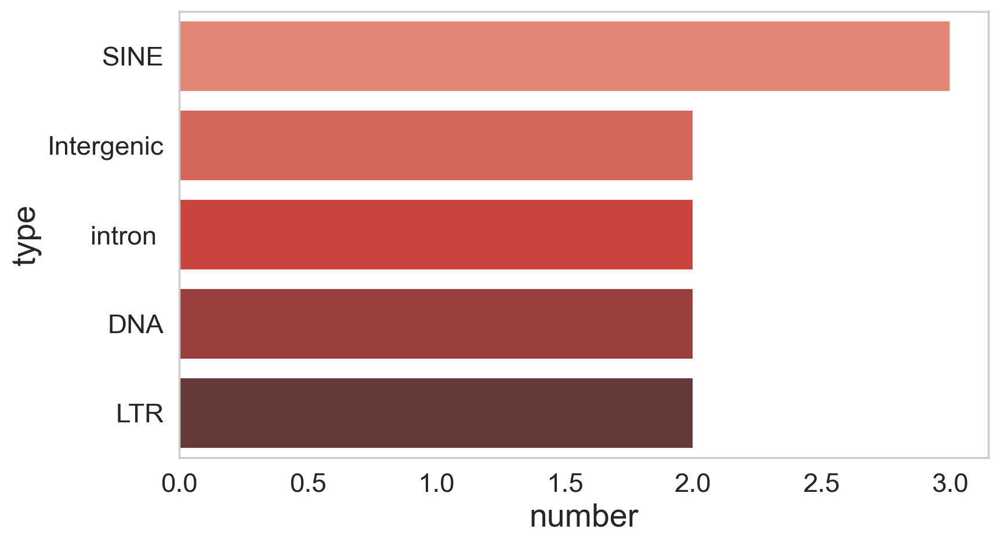
    


    	Plot homer anno distribution over!
    	Anno snp,se,e,eQTL Start!
    	Anno snp,SuperEnhancer,Enhancer,eQTL End!
    	jinja2 report Start!
    	jinja2 report End!
    Run fast End!
    SRR6315411
    Run fast Start!
    	Make chr bed & QC start!
    	Make chr bed & QC over!
    	Plot Chr distribution Start!
    	Plot Chr distribution over!
    	Plot Length distribution Start!
    	Plot Length distribution over!
    	Plot homer anno distribution Start!


    
    	Peak file = ./data/nebula/circle-Map_real_data/SRR6315411/ecc_pipe_result/circlemap_result.analysis.bed
    	Genome = hg38
    	Organism = human
    	Peak/BED file conversion summary:
    		BED/Header formatted lines: 1171
    		peakfile formatted lines: 0
    		Duplicated Peak IDs: 700
    
    	Peak File Statistics:
    		Total Peaks: 1171
    		Redundant Peak IDs: 0
    		Peaks lacking information: 0 (need at least 5 columns per peak)
    		Peaks with misformatted coordinates: 0 (should be integer)
    		Peaks with misformatted strand: 0 (should be either +/- or 0/1)
    
    	Peak file looks good!
    
    	Reading Positions...
    	-----------------------
    	Finding Closest TSS...
    	Annotating:........................
    		Annotation	Number of peaks	Total size (bp)	Log2 Ratio (obs/exp)	LogP enrichment (+values depleted)
    		3UTR	15.0	26833139	0.559	-2.383
    		miRNA	0.0	97618	-0.052	0.037
    		ncRNA	2.0	7044070	-0.418	0.693
    		TTS	22.0	32404629	0.840	-4.883
    		pseudo	0.0	2111155	-0.849	0.801
    		Exon	25.0	37120946	0.828	-5.274
    		Intron	541.0	1257910936	0.181	-9.298
    		Intergenic	537.0	1684358172	-0.251	20.391
    		Promoter	27.0	35946139	0.985	-7.083
    		5UTR	2.0	2601483	1.019	-1.349
    		snoRNA	0.0	357	-0.000	0.000
    		scRNA	0.0	97	-0.000	0.000
    		rRNA	0.0	25562	-0.014	0.010
    	NOTE: If this part takes more than 2 minutes, there is a good chance
    		your machine ran out of memory: consider hitting ctrl+C and rerunning
    		the command with "-noann"
    	To capture annotation stats in a file, use "-annStats <filename>" next time
    	Annotating:........................
    		Annotation	Number of peaks	Total size (bp)	Log2 Ratio (obs/exp)	LogP enrichment (+values depleted)
    		3UTR	15.0	26833139	0.560	-2.386
    		Retroposon	1.0	4062585	-0.623	0.608
    		RC?	0.0	59773	-0.032	0.023
    		RNA	0.0	108000	-0.058	0.041
    		miRNA	0.0	97618	-0.052	0.037
    		ncRNA	2.0	7044070	-0.417	0.692
    		TTS	22.0	32404629	0.840	-4.889
    		LINE	96.0	633178497	-1.323	69.456
    		srpRNA	0.0	262214	-0.137	0.099
    		SINE	288.0	379673449	1.000	-69.312
    		RC	0.0	362795	-0.186	0.138
    		tRNA	0.0	91738	-0.049	0.035
    		DNA?	0.0	423197	-0.215	0.160
    		pseudo	0.0	2111155	-0.849	0.801
    		DNA	36.0	99395597	-0.066	0.840
    		Exon	25.0	37120946	0.829	-5.280
    		Intron	275.0	656103354	0.144	-3.372
    		Intergenic	214.0	780868131	-0.469	18.793
    		Promoter	27.0	35946139	0.986	-7.091
    		5UTR	2.0	2601483	1.020	-1.350
    		snoRNA	0.0	357	-0.000	0.000
    		LTR?	1.0	1140409	1.209	-1.047
    		scRNA	0.0	121638	-0.065	0.046
    		CpG-Island	7.0	9000269	1.036	-2.839
    		Low_complexity	1.0	5480212	-1.055	0.954
    		LTR	140.0	262167686	0.494	-10.344
    		Simple_repeat	7.0	34754537	-0.913	3.030
    		snRNA	0.0	314325	-0.162	0.119
    		Unknown	0.0	714206	-0.346	0.271
    		SINE?	0.0	2674	-0.001	0.001
    		Satellite	12.0	75387841	-1.252	7.955
    		rRNA	0.0	202619	-0.107	0.077
    	Counting Tags in Peaks from each directory...
    	Organism: human
    	Loading Gene Informaiton...
    	Outputing Annotation File...
    	Done annotating peaks file
    


    

    


    
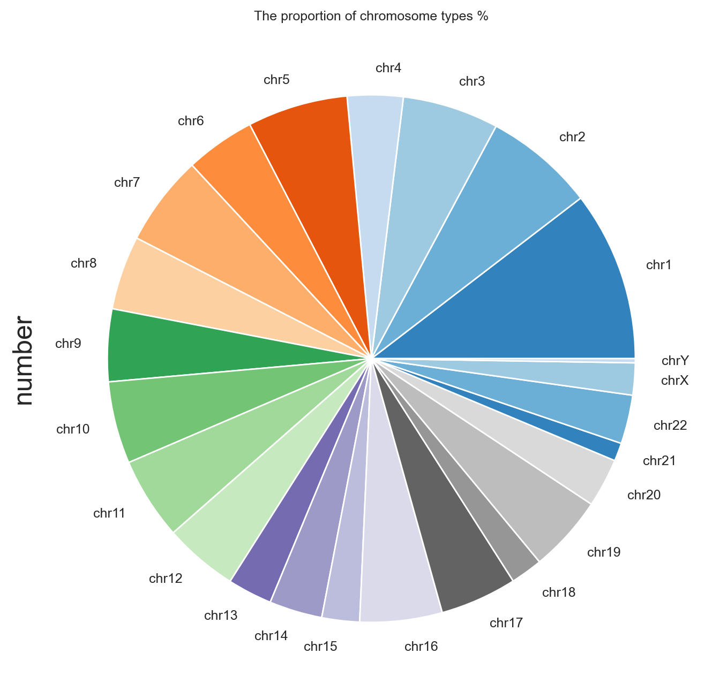
    


    
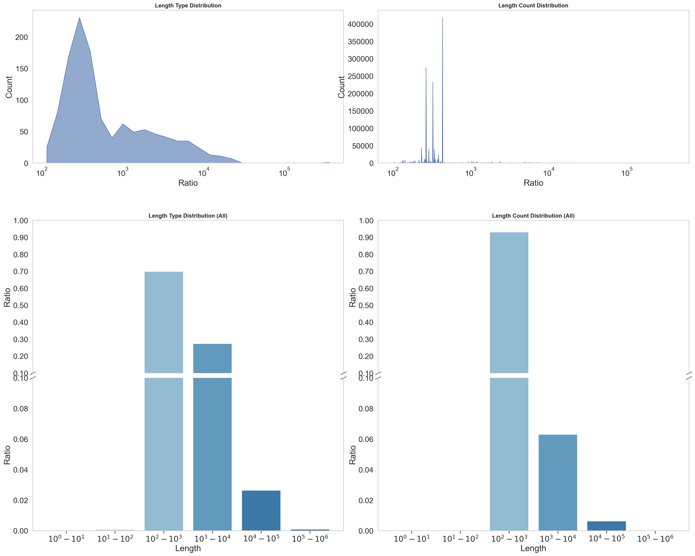
    


    
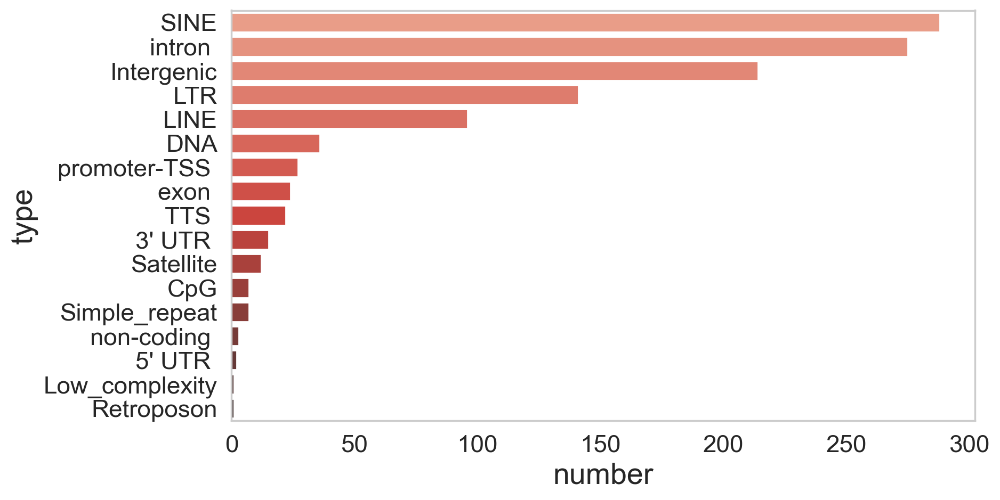
    


    	Plot homer anno distribution over!
    	Anno snp,se,e,eQTL Start!


    
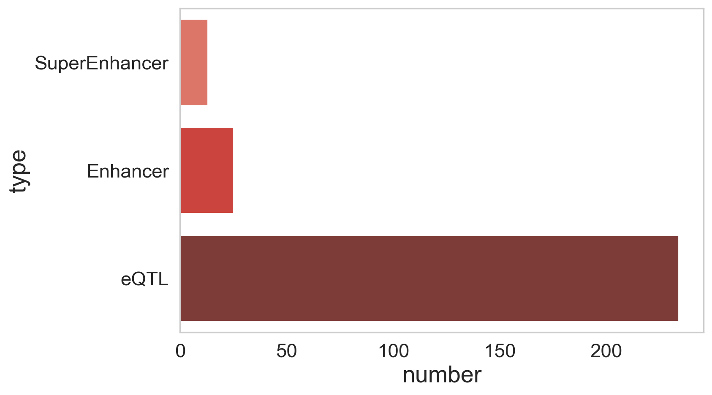
    


    	Anno snp,SuperEnhancer,Enhancer,eQTL End!
    	jinja2 report Start!
    	jinja2 report End!
    Run fast End!
    SRR6315412
    Run fast Start!
    	Make chr bed & QC start!
    	Make chr bed & QC over!
    	Plot Chr distribution Start!
    	Plot Chr distribution over!
    	Plot Length distribution Start!
    	Plot Length distribution over!
    	Plot homer anno distribution Start!


    
    	Peak file = ./data/nebula/circle-Map_real_data/SRR6315412/ecc_pipe_result/circlemap_result.analysis.bed
    	Genome = hg38
    	Organism = human
    	Peak/BED file conversion summary:
    		BED/Header formatted lines: 1107
    		peakfile formatted lines: 0
    		Duplicated Peak IDs: 672
    
    	Peak File Statistics:
    		Total Peaks: 1107
    		Redundant Peak IDs: 0
    		Peaks lacking information: 0 (need at least 5 columns per peak)
    		Peaks with misformatted coordinates: 0 (should be integer)
    		Peaks with misformatted strand: 0 (should be either +/- or 0/1)
    
    	Peak file looks good!
    
    	Reading Positions...
    	-----------------------
    	Finding Closest TSS...
    	Annotating:........................
    		Annotation	Number of peaks	Total size (bp)	Log2 Ratio (obs/exp)	LogP enrichment (+values depleted)
    		3UTR	9.0	26833139	-0.097	0.682
    		miRNA	0.0	97618	-0.050	0.035
    		ncRNA	1.0	7044070	-1.337	1.267
    		TTS	19.0	32404629	0.709	-3.577
    		pseudo	0.0	2111155	-0.814	0.757
    		Exon	13.0	37120946	-0.034	0.619
    		Intron	509.0	1257910936	0.174	-8.324
    		Intergenic	533.0	1684358172	-0.181	11.458
    		Promoter	22.0	35946139	0.771	-4.385
    		5UTR	1.0	2601483	0.100	-0.500
    		snoRNA	0.0	357	-0.000	0.000
    		scRNA	0.0	97	-0.000	0.000
    		rRNA	0.0	25562	-0.013	0.009
    	NOTE: If this part takes more than 2 minutes, there is a good chance
    		your machine ran out of memory: consider hitting ctrl+C and rerunning
    		the command with "-noann"
    	To capture annotation stats in a file, use "-annStats <filename>" next time
    	Annotating:........................
    		Annotation	Number of peaks	Total size (bp)	Log2 Ratio (obs/exp)	LogP enrichment (+values depleted)
    		3UTR	9.0	26833139	-0.096	0.681
    		Retroposon	0.0	4062585	-1.298	1.457
    		RC?	0.0	59773	-0.031	0.021
    		RNA	0.0	108000	-0.055	0.039
    		miRNA	0.0	97618	-0.050	0.035
    		ncRNA	1.0	7044070	-1.336	1.266
    		TTS	19.0	32404629	0.710	-3.582
    		LINE	112.0	633178497	-1.019	45.731
    		srpRNA	0.0	262214	-0.130	0.094
    		SINE	277.0	379673449	1.025	-69.743
    		RC	0.0	362795	-0.176	0.130
    		tRNA	0.0	91738	-0.047	0.033
    		DNA?	0.0	423197	-0.204	0.152
    		pseudo	0.0	2111155	-0.813	0.757
    		DNA	26.0	99395597	-0.455	2.902
    		Exon	13.0	37120946	-0.034	0.618
    		Intron	252.0	656103354	0.100	-2.153
    		Intergenic	238.0	780868131	-0.234	6.314
    		Promoter	22.0	35946139	0.772	-4.390
    		5UTR	1.0	2601483	0.101	-0.500
    		snoRNA	0.0	357	-0.000	0.000
    		LTR?	0.0	1140409	-0.495	0.409
    		scRNA	0.0	121638	-0.062	0.044
    		CpG-Island	6.0	9000269	0.895	-2.224
    		Low_complexity	0.0	5480212	-1.570	1.966
    		LTR	117.0	262167686	0.316	-4.702
    		Simple_repeat	8.0	34754537	-0.639	2.073
    		snRNA	0.0	314325	-0.154	0.113
    		Unknown	0.0	714206	-0.329	0.256
    		SINE?	0.0	2674	-0.001	0.001
    		Satellite	6.0	75387841	-2.171	13.791
    		rRNA	0.0	202619	-0.101	0.073
    	Counting Tags in Peaks from each directory...
    	Organism: human
    	Loading Gene Informaiton...
    	Outputing Annotation File...
    	Done annotating peaks file
    


    
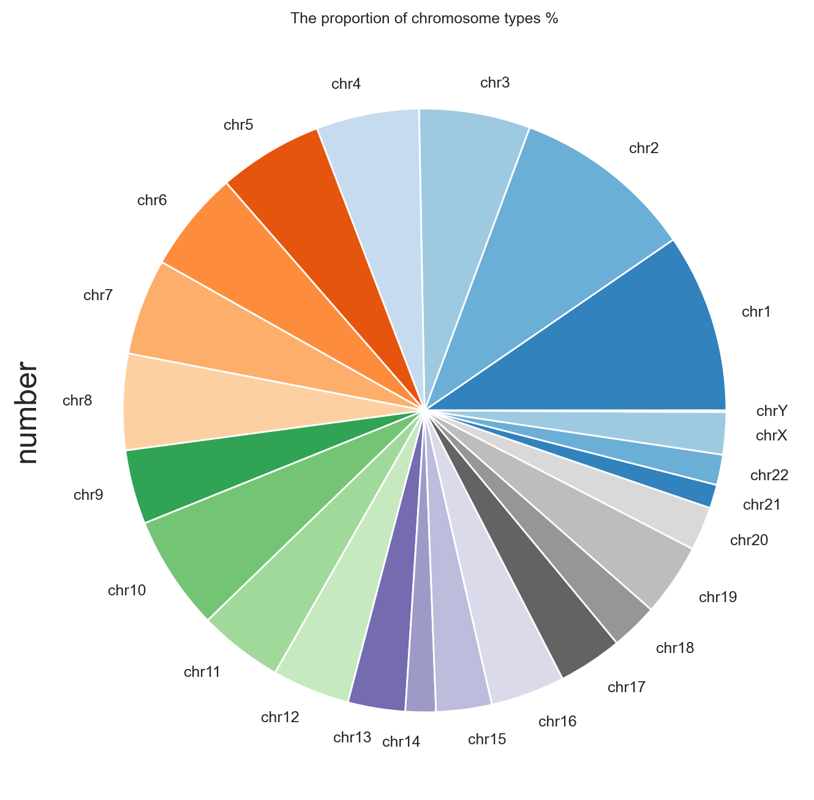
    


    
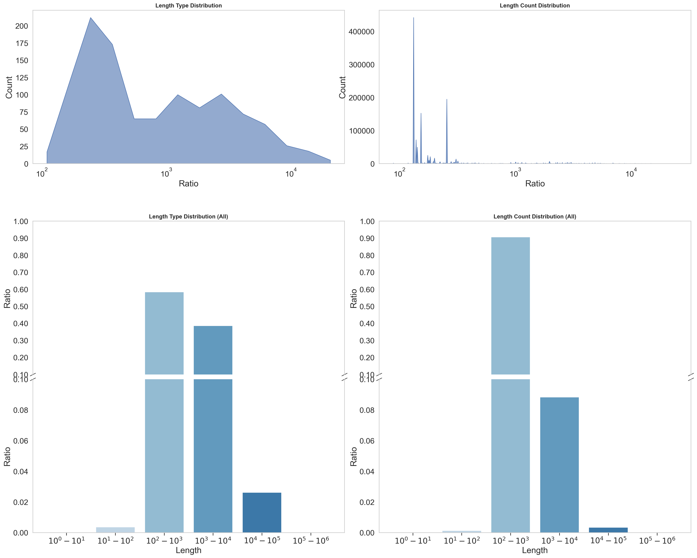
    


    
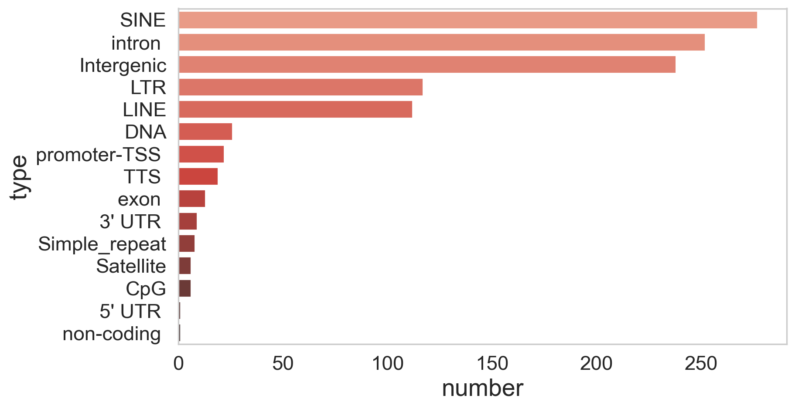
    


    	Plot homer anno distribution over!
    	Anno snp,se,e,eQTL Start!


    
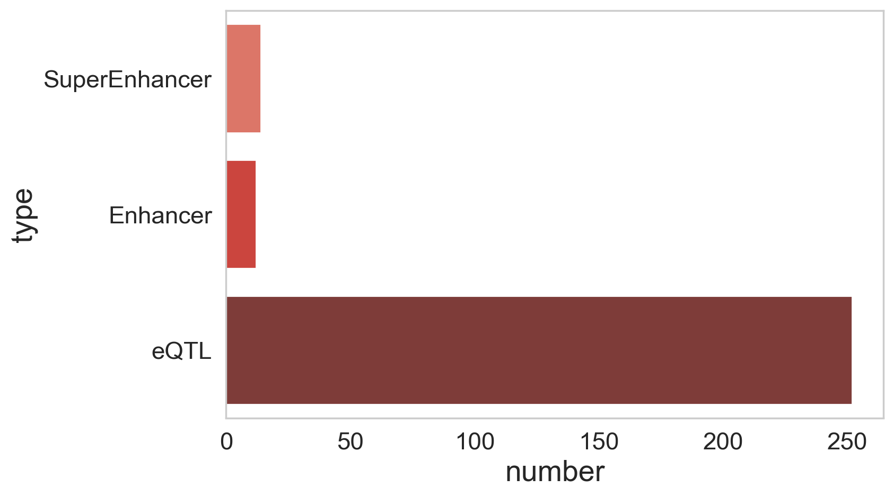
    


    	Anno snp,SuperEnhancer,Enhancer,eQTL End!
    	jinja2 report Start!
    	jinja2 report End!
    Run fast End!
    SRR6315413
    Run fast Start!
    	Make chr bed & QC start!
    	Make chr bed & QC over!
    	Plot Chr distribution Start!
    	Plot Chr distribution over!
    	Plot Length distribution Start!
    	Plot Length distribution over!
    	Plot homer anno distribution Start!


    
    	Peak file = ./data/nebula/circle-Map_real_data/SRR6315413/ecc_pipe_result/circlemap_result.analysis.bed
    	Genome = hg38
    	Organism = human
    	Peak/BED file conversion summary:
    		BED/Header formatted lines: 10
    		peakfile formatted lines: 1
    		Duplicated Peak IDs: 0
    
    	Peak File Statistics:
    		Total Peaks: 11
    		Redundant Peak IDs: 0
    		Peaks lacking information: 0 (need at least 5 columns per peak)
    		Peaks with misformatted coordinates: 0 (should be integer)
    		Peaks with misformatted strand: 0 (should be either +/- or 0/1)
    
    	Peak file looks good!
    
    	Reading Positions...
    	-----------------------
    	Finding Closest TSS...
    	Annotating:.......
    		Annotation	Number of peaks	Total size (bp)	Log2 Ratio (obs/exp)	LogP enrichment (+values depleted)
    		3UTR	0.0	11522999	-0.132	0.095
    		miRNA	0.0	28516	-0.000	0.000
    		ncRNA	0.0	2799455	-0.033	0.023
    		TTS	0.0	13421853	-0.153	0.111
    		pseudo	0.0	799439	-0.009	0.007
    		Exon	0.0	16215520	-0.183	0.134
    		Intron	6.0	528306122	0.464	-1.468
    		Intergenic	4.0	625616179	-0.365	1.077
    		Promoter	0.0	14929526	-0.169	0.124
    		5UTR	0.0	1108447	-0.013	0.009
    		snoRNA	0.0	220	-0.000	0.000
    	NOTE: If this part takes more than 2 minutes, there is a good chance
    		your machine ran out of memory: consider hitting ctrl+C and rerunning
    		the command with "-noann"
    	To capture annotation stats in a file, use "-annStats <filename>" next time
    	Annotating:.......
    		Annotation	Number of peaks	Total size (bp)	Log2 Ratio (obs/exp)	LogP enrichment (+values depleted)
    		3UTR	0.0	11522999	-0.132	0.095
    		Retroposon	0.0	1728829	-0.020	0.014
    		RC?	0.0	26951	-0.000	0.000
    		RNA	0.0	45552	-0.001	0.000
    		miRNA	0.0	28516	-0.000	0.000
    		ncRNA	0.0	2799455	-0.033	0.023
    		TTS	0.0	13421853	-0.153	0.111
    		LINE	1.0	249142123	-1.036	1.019
    		srpRNA	0.0	110790	-0.001	0.001
    		SINE	5.0	156324060	1.959	-5.287
    		RC	0.0	148125	-0.002	0.001
    		tRNA	0.0	50227	-0.001	0.000
    		DNA?	0.0	175229	-0.002	0.001
    		pseudo	0.0	799439	-0.009	0.007
    		DNA	0.0	41376464	-0.436	0.346
    		Exon	0.0	16215520	-0.183	0.134
    		Intron	3.0	277102358	0.396	-0.897
    		Intergenic	1.0	286327858	-1.236	1.280
    		Promoter	0.0	14929526	-0.169	0.124
    		5UTR	0.0	1108447	-0.013	0.009
    		snoRNA	0.0	220	-0.000	0.000
    		LTR?	0.0	488599	-0.006	0.004
    		scRNA	0.0	52670	-0.001	0.000
    		CpG-Island	0.0	3345327	-0.039	0.028
    		Low_complexity	0.0	2137799	-0.025	0.018
    		LTR	0.0	101014148	-0.931	0.868
    		Simple_repeat	0.0	13210489	-0.150	0.109
    		snRNA	0.0	139582	-0.002	0.001
    		Unknown	0.0	313404	-0.004	0.003
    		SINE?	0.0	1261	-0.000	0.000
    		Satellite	0.0	21082773	-0.235	0.175
    		rRNA	0.0	65637	-0.001	0.001
    	Counting Tags in Peaks from each directory...
    	Organism: human
    	Loading Gene Informaiton...
    	Outputing Annotation File...
    	Done annotating peaks file
    


    
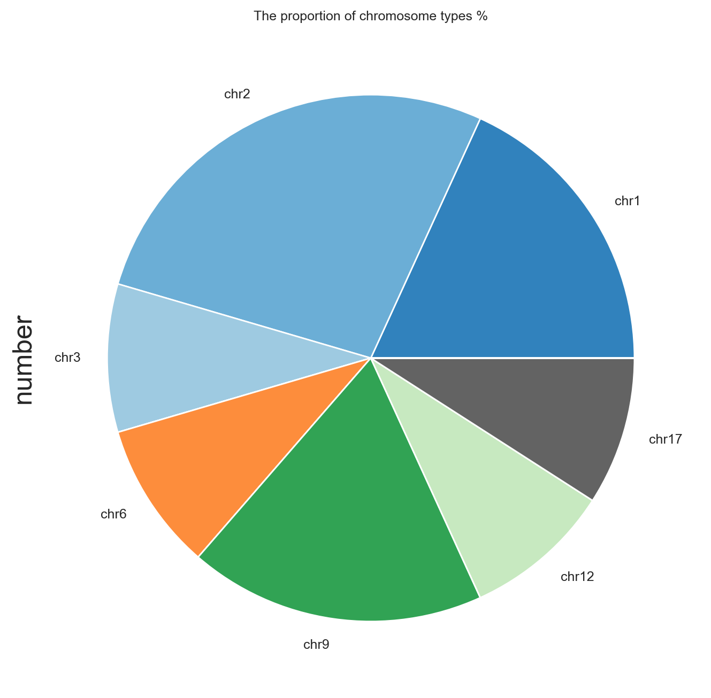
    


    
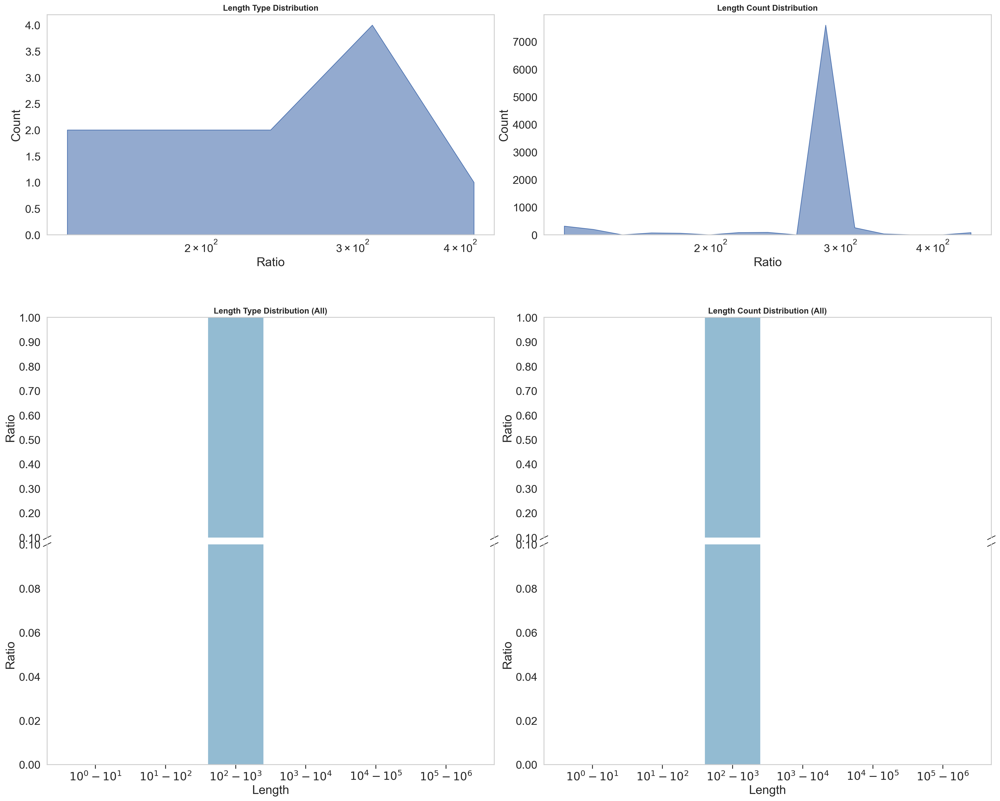
    


    
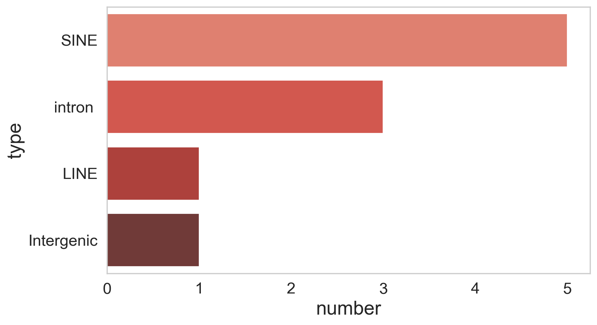
    


    	Plot homer anno distribution over!
    	Anno snp,se,e,eQTL Start!
    	Anno snp,SuperEnhancer,Enhancer,eQTL End!
    	jinja2 report Start!
    	jinja2 report End!
    Run fast End!
    SRR6315414
    Run fast Start!
    	Make chr bed & QC start!
    	Make chr bed & QC over!
    	Plot Chr distribution Start!
    	Plot Chr distribution over!
    	Plot Length distribution Start!
    	Plot Length distribution over!
    	Plot homer anno distribution Start!


    
    	Peak file = ./data/nebula/circle-Map_real_data/SRR6315414/ecc_pipe_result/circlemap_result.analysis.bed
    	Genome = hg38
    	Organism = human
    	Peak/BED file conversion summary:
    		BED/Header formatted lines: 8
    		peakfile formatted lines: 0
    		Duplicated Peak IDs: 0
    
    	Peak File Statistics:
    		Total Peaks: 8
    		Redundant Peak IDs: 0
    		Peaks lacking information: 0 (need at least 5 columns per peak)
    		Peaks with misformatted coordinates: 0 (should be integer)
    		Peaks with misformatted strand: 0 (should be either +/- or 0/1)
    
    	Peak file looks good!
    
    	Reading Positions...
    	-----------------------
    	Finding Closest TSS...
    	Annotating:......
    		Annotation	Number of peaks	Total size (bp)	Log2 Ratio (obs/exp)	LogP enrichment (+values depleted)
    		3UTR	0.0	7652982	-0.094	0.067
    		miRNA	0.0	15777	-0.000	0.000
    		ncRNA	0.0	2119278	-0.026	0.018
    		TTS	0.0	9108767	-0.111	0.079
    		pseudo	0.0	679902	-0.008	0.006
    		Exon	0.0	10802394	-0.131	0.094
    		Intron	6.0	400256982	0.789	-2.598
    		Intergenic	2.0	480606081	-1.060	2.134
    		Promoter	0.0	10000091	-0.121	0.087
    		5UTR	0.0	744785	-0.009	0.006
    		snoRNA	0.0	105	-0.000	0.000
    	NOTE: If this part takes more than 2 minutes, there is a good chance
    		your machine ran out of memory: consider hitting ctrl+C and rerunning
    		the command with "-noann"
    	To capture annotation stats in a file, use "-annStats <filename>" next time
    	Annotating:......
    		Annotation	Number of peaks	Total size (bp)	Log2 Ratio (obs/exp)	LogP enrichment (+values depleted)
    		3UTR	0.0	7652982	-0.093	0.067
    		Retroposon	0.0	1210228	-0.015	0.011
    		RC?	0.0	17552	-0.000	0.000
    		RNA	0.0	32432	-0.000	0.000
    		miRNA	0.0	15777	-0.000	0.000
    		ncRNA	0.0	2119278	-0.026	0.018
    		TTS	0.0	9108767	-0.111	0.079
    		LINE	1.0	190316274	-0.723	0.724
    		srpRNA	0.0	74685	-0.001	0.001
    		SINE	3.0	114951836	1.589	-2.706
    		RC	0.0	130452	-0.002	0.001
    		tRNA	0.0	22862	-0.000	0.000
    		DNA?	0.0	138217	-0.002	0.001
    		pseudo	0.0	679902	-0.008	0.006
    		DNA	0.0	31769577	-0.362	0.280
    		Exon	0.0	10802394	-0.131	0.094
    		Intron	2.0	211721633	0.123	-0.545
    		Intergenic	1.0	218188264	-0.920	0.912
    		Promoter	0.0	10000091	-0.121	0.087
    		5UTR	0.0	744785	-0.009	0.006
    		snoRNA	0.0	105	-0.000	0.000
    		LTR?	0.0	346873	-0.004	0.003
    		scRNA	0.0	36352	-0.000	0.000
    		CpG-Island	0.0	2540953	-0.032	0.022
    		Low_complexity	0.0	1682696	-0.021	0.015
    		LTR	1.0	78071295	0.563	-0.679
    		Simple_repeat	0.0	10428371	-0.126	0.091
    		snRNA	0.0	93439	-0.001	0.001
    		Unknown	0.0	228227	-0.003	0.002
    		SINE?	0.0	1175	-0.000	0.000
    		Satellite	0.0	19304641	-0.228	0.169
    		rRNA	0.0	56346	-0.001	0.000
    	Counting Tags in Peaks from each directory...
    	Organism: human
    	Loading Gene Informaiton...
    	Outputing Annotation File...
    	Done annotating peaks file
    


    
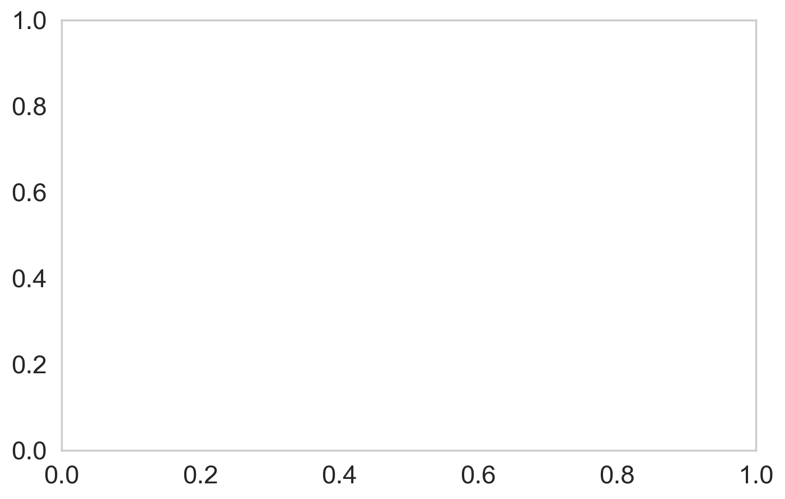
    


    
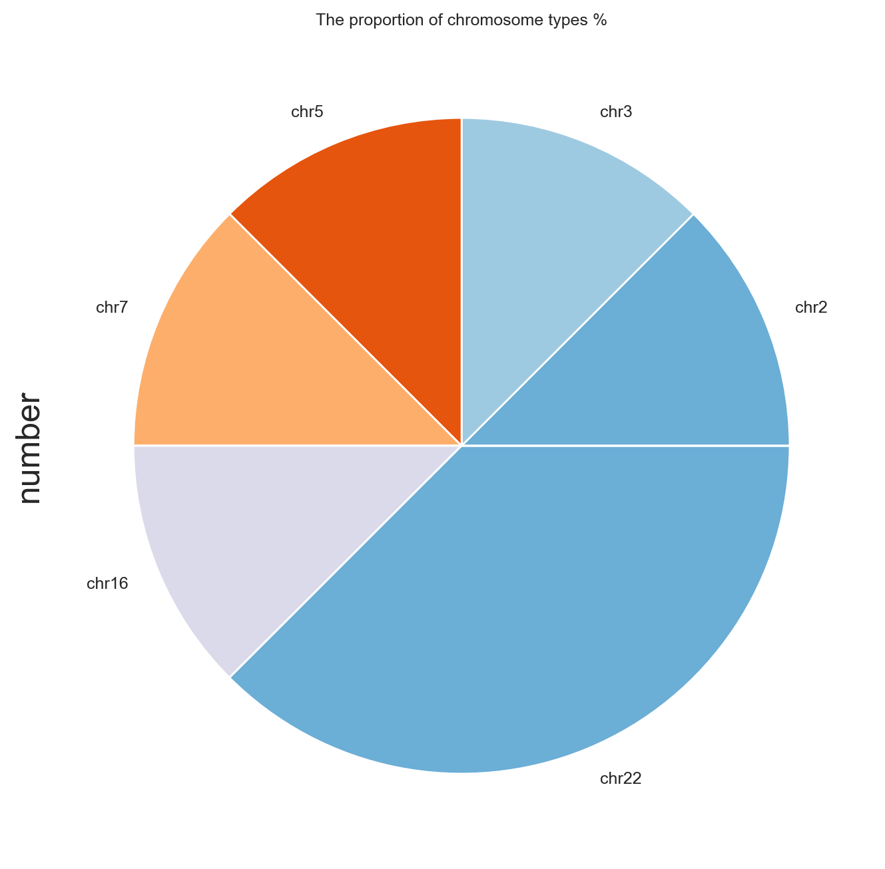
    


    
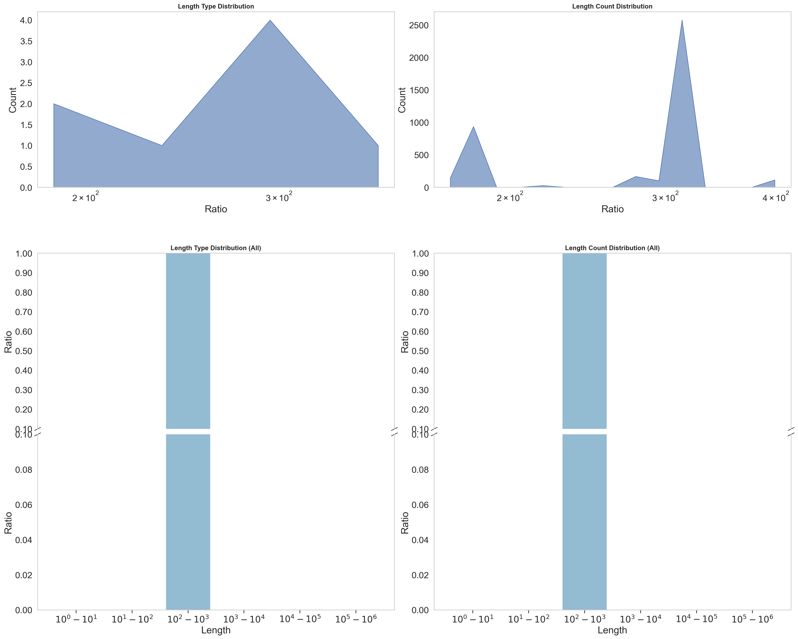
    


    
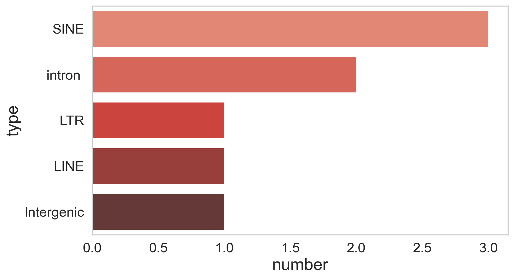
    


    	Plot homer anno distribution over!
    	Anno snp,se,e,eQTL Start!
    	Anno snp,SuperEnhancer,Enhancer,eQTL End!
    	jinja2 report Start!
    	jinja2 report End!
    Run fast End!
    SRR6315415
    Run fast Start!
    	Make chr bed & QC start!
    	Make chr bed & QC over!
    	Plot Chr distribution Start!
    	Plot Chr distribution over!
    	Plot Length distribution Start!
    	Plot Length distribution over!
    	Plot homer anno distribution Start!


    
    	Peak file = ./data/nebula/circle-Map_real_data/SRR6315415/ecc_pipe_result/circlemap_result.analysis.bed
    	Genome = hg38
    	Organism = human
    	Peak/BED file conversion summary:
    		BED/Header formatted lines: 14
    		peakfile formatted lines: 1
    		Duplicated Peak IDs: 1
    
    	Peak File Statistics:
    		Total Peaks: 15
    		Redundant Peak IDs: 0
    		Peaks lacking information: 0 (need at least 5 columns per peak)
    		Peaks with misformatted coordinates: 0 (should be integer)
    		Peaks with misformatted strand: 0 (should be either +/- or 0/1)
    
    	Peak file looks good!
    
    	Reading Positions...
    	-----------------------
    	Finding Closest TSS...
    	Annotating:.........
    		Annotation	Number of peaks	Total size (bp)	Log2 Ratio (obs/exp)	LogP enrichment (+values depleted)
    		3UTR	0.0	9937231	-0.187	0.137
    		miRNA	0.0	25178	-0.000	0.000
    		ncRNA	0.0	2363852	-0.046	0.033
    		TTS	0.0	12144074	-0.225	0.168
    		pseudo	0.0	875964	-0.017	0.012
    		Exon	0.0	14520049	-0.266	0.201
    		Intron	10.0	416314345	0.804	-3.870
    		Intergenic	4.0	546824192	-0.911	2.955
    		Promoter	0.0	13530834	-0.249	0.187
    		5UTR	0.0	976514	-0.019	0.013
    		snoRNA	0.0	123	-0.000	0.000
    	NOTE: If this part takes more than 2 minutes, there is a good chance
    		your machine ran out of memory: consider hitting ctrl+C and rerunning
    		the command with "-noann"
    	To capture annotation stats in a file, use "-annStats <filename>" next time
    	Annotating:.........
    		Annotation	Number of peaks	Total size (bp)	Log2 Ratio (obs/exp)	LogP enrichment (+values depleted)
    		3UTR	0.0	9937231	-0.187	0.137
    		Retroposon	0.0	1370128	-0.027	0.019
    		RC?	0.0	20715	-0.000	0.000
    		RNA	0.0	32409	-0.001	0.000
    		miRNA	0.0	25178	-0.000	0.000
    		ncRNA	0.0	2363852	-0.046	0.033
    		TTS	0.0	12144074	-0.225	0.168
    		LINE	1.0	190044801	-1.386	1.455
    		srpRNA	0.0	90971	-0.002	0.001
    		SINE	6.0	135882208	1.683	-5.037
    		RC	0.0	115014	-0.002	0.002
    		tRNA	0.0	37313	-0.001	0.001
    		DNA?	0.0	136697	-0.003	0.002
    		pseudo	0.0	875964	-0.017	0.012
    		DNA	0.0	31850386	-0.538	0.445
    		Exon	0.0	14520049	-0.266	0.201
    		Intron	6.0	215754433	1.016	-2.874
    		Intergenic	1.0	261846321	-1.848	2.397
    		Promoter	0.0	13530834	-0.249	0.187
    		5UTR	0.0	976514	-0.019	0.013
    		snoRNA	0.0	123	-0.000	0.000
    		LTR?	0.0	337339	-0.007	0.005
    		scRNA	0.0	42751	-0.001	0.001
    		CpG-Island	0.0	3458875	-0.067	0.048
    		Low_complexity	0.0	1870302	-0.037	0.026
    		LTR	0.0	81086537	-1.145	1.162
    		Simple_repeat	0.0	11833605	-0.220	0.164
    		snRNA	0.0	110380	-0.002	0.002
    		Unknown	0.0	226361	-0.004	0.003
    		SINE?	0.0	619	-0.000	0.000
    		Satellite	0.0	27372787	-0.472	0.382
    		rRNA	0.0	65787	-0.001	0.001
    	Counting Tags in Peaks from each directory...
    	Organism: human
    	Loading Gene Informaiton...
    	Outputing Annotation File...
    	Done annotating peaks file
    


    

    


    
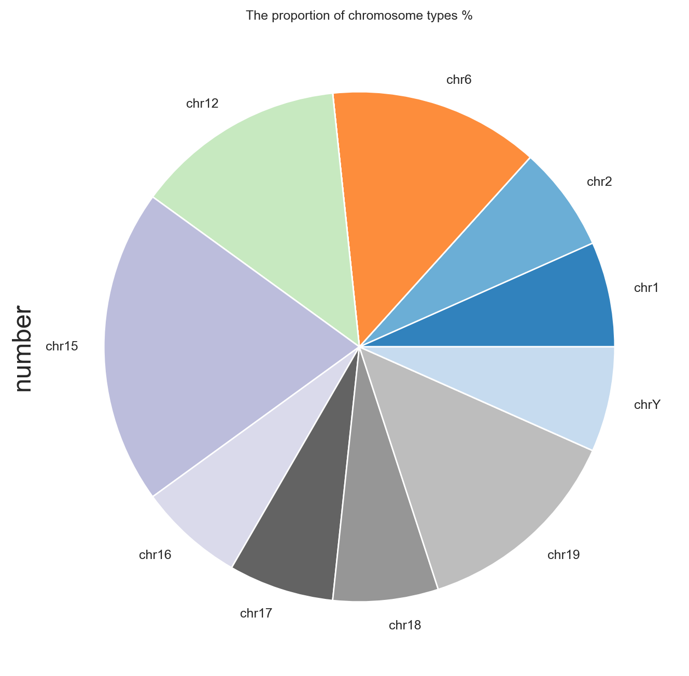
    


    
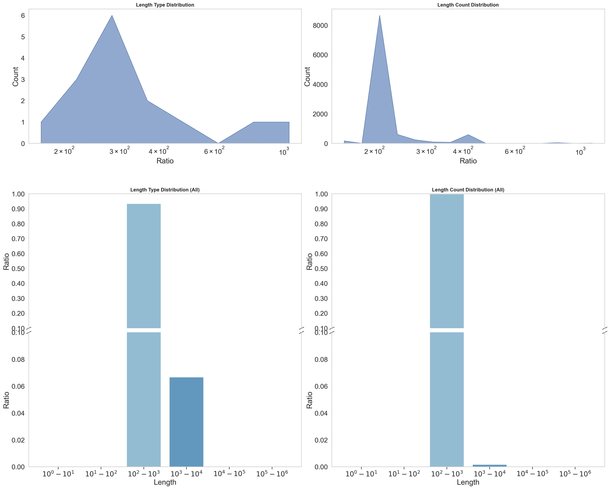
    


    
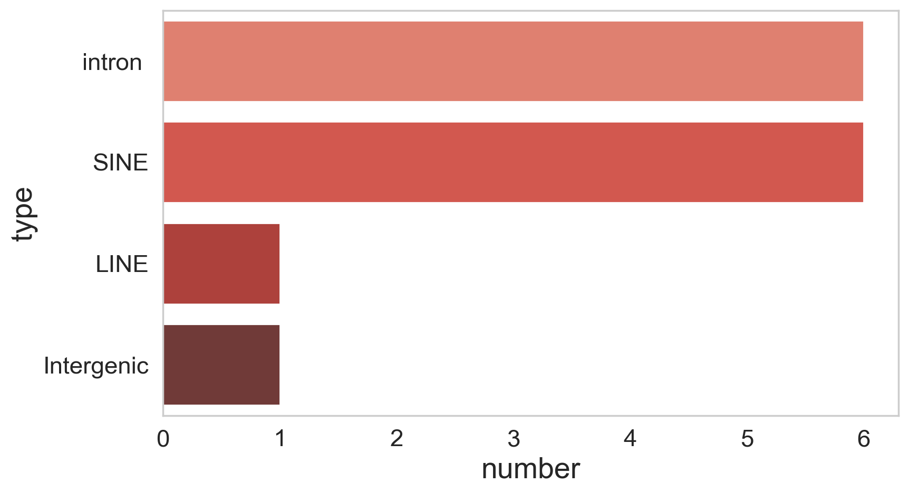
    


    	Plot homer anno distribution over!
    	Anno snp,se,e,eQTL Start!
    	Anno snp,SuperEnhancer,Enhancer,eQTL End!
    	jinja2 report Start!
    	jinja2 report End!
    Run fast End!
    SRR6315416
    Run fast Start!
    	Make chr bed & QC start!
    	Make chr bed & QC over!
    	Plot Chr distribution Start!
    	Plot Chr distribution over!
    	Plot Length distribution Start!
    	Plot Length distribution over!
    	Plot homer anno distribution Start!


    
    	Peak file = ./data/nebula/circle-Map_real_data/SRR6315416/ecc_pipe_result/circlemap_result.analysis.bed
    	Genome = hg38
    	Organism = human
    	Peak/BED file conversion summary:
    		BED/Header formatted lines: 22
    		peakfile formatted lines: 1
    		Duplicated Peak IDs: 0
    
    	Peak File Statistics:
    		Total Peaks: 23
    		Redundant Peak IDs: 0
    		Peaks lacking information: 0 (need at least 5 columns per peak)
    		Peaks with misformatted coordinates: 0 (should be integer)
    		Peaks with misformatted strand: 0 (should be either +/- or 0/1)
    
    	Peak file looks good!
    
    	Reading Positions...
    	-----------------------
    	Finding Closest TSS...
    	Annotating:.............
    		Annotation	Number of peaks	Total size (bp)	Log2 Ratio (obs/exp)	LogP enrichment (+values depleted)
    		3UTR	0.0	14802495	-0.268	0.203
    		miRNA	0.0	40550	-0.001	0.001
    		ncRNA	0.0	3902397	-0.075	0.053
    		TTS	0.0	17769704	-0.317	0.244
    		pseudo	0.0	1228228	-0.024	0.017
    		Exon	0.0	20513852	-0.361	0.282
    		Intron	12.0	678527134	0.371	-1.782
    		Intergenic	10.0	851313562	-0.219	1.162
    		Promoter	0.0	19650138	-0.347	0.270
    		5UTR	0.0	1426025	-0.028	0.020
    		snoRNA	0.0	229	-0.000	0.000
    		scRNA	0.0	97	-0.000	0.000
    	NOTE: If this part takes more than 2 minutes, there is a good chance
    		your machine ran out of memory: consider hitting ctrl+C and rerunning
    		the command with "-noann"
    	To capture annotation stats in a file, use "-annStats <filename>" next time
    	Annotating:.............
    		Annotation	Number of peaks	Total size (bp)	Log2 Ratio (obs/exp)	LogP enrichment (+values depleted)
    		3UTR	0.0	14802495	-0.268	0.203
    		Retroposon	0.0	2179915	-0.042	0.030
    		RC?	0.0	28734	-0.001	0.000
    		RNA	0.0	58976	-0.001	0.001
    		miRNA	0.0	40550	-0.001	0.001
    		ncRNA	0.0	3902397	-0.075	0.053
    		TTS	0.0	17769704	-0.317	0.244
    		LINE	1.0	317737922	-2.118	2.978
    		srpRNA	0.0	147664	-0.003	0.002
    		SINE	17.0	206330469	2.592	-25.394
    		RC	0.0	186950	-0.004	0.003
    		tRNA	0.0	50538	-0.001	0.001
    		DNA?	0.0	221296	-0.004	0.003
    		pseudo	0.0	1228228	-0.024	0.017
    		DNA	1.0	52582107	0.477	-0.657
    		Exon	0.0	20513852	-0.361	0.282
    		Intron	1.0	354385283	-2.276	3.494
    		Intergenic	0.0	397765276	-3.039	6.242
    		Promoter	0.0	19650138	-0.347	0.270
    		5UTR	0.0	1426025	-0.028	0.019
    		snoRNA	0.0	229	-0.000	0.000
    		LTR?	0.0	604137	-0.012	0.008
    		scRNA	0.0	69587	-0.001	0.001
    		CpG-Island	0.0	5070283	-0.097	0.069
    		Low_complexity	0.0	2918565	-0.057	0.040
    		LTR	2.0	133845608	0.129	-0.587
    		Simple_repeat	0.0	18300071	-0.325	0.251
    		snRNA	0.0	164661	-0.003	0.002
    		Unknown	0.0	374253	-0.007	0.005
    		SINE?	0.0	1227	-0.000	0.000
    		Satellite	0.0	37694236	-0.611	0.521
    		rRNA	0.0	93725	-0.002	0.001
    	Counting Tags in Peaks from each directory...
    	Organism: human
    	Loading Gene Informaiton...
    	Outputing Annotation File...
    	Done annotating peaks file
    


    

    


    
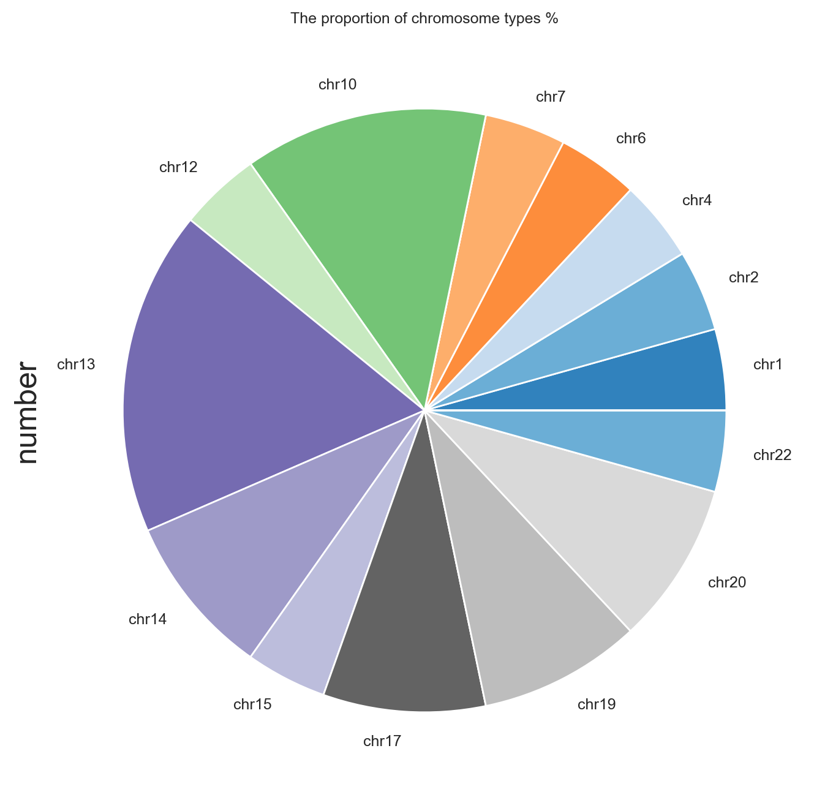
    


    

    


    

    


    	Plot homer anno distribution over!
    	Anno snp,se,e,eQTL Start!
    	Anno snp,SuperEnhancer,Enhancer,eQTL End!
    	jinja2 report Start!
    	jinja2 report End!
    Run fast End!
    SRR6315417
    Run fast Start!
    	Make chr bed & QC start!
    	Make chr bed & QC over!
    	Plot Chr distribution Start!
    	Plot Chr distribution over!
    	Plot Length distribution Start!
    	Plot Length distribution over!
    	Plot homer anno distribution Start!


    
    	Peak file = ./data/nebula/circle-Map_real_data/SRR6315417/ecc_pipe_result/circlemap_result.analysis.bed
    	Genome = hg38
    	Organism = human
    	Peak/BED file conversion summary:
    		BED/Header formatted lines: 24
    		peakfile formatted lines: 0
    		Duplicated Peak IDs: 0
    
    	Peak File Statistics:
    		Total Peaks: 24
    		Redundant Peak IDs: 0
    		Peaks lacking information: 0 (need at least 5 columns per peak)
    		Peaks with misformatted coordinates: 0 (should be integer)
    		Peaks with misformatted strand: 0 (should be either +/- or 0/1)
    
    	Peak file looks good!
    
    	Reading Positions...
    	-----------------------
    	Finding Closest TSS...
    	Annotating:..............
    		Annotation	Number of peaks	Total size (bp)	Log2 Ratio (obs/exp)	LogP enrichment (+values depleted)
    		3UTR	0.0	18909091	-0.284	0.217
    		miRNA	0.0	55164	-0.001	0.001
    		ncRNA	0.0	4701390	-0.076	0.054
    		TTS	0.0	23231673	-0.343	0.267
    		pseudo	0.0	1491073	-0.024	0.017
    		Exon	0.0	27236035	-0.395	0.313
    		Intron	14.0	879051269	0.481	-2.569
    		Intergenic	8.0	1120432539	-0.677	3.233
    		Promoter	2.0	25880081	2.759	-3.354
    		5UTR	0.0	1896873	-0.031	0.022
    		snoRNA	0.0	227	-0.000	0.000
    	NOTE: If this part takes more than 2 minutes, there is a good chance
    		your machine ran out of memory: consider hitting ctrl+C and rerunning
    		the command with "-noann"
    	To capture annotation stats in a file, use "-annStats <filename>" next time
    	Annotating:..............
    		Annotation	Number of peaks	Total size (bp)	Log2 Ratio (obs/exp)	LogP enrichment (+values depleted)
    		3UTR	0.0	18909091	-0.284	0.217
    		Retroposon	0.0	2954002	-0.048	0.034
    		RC?	0.0	41593	-0.001	0.000
    		RNA	0.0	73268	-0.001	0.001
    		miRNA	0.0	55164	-0.001	0.001
    		ncRNA	0.0	4701390	-0.076	0.054
    		TTS	0.0	23231673	-0.343	0.266
    		LINE	4.0	447370949	-0.351	0.917
    		srpRNA	0.0	180882	-0.003	0.002
    		SINE	3.0	267836819	-0.026	0.455
    		RC	0.0	246344	-0.004	0.003
    		tRNA	0.0	72974	-0.001	0.001
    		DNA?	0.0	291745	-0.005	0.003
    		pseudo	0.0	1491073	-0.024	0.017
    		DNA	0.0	69087793	-0.860	0.801
    		Exon	0.0	27236035	-0.395	0.313
    		Intron	7.0	456200456	0.428	-1.379
    		Intergenic	5.0	492870491	-0.169	0.705
    		Promoter	2.0	25880081	2.760	-3.355
    		5UTR	0.0	1896873	-0.031	0.022
    		snoRNA	0.0	227	-0.000	0.000
    		LTR?	0.0	791178	-0.013	0.009
    		scRNA	0.0	85352	-0.001	0.001
    		CpG-Island	0.0	6385780	-0.102	0.073
    		Low_complexity	0.0	3797211	-0.061	0.043
    		LTR	2.0	181302670	-0.048	0.419
    		Simple_repeat	1.0	23481696	1.900	-1.443
    		snRNA	0.0	220571	-0.004	0.003
    		Unknown	0.0	498512	-0.008	0.006
    		SINE?	0.0	1967	-0.000	0.000
    		Satellite	0.0	46637140	-0.627	0.538
    		rRNA	0.0	121112	-0.002	0.001
    	Counting Tags in Peaks from each directory...
    	Organism: human
    	Loading Gene Informaiton...
    	Outputing Annotation File...
    	Done annotating peaks file
    


    

    


    
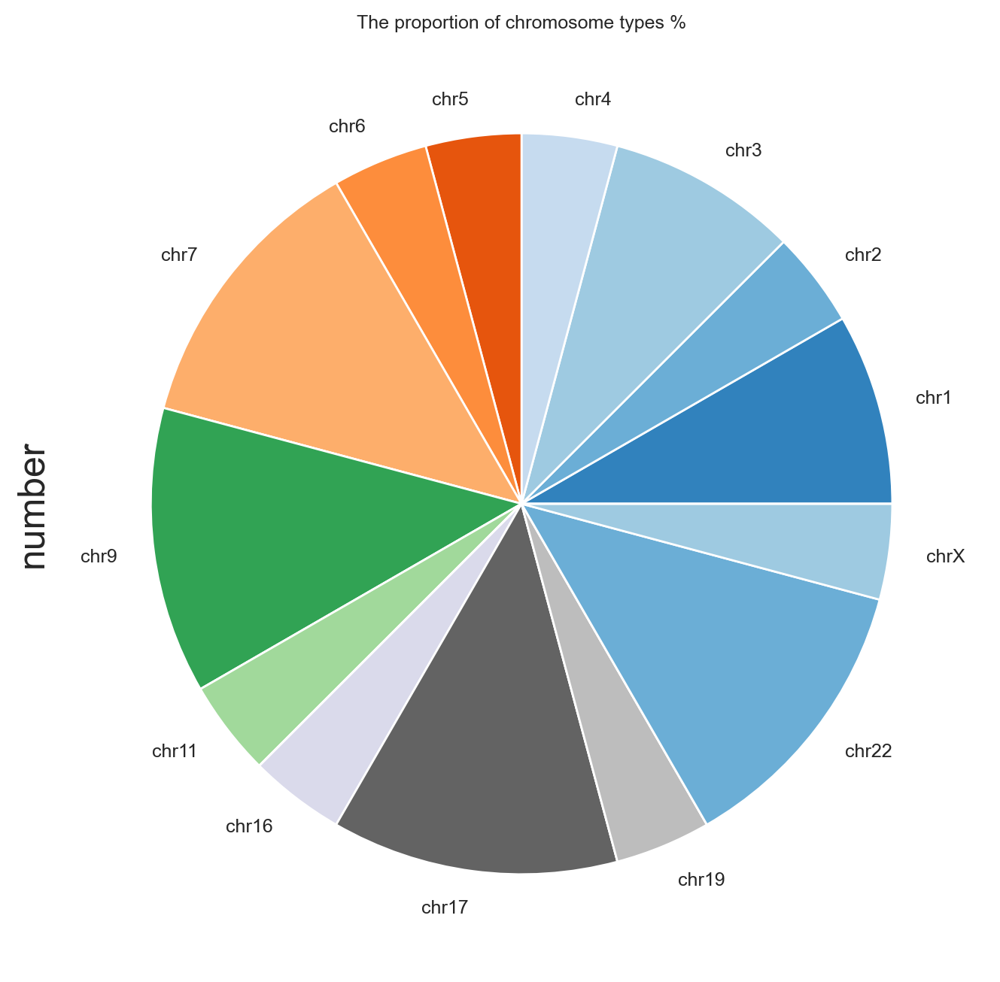
    


    
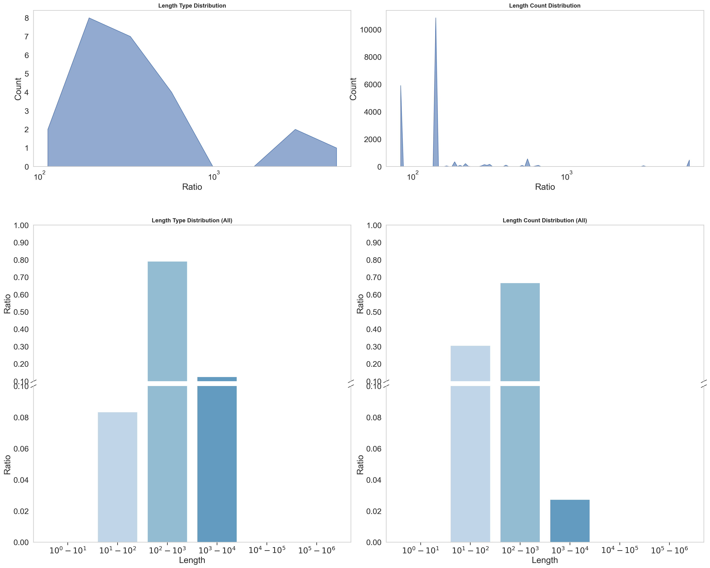
    


    
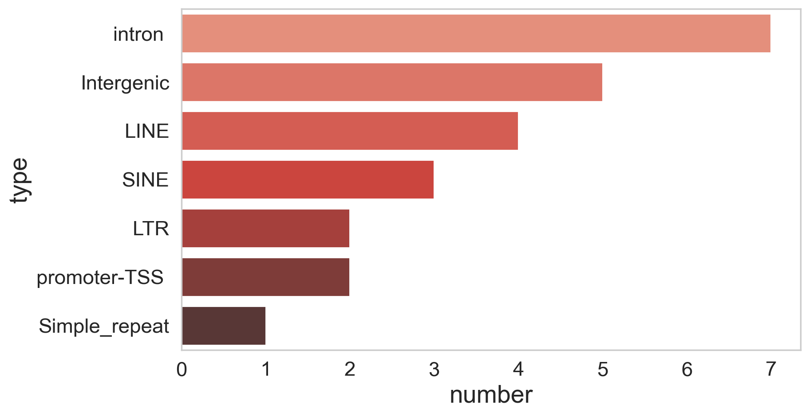
    


    	Plot homer anno distribution over!
    	Anno snp,se,e,eQTL Start!


    
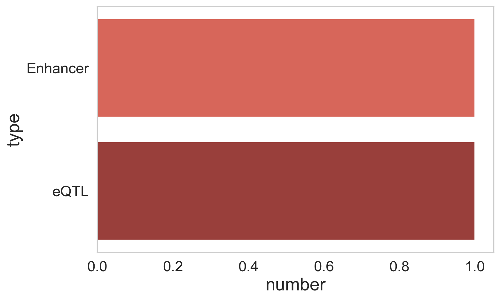
    


    	Anno snp,SuperEnhancer,Enhancer,eQTL End!
    	jinja2 report Start!
    	jinja2 report End!
    Run fast End!
    SRR6315418
    Run fast Start!
    	Make chr bed & QC start!
    	Make chr bed & QC over!
    	Plot Chr distribution Start!
    	Plot Chr distribution over!
    	Plot Length distribution Start!
    	Plot Length distribution over!
    	Plot homer anno distribution Start!


    
    	Peak file = ./data/nebula/circle-Map_real_data/SRR6315418/ecc_pipe_result/circlemap_result.analysis.bed
    	Genome = hg38
    	Organism = human
    	Peak/BED file conversion summary:
    		BED/Header formatted lines: 168
    		peakfile formatted lines: 0
    		Duplicated Peak IDs: 46
    
    	Peak File Statistics:
    		Total Peaks: 168
    		Redundant Peak IDs: 0
    		Peaks lacking information: 0 (need at least 5 columns per peak)
    		Peaks with misformatted coordinates: 0 (should be integer)
    		Peaks with misformatted strand: 0 (should be either +/- or 0/1)
    
    	Peak file looks good!
    
    	Reading Positions...
    	-----------------------
    	Finding Closest TSS...
    	Annotating:.......................
    		Annotation	Number of peaks	Total size (bp)	Log2 Ratio (obs/exp)	LogP enrichment (+values depleted)
    		3UTR	3.0	26786192	1.014	-1.677
    		miRNA	0.0	97618	-0.008	0.005
    		ncRNA	1.0	6998912	1.365	-1.133
    		TTS	9.0	32227484	2.332	-9.310
    		pseudo	0.0	2085537	-0.158	0.116
    		Exon	0.0	37015031	-1.622	2.065
    		Intron	84.0	1253662019	0.273	-4.215
    		Intergenic	68.0	1631972721	-0.413	8.006
    		Promoter	3.0	35774823	0.597	-1.143
    		5UTR	0.0	2592085	-0.194	0.144
    		snoRNA	0.0	357	-0.000	0.000
    		scRNA	0.0	97	-0.000	0.000
    		rRNA	0.0	25562	-0.002	0.001
    	NOTE: If this part takes more than 2 minutes, there is a good chance
    		your machine ran out of memory: consider hitting ctrl+C and rerunning
    		the command with "-noann"
    	To capture annotation stats in a file, use "-annStats <filename>" next time
    	Annotating:.......................
    		Annotation	Number of peaks	Total size (bp)	Log2 Ratio (obs/exp)	LogP enrichment (+values depleted)
    		3UTR	3.0	26786192	1.015	-1.678
    		Retroposon	0.0	4044155	-0.292	0.224
    		RC?	0.0	59509	-0.005	0.003
    		RNA	0.0	107756	-0.009	0.006
    		miRNA	0.0	97618	-0.008	0.005
    		ncRNA	1.0	6998912	1.366	-1.134
    		TTS	9.0	32227484	2.333	-9.314
    		LINE	16.0	626703751	-1.118	9.368
    		srpRNA	0.0	261424	-0.021	0.014
    		SINE	38.0	377075025	0.862	-8.644
    		RC	0.0	359494	-0.028	0.020
    		tRNA	0.0	91111	-0.007	0.005
    		DNA?	0.0	422285	-0.033	0.023
    		pseudo	0.0	2085537	-0.158	0.116
    		DNA	6.0	98947449	0.130	-0.755
    		Exon	0.0	37015031	-1.622	2.064
    		Intron	47.0	654126650	0.374	-3.503
    		Intergenic	22.0	742668051	-0.904	8.574
    		Promoter	3.0	35774823	0.597	-1.144
    		5UTR	0.0	2592085	-0.194	0.144
    		snoRNA	0.0	357	-0.000	0.000
    		LTR?	0.0	1137225	-0.088	0.063
    		scRNA	0.0	121379	-0.010	0.007
    		CpG-Island	5.0	8917387	3.338	-8.768
    		Low_complexity	1.0	5394919	1.742	-1.352
    		LTR	14.0	257625099	-0.029	0.617
    		Simple_repeat	1.0	33811580	-0.906	0.822
    		snRNA	0.0	311793	-0.025	0.017
    		Unknown	0.0	713433	-0.056	0.040
    		SINE?	0.0	2674	-0.000	0.000
    		Satellite	2.0	74135823	-1.039	1.519
    		rRNA	0.0	199378	-0.016	0.011
    	Counting Tags in Peaks from each directory...
    	Organism: human
    	Loading Gene Informaiton...
    	Outputing Annotation File...
    	Done annotating peaks file
    


    
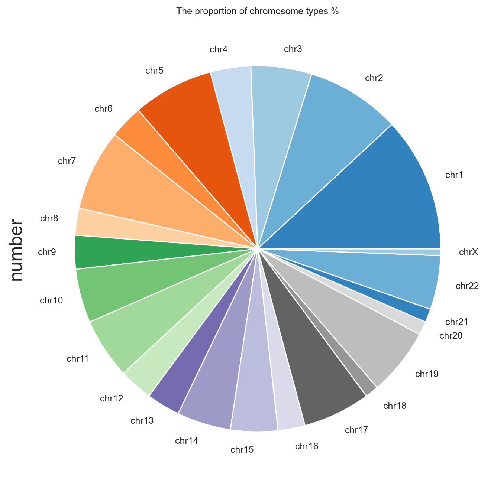
    


    
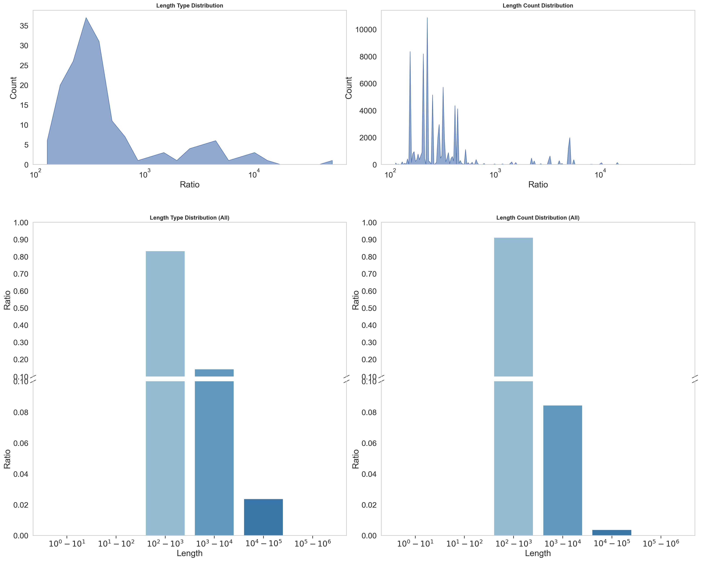
    


    
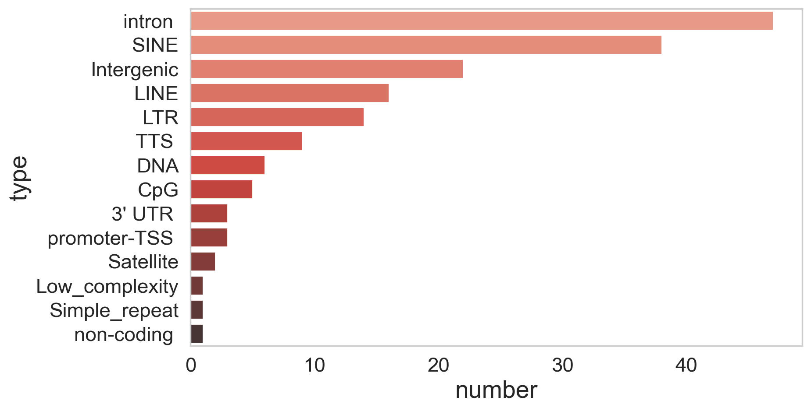
    


    	Plot homer anno distribution over!
    	Anno snp,se,e,eQTL Start!


    
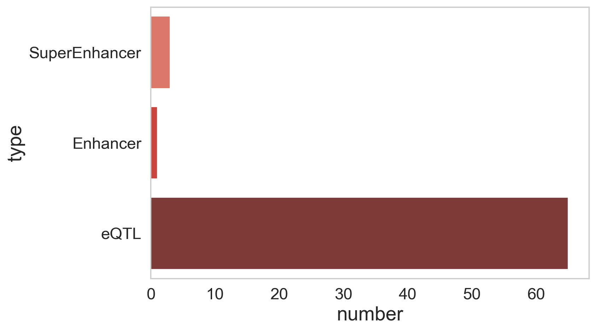
    


    	Anno snp,SuperEnhancer,Enhancer,eQTL End!
    	jinja2 report Start!
    	jinja2 report End!
    Run fast End!
    SRR6315419
    Run fast Start!
    	Make chr bed & QC start!
    	Make chr bed & QC over!
    	Plot Chr distribution Start!
    	Plot Chr distribution over!
    	Plot Length distribution Start!
    	Plot Length distribution over!
    	Plot homer anno distribution Start!


    
    	Peak file = ./data/nebula/circle-Map_real_data/SRR6315419/ecc_pipe_result/circlemap_result.analysis.bed
    	Genome = hg38
    	Organism = human
    	Peak/BED file conversion summary:
    		BED/Header formatted lines: 24
    		peakfile formatted lines: 0
    		Duplicated Peak IDs: 1
    
    	Peak File Statistics:
    		Total Peaks: 24
    		Redundant Peak IDs: 0
    		Peaks lacking information: 0 (need at least 5 columns per peak)
    		Peaks with misformatted coordinates: 0 (should be integer)
    		Peaks with misformatted strand: 0 (should be either +/- or 0/1)
    
    	Peak file looks good!
    
    	Reading Positions...
    	-----------------------
    	Finding Closest TSS...
    	Annotating:................
    		Annotation	Number of peaks	Total size (bp)	Log2 Ratio (obs/exp)	LogP enrichment (+values depleted)
    		3UTR	0.0	18950367	-0.278	0.212
    		miRNA	0.0	55431	-0.001	0.001
    		ncRNA	0.0	5007561	-0.078	0.056
    		TTS	0.0	22999465	-0.332	0.257
    		pseudo	0.0	1696788	-0.027	0.019
    		Exon	1.0	26677096	1.752	-1.354
    		Intron	12.0	903642545	0.255	-1.299
    		Intergenic	9.0	1150664385	-0.508	2.427
    		Promoter	2.0	25481875	2.818	-3.429
    		5UTR	0.0	1853130	-0.029	0.021
    		snoRNA	0.0	281	-0.000	0.000
    	NOTE: If this part takes more than 2 minutes, there is a good chance
    		your machine ran out of memory: consider hitting ctrl+C and rerunning
    		the command with "-noann"
    	To capture annotation stats in a file, use "-annStats <filename>" next time
    	Annotating:................
    		Annotation	Number of peaks	Total size (bp)	Log2 Ratio (obs/exp)	LogP enrichment (+values depleted)
    		3UTR	0.0	18950367	-0.278	0.212
    		Retroposon	0.0	2873351	-0.045	0.032
    		RC?	0.0	43647	-0.001	0.000
    		RNA	0.0	76655	-0.001	0.001
    		miRNA	0.0	55431	-0.001	0.001
    		ncRNA	0.0	5007561	-0.078	0.056
    		TTS	0.0	22999465	-0.332	0.257
    		LINE	1.0	450083847	-2.323	3.622
    		srpRNA	0.0	186438	-0.003	0.002
    		SINE	8.0	273198882	1.397	-4.910
    		RC	0.0	272697	-0.004	0.003
    		tRNA	0.0	63757	-0.001	0.001
    		DNA?	0.0	305311	-0.005	0.003
    		pseudo	0.0	1696788	-0.027	0.019
    		DNA	0.0	70871793	-0.860	0.801
    		Exon	1.0	26677096	1.753	-1.355
    		Intron	3.0	471287818	-0.805	1.617
    		Intergenic	6.0	517805789	0.059	-0.631
    		Promoter	2.0	25481875	2.819	-3.430
    		5UTR	0.0	1853130	-0.029	0.021
    		snoRNA	0.0	281	-0.000	0.000
    		LTR?	0.0	790124	-0.013	0.009
    		scRNA	0.0	86620	-0.001	0.001
    		CpG-Island	0.0	6488271	-0.101	0.072
    		Low_complexity	0.0	3870156	-0.061	0.043
    		LTR	3.0	181801376	0.569	-1.111
    		Simple_repeat	0.0	24211709	-0.347	0.271
    		snRNA	0.0	219652	-0.004	0.002
    		Unknown	0.0	499801	-0.008	0.006
    		SINE?	0.0	1877	-0.000	0.000
    		Satellite	0.0	50350793	-0.654	0.567
    		rRNA	0.0	122245	-0.002	0.001
    	Counting Tags in Peaks from each directory...
    	Organism: human
    	Loading Gene Informaiton...
    	Outputing Annotation File...
    	Done annotating peaks file
    


    
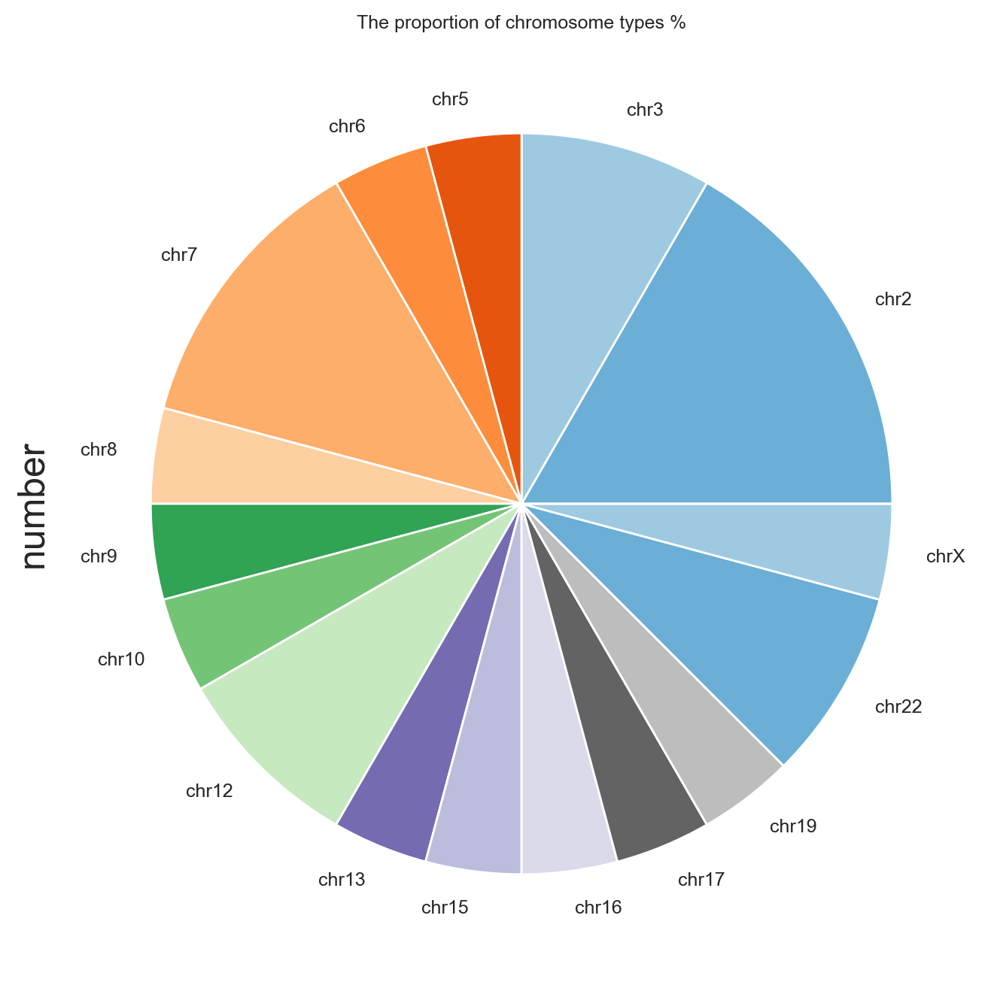
    


    
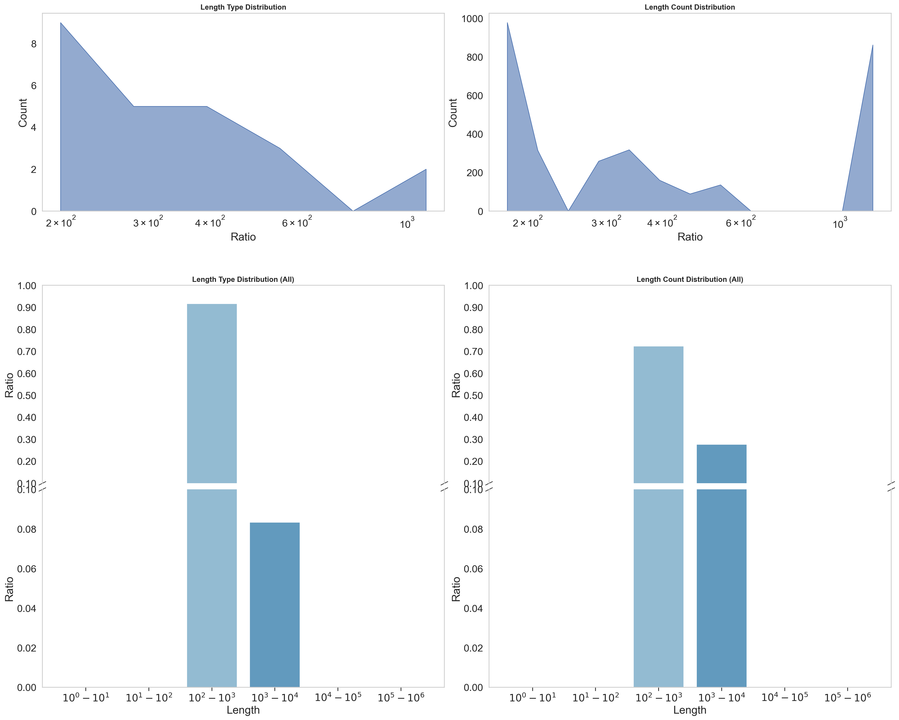
    


    

    


    	Plot homer anno distribution over!
    	Anno snp,se,e,eQTL Start!
    	Anno snp,SuperEnhancer,Enhancer,eQTL End!
    	jinja2 report Start!
    	jinja2 report End!
    Run fast End!
    SRR6315420
    Run fast Start!
    	Make chr bed & QC start!
    	Make chr bed & QC over!
    	Plot Chr distribution Start!
    	Plot Chr distribution over!
    	Plot Length distribution Start!
    	Plot Length distribution over!
    	Plot homer anno distribution Start!


    
    	Peak file = ./data/nebula/circle-Map_real_data/SRR6315420/ecc_pipe_result/circlemap_result.analysis.bed
    	Genome = hg38
    	Organism = human
    	Peak/BED file conversion summary:
    		BED/Header formatted lines: 7
    		peakfile formatted lines: 0
    		Duplicated Peak IDs: 0
    
    	Peak File Statistics:
    		Total Peaks: 7
    		Redundant Peak IDs: 0
    		Peaks lacking information: 0 (need at least 5 columns per peak)
    		Peaks with misformatted coordinates: 0 (should be integer)
    		Peaks with misformatted strand: 0 (should be either +/- or 0/1)
    
    	Peak file looks good!
    
    	Reading Positions...
    	-----------------------
    	Finding Closest TSS...
    	Annotating:......
    		Annotation	Number of peaks	Total size (bp)	Log2 Ratio (obs/exp)	LogP enrichment (+values depleted)
    		3UTR	0.0	6899479	-0.087	0.062
    		miRNA	0.0	29986	-0.000	0.000
    		ncRNA	0.0	1928968	-0.025	0.017
    		TTS	0.0	8698147	-0.110	0.079
    		pseudo	0.0	771164	-0.010	0.007
    		Exon	0.0	10209266	-0.128	0.092
    		Intron	5.0	334963492	0.733	-2.056
    		Intergenic	2.0	405450641	-0.865	1.636
    		Promoter	0.0	9699155	-0.122	0.088
    		5UTR	0.0	692580	-0.009	0.006
    		snoRNA	0.0	40	-0.000	0.000
    	NOTE: If this part takes more than 2 minutes, there is a good chance
    		your machine ran out of memory: consider hitting ctrl+C and rerunning
    		the command with "-noann"
    	To capture annotation stats in a file, use "-annStats <filename>" next time
    	Annotating:......
    		Annotation	Number of peaks	Total size (bp)	Log2 Ratio (obs/exp)	LogP enrichment (+values depleted)
    		3UTR	0.0	6899479	-0.087	0.062
    		Retroposon	0.0	1029111	-0.013	0.009
    		RC?	0.0	14887	-0.000	0.000
    		RNA	0.0	26022	-0.000	0.000
    		miRNA	0.0	29986	-0.000	0.000
    		ncRNA	0.0	1928968	-0.025	0.017
    		TTS	0.0	8698147	-0.110	0.079
    		LINE	1.0	150925607	-0.438	0.520
    		srpRNA	0.0	65334	-0.001	0.001
    		SINE	2.0	101725934	1.131	-1.472
    		RC	0.0	101688	-0.001	0.001
    		tRNA	0.0	20473	-0.000	0.000
    		DNA?	0.0	109037	-0.001	0.001
    		pseudo	0.0	771164	-0.010	0.007
    		DNA	0.0	24897784	-0.300	0.227
    		Exon	0.0	10209266	-0.128	0.092
    		Intron	1.0	176024056	-0.660	0.679
    		Intergenic	2.0	193584935	0.203	-0.597
    		Promoter	0.0	9699155	-0.122	0.088
    		5UTR	0.0	692580	-0.009	0.006
    		snoRNA	0.0	40	-0.000	0.000
    		LTR?	0.0	272979	-0.004	0.002
    		scRNA	0.0	31646	-0.000	0.000
    		CpG-Island	0.0	2488604	-0.032	0.022
    		Low_complexity	0.0	1405840	-0.018	0.013
    		LTR	1.0	60062722	0.891	-0.845
    		Simple_repeat	0.0	8679748	-0.109	0.078
    		snRNA	0.0	76945	-0.001	0.001
    		Unknown	0.0	174196	-0.002	0.002
    		SINE?	0.0	613	-0.000	0.000
    		Satellite	0.0	19125100	-0.234	0.174
    		rRNA	0.0	48347	-0.001	0.000
    	Counting Tags in Peaks from each directory...
    	Organism: human
    	Loading Gene Informaiton...
    	Outputing Annotation File...
    	Done annotating peaks file
    


    

    


    
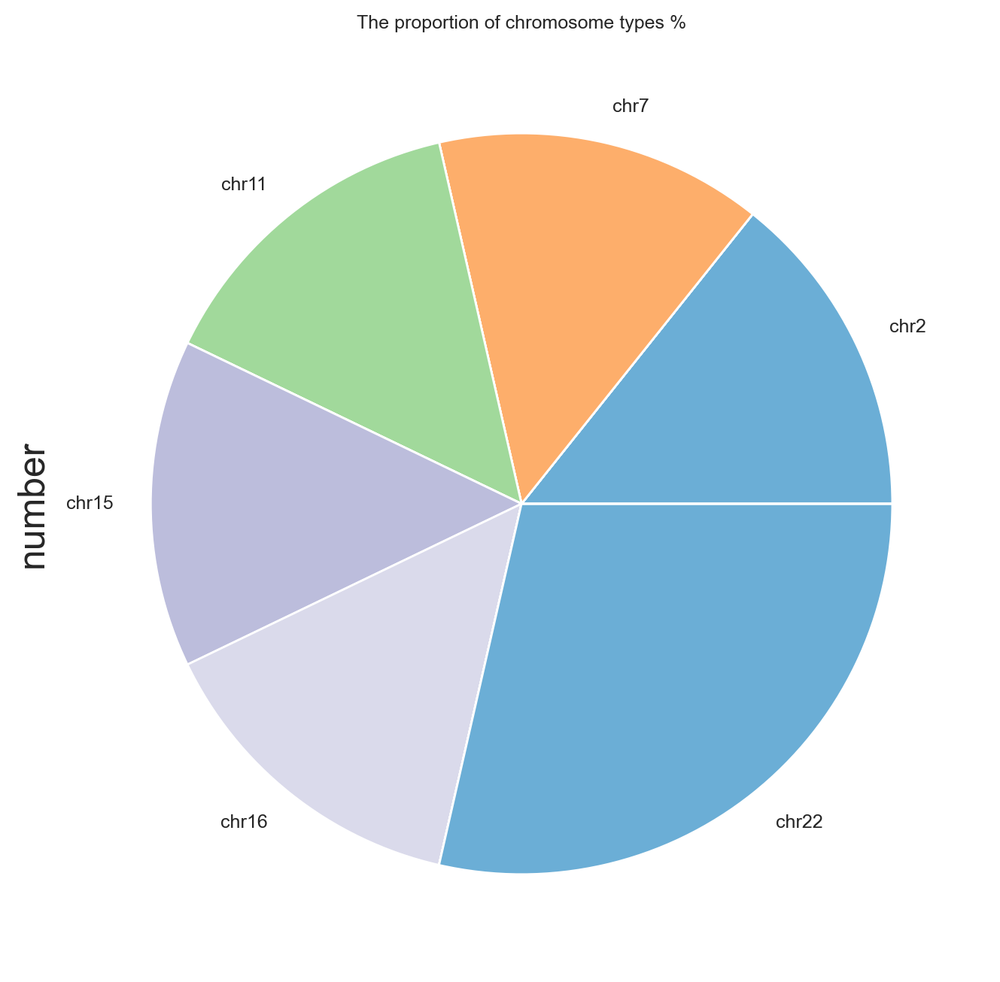
    


    
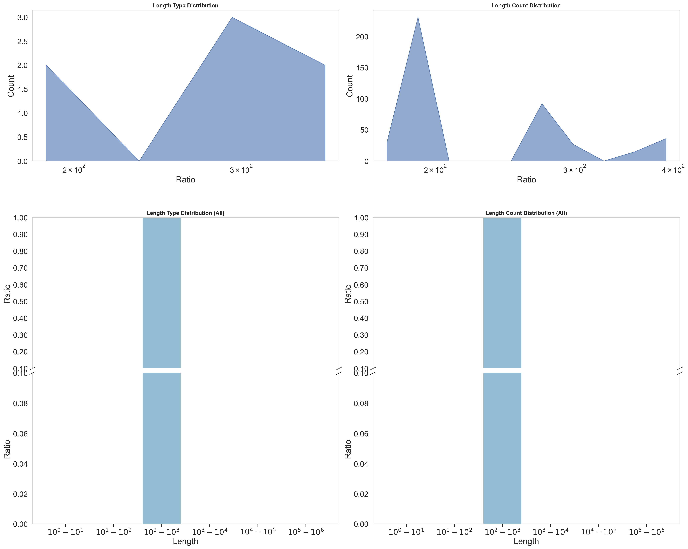
    


    
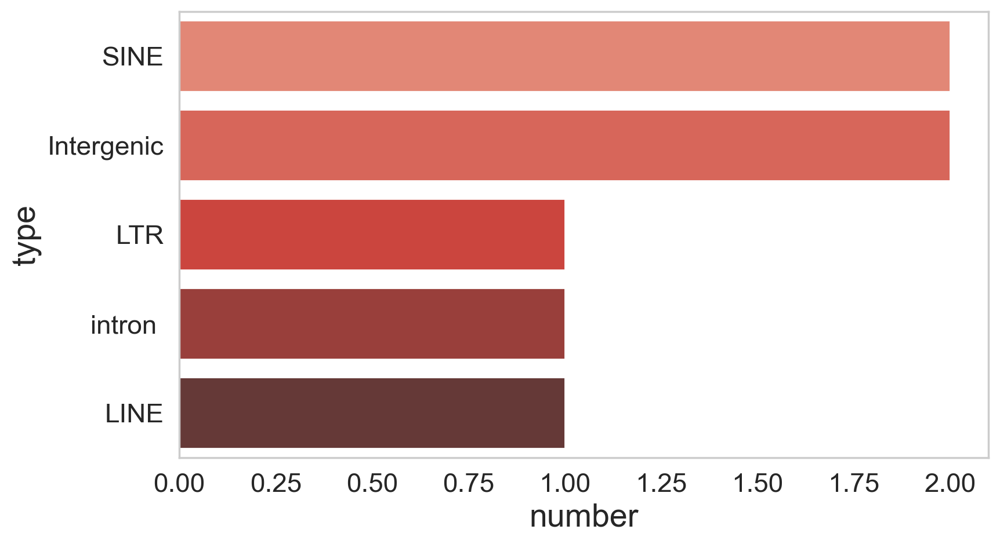
    


    	Plot homer anno distribution over!
    	Anno snp,se,e,eQTL Start!
    	Anno snp,SuperEnhancer,Enhancer,eQTL End!
    	jinja2 report Start!
    	jinja2 report End!
    Run fast End!
    SRR6315421
    Run fast Start!
    	Make chr bed & QC start!
    	Make chr bed & QC over!
    	Plot Chr distribution Start!
    	Plot Chr distribution over!
    	Plot Length distribution Start!
    	Plot Length distribution over!
    	Plot homer anno distribution Start!


    
    	Peak file = ./data/nebula/circle-Map_real_data/SRR6315421/ecc_pipe_result/circlemap_result.analysis.bed
    	Genome = hg38
    	Organism = human
    	Peak/BED file conversion summary:
    		BED/Header formatted lines: 4
    		peakfile formatted lines: 1
    		Duplicated Peak IDs: 0
    
    	Peak File Statistics:
    		Total Peaks: 5
    		Redundant Peak IDs: 0
    		Peaks lacking information: 0 (need at least 5 columns per peak)
    		Peaks with misformatted coordinates: 0 (should be integer)
    		Peaks with misformatted strand: 0 (should be either +/- or 0/1)
    
    	Peak file looks good!
    
    	Reading Positions...
    	-----------------------
    	Finding Closest TSS...
    	Annotating:...
    		Annotation	Number of peaks	Total size (bp)	Log2 Ratio (obs/exp)	LogP enrichment (+values depleted)
    		3UTR	0.0	3765582	-0.064	0.045
    		miRNA	0.0	12282	-0.000	0.000
    		ncRNA	0.0	830427	-0.014	0.010
    		TTS	0.0	4730585	-0.080	0.057
    		pseudo	0.0	227288	-0.004	0.003
    		Exon	0.0	5544543	-0.093	0.066
    		Intron	3.0	148088244	0.771	-1.480
    		Intergenic	1.0	168052987	-0.997	1.158
    		Promoter	0.0	5258791	-0.089	0.063
    		5UTR	0.0	380840	-0.007	0.005
    		snoRNA	0.0	64	-0.000	0.000
    	NOTE: If this part takes more than 2 minutes, there is a good chance
    		your machine ran out of memory: consider hitting ctrl+C and rerunning
    		the command with "-noann"
    	To capture annotation stats in a file, use "-annStats <filename>" next time
    	Annotating:...
    		Annotation	Number of peaks	Total size (bp)	Log2 Ratio (obs/exp)	LogP enrichment (+values depleted)
    		3UTR	0.0	3765582	-0.064	0.045
    		Retroposon	0.0	496181	-0.008	0.006
    		RC?	0.0	6538	-0.000	0.000
    		RNA	0.0	12399	-0.000	0.000
    		miRNA	0.0	12282	-0.000	0.000
    		ncRNA	0.0	830427	-0.014	0.010
    		TTS	0.0	4730585	-0.080	0.057
    		LINE	1.0	67143312	0.328	-0.530
    		srpRNA	0.0	33226	-0.001	0.000
    		SINE	1.0	50578385	0.736	-0.738
    		RC	0.0	38566	-0.001	0.000
    		tRNA	0.0	7604	-0.000	0.000
    		DNA?	0.0	37269	-0.001	0.000
    		pseudo	0.0	227288	-0.004	0.003
    		DNA	0.0	10787612	-0.179	0.130
    		Exon	0.0	5544543	-0.093	0.066
    		Intron	1.0	74302774	0.181	-0.461
    		Intergenic	1.0	66233119	0.347	-0.539
    		Promoter	0.0	5258791	-0.089	0.063
    		5UTR	0.0	380840	-0.007	0.005
    		snoRNA	0.0	64	-0.000	0.000
    		LTR?	0.0	133382	-0.002	0.002
    		scRNA	0.0	14693	-0.000	0.000
    		CpG-Island	0.0	1311386	-0.022	0.016
    		Low_complexity	0.0	681912	-0.012	0.008
    		LTR	0.0	30140858	-0.478	0.375
    		Simple_repeat	0.0	3960975	-0.067	0.047
    		snRNA	0.0	33536	-0.001	0.000
    		Unknown	0.0	72056	-0.001	0.001
    		SINE?	0.0	229	-0.000	0.000
    		Satellite	0.0	10221872	-0.170	0.123
    		rRNA	0.0	25805	-0.000	0.000
    	Counting Tags in Peaks from each directory...
    	Organism: human
    	Loading Gene Informaiton...
    	Outputing Annotation File...
    	Done annotating peaks file
    


    

    


    
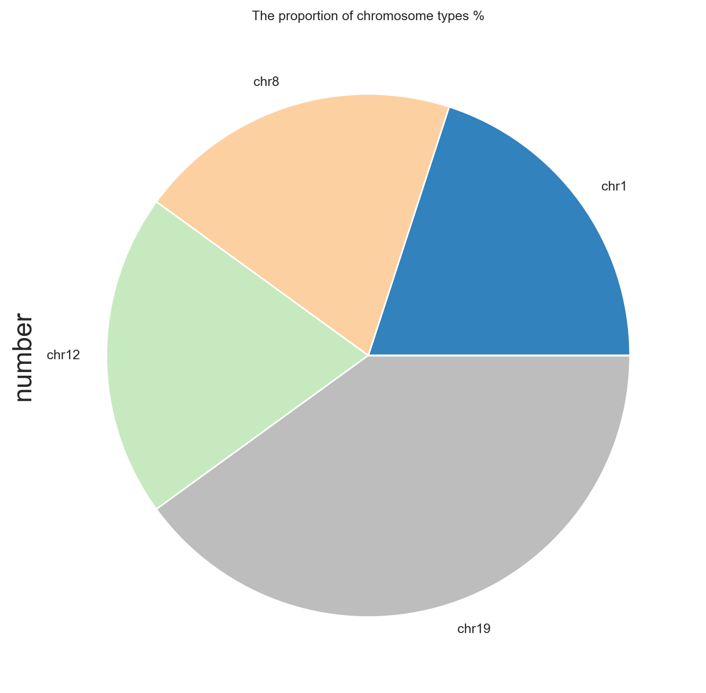
    


    
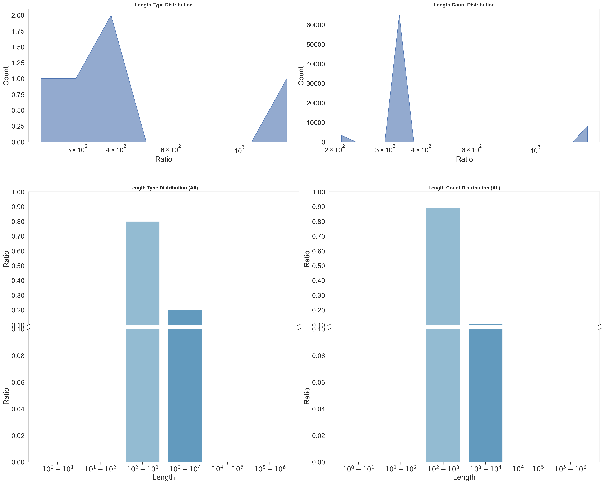
    


    
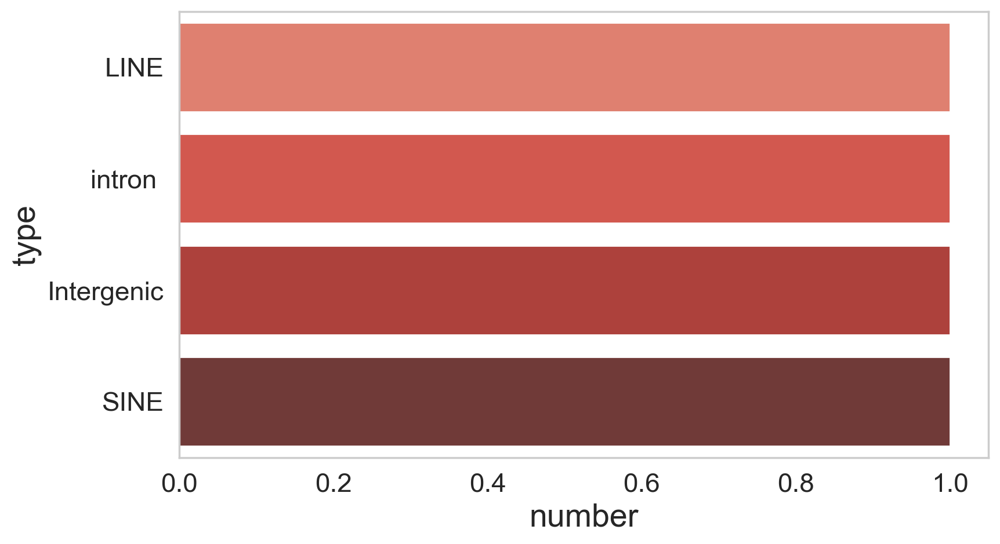
    


    	Plot homer anno distribution over!
    	Anno snp,se,e,eQTL Start!


    
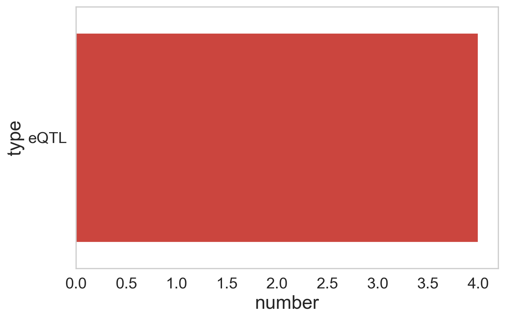
    


    	Anno snp,SuperEnhancer,Enhancer,eQTL End!
    	jinja2 report Start!
    	jinja2 report End!
    Run fast End!
    SRR6315422
    Run fast Start!
    	Make chr bed & QC start!
    	Make chr bed & QC over!
    	Plot Chr distribution Start!
    	Plot Chr distribution over!
    	Plot Length distribution Start!
    	Plot Length distribution over!
    	Plot homer anno distribution Start!


    
    	Peak file = ./data/nebula/circle-Map_real_data/SRR6315422/ecc_pipe_result/circlemap_result.analysis.bed
    	Genome = hg38
    	Organism = human
    	Peak/BED file conversion summary:
    		BED/Header formatted lines: 5
    		peakfile formatted lines: 1
    		Duplicated Peak IDs: 0
    
    	Peak File Statistics:
    		Total Peaks: 6
    		Redundant Peak IDs: 0
    		Peaks lacking information: 0 (need at least 5 columns per peak)
    		Peaks with misformatted coordinates: 0 (should be integer)
    		Peaks with misformatted strand: 0 (should be either +/- or 0/1)
    
    	Peak file looks good!
    
    	Reading Positions...
    	-----------------------
    	Finding Closest TSS...
    	Annotating:.....
    		Annotation	Number of peaks	Total size (bp)	Log2 Ratio (obs/exp)	LogP enrichment (+values depleted)
    		3UTR	0.0	7277398	-0.069	0.049
    		miRNA	0.0	23234	-0.000	0.000
    		ncRNA	0.0	1806657	-0.017	0.012
    		TTS	0.0	8482556	-0.080	0.057
    		pseudo	0.0	556380	-0.005	0.004
    		Exon	0.0	9680839	-0.091	0.065
    		Intron	2.0	331687826	-0.143	0.497
    		Intergenic	2.0	381165563	-0.344	0.723
    		Promoter	1.0	9361279	4.004	-2.800
    		5UTR	0.0	693146	-0.007	0.005
    		snoRNA	0.0	140	-0.000	0.000
    	NOTE: If this part takes more than 2 minutes, there is a good chance
    		your machine ran out of memory: consider hitting ctrl+C and rerunning
    		the command with "-noann"
    	To capture annotation stats in a file, use "-annStats <filename>" next time
    	Annotating:.....
    		Annotation	Number of peaks	Total size (bp)	Log2 Ratio (obs/exp)	LogP enrichment (+values depleted)
    		3UTR	0.0	7277398	-0.069	0.049
    		Retroposon	0.0	1067726	-0.010	0.007
    		RC?	0.0	15479	-0.000	0.000
    		RNA	0.0	29326	-0.000	0.000
    		miRNA	0.0	23234	-0.000	0.000
    		ncRNA	0.0	1806657	-0.017	0.012
    		TTS	0.0	8482556	-0.080	0.057
    		LINE	0.0	152682241	-1.186	1.136
    		srpRNA	0.0	68107	-0.001	0.000
    		SINE	2.0	100967268	1.573	-1.989
    		RC	0.0	83056	-0.001	0.001
    		tRNA	0.0	28141	-0.000	0.000
    		DNA?	0.0	99850	-0.001	0.001
    		pseudo	0.0	556380	-0.005	0.004
    		DNA	0.0	25126318	-0.230	0.170
    		Exon	0.0	9680839	-0.091	0.065
    		Intron	0.0	172576448	-1.317	1.305
    		Intergenic	1.0	167156076	-0.154	0.370
    		Promoter	1.0	9361279	4.004	-2.801
    		5UTR	0.0	693146	-0.007	0.005
    		snoRNA	0.0	140	-0.000	0.000
    		LTR?	0.0	312129	-0.003	0.002
    		scRNA	0.0	33349	-0.000	0.000
    		CpG-Island	0.0	2294424	-0.022	0.015
    		Low_complexity	0.0	1370633	-0.013	0.009
    		LTR	1.0	63350034	1.246	-1.032
    		Simple_repeat	0.0	8382890	-0.079	0.056
    		snRNA	0.0	82511	-0.001	0.001
    		Unknown	0.0	183452	-0.002	0.001
    		SINE?	0.0	487	-0.000	0.000
    		Satellite	0.0	17328297	-0.161	0.117
    		rRNA	0.0	46619	-0.000	0.000
    	Counting Tags in Peaks from each directory...
    	Organism: human
    	Loading Gene Informaiton...
    	Outputing Annotation File...
    	Done annotating peaks file
    


    
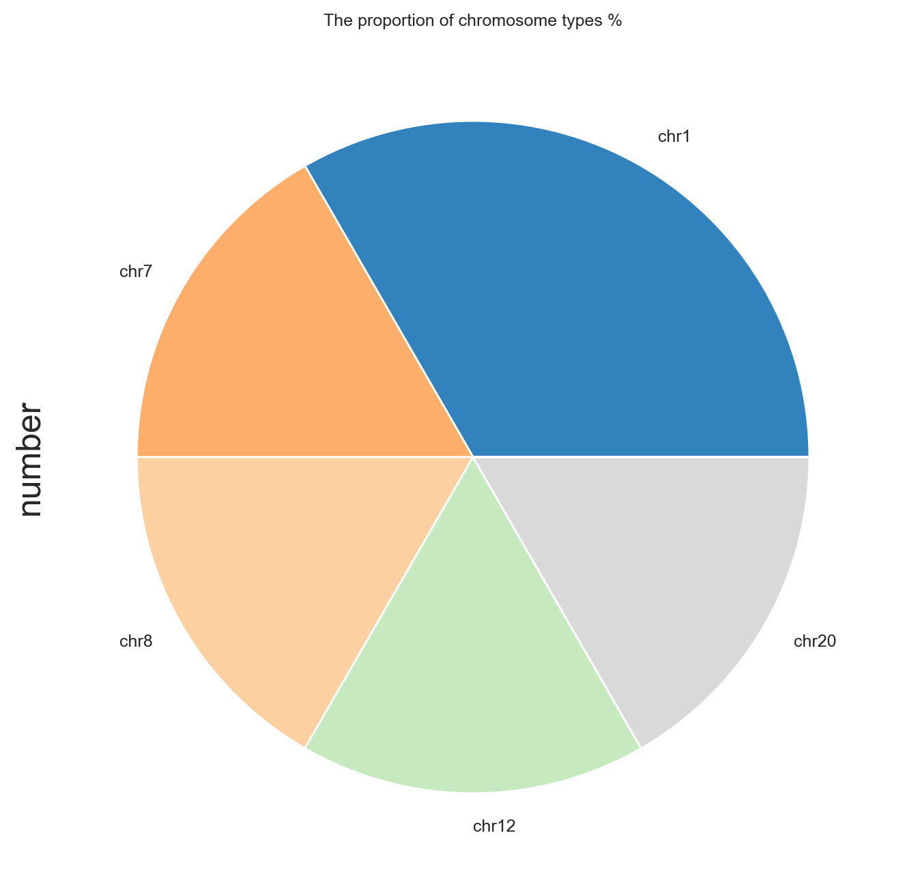
    


    
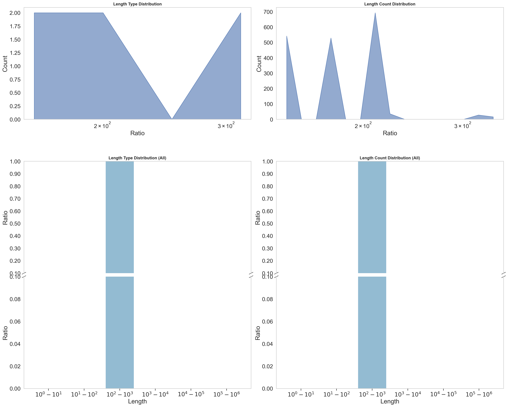
    


    
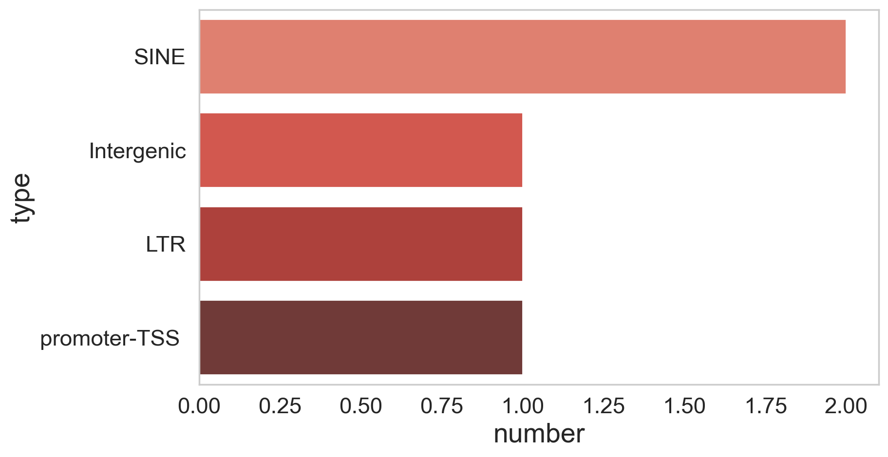
    


    	Plot homer anno distribution over!
    	Anno snp,se,e,eQTL Start!
    	Anno snp,SuperEnhancer,Enhancer,eQTL End!
    	jinja2 report Start!
    	jinja2 report End!
    Run fast End!
    SRR6315423
    Run fast Start!
    	Make chr bed & QC start!
    	Make chr bed & QC over!
    	Plot Chr distribution Start!
    	Plot Chr distribution over!
    	Plot Length distribution Start!
    	Plot Length distribution over!
    	Plot homer anno distribution Start!


    
    	Peak file = ./data/nebula/circle-Map_real_data/SRR6315423/ecc_pipe_result/circlemap_result.analysis.bed
    	Genome = hg38
    	Organism = human
    	Peak/BED file conversion summary:
    		BED/Header formatted lines: 2037
    		peakfile formatted lines: 0
    		Duplicated Peak IDs: 1111
    
    	Peak File Statistics:
    		Total Peaks: 2037
    		Redundant Peak IDs: 0
    		Peaks lacking information: 0 (need at least 5 columns per peak)
    		Peaks with misformatted coordinates: 0 (should be integer)
    		Peaks with misformatted strand: 0 (should be either +/- or 0/1)
    
    	Peak file looks good!
    
    	Reading Positions...
    	-----------------------
    	Finding Closest TSS...
    	Annotating:........................
    		Annotation	Number of peaks	Total size (bp)	Log2 Ratio (obs/exp)	LogP enrichment (+values depleted)
    		3UTR	22.0	26833139	0.313	-1.712
    		miRNA	0.0	97618	-0.090	0.064
    		ncRNA	8.0	7044070	0.783	-2.311
    		TTS	41.0	32404629	0.939	-9.253
    		pseudo	2.0	2111155	0.521	-0.902
    		Exon	44.0	37120946	0.845	-8.412
    		Intron	903.0	1257910936	0.121	-7.451
    		Intergenic	966.0	1684358172	-0.203	23.555
    		Promoter	46.0	35946139	0.955	-10.458
    		5UTR	5.0	2601483	1.542	-3.485
    		snoRNA	0.0	357	-0.000	0.000
    		scRNA	0.0	97	-0.000	0.000
    		rRNA	0.0	25562	-0.024	0.017
    	NOTE: If this part takes more than 2 minutes, there is a good chance
    		your machine ran out of memory: consider hitting ctrl+C and rerunning
    		the command with "-noann"
    	To capture annotation stats in a file, use "-annStats <filename>" next time
    	Annotating:........................
    		Annotation	Number of peaks	Total size (bp)	Log2 Ratio (obs/exp)	LogP enrichment (+values depleted)
    		3UTR	22.0	26833139	0.314	-1.715
    		Retroposon	4.0	4062585	0.578	-1.268
    		RC?	0.0	59773	-0.056	0.039
    		RNA	0.0	108000	-0.099	0.071
    		miRNA	0.0	97618	-0.090	0.064
    		ncRNA	8.0	7044070	0.784	-2.314
    		TTS	41.0	32404629	0.940	-9.264
    		LINE	218.0	633178497	-0.938	72.696
    		srpRNA	0.0	262214	-0.230	0.173
    		SINE	508.0	379673449	1.020	-124.593
    		RC	0.0	362795	-0.310	0.239
    		tRNA	0.0	91738	-0.085	0.061
    		DNA?	0.0	423197	-0.355	0.279
    		pseudo	2.0	2111155	0.522	-0.902
    		DNA	67.0	99395597	0.031	-0.808
    		Exon	44.0	37120946	0.846	-8.422
    		Intron	434.0	656103354	0.004	-0.728
    		Intergenic	389.0	780868131	-0.405	24.576
    		Promoter	46.0	35946139	0.956	-10.470
    		5UTR	5.0	2601483	1.543	-3.487
    		snoRNA	0.0	357	-0.000	0.000
    		LTR?	0.0	1140409	-0.809	0.752
    		scRNA	0.0	121638	-0.111	0.080
    		CpG-Island	19.0	9000269	1.678	-11.130
    		Low_complexity	0.0	5480212	-2.208	3.618
    		LTR	191.0	262167686	0.143	-2.491
    		Simple_repeat	14.0	34754537	-0.712	3.461
    		snRNA	1.0	314325	2.270	-1.675
    		Unknown	0.0	714206	-0.557	0.471
    		SINE?	0.0	2674	-0.003	0.002
    		Satellite	23.0	75387841	-1.112	11.076
    		rRNA	1.0	202619	2.903	-2.079
    	Counting Tags in Peaks from each directory...
    	Organism: human
    	Loading Gene Informaiton...
    	Outputing Annotation File...
    	Done annotating peaks file
    


    

    


    
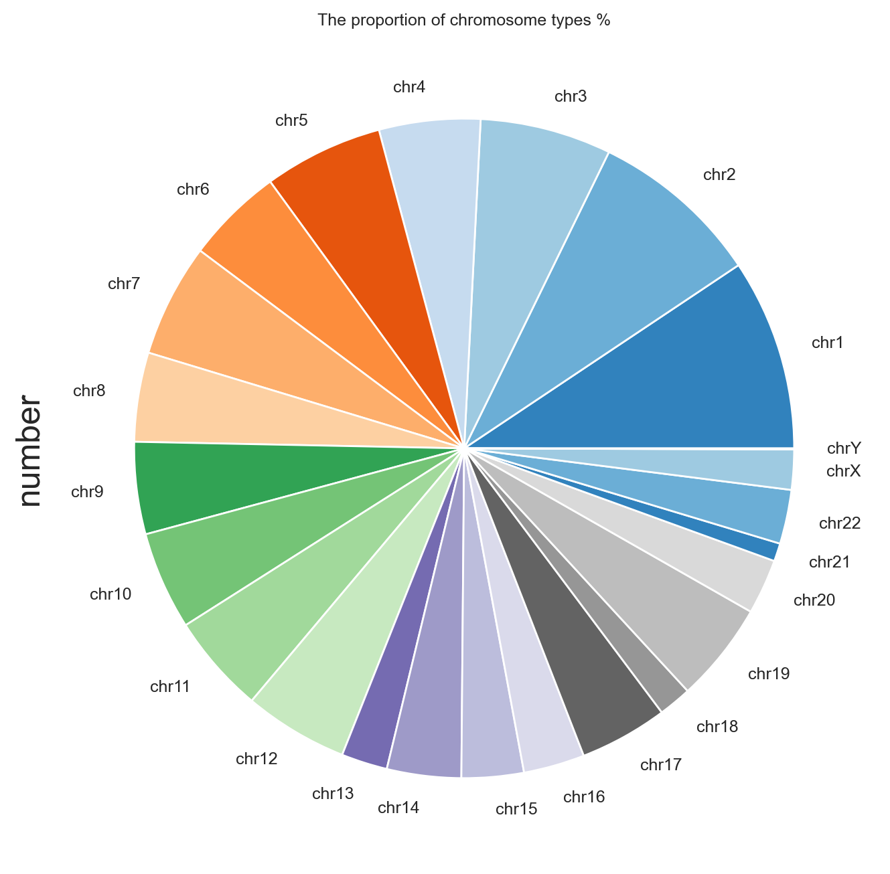
    


    
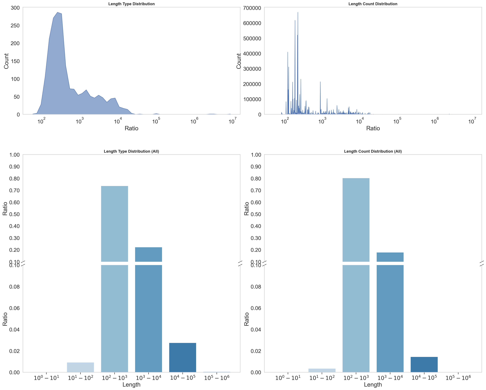
    


    
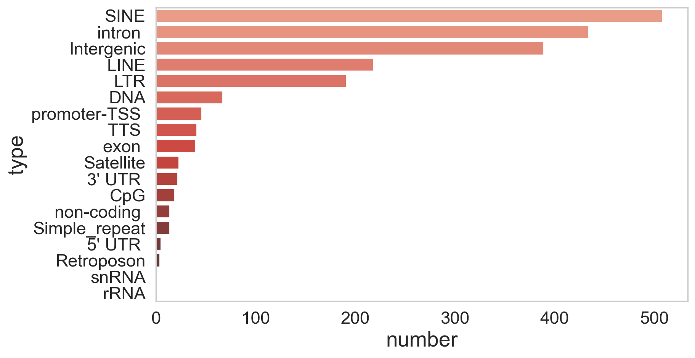
    


    	Plot homer anno distribution over!
    	Anno snp,se,e,eQTL Start!


    

    


    	Anno snp,SuperEnhancer,Enhancer,eQTL End!
    	jinja2 report Start!
    	jinja2 report End!
    Run fast End!
    SRR6315424
    Run fast Start!
    	Make chr bed & QC start!
    	Make chr bed & QC over!
    	Plot Chr distribution Start!
    	Plot Chr distribution over!
    	Plot Length distribution Start!
    	Plot Length distribution over!
    	Plot homer anno distribution Start!


    
    	Peak file = ./data/nebula/circle-Map_real_data/SRR6315424/ecc_pipe_result/circlemap_result.analysis.bed
    	Genome = hg38
    	Organism = human
    	Peak/BED file conversion summary:
    		BED/Header formatted lines: 2742
    		peakfile formatted lines: 0
    		Duplicated Peak IDs: 1978
    
    	Peak File Statistics:
    		Total Peaks: 2742
    		Redundant Peak IDs: 0
    		Peaks lacking information: 0 (need at least 5 columns per peak)
    		Peaks with misformatted coordinates: 0 (should be integer)
    		Peaks with misformatted strand: 0 (should be either +/- or 0/1)
    
    	Peak file looks good!
    
    	Reading Positions...
    	-----------------------
    	Finding Closest TSS...
    	Annotating:........................
    		Annotation	Number of peaks	Total size (bp)	Log2 Ratio (obs/exp)	LogP enrichment (+values depleted)
    		3UTR	40.0	26833139	0.747	-6.523
    		miRNA	0.0	97618	-0.120	0.087
    		ncRNA	15.0	7044070	1.261	-6.187
    		TTS	43.0	32404629	0.579	-4.880
    		pseudo	2.0	2111155	0.093	-0.581
    		Exon	56.0	37120946	0.764	-8.827
    		Intron	1265.0	1257910936	0.179	-18.816
    		Intergenic	1260.0	1684358172	-0.248	43.831
    		Promoter	54.0	35946139	0.758	-8.467
    		5UTR	7.0	2601483	1.599	-4.650
    		snoRNA	0.0	357	-0.000	0.000
    		scRNA	0.0	97	-0.000	0.000
    		rRNA	0.0	25562	-0.032	0.023
    	NOTE: If this part takes more than 2 minutes, there is a good chance
    		your machine ran out of memory: consider hitting ctrl+C and rerunning
    		the command with "-noann"
    	To capture annotation stats in a file, use "-annStats <filename>" next time
    	Annotating:........................
    		Annotation	Number of peaks	Total size (bp)	Log2 Ratio (obs/exp)	LogP enrichment (+values depleted)
    		3UTR	40.0	26833139	0.747	-6.532
    		Retroposon	4.0	4062585	0.149	-0.721
    		RC?	0.0	59773	-0.075	0.053
    		RNA	0.0	108000	-0.132	0.096
    		miRNA	0.0	97618	-0.120	0.087
    		ncRNA	15.0	7044070	1.262	-6.192
    		TTS	43.0	32404629	0.580	-4.889
    		LINE	280.0	633178497	-1.006	107.668
    		srpRNA	1.0	262214	2.103	-1.572
    		SINE	691.0	379673449	1.035	-172.965
    		RC	0.0	362795	-0.403	0.322
    		tRNA	0.0	91738	-0.113	0.081
    		DNA?	0.0	423197	-0.460	0.376
    		pseudo	2.0	2111155	0.093	-0.581
    		DNA	77.0	99395597	-0.197	2.113
    		Exon	56.0	37120946	0.765	-8.839
    		Intron	624.0	656103354	0.099	-3.548
    		Intergenic	515.0	780868131	-0.429	35.558
    		Promoter	54.0	35946139	0.759	-8.479
    		5UTR	7.0	2601483	1.599	-4.653
    		snoRNA	0.0	357	-0.000	0.000
    		LTR?	3.0	1140409	1.567	-2.494
    		scRNA	0.0	121638	-0.148	0.108
    		CpG-Island	19.0	9000269	1.249	-7.371
    		Low_complexity	6.0	5480212	0.302	-1.020
    		LTR	277.0	262167686	0.251	-6.364
    		Simple_repeat	15.0	34754537	-1.041	6.748
    		snRNA	0.0	314325	-0.355	0.279
    		Unknown	1.0	714206	0.657	-0.756
    		SINE?	0.0	2674	-0.003	0.002
    		Satellite	12.0	75387841	-2.480	36.850
    		rRNA	0.0	202619	-0.239	0.180
    	Counting Tags in Peaks from each directory...
    	Organism: human
    	Loading Gene Informaiton...
    	Outputing Annotation File...
    	Done annotating peaks file
    


    
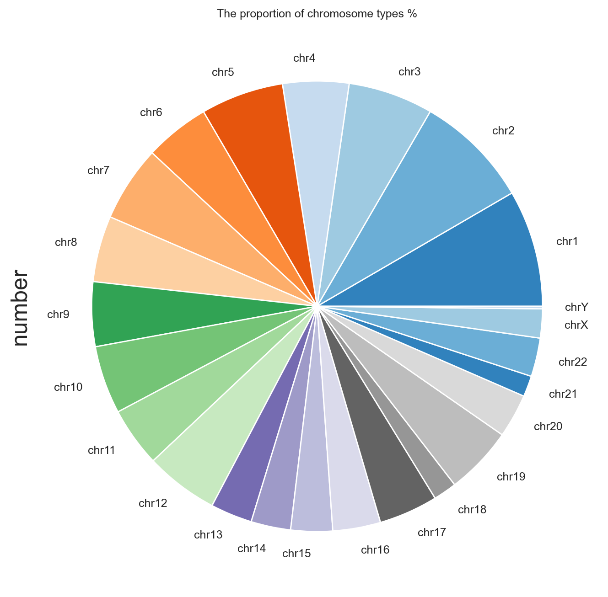
    


    
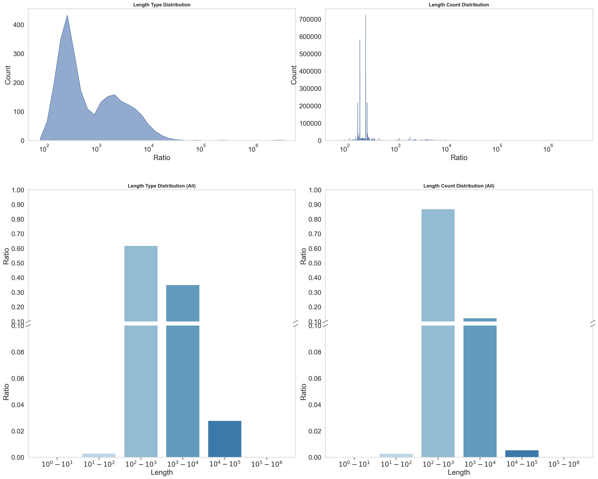
    


    
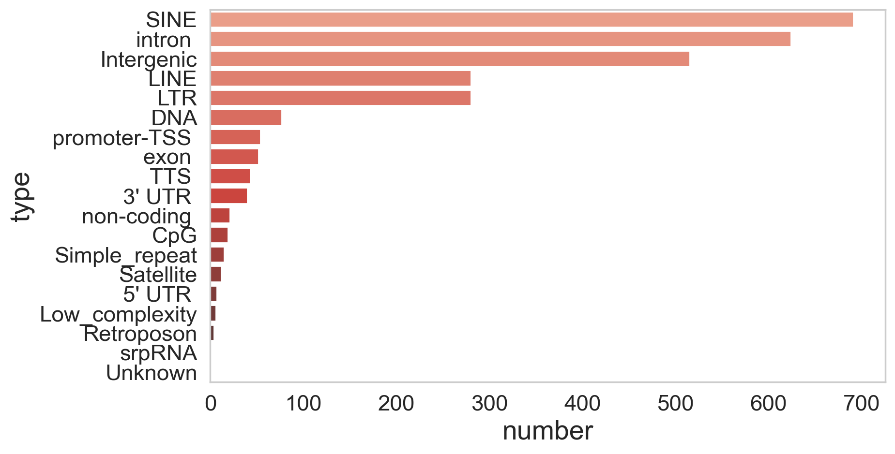
    


    	Plot homer anno distribution over!
    	Anno snp,se,e,eQTL Start!


    
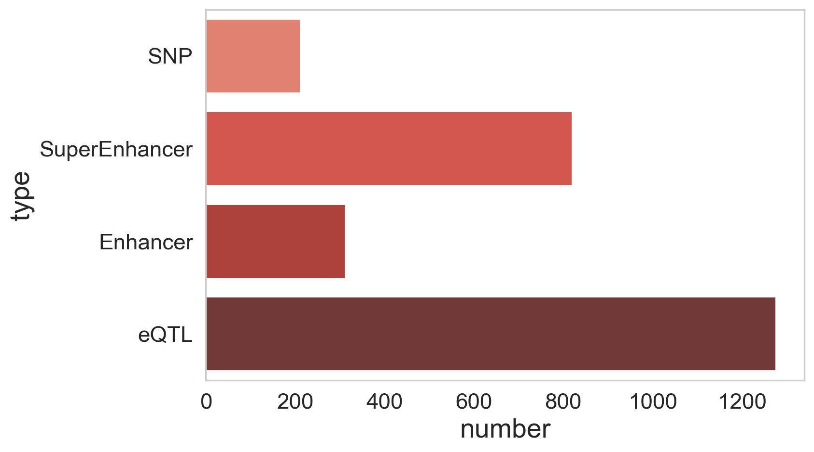
    


    	Anno snp,SuperEnhancer,Enhancer,eQTL End!
    	jinja2 report Start!
    	jinja2 report End!
    Run fast End!
    SRR6315425
    Run fast Start!
    	Make chr bed & QC start!
    	Make chr bed & QC over!
    	Plot Chr distribution Start!
    	Plot Chr distribution over!
    	Plot Length distribution Start!
    	Plot Length distribution over!
    	Plot homer anno distribution Start!


    
    	Peak file = ./data/nebula/circle-Map_real_data/SRR6315425/ecc_pipe_result/circlemap_result.analysis.bed
    	Genome = hg38
    	Organism = human
    	Peak/BED file conversion summary:
    		BED/Header formatted lines: 366
    		peakfile formatted lines: 0
    		Duplicated Peak IDs: 125
    
    	Peak File Statistics:
    		Total Peaks: 366
    		Redundant Peak IDs: 0
    		Peaks lacking information: 0 (need at least 5 columns per peak)
    		Peaks with misformatted coordinates: 0 (should be integer)
    		Peaks with misformatted strand: 0 (should be either +/- or 0/1)
    
    	Peak file looks good!
    
    	Reading Positions...
    	-----------------------
    	Finding Closest TSS...
    	Annotating:........................
    		Annotation	Number of peaks	Total size (bp)	Log2 Ratio (obs/exp)	LogP enrichment (+values depleted)
    		3UTR	2.0	26833139	-0.666	0.956
    		miRNA	0.0	97618	-0.017	0.012
    		ncRNA	0.0	7044070	-0.876	0.834
    		TTS	7.0	32404629	0.869	-2.377
    		pseudo	1.0	2111155	2.002	-1.510
    		Exon	10.0	37120946	1.188	-4.261
    		Intron	169.0	1257910936	0.184	-4.009
    		Intergenic	169.0	1684358172	-0.237	6.986
    		Promoter	7.0	35946139	0.720	-1.986
    		5UTR	0.0	2601483	-0.387	0.308
    		snoRNA	0.0	357	-0.000	0.000
    		scRNA	0.0	97	-0.000	0.000
    		rRNA	0.0	25562	-0.004	0.003
    	NOTE: If this part takes more than 2 minutes, there is a good chance
    		your machine ran out of memory: consider hitting ctrl+C and rerunning
    		the command with "-noann"
    	To capture annotation stats in a file, use "-annStats <filename>" next time
    	Annotating:........................
    		Annotation	Number of peaks	Total size (bp)	Log2 Ratio (obs/exp)	LogP enrichment (+values depleted)
    		3UTR	2.0	26833139	-0.665	0.955
    		Retroposon	2.0	4062585	2.058	-2.475
    		RC?	0.0	59773	-0.010	0.007
    		RNA	0.0	108000	-0.018	0.013
    		miRNA	0.0	97618	-0.017	0.012
    		ncRNA	0.0	7044070	-0.875	0.834
    		TTS	7.0	32404629	0.870	-2.379
    		LINE	36.0	633178497	-1.056	17.112
    		srpRNA	0.0	262214	-0.044	0.031
    		SINE	106.0	379673449	1.240	-38.902
    		RC	0.0	362795	-0.061	0.043
    		tRNA	0.0	91738	-0.016	0.011
    		DNA?	0.0	423197	-0.070	0.050
    		pseudo	1.0	2111155	2.003	-1.510
    		DNA	11.0	99395597	-0.095	0.715
    		Exon	10.0	37120946	1.188	-4.264
    		Intron	72.0	656103354	-0.107	1.342
    		Intergenic	67.0	780868131	-0.462	6.868
    		Promoter	7.0	35946139	0.720	-1.988
    		5UTR	0.0	2601483	-0.387	0.308
    		snoRNA	0.0	357	-0.000	0.000
    		LTR?	1.0	1140409	2.891	-2.070
    		scRNA	0.0	121638	-0.021	0.014
    		CpG-Island	4.0	9000269	1.911	-3.774
    		Low_complexity	0.0	5480212	-0.722	0.648
    		LTR	29.0	262167686	-0.096	0.918
    		Simple_repeat	4.0	34754537	-0.038	0.498
    		snRNA	0.0	314325	-0.053	0.037
    		Unknown	0.0	714206	-0.117	0.084
    		SINE?	0.0	2674	-0.000	0.000
    		Satellite	6.0	75387841	-0.571	1.553
    		rRNA	0.0	202619	-0.034	0.024
    	Counting Tags in Peaks from each directory...
    	Organism: human
    	Loading Gene Informaiton...
    	Outputing Annotation File...
    	Done annotating peaks file
    


    
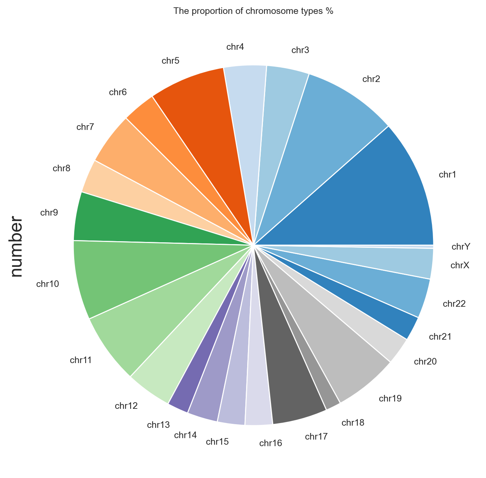
    


    
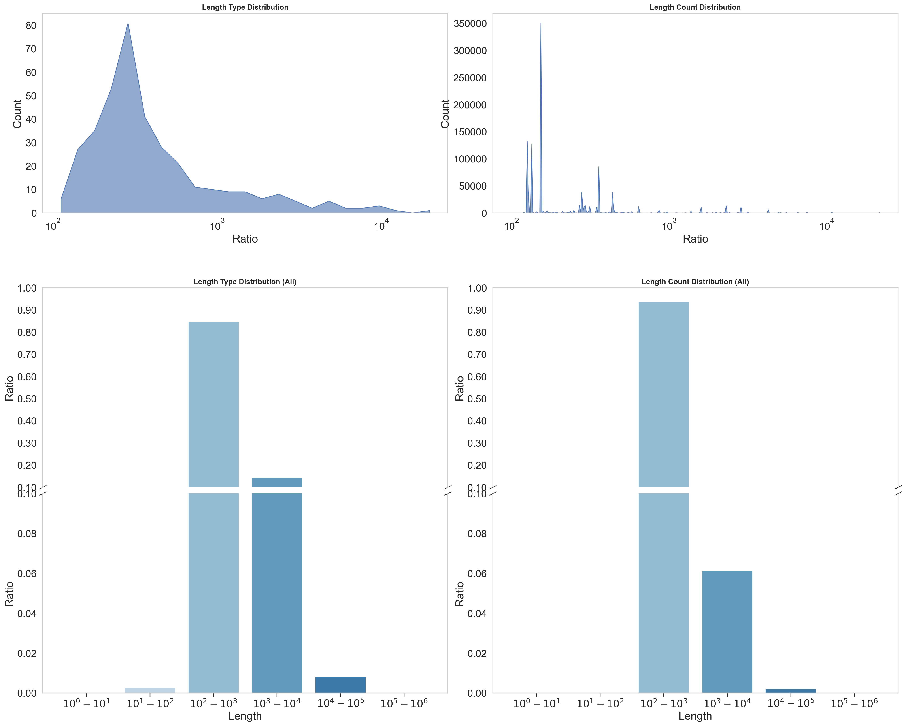
    


    

    


    	Plot homer anno distribution over!
    	Anno snp,se,e,eQTL Start!


    ***** WARNING: File ./data/nebula/circle-Map_real_data/SRR6315425/ecc_pipe_result/circlemap_result.analysis.bed has inconsistent naming convention for record:
    	2598	3068	1143	2307
    
    ***** WARNING: File ./data/nebula/circle-Map_real_data/SRR6315425/ecc_pipe_result/circlemap_result.analysis.bed has inconsistent naming convention for record:
    	2598	3068	1143	2307
    
    ***** WARNING: File ./data/nebula/circle-Map_real_data/SRR6315425/ecc_pipe_result/circlemap_result.analysis.bed has inconsistent naming convention for record:
    	2598	3068	1143	2307
    
    ***** WARNING: File ./data/nebula/circle-Map_real_data/SRR6315425/ecc_pipe_result/circlemap_result.analysis.bed has inconsistent naming convention for record:
    	2598	3068	1143	2307
    
    ***** WARNING: File ./data/nebula/circle-Map_real_data/SRR6315425/ecc_pipe_result/circlemap_result.analysis.bed has inconsistent naming convention for record:
    	2598	3068	1143	2307
    
    ***** WARNING: File ./data/nebula/circle-Map_real_data/SRR6315425/ecc_pipe_result/circlemap_result.analysis.bed has inconsistent naming convention for record:
    	2598	3068	1143	2307
    
    ***** WARNING: File ./data/nebula/circle-Map_real_data/SRR6315425/ecc_pipe_result/circlemap_result.analysis.bed has inconsistent naming convention for record:
    	2598	3068	1143	2307
    
    ***** WARNING: File ./data/nebula/circle-Map_real_data/SRR6315425/ecc_pipe_result/circlemap_result.analysis.bed has inconsistent naming convention for record:
    	2598	3068	1143	2307
    


    
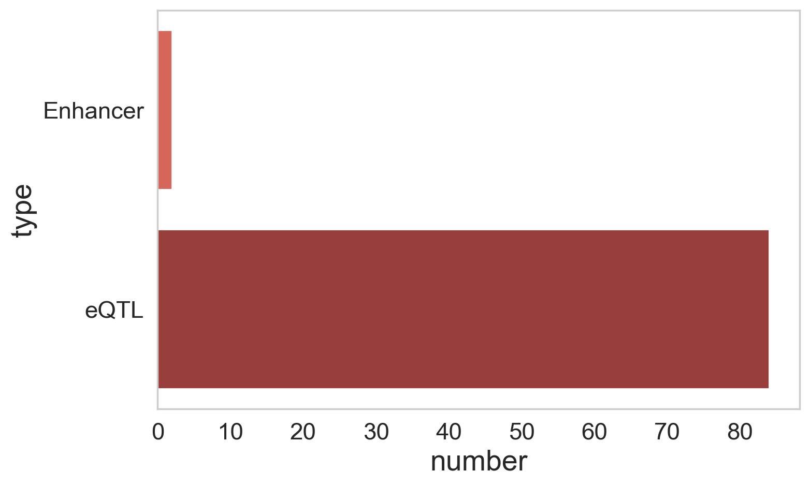
    


    	Anno snp,SuperEnhancer,Enhancer,eQTL End!
    	jinja2 report Start!
    	jinja2 report End!
    Run fast End!
    SRR6315426
    Run fast Start!
    	Make chr bed & QC start!
    	Make chr bed & QC over!
    	Plot Chr distribution Start!
    	Plot Chr distribution over!
    	Plot Length distribution Start!
    	Plot Length distribution over!
    	Plot homer anno distribution Start!


    
    	Peak file = ./data/nebula/circle-Map_real_data/SRR6315426/ecc_pipe_result/circlemap_result.analysis.bed
    	Genome = hg38
    	Organism = human
    	Peak/BED file conversion summary:
    		BED/Header formatted lines: 666
    		peakfile formatted lines: 1
    		Duplicated Peak IDs: 294
    
    	Peak File Statistics:
    		Total Peaks: 667
    		Redundant Peak IDs: 0
    		Peaks lacking information: 0 (need at least 5 columns per peak)
    		Peaks with misformatted coordinates: 0 (should be integer)
    		Peaks with misformatted strand: 0 (should be either +/- or 0/1)
    
    	Peak file looks good!
    
    	Reading Positions...
    	-----------------------
    	Finding Closest TSS...
    	Annotating:........................
    		Annotation	Number of peaks	Total size (bp)	Log2 Ratio (obs/exp)	LogP enrichment (+values depleted)
    		3UTR	8.0	26833139	0.469	-1.488
    		miRNA	0.0	97618	-0.030	0.021
    		ncRNA	1.0	7044070	-0.602	0.595
    		TTS	17.0	32404629	1.284	-7.051
    		pseudo	1.0	2111155	1.136	-1.006
    		Exon	16.0	37120946	1.000	-4.849
    		Intron	310.0	1257910936	0.194	-6.672
    		Intergenic	292.0	1684358172	-0.314	17.605
    		Promoter	19.0	35946139	1.295	-7.811
    		5UTR	1.0	2601483	0.835	-0.846
    		snoRNA	0.0	357	-0.000	0.000
    		scRNA	0.0	97	-0.000	0.000
    		rRNA	0.0	25562	-0.008	0.006
    	NOTE: If this part takes more than 2 minutes, there is a good chance
    		your machine ran out of memory: consider hitting ctrl+C and rerunning
    		the command with "-noann"
    	To capture annotation stats in a file, use "-annStats <filename>" next time
    	Annotating:........................
    		Annotation	Number of peaks	Total size (bp)	Log2 Ratio (obs/exp)	LogP enrichment (+values depleted)
    		3UTR	8.0	26833139	0.469	-1.490
    		Retroposon	1.0	4062585	0.193	-0.539
    		RC?	0.0	59773	-0.018	0.013
    		RNA	0.0	108000	-0.033	0.023
    		miRNA	0.0	97618	-0.030	0.021
    		ncRNA	1.0	7044070	-0.601	0.594
    		TTS	17.0	32404629	1.285	-7.056
    		LINE	54.0	633178497	-1.336	40.899
    		srpRNA	0.0	262214	-0.079	0.056
    		SINE	187.0	379673449	1.194	-62.522
    		RC	0.0	362795	-0.109	0.078
    		tRNA	0.0	91738	-0.028	0.020
    		DNA?	0.0	423197	-0.126	0.091
    		pseudo	1.0	2111155	1.137	-1.007
    		DNA	18.0	99395597	-0.250	1.315
    		Exon	16.0	37120946	1.001	-4.853
    		Intron	148.0	656103354	0.067	-1.287
    		Intergenic	102.0	780868131	-0.721	21.785
    		Promoter	19.0	35946139	1.295	-7.817
    		5UTR	1.0	2601483	0.836	-0.846
    		snoRNA	0.0	357	-0.000	0.000
    		LTR?	0.0	1140409	-0.317	0.246
    		scRNA	0.0	121638	-0.037	0.026
    		CpG-Island	8.0	9000269	2.045	-7.037
    		Low_complexity	2.0	5480212	0.761	-1.108
    		LTR	78.0	262167686	0.466	-5.978
    		Simple_repeat	1.0	34754537	-2.904	5.379
    		snRNA	0.0	314325	-0.095	0.068
    		Unknown	0.0	714206	-0.206	0.154
    		SINE?	0.0	2674	-0.001	0.001
    		Satellite	3.0	75387841	-2.436	9.611
    		rRNA	0.0	202619	-0.062	0.044
    	Counting Tags in Peaks from each directory...
    	Organism: human
    	Loading Gene Informaiton...
    	Outputing Annotation File...
    	Done annotating peaks file
    


    
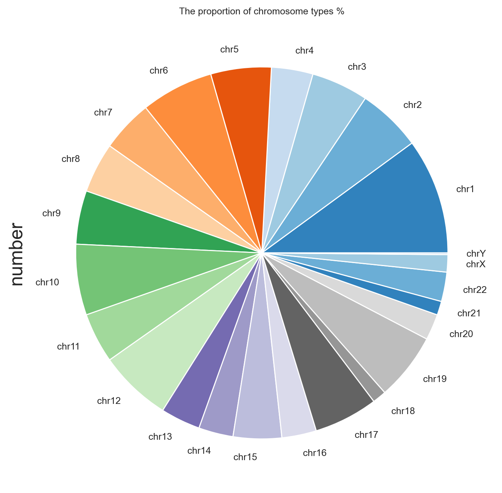
    


    
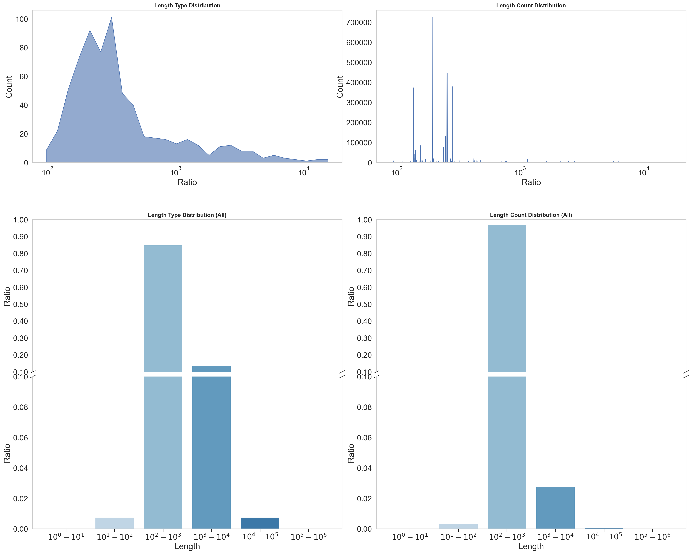
    


    
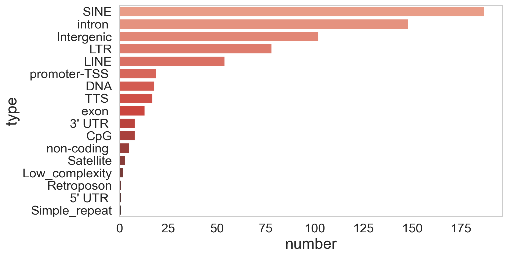
    


    	Plot homer anno distribution over!
    	Anno snp,se,e,eQTL Start!


    ***** WARNING: File ./data/nebula/circle-Map_real_data/SRR6315426/ecc_pipe_result/circlemap_result.analysis.bed has inconsistent naming convention for record:
    	0	16569	457	5350
    
    ***** WARNING: File ./data/nebula/circle-Map_real_data/SRR6315426/ecc_pipe_result/circlemap_result.analysis.bed has inconsistent naming convention for record:
    	0	16569	457	5350
    
    ***** WARNING: File ./data/nebula/circle-Map_real_data/SRR6315426/ecc_pipe_result/circlemap_result.analysis.bed has inconsistent naming convention for record:
    	0	16569	457	5350
    
    ***** WARNING: File ./data/nebula/circle-Map_real_data/SRR6315426/ecc_pipe_result/circlemap_result.analysis.bed has inconsistent naming convention for record:
    	0	16569	457	5350
    
    ***** WARNING: File ./data/nebula/circle-Map_real_data/SRR6315426/ecc_pipe_result/circlemap_result.analysis.bed has inconsistent naming convention for record:
    	0	16569	457	5350
    
    ***** WARNING: File ./data/nebula/circle-Map_real_data/SRR6315426/ecc_pipe_result/circlemap_result.analysis.bed has inconsistent naming convention for record:
    	0	16569	457	5350
    
    ***** WARNING: File ./data/nebula/circle-Map_real_data/SRR6315426/ecc_pipe_result/circlemap_result.analysis.bed has inconsistent naming convention for record:
    	0	16569	457	5350
    
    ***** WARNING: File ./data/nebula/circle-Map_real_data/SRR6315426/ecc_pipe_result/circlemap_result.analysis.bed has inconsistent naming convention for record:
    	0	16569	457	5350
    


    

    


    	Anno snp,SuperEnhancer,Enhancer,eQTL End!
    	jinja2 report Start!
    	jinja2 report End!
    Run fast End!
    SRR6315427
    Run fast Start!
    	Make chr bed & QC start!
    	Make chr bed & QC over!
    	Plot Chr distribution Start!
    	Plot Chr distribution over!
    	Plot Length distribution Start!
    	Plot Length distribution over!
    	Plot homer anno distribution Start!


    
    	Peak file = ./data/nebula/circle-Map_real_data/SRR6315427/ecc_pipe_result/circlemap_result.analysis.bed
    	Genome = hg38
    	Organism = human
    	Peak/BED file conversion summary:
    		BED/Header formatted lines: 426
    		peakfile formatted lines: 0
    		Duplicated Peak IDs: 142
    
    	Peak File Statistics:
    		Total Peaks: 426
    		Redundant Peak IDs: 0
    		Peaks lacking information: 0 (need at least 5 columns per peak)
    		Peaks with misformatted coordinates: 0 (should be integer)
    		Peaks with misformatted strand: 0 (should be either +/- or 0/1)
    
    	Peak file looks good!
    
    	Reading Positions...
    	-----------------------
    	Finding Closest TSS...
    	Annotating:.......................
    		Annotation	Number of peaks	Total size (bp)	Log2 Ratio (obs/exp)	LogP enrichment (+values depleted)
    		3UTR	5.0	26786192	0.412	-1.128
    		miRNA	0.0	97618	-0.020	0.014
    		ncRNA	2.0	6998912	1.026	-1.356
    		TTS	12.0	32227484	1.408	-6.054
    		pseudo	0.0	2085537	-0.371	0.293
    		Exon	11.0	37015031	1.083	-4.080
    		Intron	200.0	1253662019	0.185	-4.575
    		Intergenic	184.0	1631972721	-0.315	11.759
    		Promoter	11.0	35774823	1.132	-4.305
    		5UTR	0.0	2592085	-0.448	0.364
    		snoRNA	0.0	357	-0.000	0.000
    		scRNA	0.0	97	-0.000	0.000
    		rRNA	0.0	25562	-0.005	0.004
    	NOTE: If this part takes more than 2 minutes, there is a good chance
    		your machine ran out of memory: consider hitting ctrl+C and rerunning
    		the command with "-noann"
    	To capture annotation stats in a file, use "-annStats <filename>" next time
    	Annotating:.......................
    		Annotation	Number of peaks	Total size (bp)	Log2 Ratio (obs/exp)	LogP enrichment (+values depleted)
    		3UTR	5.0	26786192	0.413	-1.129
    		Retroposon	0.0	4044155	-0.649	0.567
    		RC?	0.0	59509	-0.012	0.008
    		RNA	0.0	107756	-0.022	0.015
    		miRNA	0.0	97618	-0.020	0.014
    		ncRNA	2.0	6998912	1.027	-1.357
    		TTS	12.0	32227484	1.409	-6.058
    		LINE	41.0	626703751	-1.100	20.954
    		srpRNA	0.0	261424	-0.052	0.037
    		SINE	99.0	377075025	0.905	-21.422
    		RC	0.0	359494	-0.071	0.050
    		tRNA	0.0	91111	-0.018	0.013
    		DNA?	0.0	422285	-0.083	0.059
    		pseudo	0.0	2085537	-0.370	0.293
    		DNA	8.0	98947449	-0.794	2.767
    		Exon	11.0	37015031	1.084	-4.083
    		Intron	112.0	654126650	0.288	-4.501
    		Intergenic	67.0	742668051	-0.636	11.772
    		Promoter	11.0	35774823	1.133	-4.308
    		5UTR	0.0	2592085	-0.448	0.364
    		snoRNA	0.0	357	-0.000	0.000
    		LTR?	0.0	1137225	-0.214	0.159
    		scRNA	0.0	121379	-0.024	0.017
    		CpG-Island	4.0	8917387	1.678	-3.268
    		Low_complexity	1.0	5394919	0.403	-0.633
    		LTR	45.0	257625099	0.317	-2.578
    		Simple_repeat	2.0	33811580	-1.245	1.919
    		snRNA	0.0	311793	-0.062	0.044
    		Unknown	0.0	713433	-0.138	0.100
    		SINE?	0.0	2674	-0.001	0.000
    		Satellite	4.0	74135823	-1.378	3.843
    		rRNA	1.0	199378	5.161	-3.591
    	Counting Tags in Peaks from each directory...
    	Organism: human
    	Loading Gene Informaiton...
    	Outputing Annotation File...
    	Done annotating peaks file
    


    
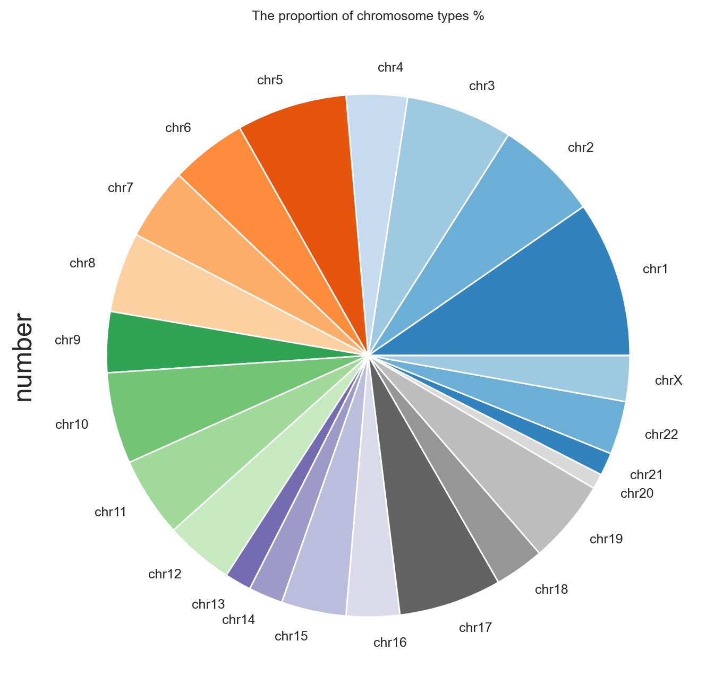
    


    
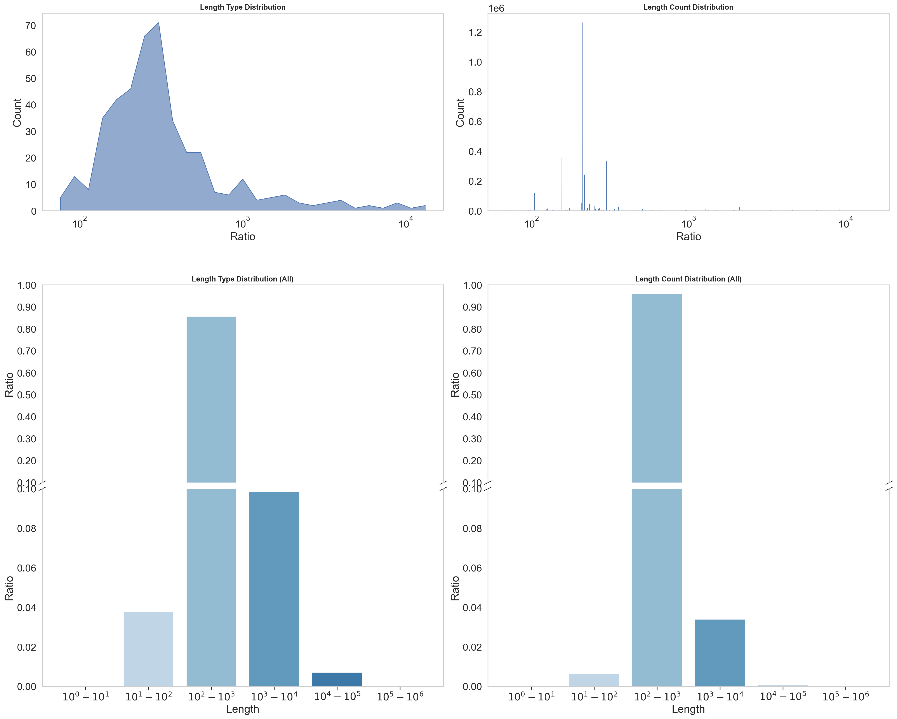
    


    
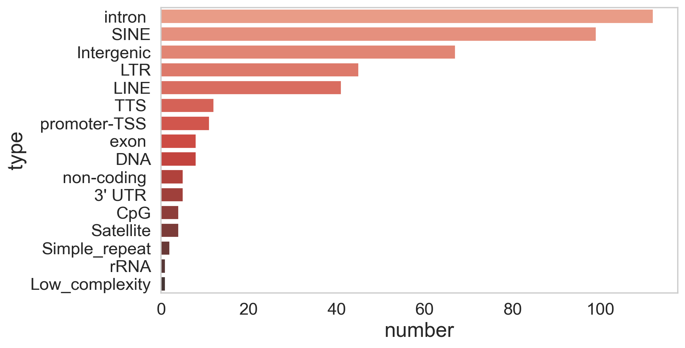
    


    	Plot homer anno distribution over!
    	Anno snp,se,e,eQTL Start!


    ***** WARNING: File ./data/nebula/circle-Map_real_data/SRR6315427/ecc_pipe_result/circlemap_result.analysis.bed has inconsistent naming convention for record:
    	2604	2754	1807	3959
    
    ***** WARNING: File ./data/nebula/circle-Map_real_data/SRR6315427/ecc_pipe_result/circlemap_result.analysis.bed has inconsistent naming convention for record:
    	2604	2754	1807	3959
    
    ***** WARNING: File ./data/nebula/circle-Map_real_data/SRR6315427/ecc_pipe_result/circlemap_result.analysis.bed has inconsistent naming convention for record:
    	2604	2754	1807	3959
    
    ***** WARNING: File ./data/nebula/circle-Map_real_data/SRR6315427/ecc_pipe_result/circlemap_result.analysis.bed has inconsistent naming convention for record:
    	2604	2754	1807	3959
    
    ***** WARNING: File ./data/nebula/circle-Map_real_data/SRR6315427/ecc_pipe_result/circlemap_result.analysis.bed has inconsistent naming convention for record:
    	2604	2754	1807	3959
    
    ***** WARNING: File ./data/nebula/circle-Map_real_data/SRR6315427/ecc_pipe_result/circlemap_result.analysis.bed has inconsistent naming convention for record:
    	2604	2754	1807	3959
    
    ***** WARNING: File ./data/nebula/circle-Map_real_data/SRR6315427/ecc_pipe_result/circlemap_result.analysis.bed has inconsistent naming convention for record:
    	2604	2754	1807	3959
    
    ***** WARNING: File ./data/nebula/circle-Map_real_data/SRR6315427/ecc_pipe_result/circlemap_result.analysis.bed has inconsistent naming convention for record:
    	2604	2754	1807	3959
    


    
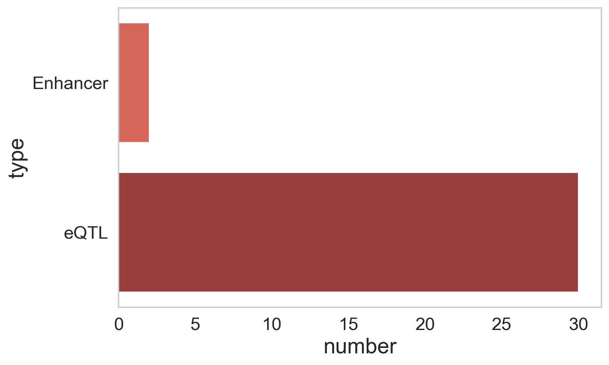
    


    	Anno snp,SuperEnhancer,Enhancer,eQTL End!
    	jinja2 report Start!
    	jinja2 report End!
    Run fast End!
    SRR6315428
    Run fast Start!
    	Make chr bed & QC start!
    	Make chr bed & QC over!
    	Plot Chr distribution Start!
    	Plot Chr distribution over!
    	Plot Length distribution Start!
    	Plot Length distribution over!
    	Plot homer anno distribution Start!


    
    	Peak file = ./data/nebula/circle-Map_real_data/SRR6315428/ecc_pipe_result/circlemap_result.analysis.bed
    	Genome = hg38
    	Organism = human
    	Peak/BED file conversion summary:
    		BED/Header formatted lines: 100
    		peakfile formatted lines: 0
    		Duplicated Peak IDs: 24
    
    	Peak File Statistics:
    		Total Peaks: 100
    		Redundant Peak IDs: 0
    		Peaks lacking information: 0 (need at least 5 columns per peak)
    		Peaks with misformatted coordinates: 0 (should be integer)
    		Peaks with misformatted strand: 0 (should be either +/- or 0/1)
    
    	Peak file looks good!
    
    	Reading Positions...
    	-----------------------
    	Finding Closest TSS...
    	Annotating:......................
    		Annotation	Number of peaks	Total size (bp)	Log2 Ratio (obs/exp)	LogP enrichment (+values depleted)
    		3UTR	1.0	26474262	0.172	-0.528
    		miRNA	0.0	91109	-0.004	0.003
    		ncRNA	0.0	6820614	-0.298	0.229
    		TTS	3.0	31727170	1.496	-2.392
    		pseudo	1.0	2069923	3.849	-2.702
    		Exon	0.0	36644103	-1.166	1.236
    		Intron	47.0	1239345362	0.178	-1.847
    		Intergenic	45.0	1601607813	-0.255	2.991
    		Promoter	3.0	35228595	1.345	-2.159
    		5UTR	0.0	2560784	-0.119	0.086
    		snoRNA	0.0	357	-0.000	0.000
    		scRNA	0.0	97	-0.000	0.000
    	NOTE: If this part takes more than 2 minutes, there is a good chance
    		your machine ran out of memory: consider hitting ctrl+C and rerunning
    		the command with "-noann"
    	To capture annotation stats in a file, use "-annStats <filename>" next time
    	Annotating:......................
    		Annotation	Number of peaks	Total size (bp)	Log2 Ratio (obs/exp)	LogP enrichment (+values depleted)
    		3UTR	1.0	26474262	0.173	-0.528
    		Retroposon	0.0	4001034	-0.182	0.134
    		RC?	0.0	59236	-0.003	0.002
    		RNA	0.0	107044	-0.005	0.004
    		miRNA	0.0	91109	-0.004	0.003
    		ncRNA	0.0	6820614	-0.298	0.229
    		TTS	3.0	31727170	1.497	-2.394
    		LINE	6.0	619516085	-1.791	10.147
    		srpRNA	0.0	258827	-0.012	0.009
    		SINE	34.0	373001706	1.444	-17.580
    		RC	0.0	355982	-0.017	0.012
    		tRNA	0.0	90622	-0.004	0.003
    		DNA?	0.0	418633	-0.020	0.014
    		pseudo	1.0	2069923	3.850	-2.703
    		DNA	4.0	97786340	0.288	-0.878
    		Exon	0.0	36644103	-1.166	1.236
    		Intron	21.0	646232435	-0.044	0.705
    		Intergenic	20.0	726186117	-0.283	1.678
    		Promoter	3.0	35228595	1.346	-2.160
    		5UTR	0.0	2560784	-0.119	0.086
    		snoRNA	0.0	357	-0.000	0.000
    		LTR?	0.0	1121352	-0.053	0.038
    		scRNA	0.0	119986	-0.006	0.004
    		CpG-Island	0.0	8754249	-0.372	0.294
    		Low_complexity	0.0	5308729	-0.237	0.178
    		LTR	7.0	253332031	-0.278	0.972
    		Simple_repeat	0.0	33134854	-1.086	1.117
    		snRNA	0.0	307380	-0.015	0.010
    		Unknown	0.0	707405	-0.034	0.024
    		SINE?	0.0	2674	-0.000	0.000
    		Satellite	0.0	71513810	-1.789	2.426
    		rRNA	0.0	169039	-0.008	0.006
    	Counting Tags in Peaks from each directory...
    	Organism: human
    	Loading Gene Informaiton...
    	Outputing Annotation File...
    	Done annotating peaks file
    


    
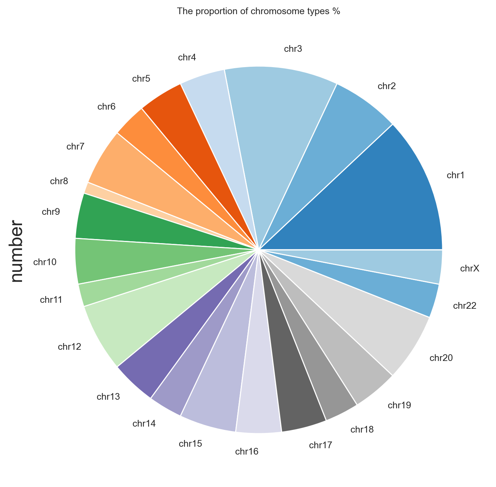
    


    
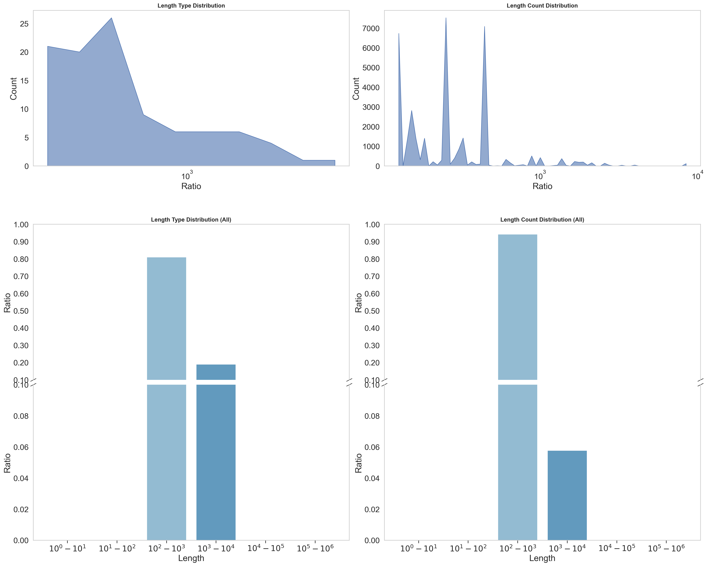
    


    
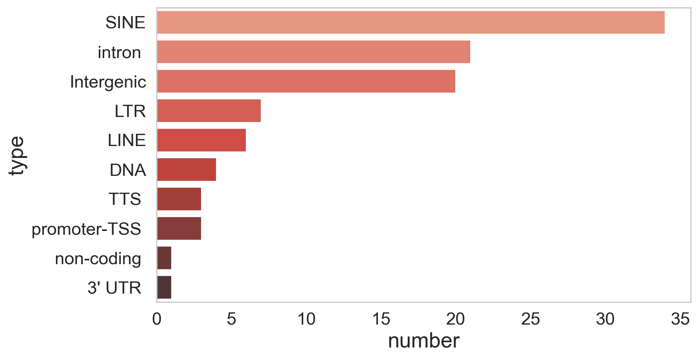
    


    	Plot homer anno distribution over!
    	Anno snp,se,e,eQTL Start!


    

    


    	Anno snp,SuperEnhancer,Enhancer,eQTL End!
    	jinja2 report Start!
    	jinja2 report End!
    Run fast End!
    SRR6315429
    Run fast Start!
    	Make chr bed & QC start!
    	Make chr bed & QC over!
    	Plot Chr distribution Start!
    	Plot Chr distribution over!
    	Plot Length distribution Start!
    	Plot Length distribution over!
    	Plot homer anno distribution Start!


    
    	Peak file = ./data/nebula/circle-Map_real_data/SRR6315429/ecc_pipe_result/circlemap_result.analysis.bed
    	Genome = hg38
    	Organism = human
    	Peak/BED file conversion summary:
    		BED/Header formatted lines: 671
    		peakfile formatted lines: 0
    		Duplicated Peak IDs: 274
    
    	Peak File Statistics:
    		Total Peaks: 671
    		Redundant Peak IDs: 0
    		Peaks lacking information: 0 (need at least 5 columns per peak)
    		Peaks with misformatted coordinates: 0 (should be integer)
    		Peaks with misformatted strand: 0 (should be either +/- or 0/1)
    
    	Peak file looks good!
    
    	Reading Positions...
    	-----------------------
    	Finding Closest TSS...
    	Annotating:.......................
    		Annotation	Number of peaks	Total size (bp)	Log2 Ratio (obs/exp)	LogP enrichment (+values depleted)
    		3UTR	11.0	26786192	0.891	-3.239
    		miRNA	0.0	97618	-0.031	0.022
    		ncRNA	1.0	6998912	-0.633	0.614
    		TTS	18.0	32227484	1.334	-7.785
    		pseudo	0.0	2085537	-0.548	0.462
    		Exon	22.0	37015031	1.424	-10.092
    		Intron	300.0	1253662019	0.111	-3.122
    		Intergenic	295.0	1631972721	-0.293	15.597
    		Promoter	21.0	35774823	1.406	-9.526
    		5UTR	3.0	2592085	2.385	-3.883
    		snoRNA	0.0	357	-0.000	0.000
    		scRNA	0.0	97	-0.000	0.000
    		rRNA	0.0	25562	-0.008	0.006
    	NOTE: If this part takes more than 2 minutes, there is a good chance
    		your machine ran out of memory: consider hitting ctrl+C and rerunning
    		the command with "-noann"
    	To capture annotation stats in a file, use "-annStats <filename>" next time
    	Annotating:.......................
    		Annotation	Number of peaks	Total size (bp)	Log2 Ratio (obs/exp)	LogP enrichment (+values depleted)
    		3UTR	11.0	26786192	0.891	-3.242
    		Retroposon	1.0	4044155	0.159	-0.525
    		RC?	0.0	59509	-0.019	0.013
    		RNA	0.0	107756	-0.034	0.024
    		miRNA	0.0	97618	-0.031	0.022
    		ncRNA	1.0	6998912	-0.632	0.614
    		TTS	18.0	32227484	1.335	-7.791
    		LINE	56.0	626703751	-1.309	40.527
    		srpRNA	1.0	261424	4.111	-2.878
    		SINE	192.0	377075025	1.202	-65.043
    		RC	0.0	359494	-0.110	0.080
    		tRNA	0.0	91111	-0.029	0.020
    		DNA?	0.0	422285	-0.129	0.093
    		pseudo	0.0	2085537	-0.548	0.462
    		DNA	12.0	98947449	-0.868	4.228
    		Exon	22.0	37015031	1.425	-10.099
    		Intron	129.0	654126650	-0.167	2.606
    		Intergenic	123.0	742668051	-0.419	9.465
    		Promoter	21.0	35774823	1.407	-9.533
    		5UTR	3.0	2592085	2.386	-3.885
    		snoRNA	0.0	357	-0.000	0.000
    		LTR?	0.0	1137225	-0.324	0.252
    		scRNA	0.0	121379	-0.038	0.027
    		CpG-Island	3.0	8917387	0.604	-1.151
    		Low_complexity	0.0	5394919	-1.135	1.195
    		LTR	60.0	257625099	0.073	-1.021
    		Simple_repeat	8.0	33811580	0.096	-0.747
    		snRNA	0.0	311793	-0.096	0.069
    		Unknown	0.0	713433	-0.212	0.158
    		SINE?	0.0	2674	-0.001	0.001
    		Satellite	10.0	74135823	-0.715	2.779
    		rRNA	0.0	199378	-0.062	0.044
    	Counting Tags in Peaks from each directory...
    	Organism: human
    	Loading Gene Informaiton...
    	Outputing Annotation File...
    	Done annotating peaks file
    


    
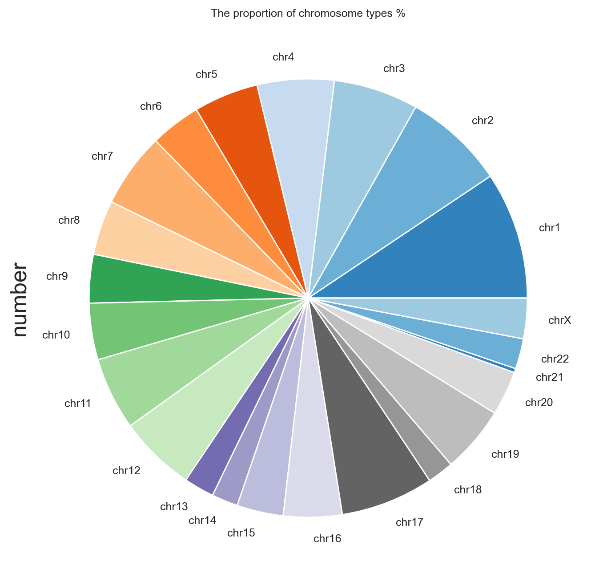
    


    
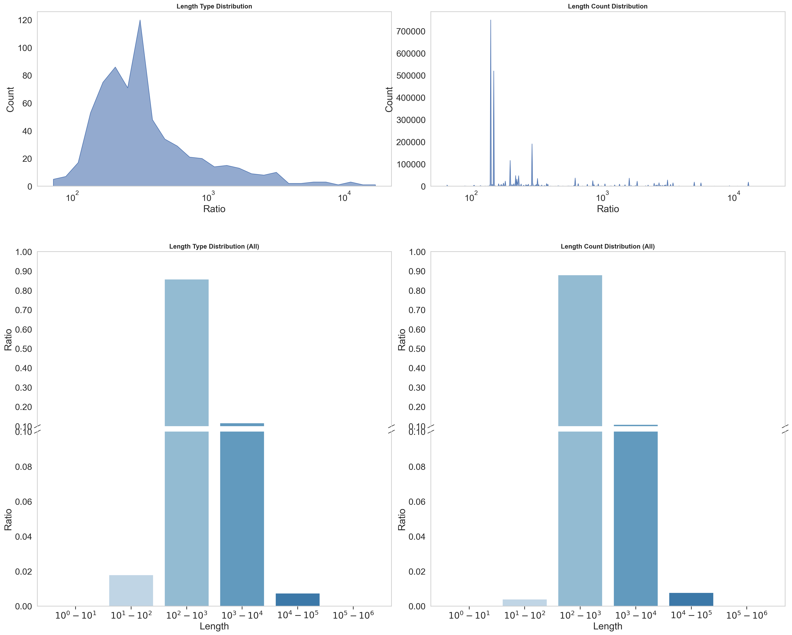
    


    
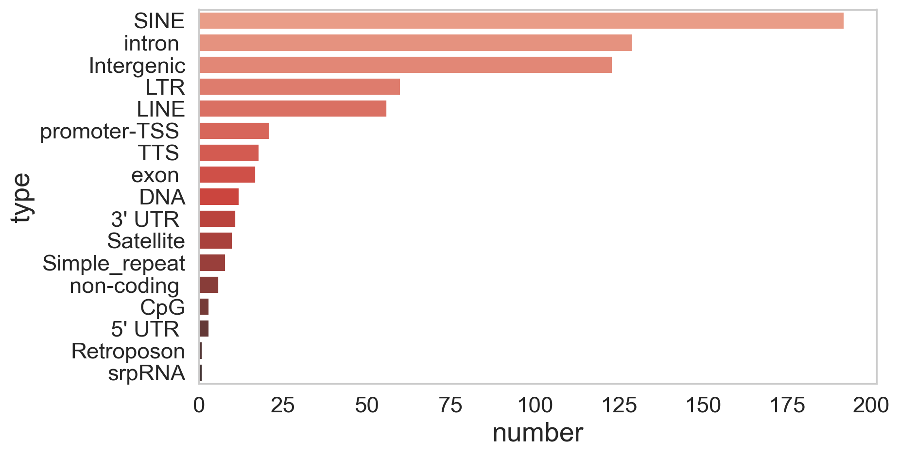
    


    	Plot homer anno distribution over!
    	Anno snp,se,e,eQTL Start!


    
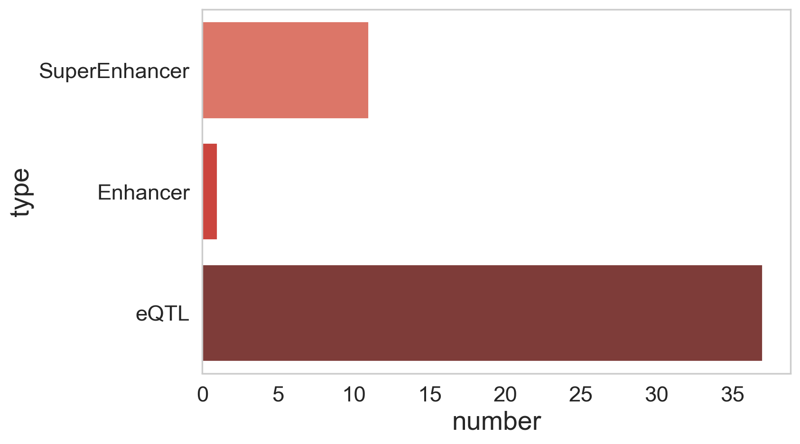
    


    	Anno snp,SuperEnhancer,Enhancer,eQTL End!
    	jinja2 report Start!
    	jinja2 report End!
    Run fast End!
    SRR6315430
    Run fast Start!
    	Make chr bed & QC start!
    	Make chr bed & QC over!
    	Plot Chr distribution Start!
    	Plot Chr distribution over!
    	Plot Length distribution Start!
    	Plot Length distribution over!
    	Plot homer anno distribution Start!


    
    	Peak file = ./data/nebula/circle-Map_real_data/SRR6315430/ecc_pipe_result/circlemap_result.analysis.bed
    	Genome = hg38
    	Organism = human
    	Peak/BED file conversion summary:
    		BED/Header formatted lines: 696
    		peakfile formatted lines: 0
    		Duplicated Peak IDs: 379
    
    	Peak File Statistics:
    		Total Peaks: 696
    		Redundant Peak IDs: 0
    		Peaks lacking information: 0 (need at least 5 columns per peak)
    		Peaks with misformatted coordinates: 0 (should be integer)
    		Peaks with misformatted strand: 0 (should be either +/- or 0/1)
    
    	Peak file looks good!
    
    	Reading Positions...
    	-----------------------
    	Finding Closest TSS...
    	Annotating:........................
    		Annotation	Number of peaks	Total size (bp)	Log2 Ratio (obs/exp)	LogP enrichment (+values depleted)
    		3UTR	3.0	26833139	-1.012	1.927
    		miRNA	0.0	97618	-0.031	0.022
    		ncRNA	3.0	7044070	0.917	-1.544
    		TTS	17.0	32404629	1.218	-6.567
    		pseudo	0.0	2111155	-0.562	0.476
    		Exon	21.0	37120946	1.327	-8.779
    		Intron	318.0	1257910936	0.165	-5.364
    		Intergenic	315.0	1684358172	-0.270	14.469
    		Promoter	17.0	35946139	1.068	-5.523
    		5UTR	2.0	2601483	1.769	-2.142
    		snoRNA	0.0	357	-0.000	0.000
    		scRNA	0.0	97	-0.000	0.000
    		rRNA	0.0	25562	-0.008	0.006
    	NOTE: If this part takes more than 2 minutes, there is a good chance
    		your machine ran out of memory: consider hitting ctrl+C and rerunning
    		the command with "-noann"
    	To capture annotation stats in a file, use "-annStats <filename>" next time
    	Annotating:........................
    		Annotation	Number of peaks	Total size (bp)	Log2 Ratio (obs/exp)	LogP enrichment (+values depleted)
    		3UTR	3.0	26833139	-1.011	1.925
    		Retroposon	1.0	4062585	0.127	-0.511
    		RC?	0.0	59773	-0.019	0.013
    		RNA	0.0	108000	-0.035	0.024
    		miRNA	0.0	97618	-0.031	0.022
    		ncRNA	3.0	7044070	0.918	-1.545
    		TTS	17.0	32404629	1.219	-6.572
    		LINE	49.0	633178497	-1.542	51.338
    		srpRNA	1.0	262214	4.081	-2.858
    		SINE	162.0	379673449	0.921	-34.685
    		RC	0.0	362795	-0.113	0.082
    		tRNA	0.0	91738	-0.030	0.021
    		DNA?	0.0	423197	-0.131	0.095
    		pseudo	0.0	2111155	-0.562	0.476
    		DNA	19.0	99395597	-0.238	1.297
    		Exon	21.0	37120946	1.328	-8.786
    		Intron	172.0	656103354	0.218	-4.169
    		Intergenic	141.0	780868131	-0.320	6.850
    		Promoter	17.0	35946139	1.069	-5.528
    		5UTR	2.0	2601483	1.770	-2.142
    		snoRNA	0.0	357	-0.000	0.000
    		LTR?	0.0	1140409	-0.330	0.257
    		scRNA	0.0	121638	-0.039	0.027
    		CpG-Island	7.0	9000269	1.787	-5.336
    		Low_complexity	1.0	5480212	-0.305	0.431
    		LTR	75.0	262167686	0.344	-3.877
    		Simple_repeat	5.0	34754537	-0.648	1.583
    		snRNA	0.0	314325	-0.099	0.071
    		Unknown	0.0	714206	-0.215	0.161
    		SINE?	0.0	2674	-0.001	0.001
    		Satellite	0.0	75387841	-4.203	17.202
    		rRNA	0.0	202619	-0.064	0.046
    	Counting Tags in Peaks from each directory...
    	Organism: human
    	Loading Gene Informaiton...
    	Outputing Annotation File...
    	Done annotating peaks file
    


    
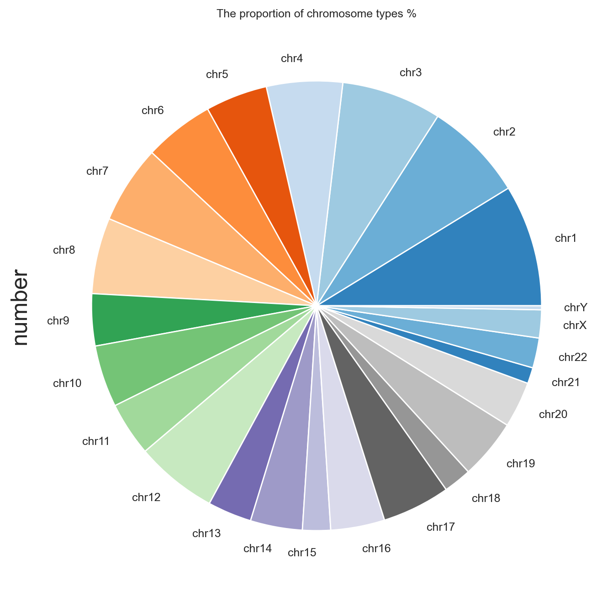
    


    
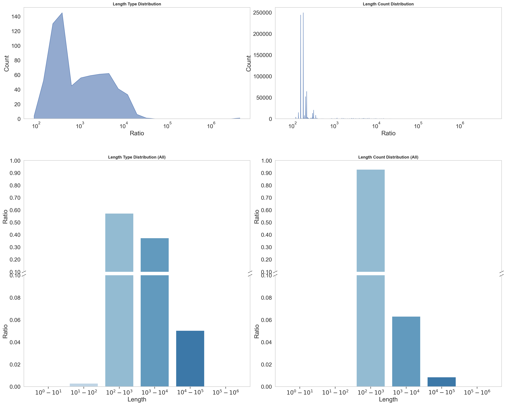
    


    
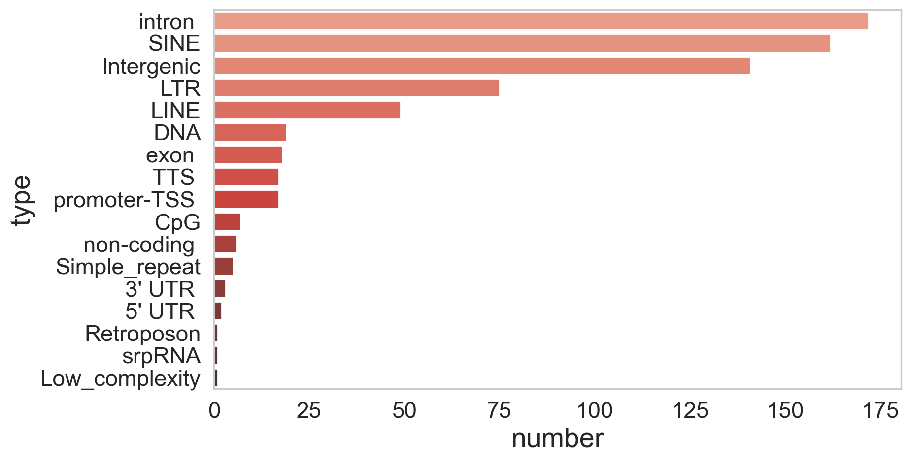
    


    	Plot homer anno distribution over!
    	Anno snp,se,e,eQTL Start!


    
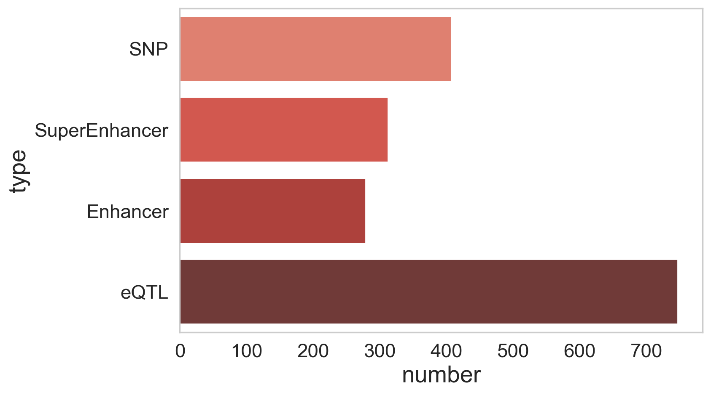
    


    	Anno snp,SuperEnhancer,Enhancer,eQTL End!
    	jinja2 report Start!
    	jinja2 report End!
    Run fast End!
    SRR6315431
    Run fast Start!
    	Make chr bed & QC start!
    	Make chr bed & QC over!
    	Plot Chr distribution Start!
    	Plot Chr distribution over!
    	Plot Length distribution Start!
    	Plot Length distribution over!
    	Plot homer anno distribution Start!


    
    	Peak file = ./data/nebula/circle-Map_real_data/SRR6315431/ecc_pipe_result/circlemap_result.analysis.bed
    	Genome = hg38
    	Organism = human
    	Peak/BED file conversion summary:
    		BED/Header formatted lines: 1426
    		peakfile formatted lines: 0
    		Duplicated Peak IDs: 987
    
    	Peak File Statistics:
    		Total Peaks: 1426
    		Redundant Peak IDs: 0
    		Peaks lacking information: 0 (need at least 5 columns per peak)
    		Peaks with misformatted coordinates: 0 (should be integer)
    		Peaks with misformatted strand: 0 (should be either +/- or 0/1)
    
    	Peak file looks good!
    
    	Reading Positions...
    	-----------------------
    	Finding Closest TSS...
    	Annotating:........................
    		Annotation	Number of peaks	Total size (bp)	Log2 Ratio (obs/exp)	LogP enrichment (+values depleted)
    		3UTR	21.0	26833139	0.760	-4.162
    		miRNA	0.0	97618	-0.064	0.045
    		ncRNA	6.0	7044070	0.883	-2.194
    		TTS	23.0	32404629	0.619	-3.460
    		pseudo	1.0	2111155	0.036	-0.473
    		Exon	25.0	37120946	0.544	-3.143
    		Intron	669.0	1257910936	0.203	-13.440
    		Intergenic	646.0	1684358172	-0.269	27.282
    		Promoter	34.0	35946139	1.034	-9.136
    		5UTR	1.0	2601483	-0.265	0.413
    		snoRNA	0.0	357	-0.000	0.000
    		scRNA	0.0	97	-0.000	0.000
    		rRNA	0.0	25562	-0.017	0.012
    	NOTE: If this part takes more than 2 minutes, there is a good chance
    		your machine ran out of memory: consider hitting ctrl+C and rerunning
    		the command with "-noann"
    	To capture annotation stats in a file, use "-annStats <filename>" next time
    	Annotating:........................
    		Annotation	Number of peaks	Total size (bp)	Log2 Ratio (obs/exp)	LogP enrichment (+values depleted)
    		3UTR	21.0	26833139	0.761	-4.167
    		Retroposon	1.0	4062585	-0.908	0.820
    		RC?	0.0	59773	-0.039	0.028
    		RNA	0.0	108000	-0.070	0.050
    		miRNA	0.0	97618	-0.064	0.045
    		ncRNA	6.0	7044070	0.883	-2.196
    		TTS	23.0	32404629	0.620	-3.465
    		LINE	141.0	633178497	-1.052	61.034
    		srpRNA	0.0	262214	-0.165	0.121
    		SINE	335.0	379673449	0.934	-70.977
    		RC	0.0	362795	-0.223	0.168
    		tRNA	0.0	91738	-0.060	0.042
    		DNA?	0.0	423197	-0.258	0.195
    		pseudo	1.0	2111155	0.037	-0.473
    		DNA	47.0	99395597	0.034	-0.788
    		Exon	25.0	37120946	0.544	-3.147
    		Intron	339.0	656103354	0.162	-4.469
    		Intergenic	273.0	780868131	-0.401	17.568
    		Promoter	34.0	35946139	1.034	-9.145
    		5UTR	1.0	2601483	-0.265	0.412
    		snoRNA	0.0	357	-0.000	0.000
    		LTR?	1.0	1140409	0.925	-0.893
    		scRNA	0.0	121638	-0.079	0.056
    		CpG-Island	10.0	9000269	1.267	-4.576
    		Low_complexity	4.0	5480212	0.660	-1.391
    		LTR	150.0	262167686	0.309	-5.447
    		Simple_repeat	10.0	34754537	-0.682	2.596
    		snRNA	0.0	314325	-0.196	0.145
    		Unknown	0.0	714206	-0.411	0.330
    		SINE?	0.0	2674	-0.002	0.001
    		Satellite	4.0	75387841	-3.122	24.013
    		rRNA	0.0	202619	-0.129	0.094
    	Counting Tags in Peaks from each directory...
    	Organism: human
    	Loading Gene Informaiton...
    	Outputing Annotation File...
    	Done annotating peaks file
    


    
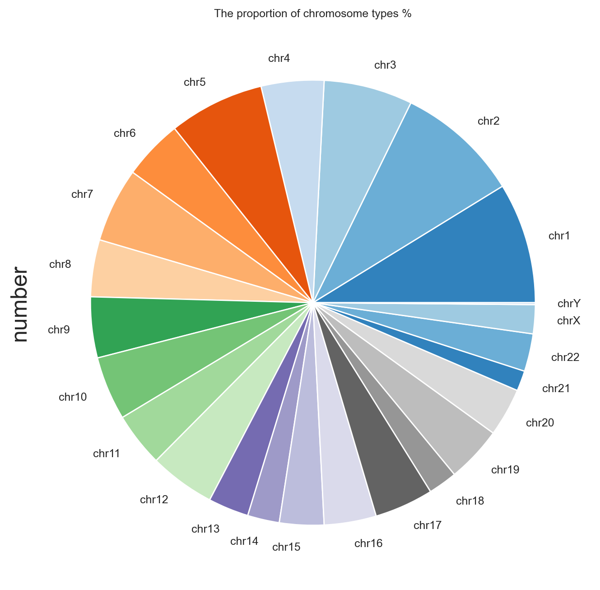
    


    
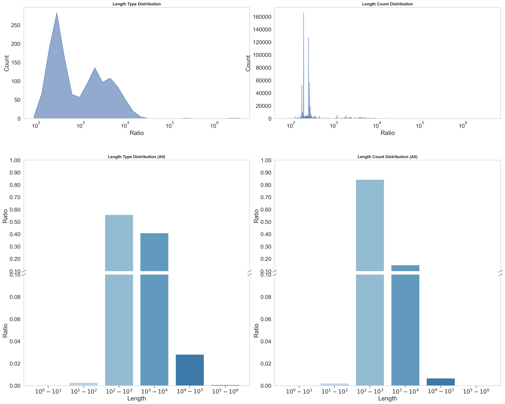
    


    
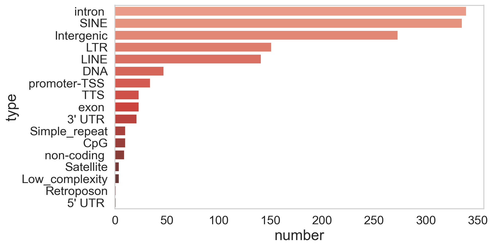
    


    	Plot homer anno distribution over!
    	Anno snp,se,e,eQTL Start!


    
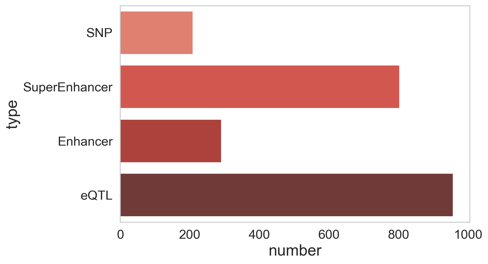
    


    	Anno snp,SuperEnhancer,Enhancer,eQTL End!
    	jinja2 report Start!
    	jinja2 report End!
    Run fast End!
    SRR6315432
    Run fast Start!
    	Make chr bed & QC start!
    	Make chr bed & QC over!
    	Plot Chr distribution Start!
    	Plot Chr distribution over!
    	Plot Length distribution Start!
    	Plot Length distribution over!
    	Plot homer anno distribution Start!


    
    	Peak file = ./data/nebula/circle-Map_real_data/SRR6315432/ecc_pipe_result/circlemap_result.analysis.bed
    	Genome = hg38
    	Organism = human
    	Peak/BED file conversion summary:
    		BED/Header formatted lines: 1558
    		peakfile formatted lines: 0
    		Duplicated Peak IDs: 945
    
    	Peak File Statistics:
    		Total Peaks: 1558
    		Redundant Peak IDs: 0
    		Peaks lacking information: 0 (need at least 5 columns per peak)
    		Peaks with misformatted coordinates: 0 (should be integer)
    		Peaks with misformatted strand: 0 (should be either +/- or 0/1)
    
    	Peak file looks good!
    
    	Reading Positions...
    	-----------------------
    	Finding Closest TSS...
    	Annotating:........................
    		Annotation	Number of peaks	Total size (bp)	Log2 Ratio (obs/exp)	LogP enrichment (+values depleted)
    		3UTR	17.0	26833139	0.328	-1.584
    		miRNA	0.0	97618	-0.069	0.049
    		ncRNA	5.0	7044070	0.492	-1.255
    		TTS	27.0	32404629	0.723	-4.671
    		pseudo	1.0	2111155	-0.092	0.340
    		Exon	38.0	37120946	1.020	-9.829
    		Intron	727.0	1257910936	0.195	-13.508
    		Intergenic	715.0	1684358172	-0.250	26.236
    		Promoter	28.0	35946139	0.626	-3.998
    		5UTR	0.0	2601483	-1.211	1.314
    		snoRNA	0.0	357	-0.000	0.000
    		scRNA	0.0	97	-0.000	0.000
    		rRNA	0.0	25562	-0.018	0.013
    	NOTE: If this part takes more than 2 minutes, there is a good chance
    		your machine ran out of memory: consider hitting ctrl+C and rerunning
    		the command with "-noann"
    	To capture annotation stats in a file, use "-annStats <filename>" next time
    	Annotating:........................
    		Annotation	Number of peaks	Total size (bp)	Log2 Ratio (obs/exp)	LogP enrichment (+values depleted)
    		3UTR	17.0	26833139	0.329	-1.587
    		Retroposon	2.0	4062585	-0.035	0.411
    		RC?	0.0	59773	-0.043	0.030
    		RNA	0.0	108000	-0.077	0.054
    		miRNA	0.0	97618	-0.069	0.049
    		ncRNA	5.0	7044070	0.493	-1.256
    		TTS	27.0	32404629	0.724	-4.677
    		LINE	148.0	633178497	-1.110	71.789
    		srpRNA	0.0	262214	-0.179	0.132
    		SINE	414.0	379673449	1.112	-119.088
    		RC	0.0	362795	-0.243	0.183
    		tRNA	0.0	91738	-0.065	0.046
    		DNA?	0.0	423197	-0.279	0.214
    		pseudo	1.0	2111155	-0.091	0.340
    		DNA	45.0	99395597	-0.156	1.361
    		Exon	38.0	37120946	1.021	-9.839
    		Intron	362.0	656103354	0.129	-3.489
    		Intergenic	304.0	780868131	-0.374	16.985
    		Promoter	28.0	35946139	0.627	-4.004
    		5UTR	0.0	2601483	-1.210	1.313
    		snoRNA	0.0	357	-0.000	0.000
    		LTR?	1.0	1140409	0.797	-0.827
    		scRNA	0.0	121638	-0.086	0.061
    		CpG-Island	11.0	9000269	1.276	-4.959
    		Low_complexity	0.0	5480212	-1.915	2.767
    		LTR	136.0	262167686	0.040	-0.967
    		Simple_repeat	11.0	34754537	-0.673	2.714
    		snRNA	0.0	314325	-0.212	0.159
    		Unknown	0.0	714206	-0.444	0.360
    		SINE?	0.0	2674	-0.002	0.001
    		Satellite	8.0	75387841	-2.249	19.601
    		rRNA	0.0	202619	-0.140	0.102
    	Counting Tags in Peaks from each directory...
    	Organism: human
    	Loading Gene Informaiton...
    	Outputing Annotation File...
    	Done annotating peaks file
    


    
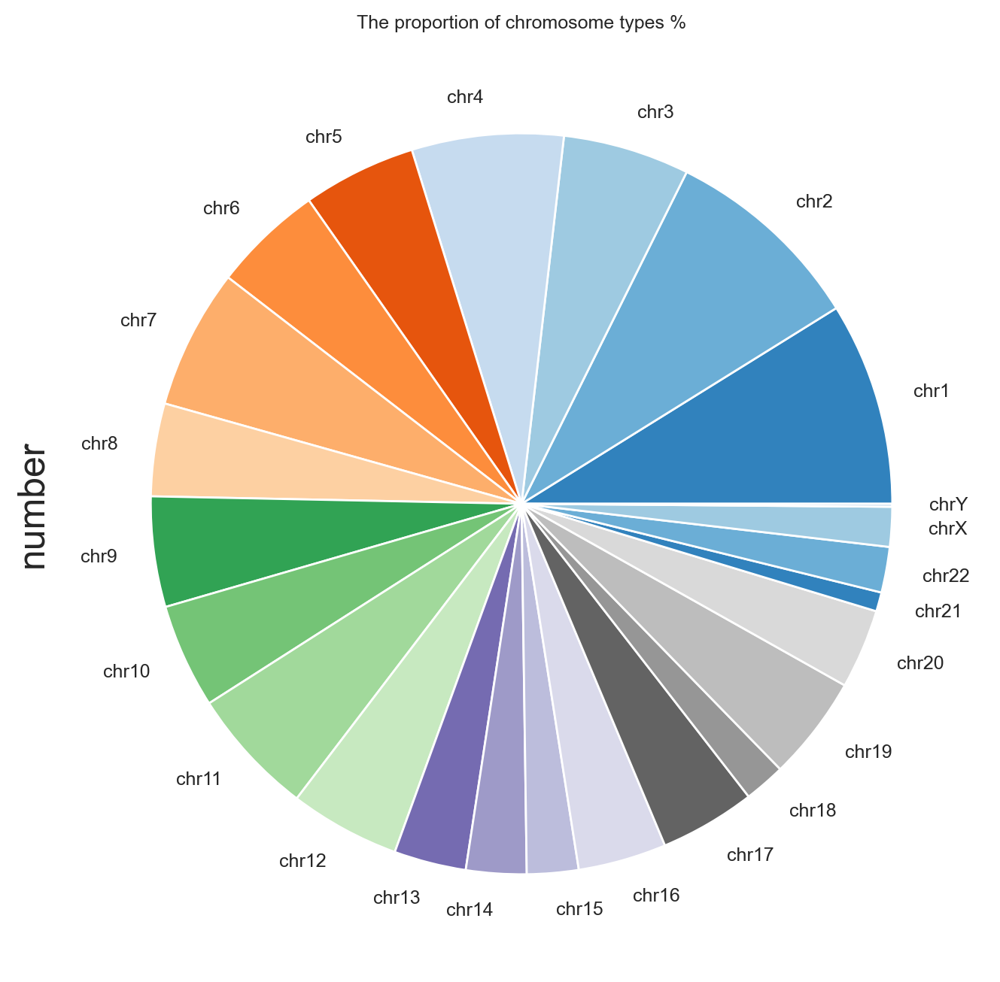
    


    
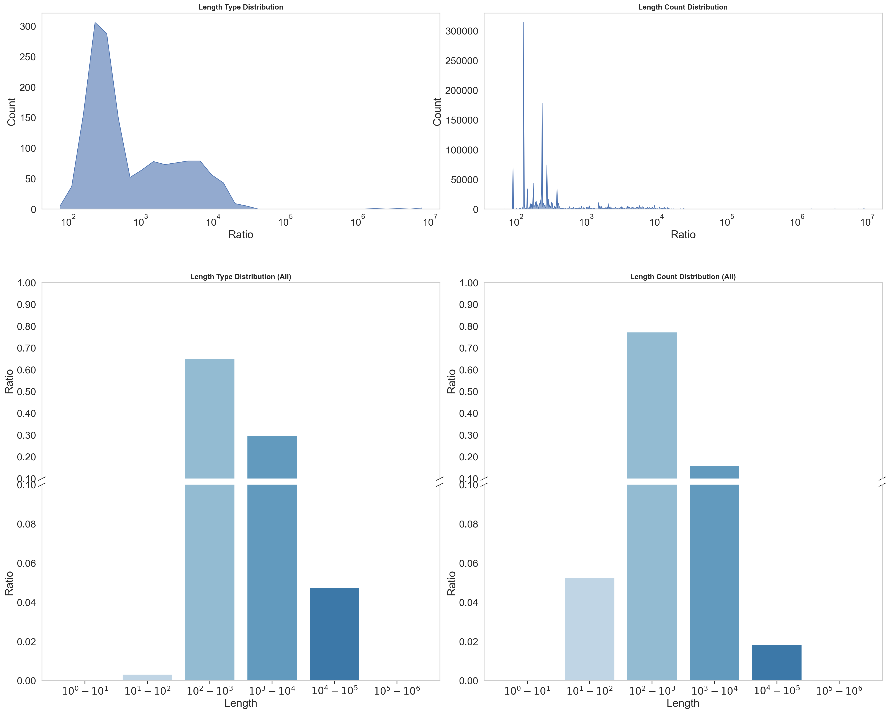
    


    
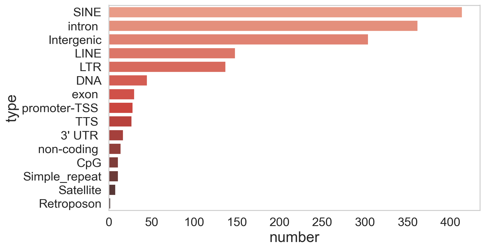
    


    	Plot homer anno distribution over!
    	Anno snp,se,e,eQTL Start!


    
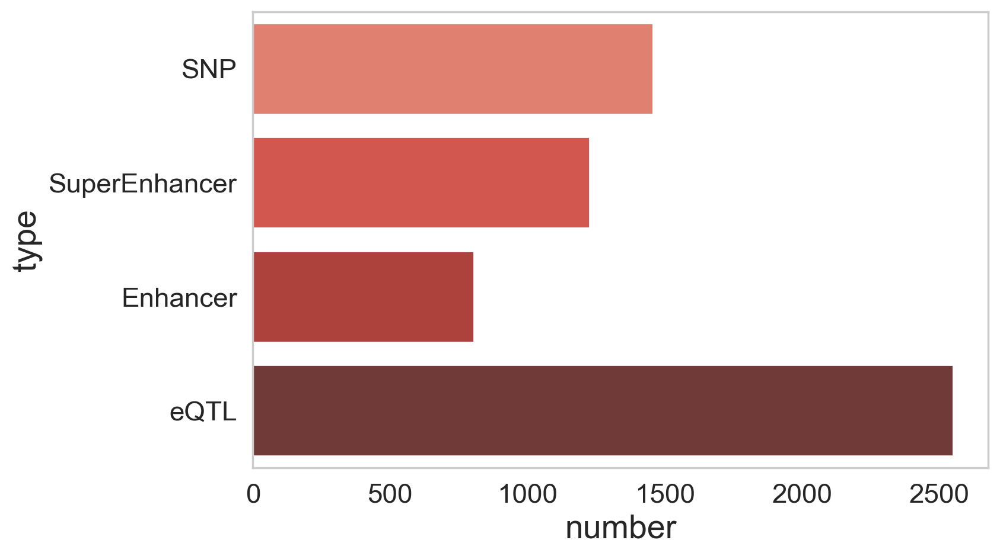
    


    	Anno snp,SuperEnhancer,Enhancer,eQTL End!
    	jinja2 report Start!
    	jinja2 report End!
    Run fast End!
    SRR6315433
    Run fast Start!
    	Make chr bed & QC start!
    	Make chr bed & QC over!
    	Plot Chr distribution Start!
    	Plot Chr distribution over!
    	Plot Length distribution Start!
    	Plot Length distribution over!
    	Plot homer anno distribution Start!


    
    	Peak file = ./data/nebula/circle-Map_real_data/SRR6315433/ecc_pipe_result/circlemap_result.analysis.bed
    	Genome = hg38
    	Organism = human
    	Peak/BED file conversion summary:
    		BED/Header formatted lines: 1338
    		peakfile formatted lines: 1
    		Duplicated Peak IDs: 811
    
    	Peak File Statistics:
    		Total Peaks: 1339
    		Redundant Peak IDs: 0
    		Peaks lacking information: 0 (need at least 5 columns per peak)
    		Peaks with misformatted coordinates: 0 (should be integer)
    		Peaks with misformatted strand: 0 (should be either +/- or 0/1)
    
    	Peak file looks good!
    
    	Reading Positions...
    	-----------------------
    	Finding Closest TSS...
    	Annotating:........................
    		Annotation	Number of peaks	Total size (bp)	Log2 Ratio (obs/exp)	LogP enrichment (+values depleted)
    		3UTR	9.0	26833139	-0.370	1.291
    		miRNA	0.0	97618	-0.060	0.042
    		ncRNA	5.0	7044070	0.711	-1.642
    		TTS	31.0	32404629	1.142	-9.769
    		pseudo	1.0	2111155	0.128	-0.511
    		Exon	26.0	37120946	0.692	-4.307
    		Intron	638.0	1257910936	0.226	-15.558
    		Intergenic	596.0	1684358172	-0.293	29.719
    		Promoter	30.0	35946139	0.945	-7.262
    		5UTR	2.0	2601483	0.827	-1.168
    		snoRNA	0.0	357	-0.000	0.000
    		scRNA	0.0	97	-0.000	0.000
    		rRNA	0.0	25562	-0.016	0.011
    	NOTE: If this part takes more than 2 minutes, there is a good chance
    		your machine ran out of memory: consider hitting ctrl+C and rerunning
    		the command with "-noann"
    	To capture annotation stats in a file, use "-annStats <filename>" next time
    	Annotating:........................
    		Annotation	Number of peaks	Total size (bp)	Log2 Ratio (obs/exp)	LogP enrichment (+values depleted)
    		3UTR	9.0	26833139	-0.369	1.289
    		Retroposon	3.0	4062585	0.769	-1.352
    		RC?	0.0	59773	-0.037	0.026
    		RNA	0.0	108000	-0.066	0.047
    		miRNA	0.0	97618	-0.060	0.042
    		ncRNA	5.0	7044070	0.712	-1.643
    		TTS	31.0	32404629	1.143	-9.778
    		LINE	101.0	633178497	-1.442	88.646
    		srpRNA	0.0	262214	-0.155	0.114
    		SINE	425.0	379673449	1.369	-177.614
    		RC	1.0	362795	2.669	-1.928
    		tRNA	0.0	91738	-0.056	0.040
    		DNA?	0.0	423197	-0.243	0.183
    		pseudo	1.0	2111155	0.129	-0.512
    		DNA	35.0	99395597	-0.299	2.133
    		Exon	26.0	37120946	0.693	-4.313
    		Intron	286.0	656103354	0.009	-0.766
    		Intergenic	224.0	780868131	-0.595	30.908
    		Promoter	30.0	35946139	0.946	-7.270
    		5UTR	2.0	2601483	0.827	-1.168
    		snoRNA	0.0	357	-0.000	0.000
    		LTR?	1.0	1140409	1.017	-0.942
    		scRNA	0.0	121638	-0.074	0.053
    		CpG-Island	16.0	9000269	2.037	-12.593
    		Low_complexity	0.0	5480212	-1.756	2.377
    		LTR	128.0	262167686	0.172	-2.431
    		Simple_repeat	6.0	34754537	-1.328	4.945
    		snRNA	0.0	314325	-0.184	0.136
    		Unknown	0.0	714206	-0.389	0.309
    		SINE?	0.0	2674	-0.002	0.001
    		Satellite	8.0	75387841	-2.030	15.344
    		rRNA	0.0	202619	-0.121	0.088
    	Counting Tags in Peaks from each directory...
    	Organism: human
    	Loading Gene Informaiton...
    	Outputing Annotation File...
    	Done annotating peaks file
    


    
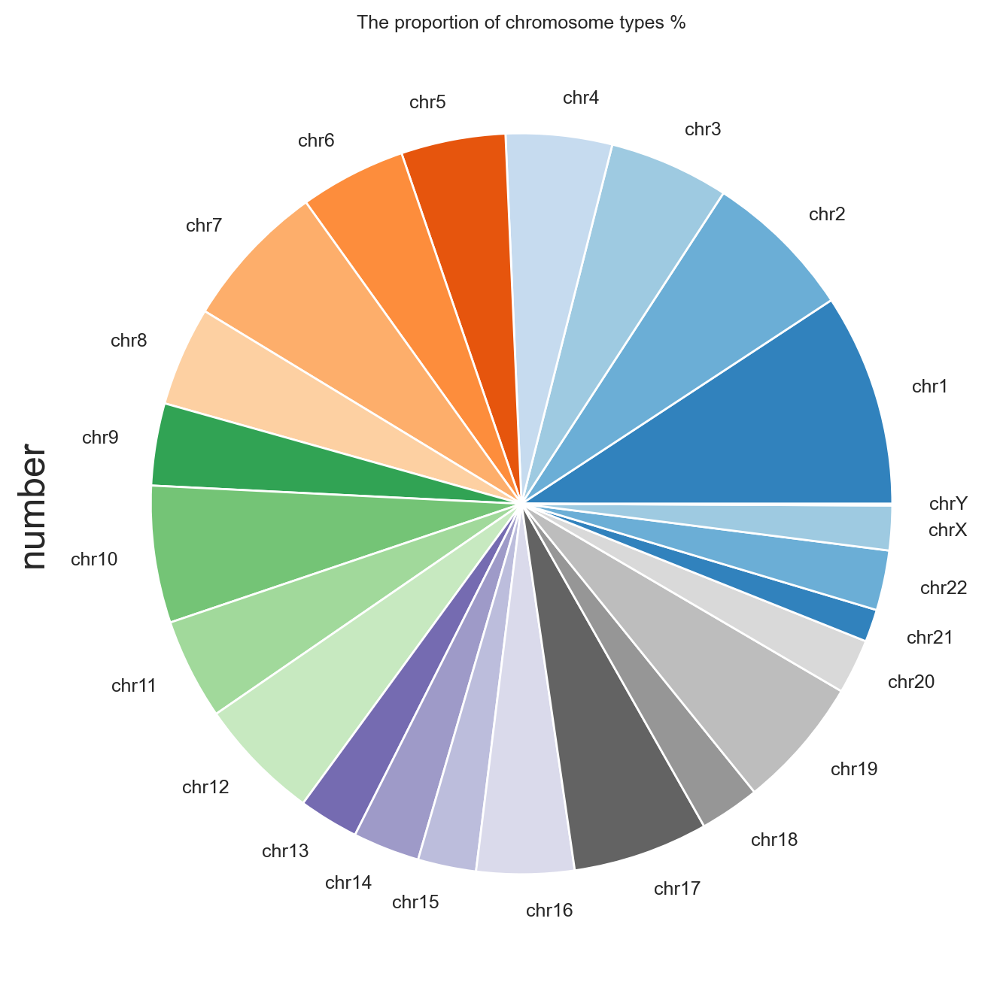
    


    
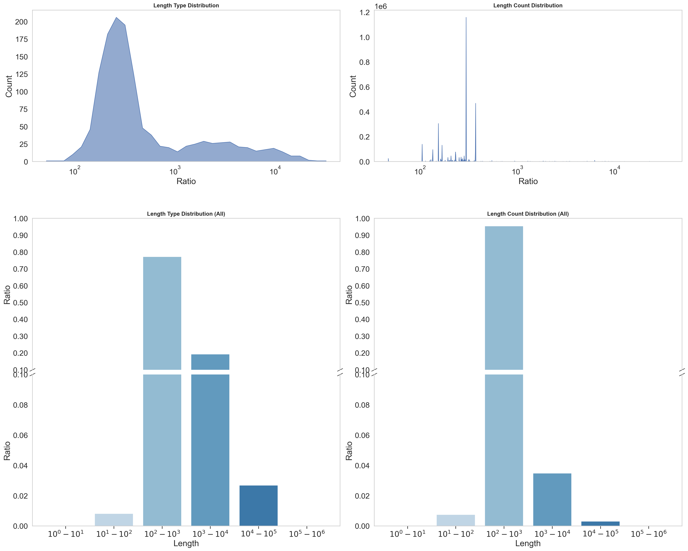
    


    
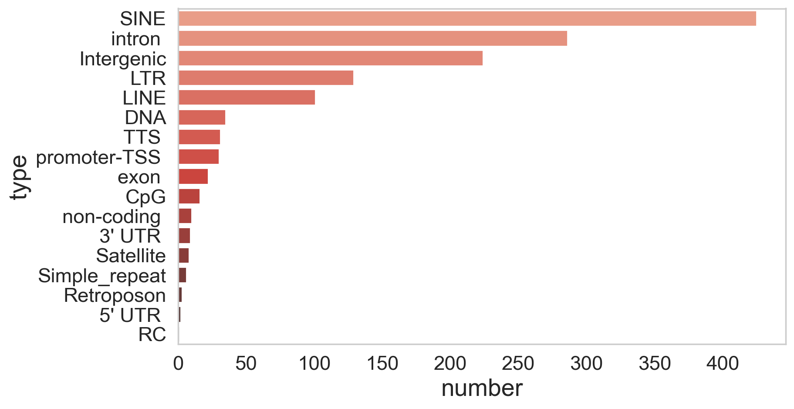
    


    	Plot homer anno distribution over!
    	Anno snp,se,e,eQTL Start!


    
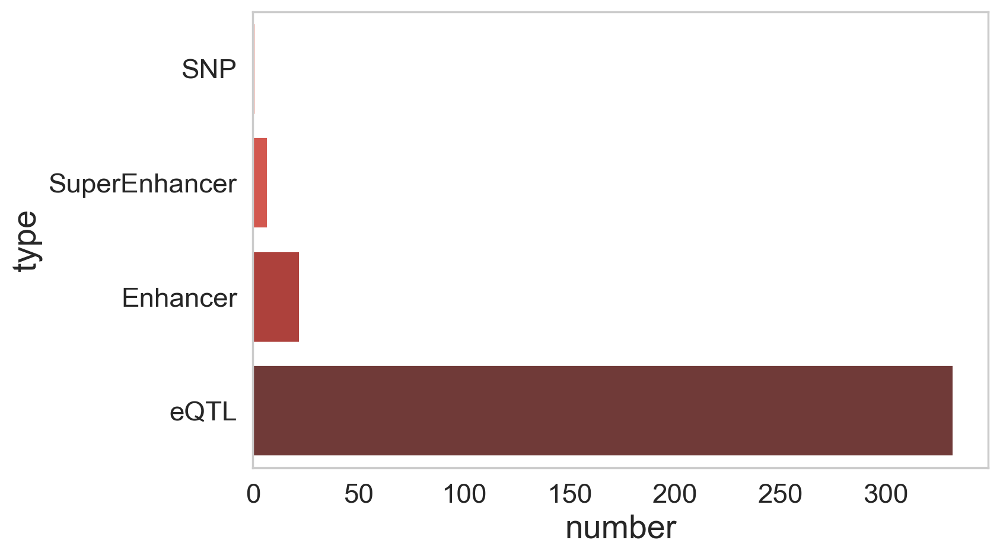
    


    	Anno snp,SuperEnhancer,Enhancer,eQTL End!
    	jinja2 report Start!
    	jinja2 report End!
    Run fast End!
    SRR6315434
    Run fast Start!
    	Make chr bed & QC start!
    	Make chr bed & QC over!
    	Plot Chr distribution Start!
    	Plot Chr distribution over!
    	Plot Length distribution Start!
    	Plot Length distribution over!
    	Plot homer anno distribution Start!


    
    	Peak file = ./data/nebula/circle-Map_real_data/SRR6315434/ecc_pipe_result/circlemap_result.analysis.bed
    	Genome = hg38
    	Organism = human
    	Peak/BED file conversion summary:
    		BED/Header formatted lines: 1602
    		peakfile formatted lines: 0
    		Duplicated Peak IDs: 964
    
    	Peak File Statistics:
    		Total Peaks: 1602
    		Redundant Peak IDs: 0
    		Peaks lacking information: 0 (need at least 5 columns per peak)
    		Peaks with misformatted coordinates: 0 (should be integer)
    		Peaks with misformatted strand: 0 (should be either +/- or 0/1)
    
    	Peak file looks good!
    
    	Reading Positions...
    	-----------------------
    	Finding Closest TSS...
    	Annotating:........................
    		Annotation	Number of peaks	Total size (bp)	Log2 Ratio (obs/exp)	LogP enrichment (+values depleted)
    		3UTR	26.0	26833139	0.901	-6.062
    		miRNA	0.0	97618	-0.071	0.051
    		ncRNA	5.0	7044070	0.452	-1.190
    		TTS	28.0	32404629	0.735	-4.900
    		pseudo	1.0	2111155	-0.132	0.356
    		Exon	39.0	37120946	1.017	-10.005
    		Intron	766.0	1257910936	0.230	-18.846
    		Intergenic	702.0	1684358172	-0.317	40.023
    		Promoter	30.0	35946139	0.685	-4.704
    		5UTR	5.0	2601483	1.889	-4.395
    		snoRNA	0.0	357	-0.000	0.000
    		scRNA	0.0	97	-0.000	0.000
    		rRNA	0.0	25562	-0.019	0.013
    	NOTE: If this part takes more than 2 minutes, there is a good chance
    		your machine ran out of memory: consider hitting ctrl+C and rerunning
    		the command with "-noann"
    	To capture annotation stats in a file, use "-annStats <filename>" next time
    	Annotating:........................
    		Annotation	Number of peaks	Total size (bp)	Log2 Ratio (obs/exp)	LogP enrichment (+values depleted)
    		3UTR	26.0	26833139	0.901	-6.069
    		Retroposon	0.0	4062585	-1.637	2.109
    		RC?	0.0	59773	-0.044	0.031
    		RNA	1.0	108000	4.158	-2.910
    		miRNA	0.0	97618	-0.071	0.051
    		ncRNA	5.0	7044070	0.452	-1.191
    		TTS	28.0	32404629	0.736	-4.907
    		LINE	145.0	633178497	-1.180	80.407
    		srpRNA	0.0	262214	-0.184	0.136
    		SINE	428.0	379673449	1.120	-124.576
    		RC	1.0	362795	2.410	-1.763
    		tRNA	0.0	91738	-0.067	0.048
    		DNA?	0.0	423197	-0.286	0.220
    		pseudo	1.0	2111155	-0.131	0.356
    		DNA	45.0	99395597	-0.196	1.625
    		Exon	39.0	37120946	1.018	-10.016
    		Intron	378.0	656103354	0.151	-4.391
    		Intergenic	292.0	780868131	-0.472	25.285
    		Promoter	30.0	35946139	0.686	-4.710
    		5UTR	5.0	2601483	1.889	-4.397
    		snoRNA	0.0	357	-0.000	0.000
    		LTR?	0.0	1140409	-0.671	0.592
    		scRNA	0.0	121638	-0.088	0.063
    		CpG-Island	19.0	9000269	2.025	-14.530
    		Low_complexity	0.0	5480212	-1.944	2.846
    		LTR	143.0	262167686	0.072	-1.282
    		Simple_repeat	13.0	34754537	-0.472	1.969
    		snRNA	0.0	314325	-0.218	0.163
    		Unknown	0.0	714206	-0.455	0.371
    		SINE?	0.0	2674	-0.002	0.001
    		Satellite	3.0	75387841	-3.704	30.239
    		rRNA	0.0	202619	-0.144	0.105
    	Counting Tags in Peaks from each directory...
    	Organism: human
    	Loading Gene Informaiton...
    	Outputing Annotation File...
    	Done annotating peaks file
    


    
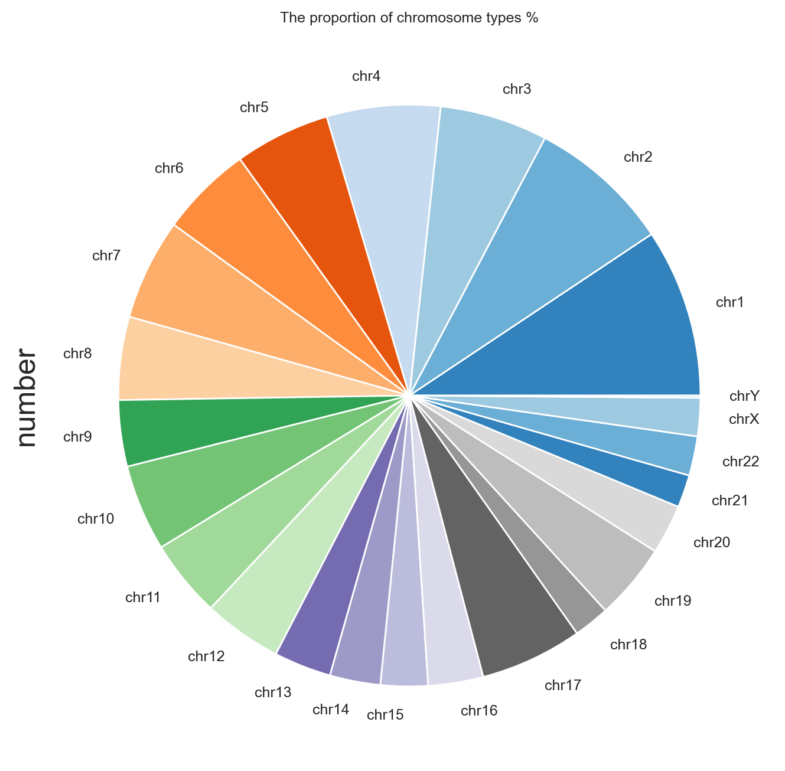
    


    
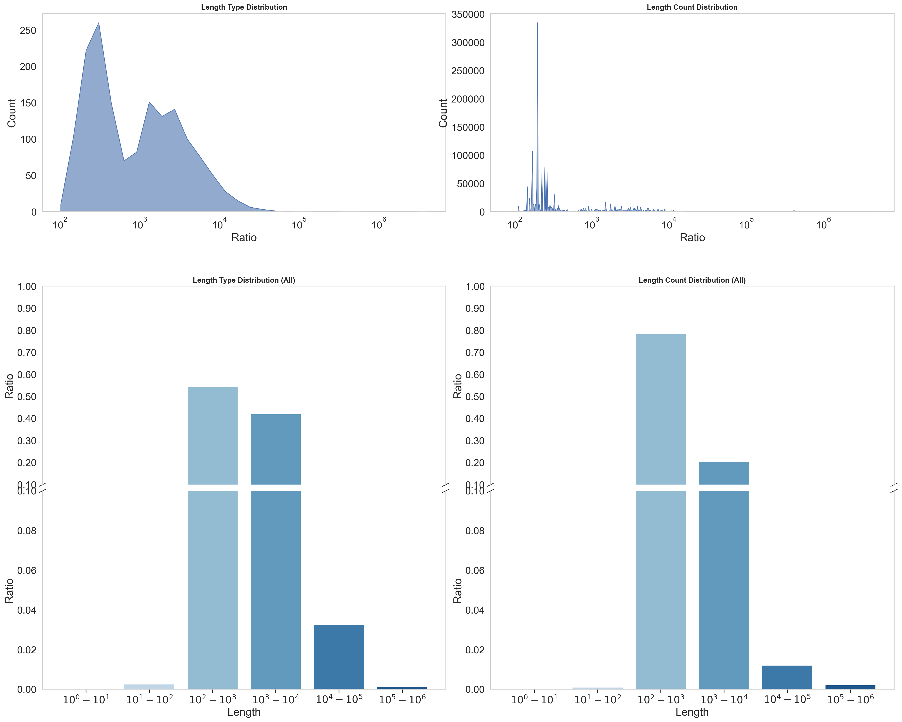
    


    
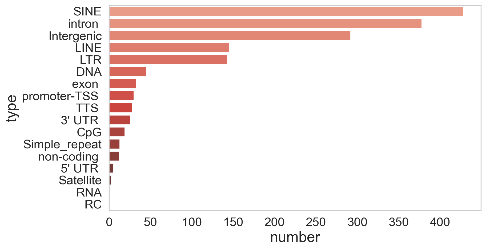
    


    	Plot homer anno distribution over!
    	Anno snp,se,e,eQTL Start!


    
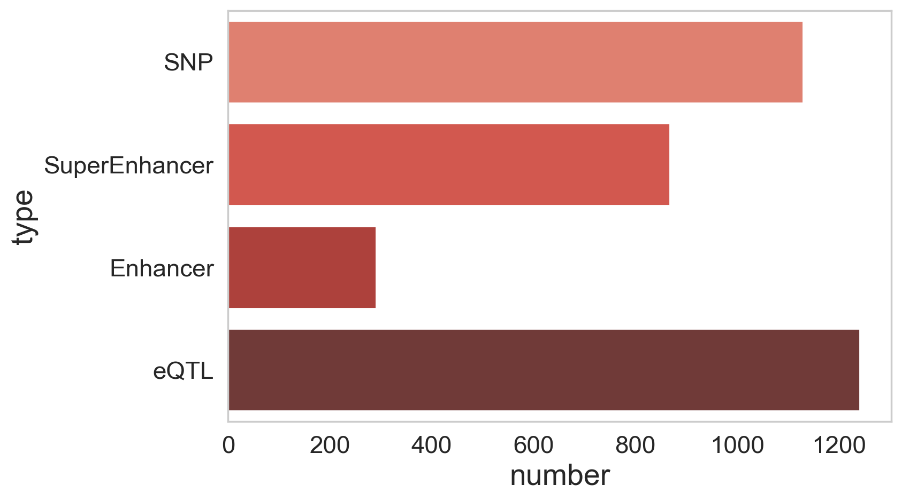
    


    	Anno snp,SuperEnhancer,Enhancer,eQTL End!
    	jinja2 report Start!
    	jinja2 report End!
    Run fast End!
    SRR6315393
    Run fast Start!
    	Make chr bed & QC start!
    	Make chr bed & QC over!
    	Plot Chr distribution Start!
    	Plot Chr distribution over!
    	Plot Length distribution Start!
    	Plot Length distribution over!
    	Plot homer anno distribution Start!


    
    	Peak file = ./data/nebula/circle-Map_real_data/SRR6315393/ecc_pipe_result/circlemap_result.analysis.bed
    	Genome = hg38
    	Organism = human
    	Peak/BED file conversion summary:
    		BED/Header formatted lines: 233
    		peakfile formatted lines: 0
    		Duplicated Peak IDs: 82
    
    	Peak File Statistics:
    		Total Peaks: 233
    		Redundant Peak IDs: 0
    		Peaks lacking information: 0 (need at least 5 columns per peak)
    		Peaks with misformatted coordinates: 0 (should be integer)
    		Peaks with misformatted strand: 0 (should be either +/- or 0/1)
    
    	Peak file looks good!
    
    	Reading Positions...
    	-----------------------
    	Finding Closest TSS...
    	Annotating:........................
    		Annotation	Number of peaks	Total size (bp)	Log2 Ratio (obs/exp)	LogP enrichment (+values depleted)
    		3UTR	3.0	26833139	0.567	-1.108
    		miRNA	0.0	97618	-0.011	0.007
    		ncRNA	2.0	7044070	1.911	-2.304
    		TTS	7.0	32404629	1.517	-4.401
    		pseudo	1.0	2111155	2.650	-1.915
    		Exon	9.0	37120946	1.683	-6.088
    		Intron	105.0	1257910936	0.145	-2.282
    		Intergenic	99.0	1684358172	-0.361	8.862
    		Promoter	5.0	35946139	0.882	-1.981
    		5UTR	2.0	2601483	3.348	-4.082
    		snoRNA	0.0	357	-0.000	0.000
    		scRNA	0.0	97	-0.000	0.000
    		rRNA	0.0	25562	-0.003	0.002
    	NOTE: If this part takes more than 2 minutes, there is a good chance
    		your machine ran out of memory: consider hitting ctrl+C and rerunning
    		the command with "-noann"
    	To capture annotation stats in a file, use "-annStats <filename>" next time
    	Annotating:........................
    		Annotation	Number of peaks	Total size (bp)	Log2 Ratio (obs/exp)	LogP enrichment (+values depleted)
    		3UTR	3.0	26833139	0.567	-1.109
    		Retroposon	1.0	4062585	1.706	-1.331
    		RC?	0.0	59773	-0.006	0.005
    		RNA	0.0	108000	-0.012	0.008
    		miRNA	0.0	97618	-0.011	0.007
    		ncRNA	2.0	7044070	1.912	-2.305
    		TTS	7.0	32404629	1.518	-4.403
    		LINE	14.0	633178497	-1.771	21.436
    		srpRNA	0.0	262214	-0.028	0.020
    		SINE	59.0	379673449	1.042	-16.949
    		RC	0.0	362795	-0.039	0.027
    		tRNA	0.0	91738	-0.010	0.007
    		DNA?	0.0	423197	-0.045	0.032
    		pseudo	1.0	2111155	2.650	-1.915
    		DNA	6.0	99395597	-0.322	0.981
    		Exon	9.0	37120946	1.684	-6.091
    		Intron	48.0	656103354	-0.045	0.816
    		Intergenic	52.0	780868131	-0.180	1.791
    		Promoter	5.0	35946139	0.882	-1.982
    		5UTR	2.0	2601483	3.349	-4.083
    		snoRNA	0.0	357	-0.000	0.000
    		LTR?	0.0	1140409	-0.119	0.086
    		scRNA	0.0	121638	-0.013	0.009
    		CpG-Island	1.0	9000269	0.558	-0.706
    		Low_complexity	1.0	5480212	1.274	-1.082
    		LTR	21.0	262167686	0.086	-0.866
    		Simple_repeat	0.0	34754537	-1.869	2.637
    		snRNA	0.0	314325	-0.034	0.024
    		Unknown	0.0	714206	-0.076	0.054
    		SINE?	0.0	2674	-0.000	0.000
    		Satellite	1.0	75387841	-2.508	3.837
    		rRNA	0.0	202619	-0.022	0.015
    	Counting Tags in Peaks from each directory...
    	Organism: human
    	Loading Gene Informaiton...
    	Outputing Annotation File...
    	Done annotating peaks file
    


    
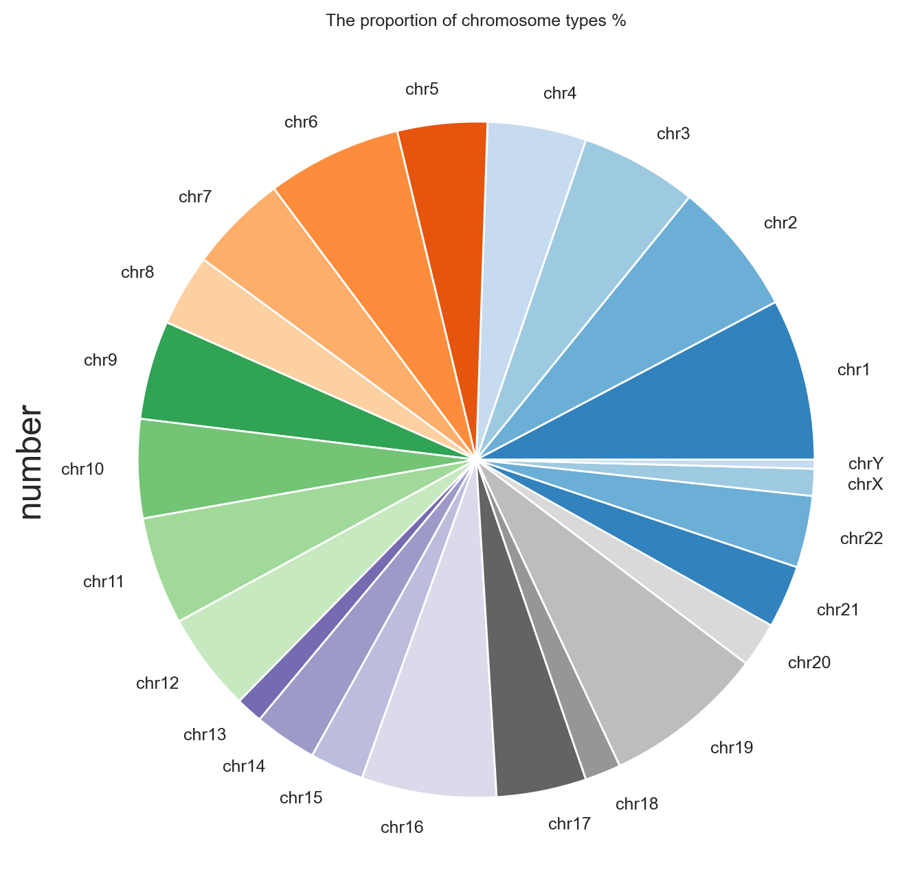
    


    
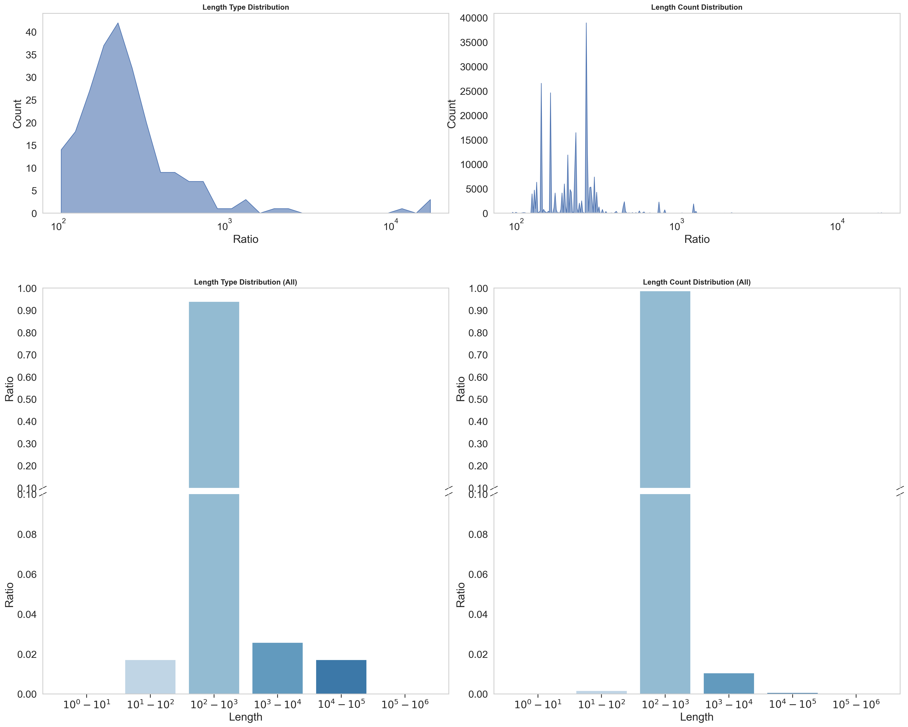
    


    
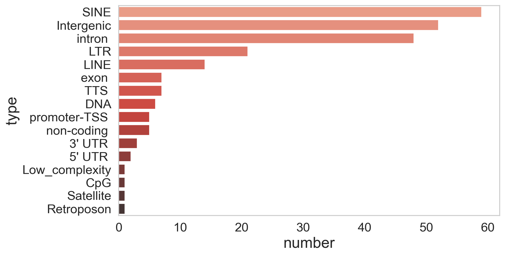
    


    	Plot homer anno distribution over!
    	Anno snp,se,e,eQTL Start!


    
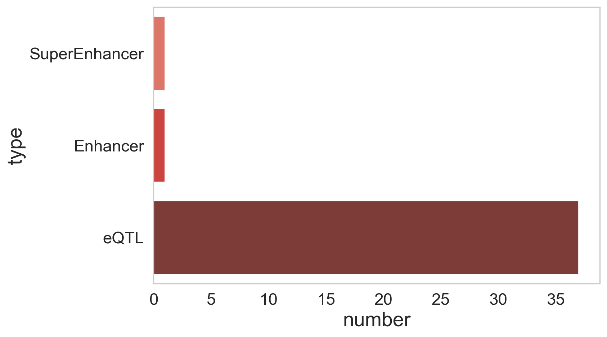
    


    	Anno snp,SuperEnhancer,Enhancer,eQTL End!
    	jinja2 report Start!
    	jinja2 report End!
    Run fast End!


```python
## Length Distribution
def get_ecc_length_ecc(_list, path_share, tool='circlemap'):
    """
    _list: group ,list 
    path_share: share path ,str
    """
    result_df = pd.DataFrame()
    for index, name in enumerate(_list):
        df = pd.read_csv(path_share+'/'+name+'/ecc_pipe_result/circlemap_qc.txt', sep='\t')
        middle_df = df.loc[:, ['Length']]
        middle_df['type'] = name
        result_df = pd.concat([result_df, middle_df], axis=0)
    return result_df
```


```python
path_share = './data/nebula/circle-Map_real_data/'
dis_df = get_ecc_length_ecc(_list, path_share)
# dis_df['sample'] = dis_df['type'].map(lambda x: _dict[x])
dis_df.head()
```


<div>
<style scoped>
    .dataframe tbody tr th:only-of-type {
        vertical-align: middle;
    }

    .dataframe tbody tr th {
        vertical-align: top;
    }

    .dataframe thead th {
        text-align: right;
    }
</style>
<table border="1" class="dataframe">
  <thead>
    <tr style="text-align: right;">
      <th></th>
      <th>Length</th>
      <th>type</th>
    </tr>
  </thead>
  <tbody>
    <tr>
      <th>0</th>
      <td>167</td>
      <td>SRR6315393</td>
    </tr>
    <tr>
      <th>1</th>
      <td>176</td>
      <td>SRR6315393</td>
    </tr>
    <tr>
      <th>2</th>
      <td>110</td>
      <td>SRR6315393</td>
    </tr>
    <tr>
      <th>3</th>
      <td>168</td>
      <td>SRR6315393</td>
    </tr>
    <tr>
      <th>4</th>
      <td>230</td>
      <td>SRR6315393</td>
    </tr>
  </tbody>
</table>
</div>


```python
# my_color_list = sns.color_palette("tab20")
# print(my_color_list)
```


```python
save = './output/Fig3/circlemap_len_dis.4000.1.pdf'
show_list = _list[:21]
color_list = [(0.12156862745098039, 0.4666666666666667, 0.7058823529411765), (0.6823529411764706, 0.7803921568627451, 0.9098039215686274), (1.0, 0.4980392156862745, 0.054901960784313725), (1.0, 0.7333333333333333, 0.47058823529411764), (0.17254901960784313, 0.6274509803921569, 0.17254901960784313), (0.596078431372549, 0.8745098039215686, 0.5411764705882353), (0.8392156862745098, 0.15294117647058825, 0.1568627450980392), (1.0, 0.596078431372549, 0.5882352941176471), (0.5803921568627451, 0.403921568627451, 0.7411764705882353), (0.7725490196078432, 0.6901960784313725, 0.8352941176470589), (0.5490196078431373, 0.33725490196078434, 0.29411764705882354), (0.7686274509803922, 0.611764705882353, 0.5803921568627451), (0.8901960784313725, 0.4666666666666667, 0.7607843137254902), (0.9686274509803922, 0.7137254901960784, 0.8235294117647058), (0.4980392156862745, 0.4980392156862745, 0.4980392156862745), (0.7803921568627451, 0.7803921568627451, 0.7803921568627451), (0.7372549019607844, 0.7411764705882353, 0.13333333333333333), (0.8588235294117647, 0.8588235294117647, 0.5529411764705883), (0.09019607843137255, 0.7450980392156863, 0.8117647058823529), (0.6196078431372549, 0.8549019607843137, 0.8980392156862745)
             ,'#ffc168']
fig, ax = plt.subplots(figsize=(12,5))

dis_df_subset = dis_df[dis_df['Length']<6000]
for index,value in enumerate(show_list):
    xi = dis_df_subset[dis_df_subset['type'].isin([value])]['Length']
    sns.histplot(xi,
             element="poly",stat='density',
             thresh=10**6,alpha=0.5, ax=ax, color=color_list[index])
ax.set_xlim([0,6000])

plt.legend(labels=show_list, fontsize='xx-small')
if save != 'None':
    fig.savefig(save, bbox_inches='tight')
```


    
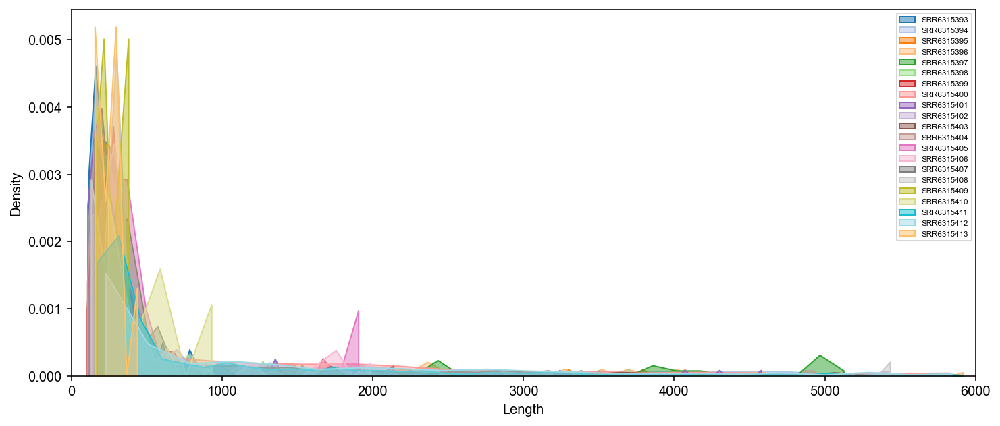
    


```python
save = './output/Fig3/circlemap_len_dis.4000.2.pdf'
show_list = _list[21:42]
color_list = [(0.12156862745098039, 0.4666666666666667, 0.7058823529411765), (0.6823529411764706, 0.7803921568627451, 0.9098039215686274), (1.0, 0.4980392156862745, 0.054901960784313725), (1.0, 0.7333333333333333, 0.47058823529411764), (0.17254901960784313, 0.6274509803921569, 0.17254901960784313), (0.596078431372549, 0.8745098039215686, 0.5411764705882353), (0.8392156862745098, 0.15294117647058825, 0.1568627450980392), (1.0, 0.596078431372549, 0.5882352941176471), (0.5803921568627451, 0.403921568627451, 0.7411764705882353), (0.7725490196078432, 0.6901960784313725, 0.8352941176470589), (0.5490196078431373, 0.33725490196078434, 0.29411764705882354), (0.7686274509803922, 0.611764705882353, 0.5803921568627451), (0.8901960784313725, 0.4666666666666667, 0.7607843137254902), (0.9686274509803922, 0.7137254901960784, 0.8235294117647058), (0.4980392156862745, 0.4980392156862745, 0.4980392156862745), (0.7803921568627451, 0.7803921568627451, 0.7803921568627451), (0.7372549019607844, 0.7411764705882353, 0.13333333333333333), (0.8588235294117647, 0.8588235294117647, 0.5529411764705883), (0.09019607843137255, 0.7450980392156863, 0.8117647058823529), (0.6196078431372549, 0.8549019607843137, 0.8980392156862745)
             ,'#ffc168']
fig, ax = plt.subplots(figsize=(12,5))

dis_df_subset = dis_df[dis_df['Length']<6000]
for index,value in enumerate(show_list):
    xi = dis_df_subset[dis_df_subset['type'].isin([value])]['Length']
    sns.histplot(xi,
             element="poly",stat='density',
             thresh=10**6,alpha=0.5, ax=ax, color=color_list[index])

ax.set_xlim([0,6000])
plt.legend(labels=show_list, fontsize='xx-small')
if save != 'None':
    plt.savefig(save, bbox_inches='tight')
```


    
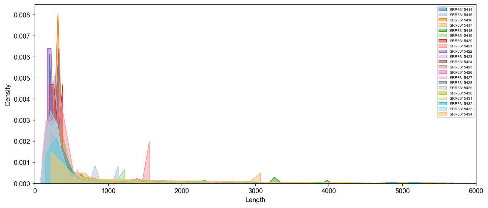
    


```python
save = './output/Fig3/circlemap_len_dis.all.1.pdf'
show_list = _list[:21]
color_list = [(0.12156862745098039, 0.4666666666666667, 0.7058823529411765), (0.6823529411764706, 0.7803921568627451, 0.9098039215686274), (1.0, 0.4980392156862745, 0.054901960784313725), (1.0, 0.7333333333333333, 0.47058823529411764), (0.17254901960784313, 0.6274509803921569, 0.17254901960784313), (0.596078431372549, 0.8745098039215686, 0.5411764705882353), (0.8392156862745098, 0.15294117647058825, 0.1568627450980392), (1.0, 0.596078431372549, 0.5882352941176471), (0.5803921568627451, 0.403921568627451, 0.7411764705882353), (0.7725490196078432, 0.6901960784313725, 0.8352941176470589), (0.5490196078431373, 0.33725490196078434, 0.29411764705882354), (0.7686274509803922, 0.611764705882353, 0.5803921568627451), (0.8901960784313725, 0.4666666666666667, 0.7607843137254902), (0.9686274509803922, 0.7137254901960784, 0.8235294117647058), (0.4980392156862745, 0.4980392156862745, 0.4980392156862745), (0.7803921568627451, 0.7803921568627451, 0.7803921568627451), (0.7372549019607844, 0.7411764705882353, 0.13333333333333333), (0.8588235294117647, 0.8588235294117647, 0.5529411764705883), (0.09019607843137255, 0.7450980392156863, 0.8117647058823529), (0.6196078431372549, 0.8549019607843137, 0.8980392156862745)
             ,'#ffc168']
fig, ax = plt.subplots(figsize=(12,5))

dis_df_subset = dis_df[dis_df['Length']<30000]
for index,value in enumerate(show_list):
    xi = dis_df_subset[dis_df_subset['type'].isin([value])]['Length']
    sns.histplot(xi,
             element="poly",stat='density',
             thresh=10**6,alpha=0.5, ax=ax, color=color_list[index])

ax.set(xlim=(0, 30000))
plt.legend(labels=show_list, fontsize='xx-small')
if save != 'None':
    plt.savefig(save, bbox_inches='tight')
```


    
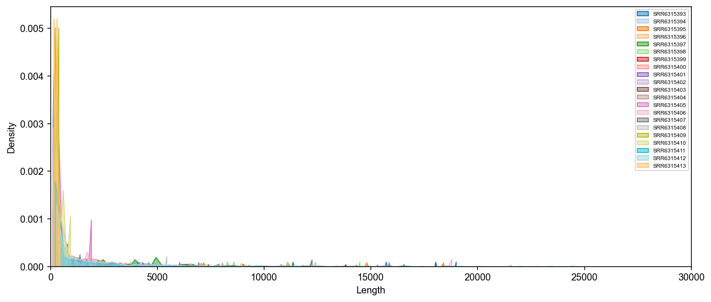
    


```python
save = './output/Fig3/circlemap_len_dis.all.2.pdf'
show_list = _list[21:42]
color_list = [(0.12156862745098039, 0.4666666666666667, 0.7058823529411765), (0.6823529411764706, 0.7803921568627451, 0.9098039215686274), (1.0, 0.4980392156862745, 0.054901960784313725), (1.0, 0.7333333333333333, 0.47058823529411764), (0.17254901960784313, 0.6274509803921569, 0.17254901960784313), (0.596078431372549, 0.8745098039215686, 0.5411764705882353), (0.8392156862745098, 0.15294117647058825, 0.1568627450980392), (1.0, 0.596078431372549, 0.5882352941176471), (0.5803921568627451, 0.403921568627451, 0.7411764705882353), (0.7725490196078432, 0.6901960784313725, 0.8352941176470589), (0.5490196078431373, 0.33725490196078434, 0.29411764705882354), (0.7686274509803922, 0.611764705882353, 0.5803921568627451), (0.8901960784313725, 0.4666666666666667, 0.7607843137254902), (0.9686274509803922, 0.7137254901960784, 0.8235294117647058), (0.4980392156862745, 0.4980392156862745, 0.4980392156862745), (0.7803921568627451, 0.7803921568627451, 0.7803921568627451), (0.7372549019607844, 0.7411764705882353, 0.13333333333333333), (0.8588235294117647, 0.8588235294117647, 0.5529411764705883), (0.09019607843137255, 0.7450980392156863, 0.8117647058823529), (0.6196078431372549, 0.8549019607843137, 0.8980392156862745)
             ,'#ffc168']
fig, ax = plt.subplots(figsize=(12,5))

dis_df_subset = dis_df[dis_df['Length']<30000]
for index,value in enumerate(show_list):
    xi = dis_df_subset[dis_df_subset['type'].isin([value])]['Length']
    sns.histplot(xi,
             element="poly",stat='density',
             thresh=10**6,alpha=0.5, ax=ax, color=color_list[index])

ax.set(xlim=(0, 30000))
plt.legend(labels=show_list, fontsize='xx-small')
if save != 'None':
    plt.savefig(save, bbox_inches='tight')
```


    
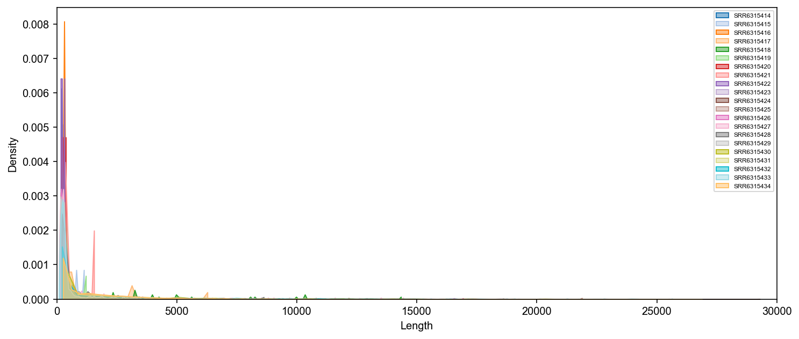
    


```python
## chromtin ratio
def get_ecc_chrom_ratio(_list, path_share, tool='circlemap'):
    """
    _list: group ,list 
    path_share: share path ,str
    """
    result_df = pd.DataFrame()
    for index, name in enumerate(_list):
        middle_df = pd.read_csv(path_share+'/'+name+'/ecc_pipe_result/01.chr_distrbution/'+tool+'_chr_distribution.csv',
                         sep=',', index_col=0)
        _sum = middle_df['number'].sum()
        middle_df['number'] = middle_df['number'].map(lambda x: x/_sum)
        middle_df.columns = [name]
        result_df = pd.concat([result_df, middle_df], axis=1)
    result_df = result_df.fillna(0)
    ##rank by chr number
    result_df = result_df.reindex(['chr'+str(i+1) for i in range(22)]+['chrX', 'chrY'])
    return result_df
```


```python
def plot_chrom_barplot(df_count, save='None'):
    
    fig=plt.figure(figsize=(12, 12))
    x = df_count.index
    width = 0.65
    chr_list = ['chr'+str(i+1) for i in range(22)]+['chrX', 'chrY']
    color_map = ['#ffe4b5', '#ffa500', '#daa520', '#ffdead', '#ff1493', '#ff7f50',
           '#ff69b4', '#ffc0cb', '#ff7f50', '#b22222', '#f08080', '#dc143c',
           '#ff0000', '#800080', '#4b0082', '#eeb3ea', '#c46da0', '#539ecd',
           '#dbe9f6', '#4682b4', '#89bedc', '#00ced1', '#40e0d0', '#538be9']
    color_dict = dict(zip(chr_list, color_map))
    y_sum = np.array([0 for i in range(df_count.shape[0])])
    for i in range(df_count.shape[1]):
        y_subset = np.array(df_count.iloc[:, i].values)
        celltype = df_count.columns[i]
        if i == 0 :
            plt.barh(x, y_subset, width, color=color_dict[celltype])
            y_sum = y_sum+y_subset
        else:
            plt.barh(x, y_subset, width, color=color_dict[celltype], left=y_sum)
            y_sum = y_sum+y_subset
    plt.legend(labels=chr_list, bbox_to_anchor=(1.1, 1.2))
    if save != 'None':
        plt.savefig(save, bbox_inches='tight')
    plt.show()
```


```python
show_list = _list[:21][::-1]
path_share = './data/nebula/circle-Map_real_data/'
chrom_df = get_ecc_chrom_ratio(show_list, path_share)
chrom_df.head()
plot_chrom_barplot(chrom_df.T, save='./output/Fig3/circlemap_chr.dis.1.pdf')
```


    
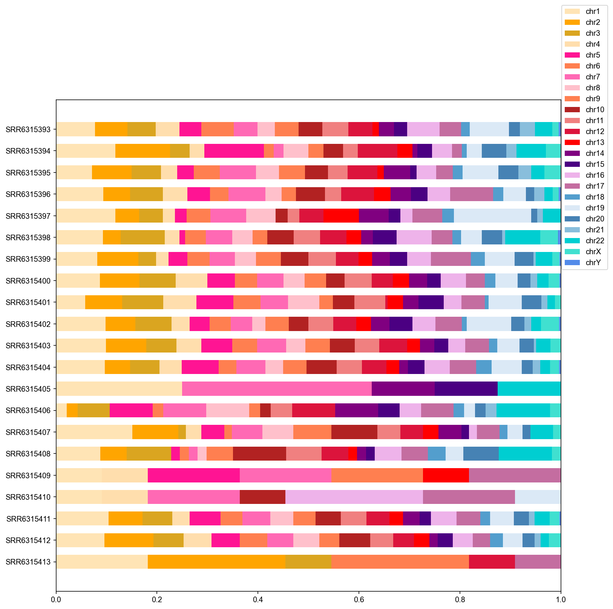
    


```python
show_list = _list[21:42][::-1]
path_share = './data/nebula/circle-Map_real_data/'
chrom_df = get_ecc_chrom_ratio(show_list, path_share)
chrom_df.head()
plot_chrom_barplot(chrom_df.T, save='./output/Fig3/circlemap_chr.dis.2.pdf')
```


    
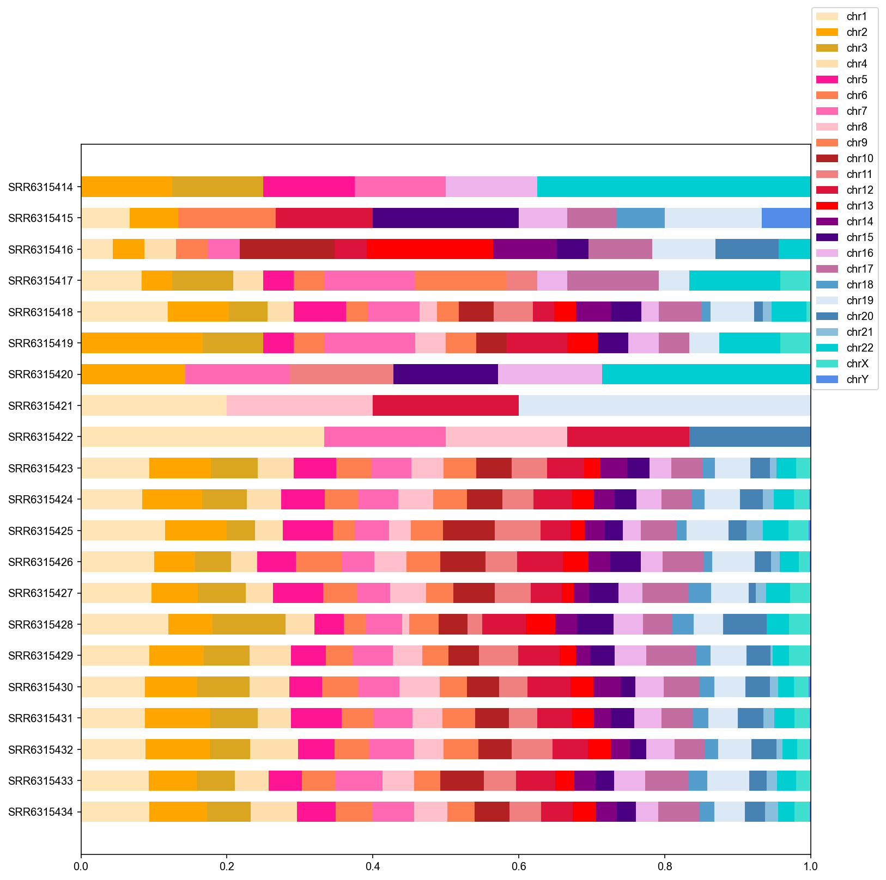
    


```python

```
